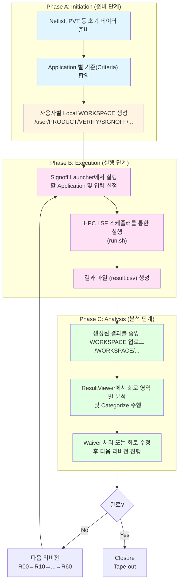
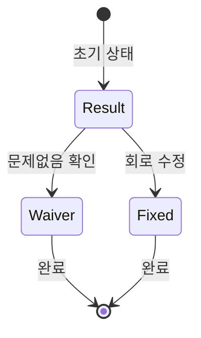

## 1. Executive Summary

### 1.1 Signoff 정의 및 배경

**Signoff**는 DRAM, FLASH, HBM과 같은 메모리 제품의 **Tr 레벨 Full-Custom 회로 설계 검증을 위한 통합 프로세스**입니다.

- 전통적인 DRAM 설계는 칩 면적 축소와 고속 I/O 성능을 위해 Full-Custom 방식으로 진행되며, 이는 정형화된 자동 설계보다 수작업 기반의 최적화가 강조됩니다.
- 이에 따라 **동적 시뮬레이션(Dynamic Verification)**과 함께 설계자의 경험 기반으로 **In-house Signoff**를 병행하여 수행해 왔습니다.
- Signoff는 이러한 회로 최적화의 유연성을 유지하면서도 제품의 신뢰성과 검증의 체계성을 확보하는 핵심 절차입니다.

Signoff는 다양한 시나리오에 대한 회로 동작을 검증하고, 설계 오류를 조기에 검출하며, 다양한 제품 스펙(PVT 조건)에 따라 문제를 사전에 방지하는 것을 목표로 합니다.


### Difficulties of Memory Design

* Memory Architecture : Cell-oriented Architecture, APP-forced, High-speed IO, Peripheral Control Logic
* Custom Design Flow: Tr.-level Custom Design, Piched-layout, Manual-placement & semi Auto-routing, Tr-level-Signoff
* Design Coverage: Knowledge/experinced-based Dynamic verification, Productivity and Signoff
* Process&Design parallel development: many Iterations for Design optimization


DRAM(Tr-Level) Design Flow:
1. Design Specification
2. Block-level Design
	1. Schematic
	2. Pre-layout Simulation
	3. Unit-level Layout
	4. Unit-level Verification
3. Top-level Physical Design
	1. Physical Layout
	2. Physical Verification
	3. Parasitic Extraction
4. Verification
	1. Post-layout Simulation
5. Tape-out


### 1.2. 주요 문제점 및 원인

| 문제          | 영향                | 원인                           |
| ----------- | ----------------- | ---------------------------- |
| Runtime 증가  | 검증 지연, 자원 경쟁      | 설계 복잡도 증가, 단일 스레드 처리         |
| Garbage 결과  | 오류 검출력 저하, 분석 비효율 | 정적 기준 부족, 알고리즘 정밀도 낮음        |
| Coverage 부족 | 오류 미검출 위험         | 일부 corner case 미포함, 시뮬레이션 한계 |
| 협업 어려움      | Waiver 중복, 업무 병목  | 통합 플랫폼 부재, 결과 공유 어려움         |


---

## 2. 조직 구조 및 역할

#### 조직 체계

```
삼성전자 메모리사업부
    └── Design Technology Team
        └── Design Simulation & Signoff Group
            └── Signoff Part
                ├── In-house Tool 개발 (SPACE/ADV 엔진)
                ├── Platform 운영 (Launcher/ResultViewer/WORKSPACE)
				└── 19종 Application 관리 및 사용자 지원
```

#### 역할 구분

| 구분                                 | 역할 내용                                                                                                                                                                                                                                                                                                                                                                                                                                                                         |
| ---------------------------------- | ----------------------------------------------------------------------------------------------------------------------------------------------------------------------------------------------------------------------------------------------------------------------------------------------------------------------------------------------------------------------------------------------------------------------------------------------------------------------------- |
| **Signoff Part** (Platform 개발/운영팀) | - **In-house Tool(SPACE/ADV) 개발 및 유지보수**<br>    - C++ 기반 회로 검증 엔진 고도화<br>    - 최신 Netlist 문법 지원 및 회로 인식 알고리즘 개선<br>- **Signoff 방법론 고도화 연구**<br>    - Coverage 향상 및 Garbage Reduction 알고리즘(AI/ML 기반) 개발<br>    - 병렬 처리(Ray) 및 Hierarchical Signoff 개발<br>- **Platform(Launcher/ResultViewer/WORKSPACE) 운영**<br>    - 사용자 친화적 Interface 제공<br>    - 대용량 데이터 처리 및 협업 시스템 구축<br>- **설계팀 기술 지원 및 교육**<br>    - 19종 Application별 전담 개발자(정/부 1-2명) 배정<br>    - 문의 대응 및 UserGuide 문서화 |
| **설계팀** (Signoff 수행 주체)            | - **제품별 필요 Signoff Application 수행**<br>    - 각 리비전(R00~R60)에 맞는 Application 선택 실행<br>- **담당 회로 영역 분석 및 검토**<br>    - ResultViewer를 통한 결과 데이터 분석<br>    - Categorize Part 수행으로 담당 영역 할당<br>- **Waiver 판단 및 처리**<br>    - Result → Waiver/Fixed 상태 관리<br>    - 회로 수정 또는 Waiver 정당성 논의<br>- **설계 개선사항 반영**<br>    - Signoff 결과 기반 회로                                                                                                                                             |

## 3. Signoff Workflow 상세

### 3.1 전체 프로세스 Flow

Signoff는 크게 3단계의 반복되는 사이클로 구성됩니다:

#### A. 준비 단계 (Initiation)
- Netlist, PVT 등 초기 데이터 준비
- Application 별 기준(Criteria) 합의
- 프로젝트 별 제품 계정의 Storage의 Signoff Local WORKSPACE 생성 (`/user/{PRODUCT}/VERIFY/SIGNOFF/{Library}/{Cell}/...`)

#### B. 실행 단계 (Execution)
- Signoff Launcher에서 실행할 Application 및 입력 설정    
- HPC LSF 스케줄러를 통한 실행 (`run.sh`)
- 해당 Signoff Application 결과 파일 (`result.csv`) 생성

#### C. 분석 단계 (Analysis)
- 생성된 결과를 중앙 WORKSPACE (`/WORKSPACE/{Product}/{Revision}/{Block}/{Tools}/...`)로 업로드
- ResultViewer에서 회로 영역 별 분석 및 Categorize 수행
- Waiver 처리 또는 회로 수정 후 다음 리비전 진행

> 이 사이클은 R00~R60까지 설계 리비전에 따라 반복되며, 최종적으로 모든 검증을 완료하면 Tape-out으로 이어집니다.




**WORKSPACE 정의:**


- **Launcher Local WORKSPACE (분산/개별)**: Signoff 작업 실행 전용 공간이며,  HPC 운영 원칙 상 한 계정마다 할당 받을 수 있는 Storage 용량 제한이 있기 때문에 제품계정 별로 Storage를 할당 받고 그 제품에 관련된 Signoff 입력, 시뮬레이션 데이터를 해당 Storage에서 독립적으로 관리. 
    
- **ResultViewer 공용 WORKSPACE (중앙/공유)**: Signoff 전용 계정으로 할당받은 Storage로, 모든 User가 접근 가능한 공유 저장소이며, Signoff 수행 결과 파일들을 관리. 결과 버전 관리 및 동시 분석을 지원합니다.

| 항목      | Local WORKSPACE              | Central WORKSPACE                          |
| ------- | ---------------------------- | ------------------------------------------ |
| 위치      | 제품 계정 별 홈 디렉토리 (`/user/...`) | 공용 NFS 스토리지 (`/WORKSPACE/...`)             |
| 목적      | Signoff Job 수행 및 임시 결과 저장    | 최종 결과 공유 및 분석, 협업 중심                       |
| 주 사용 도구 | Signoff Launcher             | Signoff ResultViewer                       |
| 파일      | netlist, run.sh, 결과 raw 파일   | result.csv (또는 parquet), 메타데이터, 버전 관리 파일 등 |

---

### 3.2 리비전별 수행 매트릭스 & Application 체계

#### 3.2.1 설계 리비전 진행 개요

메모리 제품 설계는 Schematic 단계부터 Final Layout까지 여러 리비전을 거치며 점진적으로 정밀도를 높여갑니다. 각 리비전마다 사용 가능한 데이터 수준이 다르므로, 수행 가능한 Signoff Application도 단계적으로 확대됩니다.

| Phase                    | 시점                                          | 데이터 수준                                                  | 주요 목적                  |
| ------------------------ | ------------------------------------------- | ------------------------------------------------------- | ---------------------- |
| **R00**                  | Block-level Design (Pre Layout)             | • TR-level Netlist<br>• 초기 MP/Power                     | 초기 스크리닝<br>(치명적 결함 검출) |
| **R10/R20/ R30/R40/R50** | Top-level Physical Design (Physical Layout) | • MP/Power 정밀화<br>• Layout RC extraction<br>• Timing 정보 | 범위 확대<br>(정밀 검증)       |
| **R60**                  | Final                                       | • 최종 Layout<br>• FSDB/TRN waveform                      | 최종 검증<br>(Closure)     |

#### 3.2.2 Application별 수행 시점 상세표

아래 표는 제품마다 상이할 수 있으나 대표적인 케이스를 정리한 것입니다. ✅는 해당 리비전에서 수행됨을 의미합니다.

| Tool Name                         | Engine          | Condition        | Criteria         | R00 | R10 | R20 | R30 | R40 | R50 | R60 |
| --------------------------------- | --------------- | ---------------- | ---------------- | --- | --- | --- | --- | --- | --- | --- |
| **Pre-Layout Signoff (초기 검증)**    |                 |                  |                  |     |     |     |     |     |     |     |
| Voltage Finder                    | SPACE           | –                | –                | ✅   | ✅   | ✅   | ✅   | ✅   | ✅   | ✅   |
| Power at Gate                     | SPACE           | –                | –                | ✅   | ✅   | ✅   | ✅   | ✅   | ✅   | ✅   |
| PN Ratio                          | SPACE           | SSPLVCT          | –                | ✅   | ✅   | ✅   | ✅   | ✅   | ✅   | ✅   |
| FO Check                          | SPACE           | SSPLVCT          | –                | ✅   | ✅   | ✅   | ✅   | ✅   | ✅   | ✅   |
| Driver & Keeper                   | SPACE           | SFLVCT, FSLVCT   | –                | ✅   | ✅   | ✅   | ✅   | ✅   | ✅   | ✅   |
| DC Path                           | SPACE           | TTTVCT (2P)      | –                | ✅   | ✅   | ✅   | ✅   | ✅   | ✅   | ✅   |
| Floating Node                     | SPACE           | TTTVCT (2P)      | –                | ✅   | ✅   | ✅   | ✅   | ✅   | ✅   | ✅   |
| PEC                               | SPACE           | Normal           | All Violations   | ✅   | ✅   | ✅   | ✅   | ✅   | ✅   | ✅   |
| **Static Signoff (핵심 검증)**        |                 |                  |                  |     |     |     |     |     |     |     |
| **DSC**                           | SPACE           | SSPLVCT, SSPLVHT | Rise/Fall < 2.5x |     |     | ✅   | ✅   | ✅   | ✅   | ✅   |
| **LSC**                           | SPACE           | SFLVCT, FSLVCT   | Rs/Fs > 250ps    |     | ✅   | ✅   | ✅   | ✅   | ✅   | ✅   |
| **LS**                            | SPACE           | SFLVCT, FSLVCT   | –                |     |     | ✅   | ✅   | ✅   | ✅   | ✅   |
| Cana-TR (Static)                  | SPACE           | FFPHVHT          | All Violations   |     |     |     |     | ✅   | ✅   | ✅   |
| Cana-TR (Dynamic)                 | SPACE           | FFPHVHT          | All Violations   |     |     |     |     | ✅   | ✅   | ✅   |
| **Post-Layout Signoff (정밀 검증)**   |                 |                  |                  |     |     |     |     |     |     |     |
| CDA / STA                         | SPACE/PrimeTime | SSPLVCT          | –                |     |     |     |     |     | ✅   | ✅   |
| **Dynamic Signoff (Waveform 기반)** |                 |                  |                  |     |     |     |     |     |     |     |
| ADV Margin Analyzer               | ADV             | FSDB             | –                | ✅   | ✅   | ✅   | ✅   | ✅   | ✅   | ✅   |
| Glitch Margin                     | SPACE/ADV       | FSDB             | –                |     |     |     |     |     | ✅   | ✅   |
| Dynamic DC Path                   | SPACE/ADV       | TRN/FSDB         | –                |     |     |     |     |     | ✅   | ✅   |
| ADV Latch S/H                     | ADV             | FSDB             | –                |     |     |     |     |     | ✅   | ✅   |
|                                   |                 |                  |                  |     |     |     |     |     |     | ✅   |

**범례:**
- ✅: 해당 리비전에서 수행
- **굵은 글씨**: 핵심 Application
- Condition: 시뮬레이션 코너 조건 (SSPLVCT=SS Process Low Voltage Cold Temp 등)
- Criteria: Pass/Fail 판단 기준

---

### 3.3 주요 Signoff Application 상세 설명

#### **3.3.1 Driver Size Check (DSC)**

**🎯 목적:** 회로의 Driver 크기가 적절한지 판단하여 회로 성능 최적화

**⚙️ 동작 원리:**

1. **회로 인식**: CCC(Channel Connected Component) 알고리즘으로 Transistor Level 회로를 Stage 단위로 분할
2. **Slew Simulation**: 400ps 입력 슬루를 Driver에 인가하여 Output Slew 측정
3. **비율 계산**: Input 대비 Output Slew 비율로 Driver 크기 적절성 평가
    - 비율이 너무 크면 → Driver가 취약 (Size Up 필요)
    - 비율이 너무 작으면 → Driver가 과다 (Size Down 가능)

**📊 입력 & 출력:**
- **입력**: Netlist (SPC/BLK/STAR), PVT 조건, Corner 정보
- **출력**: Rise/Fall Slew, Rise/Fall Delay, Measure Net, Driver MOS 정보

**🔍 수행 시점:** R20부터 (RC 정보가 일부 반영된 이후)

---

#### **3.3.2 Latch Strength Check (LSC)**

**🎯 목적:** Latch 회로의 Feed-back Loop 강도를 검증하여 정상 동작 보장

**⚙️ 동작 원리:**

1. **Latch 인식**: Pull-Up/Pull-Down Network를 인식하여 CCB(Channel Connected Block) 구성
2. **Strength Simulation**: Driver가 Latch 값을 변경하는 Simulation 수행
3. **Slew/Delay 분석**: Rising Strength (Rs), Falling Strength (Fs) 측정

**📊 입력 & 출력:**

- **입력**: Netlist, PVT, Default Slope (400ps)
- **출력**: Rise/Fall Slew, Rs/Fs 비율, Duty, Latch 정보

**🔍 수행 시점:** R10부터

---

#### **3.3.3 Level Shifter Check (LS)**

**🎯 목적:** 전압 도메인 간 신호 변환의 안전성 검증

**⚙️ 동작 원리:**

1. **Level Shifter 인식**: Power Network 기반으로 Level Shifter Topology 추출
2. **Slew Simulation**: 지정된 Slope(400ps)를 입력에 인가
3. **Duty 측정**: High→Low Transition의 Duty 비율 분석
    - Duty가 낮을수록 → Level Shifter 동작 불안정 가능성 ↑

**📊 입력 & 출력:**

- **입력**: Netlist, VDD/GND List, Input Slope
- **출력**: Rise/Fall Slew, Duty, Level Shifter 정보

**🔍 수행 시점:** R20부터

---

#### **3.3.4 Coupling Noise Analysis (Cana-TR)**

**🎯 목적:** Crosstalk Noise로 인한 신호 무결성 문제 검출

**⚙️ 동작 원리:**

1. **Aggressor Slew 계산**: DSC 방식으로 Aggressor의 Slew 측정
2. **Multi-Aggressor Simulation**: 모든 Aggressor를 동시에 Toggle하여 Worst Case Noise 분석
3. **Single-Aggressor Simulation**: Aggressor를 1개씩 Toggle하여 개별 영향도 분석
4. **Victim 검사**: Noise 값이 Vth를 초과하는지 확인

**📊 입력 & 출력:**

- **입력**: Layout 후 RC Netlist, SPICE Model
- **출력**: Multiple/Single Aggressor Noise, Victim/Aggressor Net 정보

**🔍 수행 시점:** R40부터 (RC extraction 이후)

---

#### **3.3.5 Coupling Delay Analyzer (CDA)**

**🎯 목적:** Coupling으로 인한 Delay 변화 검사

**⚙️ 동작 원리:**

1. **Static CDA**: Aggressor Slew 기반으로 모든 Victim-Aggressor Pair 추출
2. **Overlap Checker**: Verilog Simulation으로 동시 Toggle Case 필터링
    - Static Timing Analysis 없이도 동시 Toggle 감지
3. **Grouping**: Net Name 기반 Rule로 Path 단위 Coupling 영향도 확인

**📊 입력 & 출력:**

- **입력**: RC Netlist, Verilog TRN
- **출력**: Coupling Delay Delta, Path Group 정보

**🔍 수행 시점:** R50부터

---

## 4. Signoff Application 엔진 체계

### 4.1 SPACE (Static Signoff Engine)

**특징:**

- C++ 기반 In-house 엔진
- CCC(Channel Connected Component) 알고리즘 기반 회로 인식
- Stage 단위 SPICE Simulation 수행

**담당 Application:**

- DSC, LSC, LS, Cana-TR, CDA, PEC, PN Ratio, FO Check, DC Path, Floating Node 등

### 4.2 ADV (Dynamic Signoff Engine)

**특징:**

- Verilog/CKT + Waveform(TRN/FSDB) 분석
- 설계 SPEC/Criteria 기반 Simulation 결과 검증

**담당 Application:**

- ADV Margin Analyzer, ADV Latch S/H, Glitch Margin, Dynamic DC Path, Current Analyzer, 열화 검증 등

### 4.3 외부 Vendor Tool

**PrimeTime (Synopsys):**
- Gate-level STA (Static Timing Analysis)
- CDA와 연계하여 Path 기반 Timing 검증

**PERC (Siemens):**
- Power/Ground Network 분석

---

## 5. 데이터 협업 및 WORKSPACE 운영 체계

### 5.1 Launcher Local WORKSPACE (분산/개별)

**구조:**

```
/user/{PRODUCT}/VERIFY/SIGNOFF/{LIBRARY}/{CELL}/{USER}/{APPLICATION}_{date}/
├── input_config.yaml    # Application별 입력 설정
├── run.sh              # 실행 스크립트  
├── env/                # 환경 변수
└── result.csv          # 결과 파일
```

**특징:**
- 사용자별 독립 공간
- Signoff 수행 시 RUNSCRIPT 복사 및 입력값 환경변수화
- 계정별 Storage 용량 제한으로 Local 관리

---

### 5.2 ResultViewer 공용 WORKSPACE (중앙/공유)

**구조:**

```
/WORKSPACE/{PRODUCT}/{REVISION}/{BLOCK}/{TOOL}/
├── result.parquet      # 변환된 대용량 데이터 (Polars)
├── .meta              # 메타데이터 (진행률, 담당자)
├── .version           # 버전 관리
├── .lock              # Lock 정보 (Partial/Full)
└── backup/            # 이력 관리
```

**특징:**

- 중앙화된 Storage로 팀 협업 가능
- result.csv만 관리하여 용량 효율적
- Lock 메커니즘으로 동시 편집 방지
- 진행 현황 Dashboard 연동

---

## 6. Waiver 처리 프로세스

### 6.1 Categorize Part 실행

1. **회로 분할**: result.csv의 각 row(net/instance)별 담당자 할당
2. **Part Labeling**: Categorize Part Script 실행으로 담당자 Column 생성
3. **규모**: 평균 100만 rows 수준의 대용량 데이터

### 6.2 Waiver 상태 관리



**Waiver 값 정의:**
- **Result**: 초기 상태 (미검토)
- **Waiver**: 문제없음 확인 (정당한 이유로 Pass 처리)
- **Fixed**: 회로 수정 완료

### 6.3 Compare & Migration

**Compare 로직:**

- Application별 고유 키 기반 비교
    - **DSC**: `measure_net` + `driver_net`
    - **LSC**: `latch_name` + `input_pin`
    - **Cana-TR**: `victim_net` + `aggressor_net`

**결과 라벨:**

- `same`: 동일 (Tolerance 허용 범위 내)
- `diff`: 차이 발생 (재검토 필요)
- `not found`: 이전 리비전에 없던 항목 (신규)
- `duplicated`: 중복 발생

**Waiver 승계:**
- 이전 리비전에서 Waiver된 항목 중 `same`인 경우 자동 이월
- `diff` 항목은 수동 재검토 필요
- Tolerance 적용으로 미세한 차이는 `same` 처리

---

## 7. 협업 체계

### 7.1 Multi-user 협업 Flow

**Lock 메커니즘:**

- **Partial Lock**: 특정 필터 영역만 잠금 (예: Part='A' 담당자만 작업)
- **Full Lock**: 전체 파일 잠금 (대규모 수정 시)

**알림 시스템:**

- Knox Teams Messenger 연동
- Lock 충돌 시 자동 알림
- Waiver 완료 시 팀원 통보

**이력 관리:**

- 누가/언제/왜 수정했는지 추적
- Backup 폴더에 버전별 보관

### 7.2 진행 현황 모니터링

**Dashboard 기능 (향후 구현):**

- 제품/리비전/Tool별 진행률 가시화
- KPI 추적: Waiver 비율, 미완료 항목, 담당자별 현황
- 자동 보고: 일별/주별 진행 상황 Report

---

## 부록: 용어 정리

| 용어                 | 설명                                              |
| ------------------ | ----------------------------------------------- |
| **Revision (Rxx)** | 설계 진척 단계. R00(초기 Schematic) → R60(Final Layout) |
| **CCC**            | Channel Connected Component. Gate를 찾기 위한 알고리즘   |
| **PVT**            | Process/Voltage/Temperature 조건                  |
| **MP**             | Model Parameter. 공정 모델 파라미터                     |
| **RC**             | Resistance/Capacitance. Layout 기생 성분            |
| **FSDB**           | Fast Signal Database. Waveform 데이터 포맷           |
| **TRN**            | Cadence EDA 환경에서 사용되는 파형 데이터 파일 형식(.trn)        |
| **Waiver**         | 문제없음 확인 처리                                      |
| **Garbage**        | 진성 오류가 아닌 거짓 양성(False Positive) 결과              |
| **Coverage**       | 실제 회로 중 검증된 영역 비율                               |
| **TAT**            | Turn-Around Time. 작업 완료까지 소요 시간                 |


---
Signoff UX 개선 VoC/해결 방안
* Tool 수행의 어려움
	* Manual에 대한 이해 부족/ 수행 Guide 부족 -> EDA 체계 참조 필요(수행 가이드/ 상세 가이드)
	* Error 발생 시 파악 어려움 -> Setup TAT문제 (1주~1달 소요)