## 1. Executive Summary

### 1.1 개요

**Signoff Launcher (SOL)** 는 메모리(DRAM/FLASH/HBM) Tr-level 회로 설계 검증을 위한 웹 기반 통합 인터페이스 플랫폼입니다. 산재되어 있던 Signoff Application들을 하나의 플랫폼으로 통합하고, 입력 및 배포를 표준화하여 설계 검증 효율성을 높이는 것을 목표로 합니다.

### 1.2 핵심 가치 제안

**기존 방식의 문제점**:

이전에는 각 Signoff Application별로 개발 담당자들이 독립적으로 RUNSCRIPT를 유지보수하고 배포해 왔습니다. 이로 인해:

- **표준 부재**: 어떤 입력을 받는지, 어떻게 수행시키는지에 대한 표준이 없었음
- **입력 변수명 불일치**: 동일한 입력 데이터도 Application별로 변수명이 모두 달랐음
- **공유 체계 부재**: Tool별로 각자 알아서 사용하는 방식으로 규칙이나 공유가 없었음

**Signoff Launcher의 개선**:

|구분|기존 방식|Signoff Launcher|
|---|---|---|
|**작업 설정**|Application별 독립 RUNSCRIPT|통합 GUI + YAML 설정|
|**입력 관리**|Tool별 변수명 불일치|표준화된 입력 변수|
|**배포 관리**|분산 배포, 각자 관리|중앙 집중 배포|

### 1.3 현재 운영 현황

#### Signoff Launcher 실행 흐름

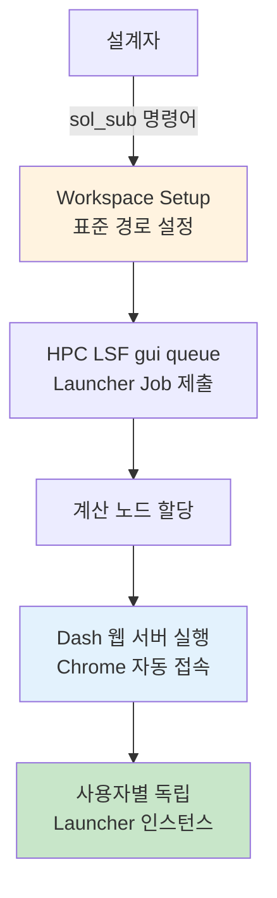

#### Signoff Application 실행 흐름
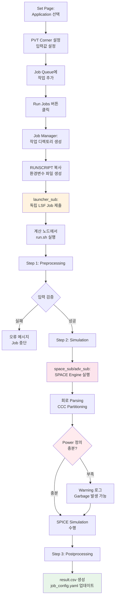
#### 운영 특징

**독립적 실행 구조:**

- **사용자별 독립 인스턴스**: 각 사용자가 HPC에서 할당받은 계산 노드에서 독립적인 Dash 서버 실행
- **표준 Workspace 구조**: 제품별 Storage의 표준 경로 구조 (`/user/{STORAGE}/VERIFY/SIGNOFF/{LIBRARY}/{CELL}/{USER}`)
- **독립적 Job 실행**: `launcher_sub`로 별도 LSF job 제출하여 Launcher GUI와 무관하게 작업 진행
    - Launcher GUI 종료되어도 제출된 Signoff job은 계속 실행
    - 각 Signoff job은 독립된 계산 노드에서 수행

**3단계 실행 프로세스:**

1. **Preprocessing**: 입력 데이터 검증 및 전처리
2. **Simulation**: `space_sub`/`adv_sub`로 Signoff Engine 실행 (또 다른 LSF job)
3. **Postprocessing**: 결과 파일 생성 및 정리

### 1.4 주요 성과

- ✅ **Signoff Application 통합**: 산재되어 있던 19개 Application을 하나의 플랫폼으로 통합
- ✅ **입력 표준화**: YAML 기반 설정으로 Tool별 입력 변수명 통일
- ✅ **배포 표준화**: 중앙 집중식 RUNSCRIPT 관리로 배포 일원화
- ✅ **작업 관리 체계화**: GUI 기반 작업 설정, Queue 관리, 모니터링 제공

#### 개선 필요 영역

- ⚠️ **입력 검증 부족**: 파일 존재 여부만 확인, 내용 검증 없어 실행 중 오류 발생
- ⚠️ **Power 정의 누락**: 전체 작업의 ~50%에서 Power 정의 누락으로 재실행 발생
- ⚠️ **가시성 부족**: 전체 Signoff 진행 상황을 파악할 Dashboard 부재
- ⚠️ **수동 프로세스**: ResultViewer로 결과 수동 업로드, 작업 추적 어려움


---

## 2. 현재 Signoff Launcher 아키텍처 개요

### 2.1 시스템 아키텍처


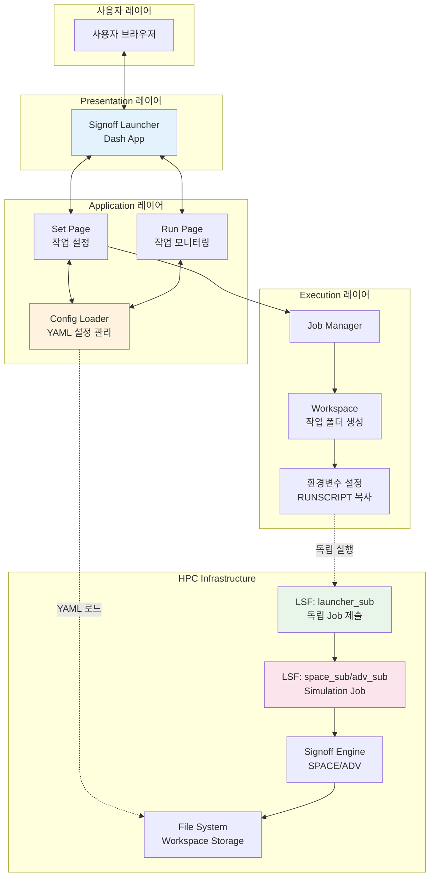

#### 레이어별 역할

**Presentation 레이어**

- **Dash App**: FlaskWebGUI로 실행되는 웹 기반 인터페이스
- 사용자별 독립 서버 인스턴스 (HPC 계산 노드에서 실행)

**Application 레이어**

_Config Loader:_

- `signoff_applications.yaml`에서 지원할 Application 목록 로드
- 각 Application의 RUNSCRIPT 경로 및 `input_config.yaml` 관리
- Application별 입력 필드 정의, 기본값, PVT 설정 로드

_Set Page (작업 설정):_

- Job Cards: Application 선택 및 PVT Corner 설정
- Job Inputs: 선택된 Application의 입력 필드 동적 생성
- Job Queue: 작업 목록 관리 및 일괄 실행

_Run Page (작업 모니터링):_

- 실행 중/완료된 작업 모니터링
- 작업 상태 추적 (pending/running/done/failed)
- 작업 관리 기능 (로그, 결과, 재실행, 중지, 삭제)

**Execution 레이어**

작업 실행 흐름:

1. **Job Manager 초기화**
    - 사용자 입력 (Application, Corner, 입력값) 수집
    - 작업 디렉토리 경로 생성
2. **Workspace Setup**
    - Workspace에 작업별 디렉토리 생성
    - 해당 Application의 RUNSCRIPT 폴더 전체 복사
    - 입력값을 환경변수 파일로 저장 (`env` 파일)
3. **독립 Job 제출**
    - `launcher_sub`로 독립적인 LSF job 제출
    - Launcher GUI와 무관하게 별도 계산 노드에서 실행
    - LSF Job에서 환경변수 source 후 `run.sh` 실행
4. **run.sh 실행 (3단계)**
    - **Preprocessing**: 입력 데이터 검증 및 전처리
    - **Simulation**: `space_sub` 또는 `adv_sub`로 Signoff Engine 실행
    - **Postprocessing**: 결과 파일 생성 및 정리
5. **결과 저장 및 모니터링**
    - `result.csv` 생성
    - `job_config.yaml` 업데이트
    - Run Page에서 상태 추적

**독립성 보장**:

- Launcher GUI가 종료되어도 제출된 job은 계속 실행
- 각 작업은 완전히 독립된 LSF job으로 관리


### 2.2 기술 스택

#### Frontend

- **Plotly Dash**: 웹 애플리케이션 프레임워크
- **Dash Mantine Components (DMC)**: 모던 UI 컴포넌트
- **Dash Blueprint Components**: 고급 UI 패턴
- **Dash AG Grid**: 고성능 데이터 테이블
- **FlaskWebGUI**: Standalone 앱 실행 환경

#### Backend

- **Python 3.12**: 주요 비즈니스 로직
- **PyYAML**: 설정 파일 관리
- **Subprocess**: LSF 작업 제출 및 관리

#### Infrastructure

- **IBM Spectrum LSF**: HPC 작업 스케줄링
- **NFS/Local FS**: Workspace 및 결과 저장
- **SPACE/ADV (C++)**: In-house Signoff Engine


### 2.3 데이터 흐름

```mermaid
graph LR
    subgraph "설정 단계"
        A[signoff_applications.yaml] --> B[Config Loader]
        C[input_config.yaml] --> B
        B --> D[Set Page UI 생성]
    end
    
    subgraph "입력 단계"
        D --> E[사용자 입력]
        E --> F[Job Queue]
    end
    
    subgraph "실행 단계"
        F --> G[Job Manager]
        G --> H[작업 디렉토리 생성]
        H --> I[RUNSCRIPT 복사]
        I --> J[환경변수 파일 생성]
        J --> K[LSF 작업 제출]
    end
    
    subgraph "처리 단계"
        K --> L[run.sh 실행]
        L --> M[Preprocessing]
        M --> N[Simulation<br/>SPACE/ADV]
        N --> O[Postprocessing]
    end
    
    subgraph "결과 단계"
        O --> P[result.csv]
        O --> Q[job_config.yaml]
        Q --> R[Run Page 모니터링]
    end
```

**흐름 설명**:

1. **설정 로드**: YAML 파일에서 Application 정의 및 입력 구성 로드
2. **UI 생성**: Config Loader가 동적으로 Set Page UI 구성
3. **사용자 입력**: Application 선택, PVT 설정, 입력값 입력
4. **작업 생성**: Job Manager가 입력을 기반으로 작업 디렉토리 및 환경 구성
5. **LSF 제출**: `launcher_sub`로 독립적인 LSF Job 생성
6. **Signoff 실행**: run.sh가 전처리-시뮬레이션-후처리 수행
7. **모니터링**: job_config.yaml 기반으로 Run Page에서 상태 추적


### 2.4 주요 설정 파일 구조

#### signoff_applications.yaml

Application 목록 및 기본 정보 정의:

```yaml
applications:
  DSC:
    label: "Driver Size Check"
    color: "#4263eb"
    group: "Static"
    runscript_path: "/path/to/RUNSCRIPTS/DSC"
    manual_link: "https://dsplm.sec.samsung.net/mem/dsc"
    developer: ["deepwonwoo"]
  
  LSC:
    label: "Level Shifter Check"
    color: "#f03e3e"
    group: "Static"
    runscript_path: "/path/to/RUNSCRIPTS/LSC"
    manual_link: "https://..."
    developer: ["user1", "user2"]
```


#### input_config.yaml (예: DSC)

Application별 입력 필드 정의:

```yaml
DSC:
  color: "#4263eb"
  label: "Driver Size Check"
  
  # PVT 입력 정의
  pvt_inputs:
    - name: PROCESS
      default: SS
      type: text_input
    - name: VOLTAGE
      default: HV
      type: text_input
    - name: TEMPERATURE
      default: HT
      type: text_input
  
  # 입력 필드 정의
  inputs:
    - name: NETLIST_FILE
      type: file_input
      required: true
      default: ""
      description: "Circuit netlist file in SPICE format"
      
    - name: EDR_FILE
      type: file_input
      required: true
      description: "EDR file for defining extra device rules"
      
    - name: MP_FILE
      type: file_input
      required: true
      description: "Model parameter file"
      
    - name: DEFAULT_VOLTAGE
      type: number_input
      required: true
      default: 0.96
      unit: "V"
      description: "Default voltage value for undefined nodes"
```

#### job_config.yaml

각 작업의 설정 및 상태 정보:

```yaml
job_name: "DSC_FULLCHIP_SSPHVCT_20250318_143022"
app: "DSC"
status: "running"
job_start_time: "2025-03-18 14:30:22"
job_finish_time: null
job_dir: "/user/.../DSC_FULLCHIP_SSPHVCT_20250318_143022"

corner:
  PROCESS: "SS"
  VOLTAGE: "HV"
  TEMPERATURE: "CT"

inputs:
  NETLIST_FILE: "/user/.../netlist.sp"
  EDR_FILE: "/user/.../edr"
  MP_FILE: "/user/.../mp"
  DEFAULT_VOLTAGE: 0.96

lsf_job_id: 12345678
message: "Job is running"
```

### 2.5 디렉토리 구조

```
signoff_launcher/
├── app.py                          # 메인 애플리케이션
├── signoff_applications.yaml       # 지원 Application 정의
├── workspace/                      # Workspace 관리
│   └── workspace.py
├── job_set/                        # Set Page
│   ├── page.py
│   ├── jobCards.py                 # Application 선택
│   ├── jobInputs.py                # 입력 필드 생성
│   ├── jobQueue.py                 # 작업 Queue 관리
│   └── jobManager.py               # 작업 실행 로직
├── job_run/                        # Run Page
│   ├── page.py
│   ├── jobTable.py                 # 작업 테이블
│   ├── jobMonitoring.py            # 자동 새로고침
│   └── actions/                    # 작업 관리 액션
├── utils/                          # 유틸리티
│   ├── config_loader.py            # YAML 설정 로더
│   ├── workspace.py                # Workspace 경로 관리
│   └── lsf.py                      # LSF API
└── RUNSCRIPTS/                     # Application별 실행 스크립트
    ├── DSC/
    │   ├── input_config.yaml
    │   ├── run.sh
    │   ├── pre_setting.py
    │   ├── netlist_preprocessing.py
    │   ├── run.tcl
    │   └── make_csv.py
    └── LSC/
        ├── input_config.yaml
        ├── run.sh
        └── ...
```


---

## 3. 주요 컴포넌트 및 기능 분석

### 3.1 Workspace 관리


**Workspace의 역할**:

Signoff Launcher의 Workspace는 각 설계자가 Signoff Application을 수행하는 **개인 작업 공간**입니다. 이는 Signoff ResultViewer에서 사용하는 중앙 공유 WORKSPACE와는 다른 개념입니다.

**Workspace 분리 배경**:

|구분|Launcher Workspace|ResultViewer WORKSPACE|
|---|---|---|
|**목적**|Signoff 실행 환경|결과 분석 및 협업|
|**데이터 특성**|대용량 입력/시뮬레이션 데이터|결과 CSV만 (상대적 소용량)|
|**저장소**|제품별 독립 Storage (NFS)|중앙 공유 Storage|
|**관리 주체**|각 설계자 개인|팀 공유|
|**이유**|시뮬레이션 데이터가 매우 크고,<br/>제품별 Storage 용량 제한 존재|결과 통합 관리 및<br/>팀 협업 필요|

**Storage 구조**:

메모리 제품마다 독립적인 Storage가 NFS로 마운트되어 있으며, 각 Storage는 용량 제한이 있습니다. 따라서:

- Signoff 실행 시 필요한 **대용량 데이터**(Netlist, SPICE 결과, 로그 등)는 **제품별 Storage**에 저장
- Signoff 결과 CSV는 **중앙 WORKSPACE**에 업로드하여 ResultViewer에서 통합 관리


#### 표준 경로 구조

```
/user/{STORAGE}/VERIFY/SIGNOFF/{LIBRARY}/{CELL}/{USER}/{APPLICATION}_{JOBNAME}_{TIMESTAMP}/
```

**경로 구성 요소:**

- **STORAGE**: 제품 프로젝트 계정 (예: hbm28gvw00, dramrez)
- **LIBRARY**: 설계 라이브러리 (예: 20_HBM3E, 00_HBM4_SCH_MAIN)
- **CELL**: 설계 셀 (예: FULLCHIP, BL_DECODER)
- **USER**: 사용자 ID
- **APPLICATION**: Signoff Application 이름 (DSC, LSC 등)
- **JOBNAME**: 작업 식별자
- **TIMESTAMP**: 작업 생성 시각

#### Workspace 설정 방식

**초기 설정:**

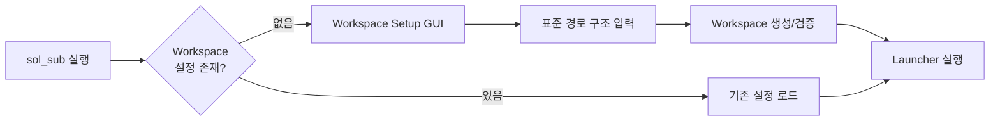


**cds.lib 기반 Library/Cell 관리**:

Cadence Virtuoso Library Manager 방식을 참고하여, 각 제품 Storage의 cds.lib 파일을 파싱하여 Library와 Cell 목록을 제공합니다.


**Workspace 설정 흐름**:

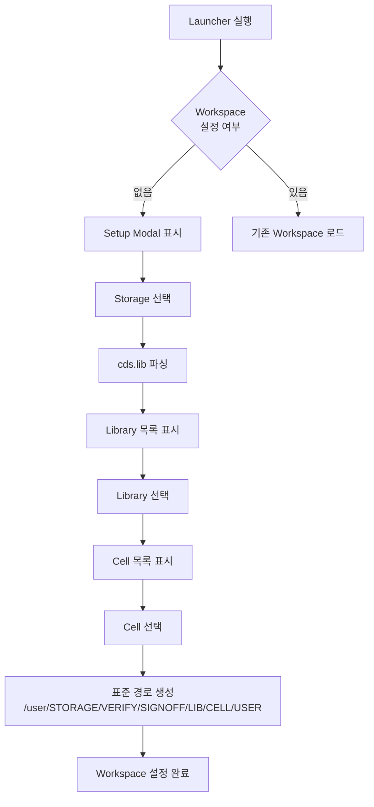

#### 3.1.4 작업 디렉토리 구조

Workspace 내에서 각 작업은 독립된 디렉토리에서 수행됩니다:

```
{WORKSPACE}/
├── DSC_FULLCHIP_SSPHVCT_20250318_143022/
│   ├── job_config.yaml          # 작업 설정 및 상태
│   ├── env                       # 환경변수 파일
│   ├── run.sh                    # 실행 스크립트 (복사됨)
│   ├── *.tcl                     # Signoff TCL 스크립트
│   ├── *.log                     # 실행 로그
│   └── result.csv                # 결과 파일
└── ...
```

**작업 디렉토리 생성 규칙**:

- **네이밍**: `{APP}_{JOBNAME}_{CORNER}_{TIMESTAMP}`
- **독립성**: 각 작업은 완전히 독립된 환경에서 실행
- **재현성**: RUNSCRIPT 전체 복사로 실행 환경 보존

**실행 과정**:

1. Job Manager가 Workspace 내 작업 디렉토리 생성
2. 해당 Application의 RUNSCRIPT 폴더 전체를 작업 디렉토리로 복사
3. Launcher에서 입력한 값들을 환경변수 파일(`env`)로 저장
4. `launcher_sub`로 LSF Job 제출
5. LSF Job에서:
    - 작업 디렉토리로 이동
    - `source env`로 환경변수 로드
    - `run.sh` 실행 → Preprocessing → Simulation → Postprocessing
6. 결과 파일(`result.csv`, 로그 등)이 작업 디렉토리에 생성

### 3.2 Config Loader

YAML 기반 설정 관리 시스템으로, Application의 동적 UI 생성을 담당합니다.

#### 로드 프로세스

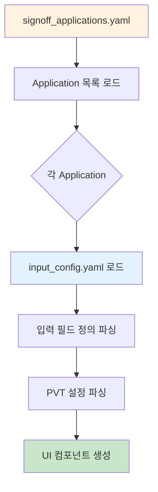

#### 입력 필드 타입

|타입|설명|예시|
|---|---|---|
|`file_input`|파일 경로 입력|NETLIST_FILE, EDR_FILE|
|`text_input`|텍스트 입력|TOP_SUBCKT, PROCESS|
|`number_input`|숫자 입력|DEFAULT_VOLTAGE, INPUT_SLOPE|
|`select_input`|드롭다운 선택|IS_FINFET (TRUE/FALSE)|
|`checkbox_input`|체크박스|RAY_MODE|
|`multiselect_input`|다중 선택|TOP_SUBCKT (여러 셀)|

#### 의존성 관리

PVT Corner별로 다른 입력이 필요한 경우 `depends_on` 속성 사용:

```yaml
- name: HV_VDD_LIST_FILE
  type: file_input
  required: true
  depends_on:
    VOLTAGE: "HV"
  description: "High voltage VDD node list"
```


---
### 3.3 Set Page: 작업 설정

#### Job Cards

Application 선택 및 기본 설정을 위한 카드 인터페이스:

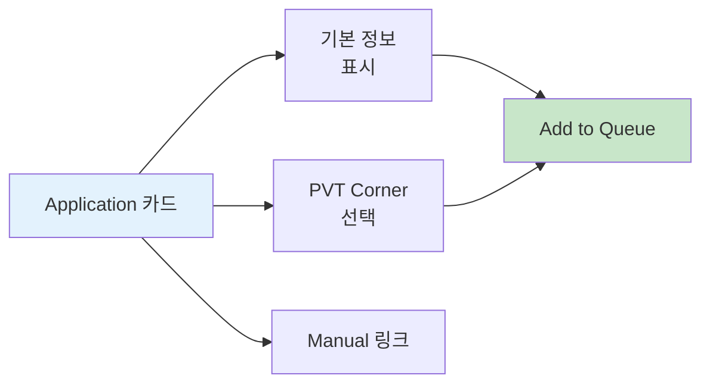

**카드 정보:**

- Application 이름 및 설명
- 개발자 정보
- Manual 링크
- PVT Corner 선택 (Process/Voltage/Temperature)

#### Job Inputs

선택된 Application에 따라 동적으로 생성되는 입력 필드:

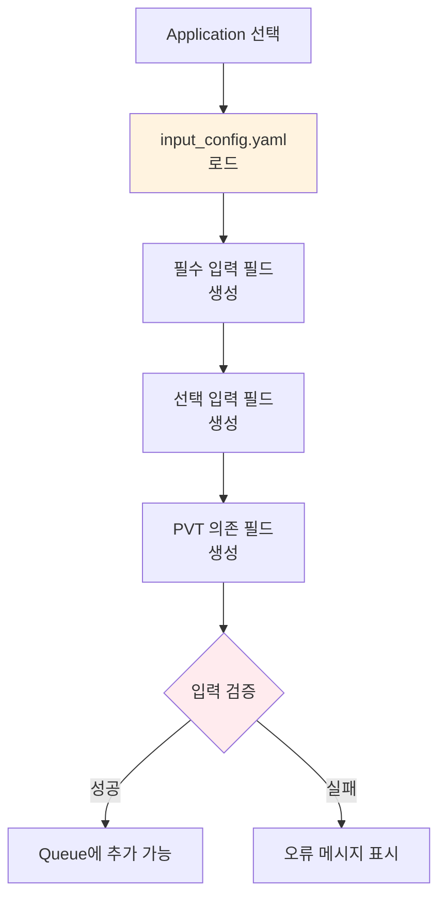

**입력 검증:**

- 필수 필드 입력 여부 확인
- 파일 존재 여부 확인 (기본적인 검증만)
- **현재 한계**: 파일 내용, 형식, 권한 등은 검증하지 않음

#### Job Queue

작업 목록 관리 및 일괄 실행:

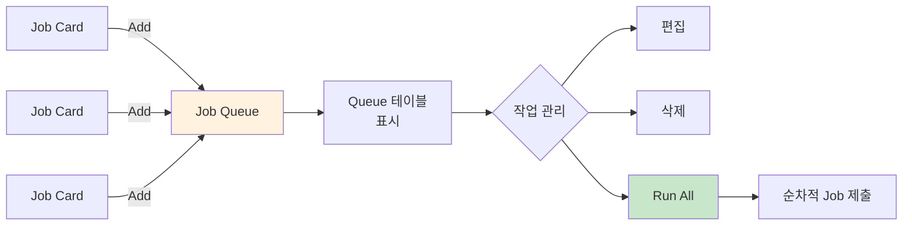

**Queue 기능:**

- 여러 작업을 Queue에 추가
- 작업 순서 조정
- 일괄 실행 (Run All Jobs)
- 개별 작업 편집/삭제

**현재 한계:**

- Queue가 메모리에만 존재 (브라우저 종료 시 손실)
- 작업 Template 저장 기능 없음
- CSV Export/Import는 지원하나 수동


#### Component 1: Job Cards

**기능**: Signoff Application 선택 및 PVT Corner 설정

**주요 기능**:

- **Application 선택**: 19개 Application 중 필요한 Tool 선택
- **PVT Corner 설정**: Process/Voltage/Temperature 조합 다중 설정
- **시각적 구분**: Application별 색상 코딩으로 직관적 구분
- **카드 관리**: 여러 Application을 동시에 설정 가능 (카드 추가/복사/삭제)

**PVT Corner 예시**:

|Process|Voltage|Temperature|
|---|---|---|
|SS (Slow)|LV (Low)|CT (Cold)|
|SS|HV (High)|CT|
|FF (Fast)|LV|HT (Hot)|
|FF|HV|HT|

#### Component 2: Job Inputs

**기능**: 선택된 Application의 입력 필드 동적 생성

**핵심 특징**:

1. **공통 입력 자동 통합**
    
    - 여러 Application이 동일한 입력을 사용하면 한 번만 입력
    - 예: NETLIST_FILE은 DSC, LSC 공통 → 한 번만 표시
2. **입력 필드 타입 지원**
    

|타입|설명|예시|
|---|---|---|
|**file_input**|파일 경로 입력|NETLIST_FILE|
|**file_select**|파일 선택 (드롭다운)|EDR_FILE|
|**text_input**|텍스트 입력|TOP_SUBCKT|
|**number_input**|숫자 입력|THRESHOLD|
|**select_input**|단일 선택|MODE|
|**multiselect_input**|다중 선택|BLOCKS|
|**checkbox_input**|체크박스|ENABLE_FEATURE|

3. **의존성 기반 입력 표시**
    
    - PVT 의존 입력: Corner별로 다른 값이 필요한 경우만 표시
    - 조건부 입력: 특정 옵션 선택 시에만 나타나는 입력
4. **필수/선택 입력 분리**
    
    - **Required Inputs**: 반드시 입력해야 하는 필드
    - **Optional Inputs**: 기본값이 있거나 선택적인 필드 (접을 수 있음)
    - 이를 통해 사용자는 **최소한의 필수 입력만으로 Signoff 수행 가능**

**사용자 편의성**:

- ✅ 입력 필드 자동 통합으로 중복 입력 제거
- ✅ Optional 입력 분리로 필수 입력만 집중
- ✅ 의존성 기반 표시로 불필요한 입력 제거
- ✅ Application별 색상 배지로 어디에 사용되는지 명확히 표시

#### Component 3: Job Queue

**기능**: 설정된 작업 목록 관리 및 병렬 실행

**명칭 설명**:

- 이름은 "Queue"이지만 실제로는 **Job Table List**
- 작업들은 순차 실행이 아닌 **병렬 실행**됨
- LSF를 통해 동시에 여러 작업 제출 가능

**주요 기능**:

|기능|설명|
|---|---|
|**작업 추가**|Set Page의 설정을 기반으로 Queue에 추가|
|**작업 편집**|테이블 셀 직접 수정 가능|
|**작업 복사**|기존 작업 복제하여 유사 작업 빠르게 생성|
|**작업 삭제**|Queue에서 제거|
|**CSV 관리**|Queue를 CSV로 내보내기/가져오기|
|**병렬 실행**|선택된 작업들을 LSF를 통해 동시 제출|

**작업 조합 생성**:

사용자가 다음을 설정하면:

- Application: DSC
- PVT Corners: SSPHVCT, FFPHVHT
- Top Subckt: BLOCK_A, BLOCK_B

자동으로 4개 작업 생성:

1. DSC_BLOCK_A_SSPHVCT
2. DSC_BLOCK_A_FFPHVHT
3. DSC_BLOCK_B_SSPHVCT
4. DSC_BLOCK_B_FFPHVHT

**실행 흐름**:

1. "Run All Jobs" 클릭
2. 선택된 작업별로 Job Manager 생성
3. 각 Job Manager가 독립적으로:
    - 작업 디렉토리 생성
    - RUNSCRIPT 복사
    - 환경변수 설정
    - LSF 작업 제출
4. 모든 작업이 **병렬로 동시 실행**

---

### 3.4 Run Page: 작업 모니터링

Run Page는 실행 중이거나 완료된 작업을 모니터링하고 관리하는 인터페이스입니다.

#### 3.3.1 전체 구조

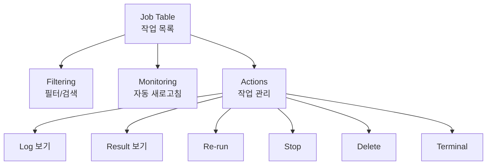

#### 3.3.2 Job Table

**기능**: Workspace 내 모든 작업을 테이블로 표시

**주요 컬럼**:

- **Job Name**: 작업 이름
- **Status**: 작업 상태 (pending/running/done/failed)
- **Application**: Signoff Tool
- **Corner**: PVT 조건
- **Created Time**: 작업 생성 시간

**Master-Detail 기능**:

- 작업 행 확장 시 상세 정보 표시
    - 입력 파일들
    - Workspace 경로
    - 실행 시간
    - 로그 파일 등

#### 3.3.3 Filtering & Search

**필터링 기능**:

- **Status Filter**: All / Pending / Running / Done / Failed 버튼
- **Text Search**: 작업 이름 검색
- **Column Filter**: AG Grid의 컬럼별 필터 활용

#### 3.3.4 Job Monitoring

**자동 새로고침**:

- 5초마다 Workspace를 스캔하여 작업 상태 업데이트
- 변경사항이 있을 때만 테이블 갱신 (불필요한 렌더링 방지)
- 자동 새로고침 On/Off 토글 가능

**상태 추적 방식**:

- 각 작업 디렉토리의 `job_config.yaml` 파일 모니터링
- 파일 내용이 변경되면 상태 업데이트

#### 3.3.5 Job Actions

각 작업에 대해 다양한 관리 기능 제공:

|Action|설명|사용 시점|
|---|---|---|
|**Log**|실행 로그 파일 보기|작업 진행 상황 확인|
|**Result**|result.csv 미리보기|작업 완료 후 결과 확인|
|**Re-run**|동일 설정으로 재실행|실패 작업 재시도, 동일 작업 반복|
|**Stop**|실행 중인 작업 중지|잘못된 설정 발견 시|
|**Delete**|작업 및 디렉토리 삭제|불필요한 작업 정리|
|**Terminal**|작업 디렉토리에서 터미널 열기|디버깅, 수동 파일 확인|

**Re-run 기능 상세**:

- Run Page에서 Re-run 클릭 시 해당 작업의 설정을 Set Page Queue에 자동 추가
- 사용자는 Set Page로 이동하여 필요 시 입력 수정 후 재실행 가능


#### 자동 새로고침

```python
# 30초마다 작업 상태 업데이트
@callback(
    Output('job-table', 'data'),
    Input('interval-component', 'n_intervals')
)
def update_job_status(n):
    # job_config.yaml 파일 읽어서 상태 업데이트
    return updated_jobs
```

**현재 한계:**

- `job_config.yaml` 파일 기반 상태 확인 (LSF 실제 상태와 불일치 가능)
- 네트워크 지연 시 정보 누락
- 실패 원인 자동 추출 부재


#### 작업 상태 추적

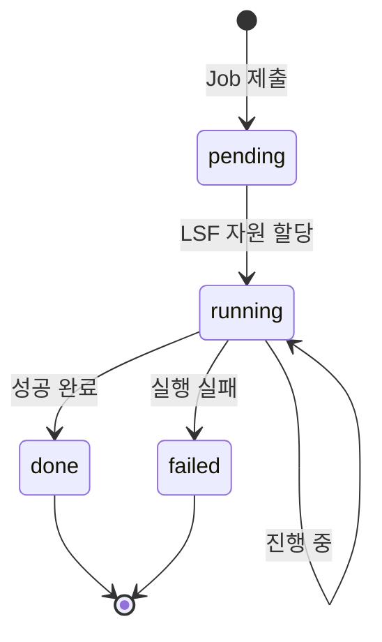

**상태 종류:**

- **pending**: LSF Queue 대기 중
- **running**: 실행 중
- **done**: 성공 완료
- **failed**: 실패


---

## 4. 주요 사용 시나리오

### 4.1 시나리오 1: DSC (Driver Size Check) 전체 Corner 수행

#### 목적

Fullchip 레벨에서 모든 PVT Corner의 Driver Size를 검증하여 회로 성능 최적화


**Workflow**:

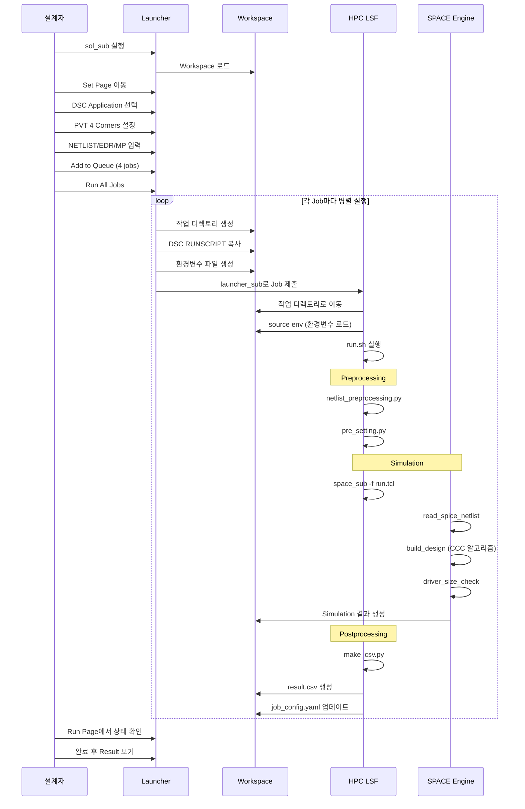

#### 실제 입력 예시

|입력 필드|값|
|---|---|
|**NETLIST_FILE**|`/user/hbm28gvw00/DESIGN/NETLIST/fullchip_v10.sp`|
|**EDR_FILE**|`/user/hbm28gvw00/DESIGN/EDR/hbm4_edr_v1.2`|
|**MP_FILE**|`/user/hbm28gvw00/DESIGN/MP/hbm4_mp_28nm`|
|**TOP_SUBCKT**|`FULLCHIP`|
|**DEFAULT_VOLTAGE**|`0.96`|
|**INPUT_SLOPE**|`0.4 ns`|
|**SIMULATION_TIME**|`10 ns`|
|**PVT Corners**|SSPLVCT, SSPHVCT, FFPLVHT, FFPHVHT|

#### 생성된 작업 디렉토리

```
/user/hbm28gvw00/VERIFY/SIGNOFF/HBM4_LIB/FULLCHIP/wonwoo/
├── DSC_FULLCHIP_SSPLVCT_20250318_143022/
│   ├── env                          # 환경변수 파일
│   ├── run.sh                       # 실행 스크립트
│   ├── run.tcl                      # SPACE TCL 스크립트
│   ├── netlist_preprocessing.py     # Netlist 전처리
│   ├── pre_setting.py               # 설정 파일 생성
│   ├── make_csv.py                  # CSV 변환
│   ├── job_config.yaml              # 작업 설정/상태
│   ├── LOG/                         # 로그 파일
│   │   ├── run.log
│   │   └── space.log
│   ├── SETUP/                       # Setup 파일
│   │   ├── tech_file
│   │   └── set_power.tcl
│   └── RESULT/                      # 결과 파일
│       ├── result                   # Raw 결과
│       └── result.csv               # CSV 변환 결과
├── DSC_FULLCHIP_SSPHVCT_20250318_143045/
├── DSC_FULLCHIP_FFPLVHT_20250318_143108/
└── DSC_FULLCHIP_FFPHVHT_20250318_143131/
```


#### run.sh 실행 상세

DSC RUNSCRIPT의 `run.sh`는 다음 3단계로 구성됩니다:

```bash
#!/bin/csh -f

# 환경변수 설정
source env

# Job 상태 업데이트 스크립트
set UPDATE_CONFIG = "python /path/to/update_job_config.py"

# ============================================
# Step 1: Preprocessing
# ============================================
$UPDATE_CONFIG --msg "Preprocessing"

# Netlist 전처리
python netlist_preprocessing.py $NETLIST_FILE preprocessed_netlist.sp
if ($status != 0) then
    $UPDATE_CONFIG --fail --msg "Netlist preprocessing failed"
    exit 1
endif

# Setup 파일 생성
python pre_setting.py
if ($status != 0) then
    $UPDATE_CONFIG --fail --msg "Pre-setting failed"
    exit 1
endif

# ============================================
# Step 2: Simulation
# ============================================
$UPDATE_CONFIG --msg "Running SPACE simulation"

# LSF Job 제어 스크립트 백그라운드 실행
python /user/signoff.dev/bin/lsf_job_lose_ctrl.py . $$ &

# SPACE Engine 실행 (또 다른 LSF Job)
space_sub -Is -cpu 8 -mem 300000 -scv run.tcl
if ($status != 0) then
    $UPDATE_CONFIG --fail --msg "SPACE simulation failed"
    exit 1
endif

# ============================================
# Step 3: Postprocessing
# ============================================
$UPDATE_CONFIG --msg "Postprocessing"

# 결과를 CSV로 변환
python make_csv.py ./RESULT/result
if ($status != 0) then
    $UPDATE_CONFIG --fail --msg "CSV conversion failed"
    exit 1
endif

# Job 완료
$UPDATE_CONFIG --done --msg "DSC executed successfully"
exit 0
```

**Preprocessing 단계:**

1. `netlist_preprocessing.py`: Netlist 형식 변환 및 전처리
    
    - 주석 제거, 형식 통일
    - Hierarchy separator 변환
    - Instance/Net 이름 정규화
2. `pre_setting.py`: SPACE 실행에 필요한 Setup 파일 생성
    
    - `tech_file`: Technology 정보
    - `set_power.tcl`: Power 정의 (VDD/GND 리스트)
    - `passive_resistor_subckt_list.tcl`: 수동 저항 Subckt 목록

**Simulation 단계 (run.tcl):**

```tcl
# 환경변수에서 입력 로드
set NETLIST $::env(NETLIST_FILE)
set EDR $::env(EDR_FILE)
set MP $::env(MP_FILE)
set DEFAULT_VOLTAGE $::env(DEFAULT_VOLTAGE)
set INPUT_SLOPE $::env(INPUT_SLOPE)
set SIM_TIME $::env(SIMULATION_TIME)

# SPACE 로그 파일 설정
set_log_file ./LOG/space.log

# 기본값 설정
set_default_undefine_resistance 1.0
set_default_undefine_vdd_value $DEFAULT_VOLTAGE
set_hierarchy_separator "."

# Power 정의 로드
source ./SETUP/set_power.tcl

# Technology 파일 읽기
read_tech_file ./SETUP/tech_file

# Netlist 읽기 및 회로 인식
read_spice_netlist $NETLIST

# 회로 Partition (CCC 알고리즘)
build_design $TOP_SUBCKT

# Driver Size Check 수행
driver_size_check \
    -slope $INPUT_SLOPE \
    -time $SIM_TIME \
    -step 0.01 \
    -temperature $TEMP \
    -thread \
    -o ./RESULT/result

exit
```

**SPACE Engine 동작:**

1. **read_spice_netlist**: Netlist Parsing
2. **build_design**: CCC (Channel Connected Component) 알고리즘으로 회로 Partition
    - Pull-Up/Pull-Down Network 인식
    - Stage 단위로 분할
    - **Power 정의가 중요**: 누락 시 Path Tracing 오래 걸림
3. **driver_size_check**: 각 Driver에 대해 Slew Simulation
    - Input Slope 400ps 인가
    - Output Slew 측정
    - Rise/Fall Delay 계산

**Postprocessing 단계:**

- `make_csv.py`: SPACE 출력을 CSV 형식으로 변환
- 결과 파일 정리 및 압축

#### 실행 시간 및 리소스

|항목|일반적인 경우|Power 누락 시|
|---|---|---|
|**Preprocessing**|~5분|~5분|
|**Simulation**|~12시간|~24시간+|
|**Postprocessing**|~10분|~10분|
|**총 소요 시간**|~12시간|~1일+|
|**메모리 사용**|~300GB|~500GB+|
|**CPU 사용**|8 cores|8 cores|

#### 결과 분석

**result.csv 구조:**

|필드|설명|
|---|---|
|Rise_Delay|Rise Slew의 50% 구간 지연 시간|
|Fall_Delay|Fall Slew의 50% 구간 지연 시간|
|Rise|최악의 Rise Slope 값 (ns)|
|Fall|최악의 Fall Slope 값 (ns)|
|Data_Net|데이터 Net 이름|
|Measure_Net|측정 Net 이름|
|Driver_MOS|대표 NMOS Driver 이름|
|Master|Measure Net의 주 이름|

**판단 기준:**

- Rise/Fall Ratio가 너무 크면 → Driver가 취약 (Size Up 필요)
- Rise/Fall Ratio가 너무 작으면 → Driver가 과다 (Size Down 가능)


### 4.2 시나리오 2: 다중 Block 병렬 검증

**목적**: 여러 Block에 대해 동일한 Signoff 일괄 수행

**설정**:

- Application: LSC (Level Shifter Check)
- Top Subckt (다중 선택): `BLOCK_A`, `BLOCK_B`, `BLOCK_C`
- PVT Corners: SSPHVCT, FFPHVHT

**자동 생성되는 작업**: 3 blocks × 2 corners = **6 jobs**

**Queue 테이블**:

|APPLICATION|Job Name|Top Subckt|Process|Voltage|Temp|
|---|---|---|---|---|---|
|LSC|LSC_BLOCK_A_SSPHVCT|BLOCK_A|SS|HV|CT|
|LSC|LSC_BLOCK_A_FFPHVHT|BLOCK_A|FF|HV|HT|
|LSC|LSC_BLOCK_B_SSPHVCT|BLOCK_B|SS|HV|CT|
|LSC|LSC_BLOCK_B_FFPHVHT|BLOCK_B|FF|HV|HT|
|LSC|LSC_BLOCK_C_SSPHVCT|BLOCK_C|SS|HV|CT|
|LSC|LSC_BLOCK_C_FFPHVHT|BLOCK_C|FF|HV|HT|

**병렬 실행**:

- 6개 작업이 동시에 LSF에 제출
- 각 작업은 독립적인 디렉토리에서 실행
- HPC 자원이 허용하는 만큼 동시 실행

#### 목적

HBM4 제품의 여러 Block에 대해 Latch Strength Check 수행

#### Workflow 특징

**Queue 활용:**

```
1. LSC Application 선택
2. BL_DECODER Block 입력 → Add to Queue
3. WL_DECODER Block 입력 → Add to Queue
4. SA_DECODER Block 입력 → Add to Queue
5. Run All Jobs → 3개 작업 병렬 실행
```

**이점:**

- 한 번에 여러 Block 설정
- 공통 입력 (EDR, MP) 재사용
- 병렬 실행으로 시간 절약
### 4.3 시나리오 3: Revision 변경 시 재실행

#### 현재 프로세스


**문제점:**

- 모든 입력을 처음부터 다시 설정해야 함
- Queue Template 저장 기능 없음
- Revision 간 입력 복사 기능 없음

**개선 필요:**

- 이전 Revision 입력 자동 로드
- Queue Template 저장/로드
- Revision 간 입력 Mapping

### 4.4 ResultViewer 연동 워크플로우

**현재 방식** (수동):


**개선 방향** (자동화 필요):


---


