# 3. 현재의 Signoff Platform 문제점 및 한계

## 1. Executive Summary

### 1.1 핵심 문제 정의

현재 Signoff Launcher는 19개 Application을 통합하여 제공하는 **실행 도구**로서는 기능하고 있으나, **"24-hour, No-Human-In-the-Loop Signoff"**라는 궁극적 목표를 달성하기에는 근본적인 한계가 존재합니다.

**핵심 문제:**

> 현재 시스템은 **"데이터"는 관리하지만 "의미"는 관리하지 않습니다.**  
> 파일과 실행 기록은 저장되지만, 데이터 간의 관계, 의사결정의 근거, 업무 지식이 시스템에 정의되지 않아 **완전 자동화가 구조적으로 불가능**합니다.

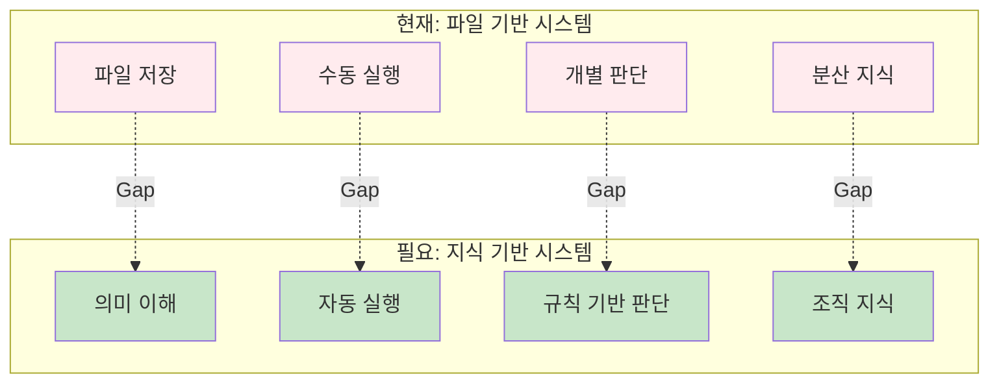

### 1.2 4대 문제 영역

현재 시스템의 한계는 4가지 영역으로 구분됩니다:

|문제 영역|핵심 이슈|자동화 영향|
|---|---|---|
|**1. 데이터 관리**|Workspace 이원화, Context 손실|입력 자동 설정 불가|
|**2. 프로세스 가시성**|Dashboard 부재, 워크플로우 단절|진행 상황 자동 추적 불가|
|**3. 협업 및 지식 관리**|지식 소실, Waiver 일관성 부족|Best Practice 학습 불가|
|**4. 자동화 준비도**|Event-Driven 부재, AI 데이터 부족|완전 자동화 구현 불가|

이러한 문제들은 서로 연결되어 있으며, **공통 근본 원인**을 가지고 있습니다.

---

## 2. 근본 원인: 파일 기반 아키텍처의 한계

### 2.1 "데이터"와 "의미"의 분리

**현재 상황:**

시스템은 파일 경로, 실행 상태, 결과 값 등의 **"데이터"**는 저장하지만, 그 데이터가 **"무엇을 의미하는지", "왜 그렇게 되었는지", "다른 데이터와 어떤 관계인지"**는 저장하지 않습니다.

**예시 1: Power 파일**

|현재 저장 정보|필요한 의미 정보|
|---|---|
|`vdd_list.txt` 파일 존재|• 어떤 Power Net이 정의되어야 하는지<br/>• 각 Net의 역할 (Core/IO/Analog)<br/>• 누락 시 어떤 영향이 있는지<br/>• 다른 Block과 공유되는지|

**예시 2: Waiver 처리**

|현재 저장 정보|필요한 의미 정보|
|---|---|
|`Waiver = True` (체크박스)|• 왜 Waiver 했는지 (판단 근거)<br/>• 누가 승인했는지<br/>• 어떤 조건에서 유효한지<br/>• 유사한 케이스의 패턴|

**예시 3: 실행 실패**

|현재 저장 정보|필요한 의미 정보|
|---|---|
|`Status = Failed`|• 실패 원인 (분류)<br/>• 해결 방법<br/>• 과거 동일 오류 발생 이력<br/>• 재발 방지 방법|

### 2.2 왜 의미가 필요한가?

**사람**은 암묵적으로 의미를 이해하고 판단할 수 있지만, **시스템**은 명시적으로 정의되지 않으면 이해할 수 없습니다.

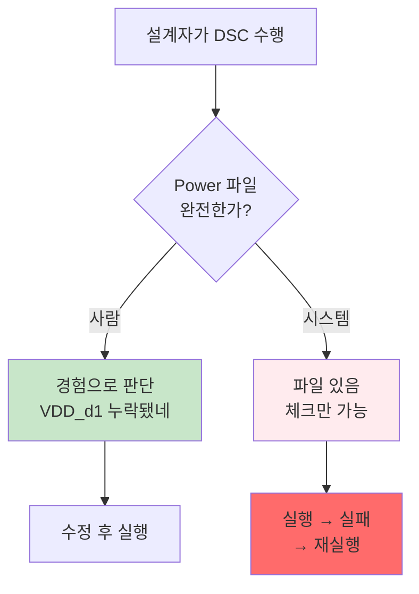

**자동화를 위해서는:**

1. **데이터의 의미**가 시스템에 정의되어야 함
2. **데이터 간 관계**가 명시되어야 함
3. **판단 규칙**이 코드화되어야 함

현재 시스템은 이 세 가지가 모두 부족합니다.

### 2.3 결과: 자동화 불가능 영역

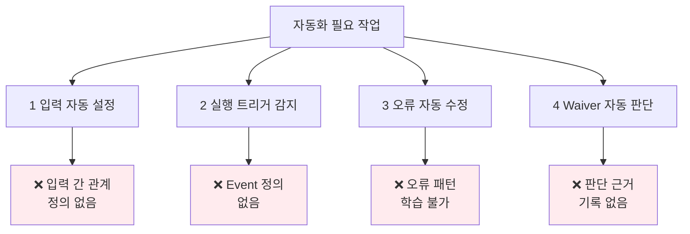

이제 4가지 문제 영역을 구체적으로 살펴보겠습니다.

---

## 3. 4대 문제 영역 상세 분석

### 3.1 데이터 관리의 한계

#### 3.1.1 Workspace 이원화와 Context 손실

**현재 구조:**

Signoff Platform은 두 개의 독립적인 저장 공간으로 운영됩니다:

|구분|Local Workspace|Central WORKSPACE|
|---|---|---|
|**위치**|제품별 Storage<br/>`/user/{PRODUCT}/VERIFY/SIGNOFF/...`|중앙 공유 Storage<br/>`/WORKSPACE/{PRODUCT}/{REVISION}/...`|
|**목적**|Signoff 작업 실행 환경|결과 분석 및 협업|
|**저장 데이터**|Netlist, RUNSCRIPT, 로그, 시뮬레이션 데이터 (대용량)|result.csv/parquet, 메타데이터 (소용량)|
|**도구**|Signoff Launcher|Signoff ResultViewer|
|**관리 주체**|개별 설계자|팀 공유|

**이원화 배경:**

- HPC 운영 정책상 제품별 Storage 용량 제한
- 대용량 시뮬레이션 데이터는 제품 Storage에 분산 저장
- 결과 CSV만 중앙에 업로드하여 협업

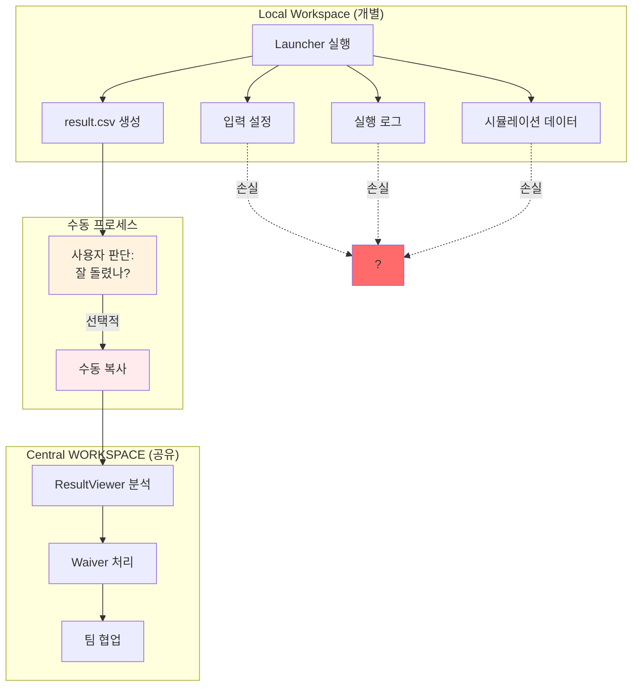

**문제점:**

**1) Context 손실**

result.csv만 업로드되어 **"어떻게 생성되었는지"** 추적이 불가능합니다:

|손실되는 정보|영향|
|---|---|
|입력 파일 선택 이유|왜 이 설정을 사용했는지 모름|
|실행 실패 이력|동일 오류를 반복함|
|중간 디버깅 과정|문제 해결 노하우 공유 불가|
|환경 변수 설정|재현 불가능|

**구체적 사례:**

```
시나리오: HBM4E R30 DSC 수행

월요일:
- 설계자 A가 DSC 실행 (Local Workspace)
- Power 정의 누락으로 실패
- Power 파일 수정 후 재실행 성공
- result.csv를 Central에 업로드

3개월 후, 같은 Block의 R40:
- 설계자 B가 DSC 실행
- 동일하게 Power 정의 누락으로 실패
- "A님이 어떻게 해결했지?" → 알 수 없음
- A님의 Local Workspace는 이미 정리됨
- 같은 시행착오를 반복 (반나절 손실)
```

**2) 재현성(Reproducibility) 부족**

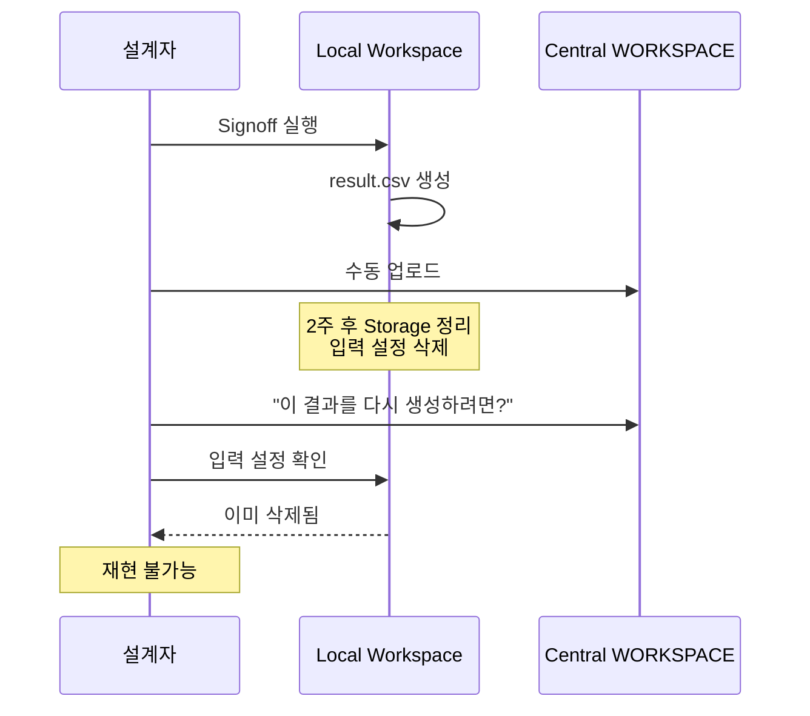

- Local Workspace는 주기적으로 정리됨
- Central WORKSPACE에는 결과만 있고 입력이 없음
- **"어떻게 만들어졌는지" 알 수 없는 결과**

**3) 버전 관리 부재**

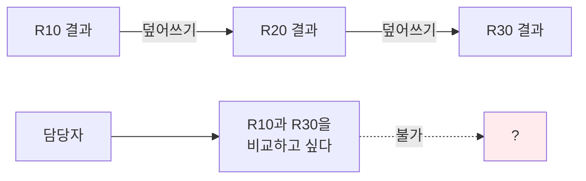

- 동일 Block을 여러 번 실행하면 이전 결과가 덮어써짐
- 과거 결과와 비교 불가능
- "예전 결과가 더 나았던 것 같은데..." → 복구 불가

#### 3.1.2 입력 재사용 불가

**문제 현상:**

Signoff 실행 시 필요한 입력들(Corner, EDR, Power, MP 등)을 매번 **수동으로 재설정**해야 합니다.

**구체적 사례:**

```
HBM4E 제품, DSC Application 수행 시:

R00 (최초):
- Corner 선택: SSPHVCT
- EDR 파일: edr_config_v1.txt
- Power 파일: vdd_core_list.txt
- MP 파일: model_v2.mp
→ 입력 설정에 30분 소요

R10 (Netlist 일부 수정):
- 동일한 입력 사용하고 싶음
- 하지만 입력 재사용 기능 없음
- 모든 입력을 다시 수동으로 설정
→ 또 30분 소요

R20, R30, R40... 반복
→ Revision당 30분씩 손실
```

**영향:**

|항목|현재 상황|문제점|
|---|---|---|
|**Revision 간**|모든 입력 재설정|실제로는 1-2개만 바뀌는데 전체 재설정|
|**Block 간**|각 Block마다 독립 설정|유사 Block도 처음부터 설정|
|**사용자 간**|각자 독립 설정|Best Practice 공유 안 됨|

**예상 시간 손실:**

```
가정:
- 제품당 평균 20개 Block
- Revision당 평균 6회 (R00~R50)
- 입력 설정 시간: 평균 30분

제품 하나당:
20 Block × 6 Revision × 30분 = 60시간

실제로는 입력의 약 90%가 동일한데도 매번 재설정
→ 약 54시간이 불필요하게 소비됨
```

**근본 원인:**

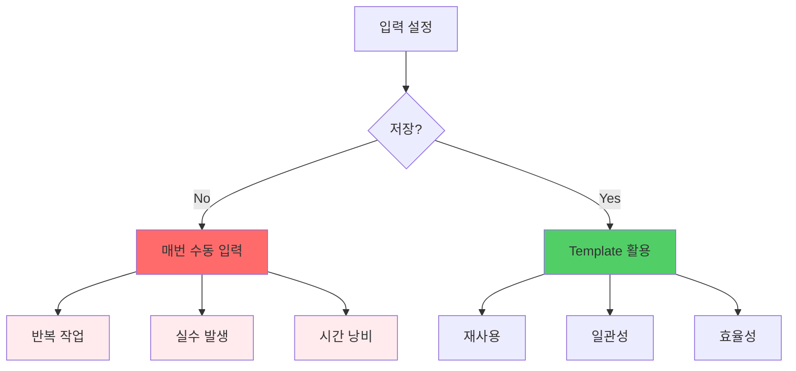

입력 설정이:

- **저장되지 않음** (일회성)
- **공유되지 않음** (개인 지식)
- **표준화되지 않음** (사람마다 다름)

#### 3.1.3 Power 정의 검증 불가

**문제 현상:**

Power 정의 누락은 가장 빈번한 오류 원인이지만, **사전 검증 불가능**합니다.

**SPACE Engine의 CCC 알고리즘:**

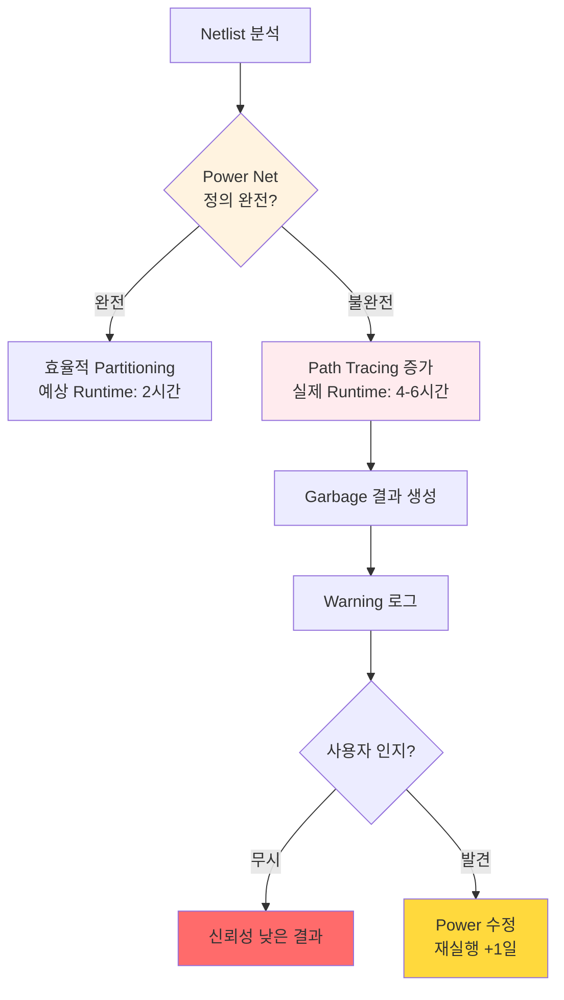

**경험적 데이터:**

실제 운영에서 관찰된 패턴:

- Power 정의 관련 오류: 전체 재실행의 약 40~50%
- 평균 재실행 시간: 4~6시간 (HPC 대기 + 실행)
- 추가 지연: 평균 1일 (담당자 확인 및 수정 시간)

**근본 원인:**

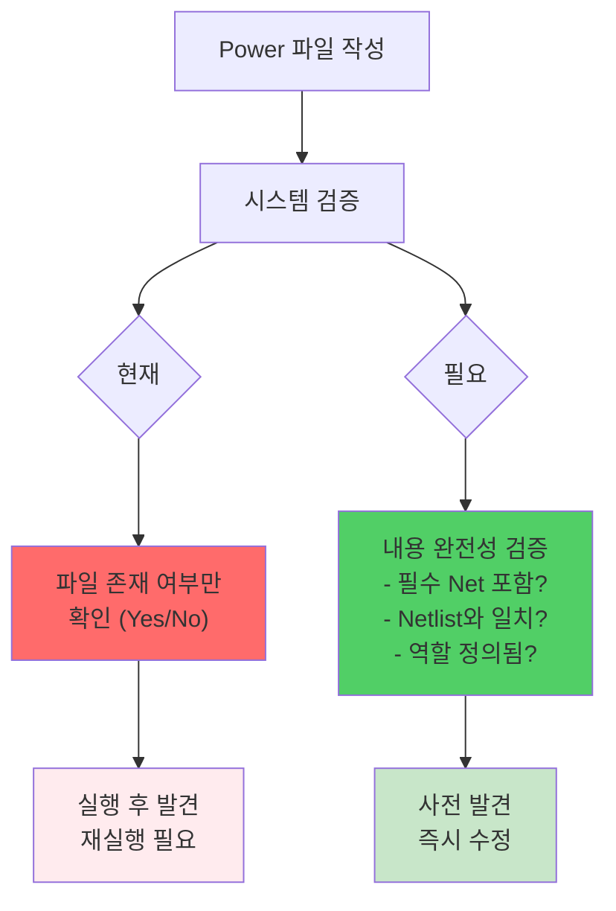

시스템이 **"파일의 존재"**만 확인하고 **"파일의 완전성"**은 검증하지 못함.

---

### 3.2 프로세스 가시성 부재

#### 3.2.1 통합 Dashboard 부재

**문제 현상:**

**"현재 Signoff가 어떻게 진행되고 있는가?"**를 한눈에 볼 수 없습니다.

**역할별 필요 정보:**

|역할|필요한 정보|현재 상황|
|---|---|---|
|**설계자**|내 Block의 전체 진행률|Job별로 개별 확인|
|**Part Leader**|제품 전체 현황, Bottleneck|수동으로 취합|
|**Tool 개발자**|Application 사용 현황, 오류 빈도|로그 수동 분석|
|**경영진**|TAT, 자원 사용률|주간 보고서|

**구체적 사례:**

```
시나리오: Tape-out 2주 전 상황 파악

PM: "HBM4E R40 Signoff 전체 진행률이 어떻게 되나요?"

Part Leader:
1. 각 설계자에게 개별 문의 (메신저/이메일)
2. 응답 취합 (반나절 소요)
3. Excel로 정리
4. "약 70% 정도 된 것 같습니다" (정확하지 않음)

실제 필요한 정보:
- Block별 완료율
- Application별 진행 상황
- Bottleneck 구간
- 예상 완료 시점
→ 실시간으로 보고 싶지만 불가능
```

**현재 모니터링의 한계:**

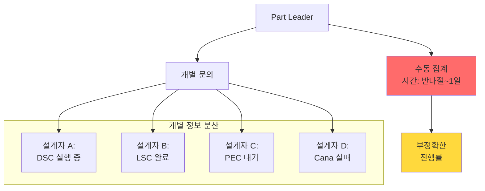

**예상 시간 손실:**

```
Part Leader의 일일 업무:
- 상태 파악: 1-2시간
- 보고서 작성: 1시간
- 주간 총 소요: 약 10-15시간

→ 실시간 Dashboard가 있다면: 5분으로 단축 가능
```

#### 3.2.2 워크플로우 단절

**문제 현상:**

Launcher → ResultViewer → 회로 수정 → 다음 Revision이 **독립적인 단계**로 분리되어 있습니다.

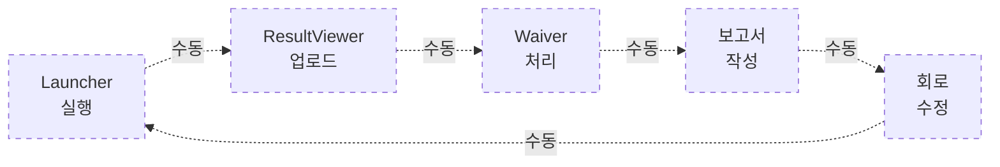

각 단계가 **수동으로 연결**되어:

- 대기 시간 발생
- 정보 손실
- 전체 흐름 추적 불가

**구체적 사례:**

```
시나리오: DSC 수행 후 회로 수정까지

Day 1 (월):
09:00 - 설계자 A가 DSC 실행
11:00 - 실행 완료
11:30 - result.csv를 Central에 수동 업로드

Day 2 (화):
10:00 - 설계자 B가 ResultViewer에서 확인
14:00 - Violation 분석 완료
14:30 - 설계자 A에게 메신저로 문의
       "이 결과가 맞나요?"
       (설계자 A 회의 중 - 2시간 후 응답)

Day 3 (수):
09:00 - 설계자 A 응답 확인
10:00 - Waiver 처리 시작
15:00 - 회로 수정 필요 항목 리스트업
16:00 - 설계팀에 전달

총 소요: 3일 (실제 작업: 8시간)
→ 자동화된 워크플로우: 1일 이내 가능
```

#### 3.2.3 의사결정 Context 부재

**문제 현상:**

**"왜 이렇게 진행되고 있는지"** Context가 보이지 않습니다.

**현재 볼 수 있는 정보:**

```
Job Status (현재):
- DSC_BLOCK_A: Running
- LSC_BLOCK_B: Completed
- Cana_BLOCK_C: Failed
```

**실제 필요한 정보:**

```
Job Context (필요):

DSC_BLOCK_A: Running
├─ 왜 실행? → R40에서 새로운 회로 추가
├─ 누가 요청? → 설계자 김OO
├─ 우선순위? → High (Critical path)
├─ 예상 완료? → 2시간 후
└─ 관련 이슈? → Power 정의 1차 수정됨

LSC_BLOCK_B: Completed
├─ 결과? → 10개 위반, 3개 Waiver 필요
├─ 다음 단계? → 설계자 이OO가 분석 중
└─ 주의사항? → 이전 Revision에 없던 신규 위반

Cana_BLOCK_C: Failed
├─ 실패 원인? → DSPF 파일 경로 오류
├─ 누가 해결? → 설계자 박OO에게 할당
└─ 재실행 예정? → 30분 후
```

Context가 없어서:

- PL이 우선순위 판단 어려움
- 설계자가 전체 흐름 파악 불가
- Tool 개발자가 문제 분석 어려움

---

### 3.3 협업 및 지식 관리 한계

#### 3.3.1 협업 프로세스의 시스템 외부화

**문제 현상:**

Signoff는 본질적으로 **협업 작업**이지만, 협업 프로세스가 **시스템 밖에서** 이루어집니다.

**Signoff 협업 특성:**

- 하나의 제품 = 수십 개 Block
- Block당 여러 Application 수행
- 결과를 Categorize하여 담당자별 분담
- Waiver 판단 시 상호 협의 필요

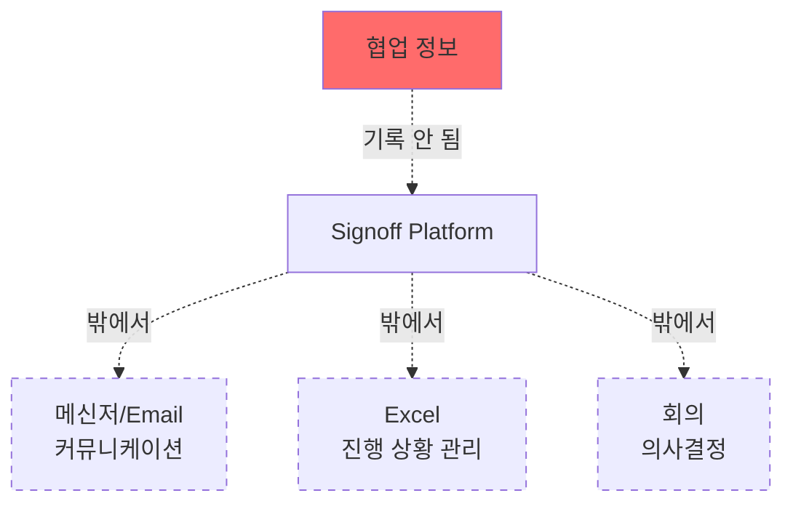

**협업 시나리오별 문제:**

|협업 시나리오|현재 문제|영향|
|---|---|---|
|**Categorize 결과 공유**|누가 어떤 Part를 담당하는지 시스템에 미기록|담당자 파악 위해 별도 연락|
|**Waiver 협의**|Waiver 판단 근거 미기록|같은 질문 반복|
|**입력 설정 공유**|각자 독립적으로 설정|Best Practice 전파 불가|
|**진행 상황 공유**|전체 진행률 확인 불가|Bottleneck 파악 어려움|

**구체적 사례:**

```
시나리오: Categorize Part 후 협업

1. 설계자 A가 FULLCHIP DSC 실행
   → 약 1,000개의 Violation 결과

2. Categorize Part 스크립트 실행:
   - CPU Part (300개) → 설계자 B
   - Memory Part (400개) → 설계자 C
   - IO Part (300개) → 설계자 A

3. 각 담당자가 ResultViewer에서 분석 시작

문제 발생:
- 설계자 B: "이 결과가 왜 CPU Part로 분류됐지?"
  → 설계자 A에게 메신저로 문의
  → 설계자 A 회의 중 (1시간 후 응답)
  
- 설계자 C도 유사 질문
  → 또 별도로 문의
  → 중복 커뮤니케이션

- 설계자 B가 Waiver 처리
  → 근거가 시스템에 기록 안 됨
  → 설계자 C가 유사 케이스 발견 시 또 문의

결과:
- 실제 분석 시간: 2시간
- 커뮤니케이션 오버헤드: 3시간
→ 총 5시간 소요
```

**근본 원인:**

협업 정보가 시스템에 기록되지 않아:

- **검색 불가능**
- **재사용 불가능**
- **신규 팀원이 참고 불가능**

#### 3.3.2 Waiver 일관성 부족

**문제 현상:**

Waiver 판단은 **전문성이 필요한 의사결정**이지만, **일관성 유지가 어렵습니다**.

**일관성 부족의 원인:**

1. **판단 근거 미기록**
    
    - "왜 Waiver 했는가?" 명시 안 됨
    - 나중에 검증 불가능
2. **설계자마다 다른 기준**
    
    - 숙련자: 엄격한 기준
    - 신규자: 불확실한 기준
    - 결과: 제품 품질 편차
3. **상황에 따른 기준 변화**
    
    - Tape-out 전: 보수적 Waiver
    - Tape-out 후: 관대한 Waiver
4. **Revision 간 일관성 부족**
    
    - R30에서 Waiver → R40에서 동일 케이스를 Fixed
    - 왜 판단이 바뀌었는지 기록 없음

**구체적 사례:**

```
시나리오: DSC 위반에 대한 Waiver 판단

Violation 정보:
- Net: CLK_BUF_OUT
- Driver: NMOS W=2um
- 기준: W >= 2.5um
- 위반: 0.5um 부족

설계자 A 판단 (R30, 3개월 경력):
→ Waiver: "CLK Buffer는 속도가 중요하여 작은 Driver 사용"
→ 체크박스만 체크, 근거 미기록

설계자 B 판단 (R40, 동일 케이스, 5년 경력):
→ Fixed: "기준 미달은 수정 필요"
→ 회로 수정 요청

문제:
- 왜 판단이 다른가?
- 어느 쪽이 옳은가?
- 표준 기준은 무엇인가?
→ 시스템에 기록이 없어 확인 불가능
```

**근본 원인:**

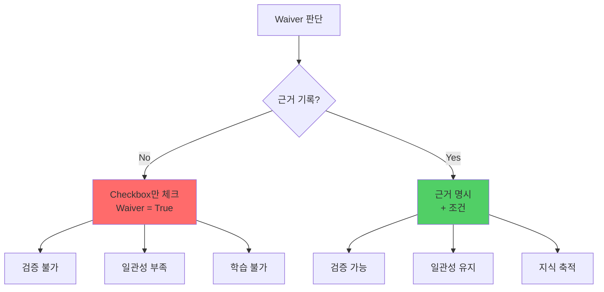

판단은 하지만 **"왜"**는 기록하지 않음.

#### 3.3.3 지식의 조직 자산화 실패

**문제 현상:**

조직에 방대한 Signoff 경험이 축적되지만, **개인의 머릿속에만** 존재합니다.

**소실되는 지식 유형:**

|지식 유형|예시|소실 시점|
|---|---|---|
|**문제 해결 노하우**|"Power 정의 오류는 이렇게 해결"|담당자 퇴사/이동|
|**최적 입력 설정**|"이 Block은 이 설정이 최적"|프로젝트 종료|
|**Corner 선택 전략**|"이 타입은 이 Corner만 체크"|시간 경과로 망각|
|**Waiver 판단 기준**|"이 케이스는 Waiver 가능"|후임자에게 미전달|

**구체적 사례:**

```
시나리오: 5년 경력 설계자 A의 퇴사

설계자 A의 축적된 지식:
- "HBM4 FULLCHIP DSC는 EDR 옵션 X를 사용하면 Runtime 30% 단축"
- "Power 정의는 이 순서로 작성하면 누락 최소화"
- "이런 패턴의 Violation은 Waiver 가능 (설계 의도)"

→ 이 지식들이 문서화되지 않음
→ 신규 설계자 B가 동일한 시행착오 반복
→ 3-6개월 학습 기간 소요
→ 조직 전체 Productivity 저하
```

**영향:**


**근본 원인:**

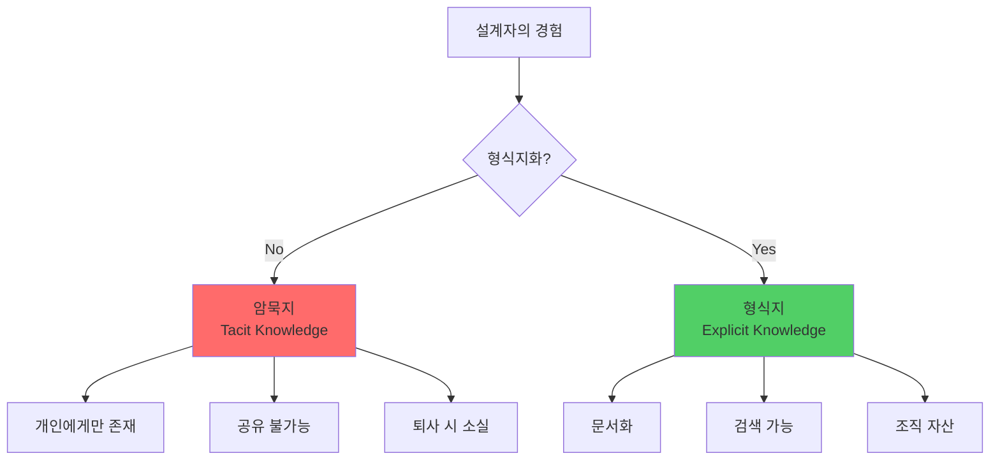

경험이 **암묵지(Tacit Knowledge)**로 남아 조직 자산이 되지 못함.

---

### 3.4 자동화 준비도 부족

#### 3.4.1 Event-Driven Architecture 부재

**문제 현상:**

**"24-hour, No-Human-In-the-Loop"** 실현을 위해서는 **Event-Driven 자동화**가 필요하지만, 현재는 **모든 것이 수동 트리거**입니다.

**필요한 Event-Driven 흐름:**

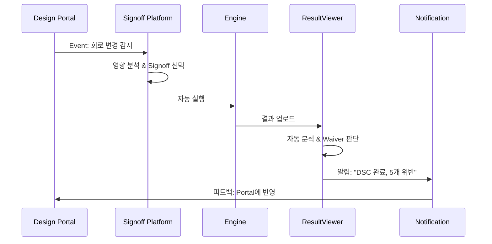

**현재 상황:**

|단계|현재 (수동)|필요 (자동)|
|---|---|---|
|**변경 감지**|❌ 사용자가 확인|✅ Design Portal 연동|
|**영향 분석**|❌ 사용자가 판단|✅ 의존성 분석|
|**Signoff 선택**|❌ 수동 선택|✅ 규칙 기반 자동 선택|
|**입력 설정**|❌ 수동 입력|✅ Template 기반 자동|
|**실행**|✅ 가능 (launcher_sub)|✅ 이미 자동화됨|
|**결과 분석**|❌ 수동 확인|✅ AI 기반 자동 분석|
|**Waiver 판단**|❌ 수동 판단|✅ 규칙 기반 자동|
|**피드백**|❌ 수동 보고|✅ Portal 자동 업데이트|

**자동화율:**

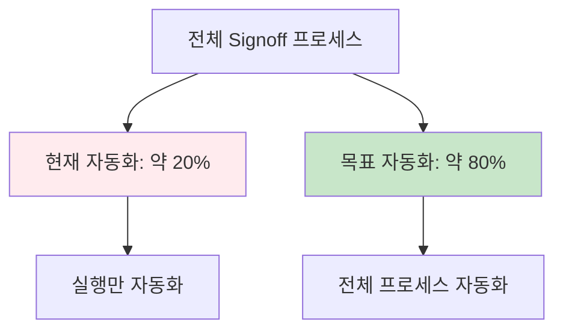

**구체적 사례:**

```
시나리오: 회로 변경 후 Signoff 필요

현재 프로세스 (수동):
Day 1:
- 설계자가 Netlist 수정 완료
- "Signoff 다시 돌려야 하는데..."
- Launcher 접속
- 입력 재설정 (30분)
- 실행

Day 2:
- 결과 확인
- ResultViewer 업로드
- 분석 시작
→ 총 소요: 2일

필요한 프로세스 (자동):
Day 1:
- 설계자가 Netlist 수정 완료
- Design Portal에 체크인
→ 시스템이 자동 감지
→ 영향 받은 Block 자동 파악
→ 필요한 Signoff 자동 선택
→ 입력 자동 설정
→ 자동 실행
→ 결과 자동 분석
→ 설계자에게 알림: "DSC 완료, 5개 위반"
→ 총 소요: 4시간 (사람 개입 없음)
```

**근본 원인:**

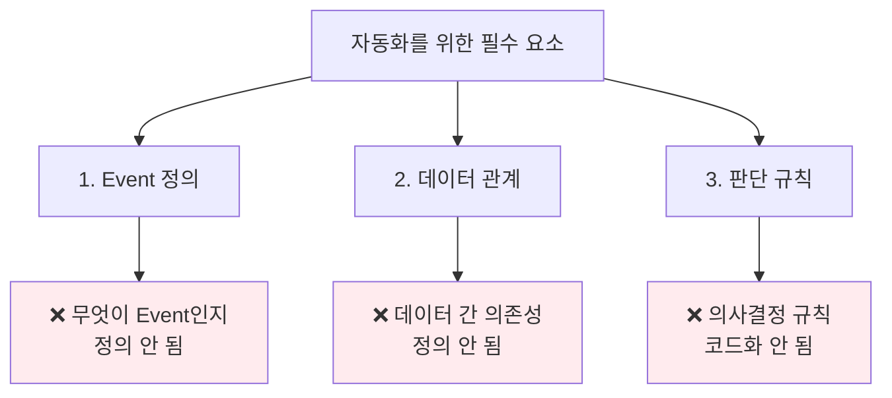

#### 3.4.2 AI 학습 데이터 부족

**문제 현상:**

AI/ML 기반 자동화를 위해서는 **고품질 학습 데이터**가 필요하지만, 현재는 **데이터 품질이 부족**합니다.

**AI 학습에 필요한 데이터:**

|데이터 유형|AI 활용 목표|현재 상태|
|---|---|---|
|**입력-결과 Pair**|최적 입력 자동 예측|❌ Pair 저장 안 됨|
|**Waiver 판단 근거**|자동 Waiver 판단|❌ 근거 기록 안 됨|
|**오류-해결 이력**|오류 자동 수정 제안|❌ 이력 없음|
|**Corner 선택 패턴**|Corner 자동 추천|❌ 패턴 없음|
|**Runtime 데이터**|성능 최적화|⚠️ 부분적|

**현재 데이터의 문제:**

1. **Context 정보 부재**
    
    - 결과만 있고 "어떻게 생성되었는지" 없음
    - AI가 학습할 Feature가 부족
2. **Label 부족**
    
    - "좋은 결과"와 "나쁜 결과" 구분 불가
    - `Waiver = True/False`만 있고 "왜"가 없음
3. **데이터 분산**
    
    - Local/Central에 분산
    - 통합 Dataset 구성 불가

**AI 자동화 예시:**

```
원하는 시나리오: Power 정의 자동 검증

1. 사용자가 Power 파일 업로드
2. AI가 과거 3,000건의 성공/실패 사례 분석
3. 자동 검증:
   - Block 타입 인식 (SRAM / Logic / IO)
   - 필수 Net 체크 (VDD_CORE, VSS, VDDQ...)
   - Netlist와 일치 여부 확인
4. 결과:
   - "VDD_ARRAY 정의 누락 (신뢰도 95%)"
   - "VSS_PERI 이름 오타 의심 (신뢰도 80%)"
5. 사용자 확인 후 실행

→ Power 관련 재실행율: 50% → 5%로 감소 예상
```

**하지만 현재는:**

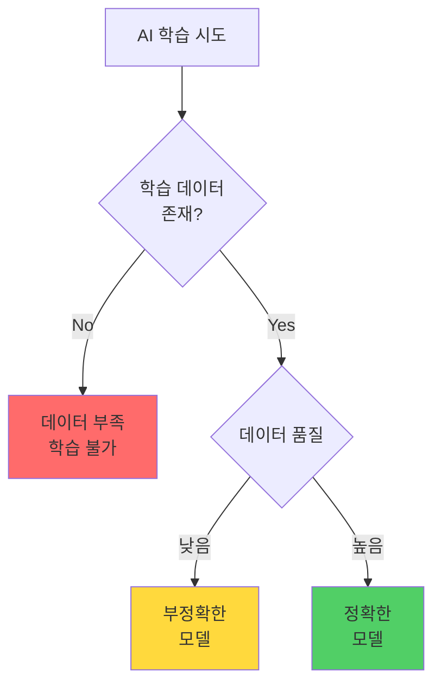

#### 3.4.3 수동 작업의 과도한 비중

**문제 현상:**

전체 Signoff 프로세스에서 **자동화 가능한 작업**이 많지만, 현재는 **대부분 수동**입니다.

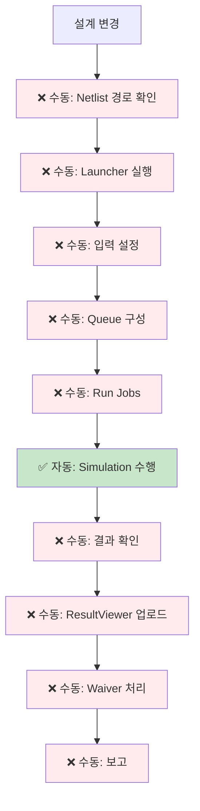

**단계별 자동화율:**

|단계|자동화 여부|작업 비중|자동화 가능성|
|---|---|---|---|
|Netlist 경로 확인|❌ 수동|5%|✅ 높음|
|Launcher 실행|❌ 수동|5%|✅ 높음|
|입력 설정|❌ 수동|20%|✅ 높음|
|Queue 구성|❌ 수동|10%|✅ 높음|
|Simulation 수행|✅ 자동|30%|✅ 이미 자동화|
|결과 확인|❌ 수동|10%|✅ 중간|
|ResultViewer 업로드|❌ 수동|5%|✅ 높음|
|Waiver 처리|❌ 수동|10%|⚠️ 낮음 (판단 필요)|
|보고|❌ 수동|5%|✅ 높음|
|**총 자동화율**|**약 30%**|**100%**|**약 70% 가능**|

**개선 잠재력:**

```
현재 자동화율: 30%
가능 자동화율: 70%
→ 약 40%p 개선 여력

HBM4E 제품 기준 예상 효과:
- 현재 Signoff TAT: 약 14일
- 개선 후 TAT: 약 7-8일
→ 약 50% 단축 가능
```

---

## 4. 종합: 현 상황의 정량적 영향

### 4.1 비효율성 추정

실제 운영 경험을 바탕으로 한 비효율성 추정:

|문제 영역|비용 항목|연간 추정 손실|
|---|---|---|
|**Power 정의 누락**|재실행 비용 (약 40-50% 발생)|**약 200-250 작업일**|
|**입력 재사용 부족**|Revision별 재설정 (10회 × 20 Block)|**약 200시간**|
|**수동 모니터링**|Part Leader 취합 작업|**약 500-1000시간**|
|**수동 업로드**|ResultViewer 업로드 (100회 × 30분)|**약 50시간**|
|**Waiver 비효율**|일관성 부족으로 재검토|**약 300시간**|
|**지식 손실**|신규 인력 재학습 기간|**약 3-6개월/인**|
|**총 비효율**||**약 2,500시간+ 효율 저하**|

### 4.2 Signoff TAT 분석

```mermaid
graph LR
    A[Revision 시작] --> B[Netlist 준비<br/>약 2일]
    B --> C[Signoff 실행<br/>약 3일]
    C --> D[오류 수정<br/>약 2-3일]
    D --> E[재실행<br/>약 3일]
    E --> F[Waiver 처리<br/>약 2일]
    F --> G[보고<br/>약 1일]
    
    H[총 TAT<br/>약 13-14일] --> I[개선 목표<br/>약 7일]
    
    style C fill:#fff3e0
    style D fill:#ffebee
    style E fill:#ffebee
    style I fill:#c8e6c9
```

**개선 잠재력:**

| 개선 항목           | 현재 (경험치)       | 목표     | 개선 예상        |
| --------------- | -------------- | ------ | ------------ |
| **Signoff TAT** | 약 13-14일       | 약 7일   | **약 50%**    |
| **입력 오류율**      | 약 20-30%       | 약 5%   | **약 75-83%** |
| **재실행율**        | 약 1.3-1.5회/Job | 약 1.1회 | **약 20-27%** |
| **자동화율**        | 약 30%          | 약 70%  | **약 133%**   |

### 4.3 핵심 제약사항

현재 시스템이 가진 **구조적 제약**:

```mermaid
graph TB
    A[파일 기반 아키텍처] --> B[데이터만 관리<br/>의미 관리 불가]
    
    B --> C[입력 자동 설정 불가]
    B --> D[오류 자동 수정 불가]
    B --> E[Waiver 자동 판단 불가]
    B --> F[지식 축적 불가]
    
    C --> G[완전 자동화<br/>불가능]
    D --> G
    E --> G
    F --> G
    
    style A fill:#ff6b6b
    style G fill:#ffd93d
```

**결론:**

1. **데이터와 의미의 분리**가 근본 원인
2. **24-hour 자동화**는 현 구조로 불가능
3. **업무 효율성**이 약 50% 저하
4. **지식 자산화** 실패로 장기 경쟁력 약화

---

**다음 단계:**

이러한 문제들을 해결하기 위한 접근 방법으로, 데이터와 의미를 통합 관리하는 새로운 아키텍처가 필요합니다.

---