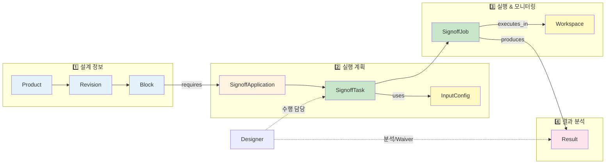
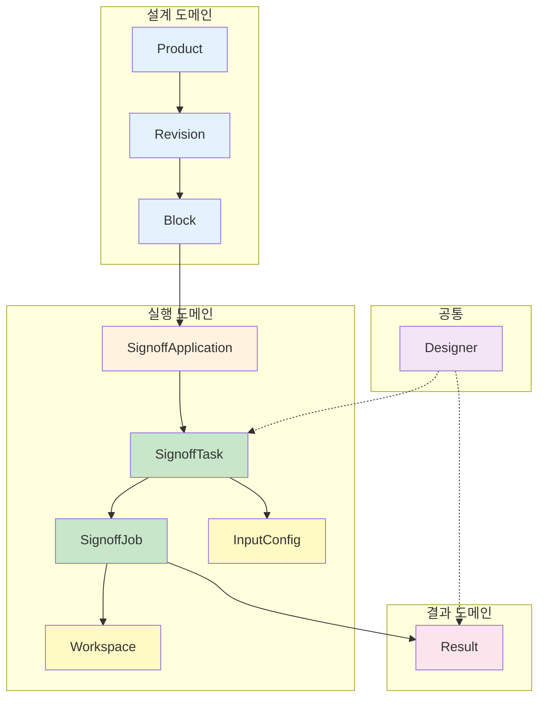
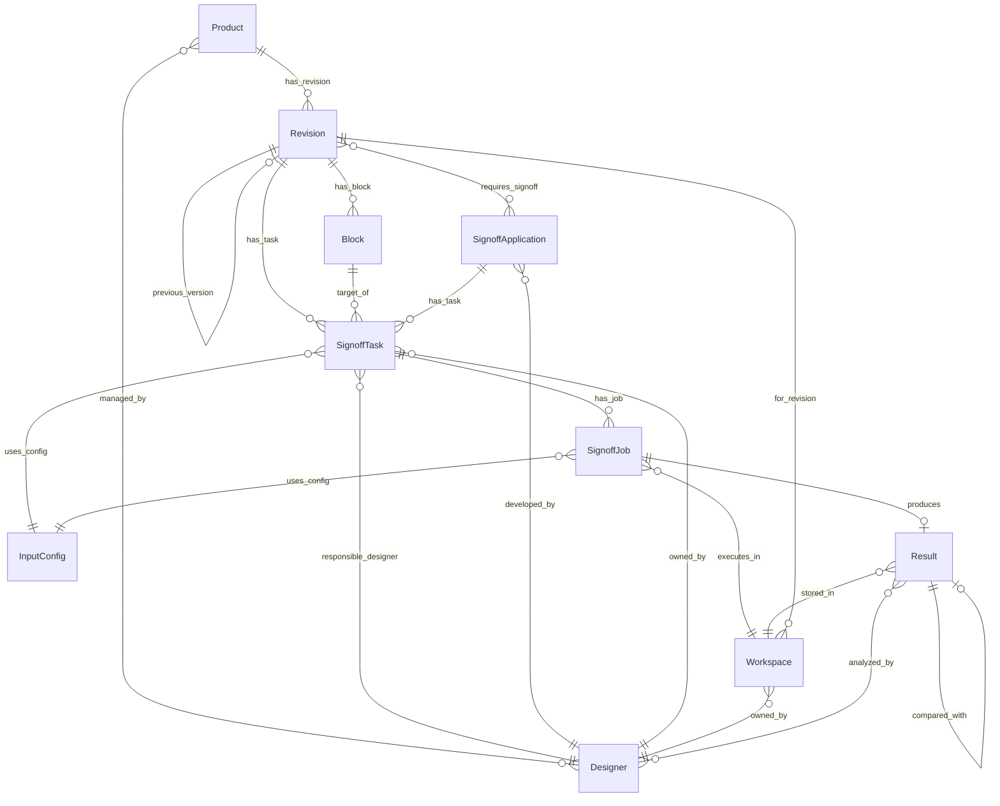
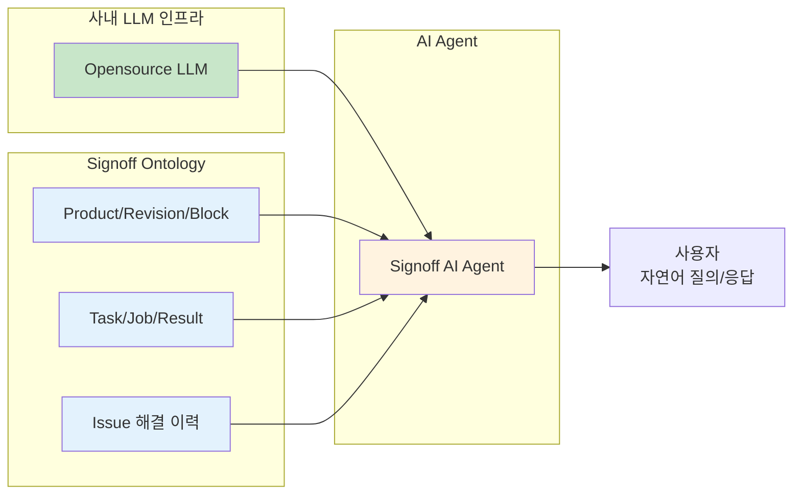
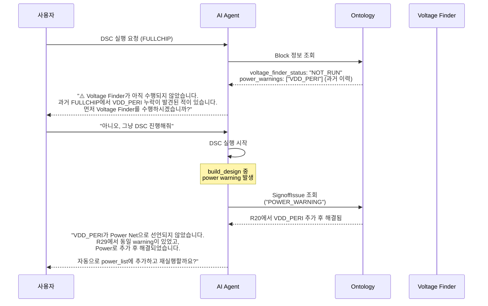
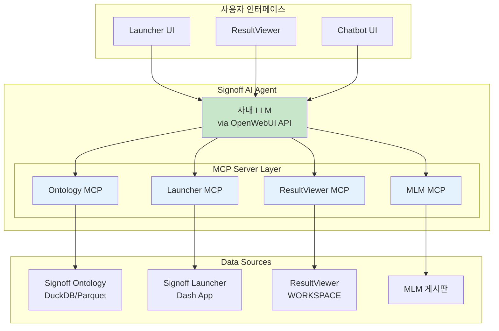
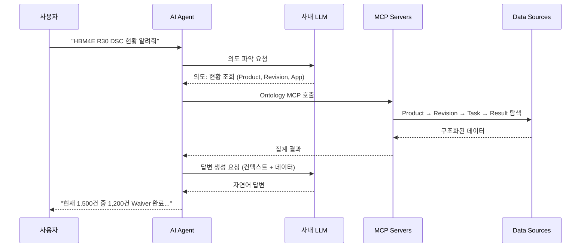
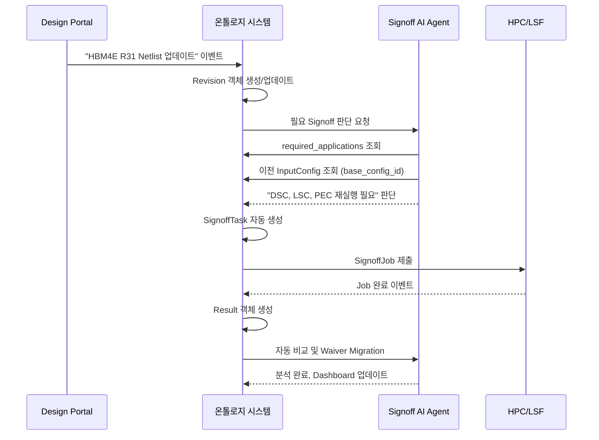
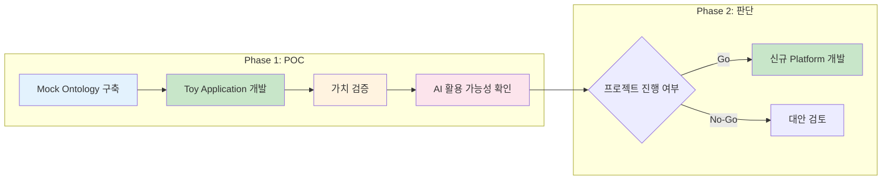

# Signoff Platform 온톨로지 설계 및 구현 방안

## 1. 서론: 온톨로지 도입 배경

### 1.1 현재 시스템의 근본적 한계

현재 Signoff Flow는 각각의 모듈들이 독립적으로 운영되며 파편화된 **파일 기반 데이터**들로 동작하고 있습니다. 실행 스크립트와 결과 파일 등 **데이터**는 남지만, 그 데이터의 **맥락과 의미**(어떤 설계 버전의 어떤 블록에 대한 어떤 검증인지, 왜 그런 결과가 나왔는지 등)는 시스템에 녹아들지 못합니다. 예를 들어 결과 CSV 파일 경로(`/user/프로젝트/R30/DSC/result.csv`)만으로는 **무슨 내용의 결과인지, 어떤 관계의 데이터인지** 파악하는데 한계가 있습니다. 이로 인해 다음과 같은 문제가 발생합니다:

- **Context 손실:** 설계 변경 이력, 입력 조건, Waiver 판단 근거 등 **문맥 정보가 파일 밖에 존재**하여 공유되지 않습니다. 중앙 Workspace와 로컬 작업 폴더로 **작업공간이 이원화**되어, 어떤 설정과 환경에서 실행됐는지 추적하기 어렵습니다. 그 결과 결과 해석이나 문제 원인 파악에 일일이 담당자의 기억과 메모에 의존하게 됩니다.
- **재현 및 추적 불가:** 현재 어떤 설정으로 검증이 수행되었는지 시스템이 모르기 때문에, 동일 조건으로 다시 실행하거나 결과를 **재현**하기 어렵습니다. 과거 특정 이력 추적 "왜 Error가 생기지?" "누가 Waiver했지?", "어떤 입력으로 수행했지?"와 같은 질문에 답하려 해도, **기록이 남지 않아 추적하기 어려운** 상황입니다. 이는 검증 결과의 **재현성과 신뢰성**을 저해합니다.
- **자동화의 어려움:** **Signoff Agent**를 지향하지만, 의미 정보 부재로 인해 자동화가 구조적으로 불가능합니다. 데이터 간 **관계가 정의되지 않아** 입력 파일들을 자동으로 세팅할 수 없고, **이벤트 트리거**를 인식하지 못해 설계 변경 시 자동 실행이 안 되며, 과거 오류 패턴을 학습시키지 못해 **AI 활용**도 제한됩니다. 결국 사람의 수작업과 판단 없이는 프로세스 진행이 막히는 것입니다.

이러한 _"데이터는 있으나 의미는 없는"_ 갭을 해결하기 위해 **온톨로지(Ontology)** 개념을 도입합니다.

### 1.2 온톨로지 도입 목표

**온톨로지(Ontology)**는 Signoff 업무의 **핵심 개체(Object)와 그들 간의 관계(Relationship)**를 명시적으로 정의하여, 시스템이 데이터의 **의미와 맥락**을 이해할 수 있게 합니다.

|구분|현재 (파일 기반)|온톨로지 도입 후|
|---|---|---|
|**데이터 저장**|파일 경로, 실행 결과|객체 + 속성 + 관계|
|**의미 이해**|❌ 불가능|✅ (AI) 시스템이 이해|
|**자동화 가능성**|수동 설정 필수|규칙 기반 자동 실행|
|**지식 축적**|개인 경험에 의존|조직 지식으로 체계화|

---
## 2. Signoff 업무 흐름 기반 온톨로지 설계

온톨로지 설계는 **실제 Signoff 업무 흐름**을 기반으로 합니다. 업무 단계별로 필요한 객체와 관계를 정의합니다.

### 2.1 Signoff 업무 흐름 개요



### 2.2 업무 단계별 객체 매핑

|업무 단계|핵심 질문|관련 Object|
|---|---|---|
|**1. 설계 정보**|무엇을 검증하는가?|Product, Revision, Block|
|**2. 실행 계획**|어떻게 검증하는가?|SignoffApplication, SignoffTask, InputConfig|
|**3. 실행 & 모니터링**|언제, 어디서 실행되는가?|SignoffJob, Workspace|
|**4. 결과 분석**|결과는 무엇이고, Waiver/Fixed는?|Result (Waiver 정보, 비교 정보 포함)|
|**전 단계 공통**|누가 담당하는가?|Designer|

---

## 3. 핵심 Object Type 정의

### 2.2 업무 단계별 객체 매핑

|업무 단계|핵심 질문|관련 Object|
|---|---|---|
|**1. 설계 정보**|무엇을 검증하는가?|Product, Revision, Block|
|**2. 실행 계획**|어떻게 검증하는가?|SignoffApplication, SignoffTask, InputConfig|
|**3. 실행 & 모니터링**|언제, 어디서 실행되는가?|SignoffJob, Workspace|
|**4. 결과 분석**|결과는 무엇이고, Waiver/Fixed는?|Result (Waiver 정보, 비교 정보 포함)|
|**전 단계 공통**|누가 담당하는가?|Designer|

---

## 3. 핵심 Object Type 정의

### 3.1 Object 개요

프로토타입 범위인 **SPACE 계열 Application (DSC, LSC, LS, PEC, Cana-Tr, CDA)**을 기준으로 **9개의 핵심 Object Type**을 정의합니다.



---

### 3.2 Product (제품)

**역할**: 메모리 제품의 최상위 개체. 모든 설계 버전과 Signoff 작업의 루트(Root)입니다.

| 속성명               | 타입        | 필수  | 설명                        | 예시                            |
| ----------------- | --------- | --- | ------------------------- | ----------------------------- |
| `product_id`      | STRING    | ✅   | 제품 고유 ID                  | `"HBM4E"`                     |
| `product_name`    | STRING    | ✅   | 제품 전체 이름                  | `"HBM4E 32GB Wide I/O"`       |
| `product_type`    | ENUM      | ✅   | 제품 유형                     | `"HBM"`, `"DDR5"`, `"LPDDR5"` |
| `created_at`      | TIMESTAMP | ✅   | 생성 시각                     | `"2024-01-15T09:00:00Z"`      |
| `updated_at`      | TIMESTAMP | ✅   | 수정 시각                     | `"2025-03-18T14:30:00Z"`      |
| `categorize_rule` | STRING    | ✅   | categorize rule table csv | `categorize_rule.csv`         |

**관계 (Links):**

|관계명|방향|대상 Object|설명|
|---|---|---|---|
|`has_revision`|→|Revision (1:N)|제품에 속한 설계 버전들|
|`managed_by`|→|Designer (N:M)|제품 책임자들 (PL, PE 등)|

---

### 3.3 Revision (설계 버전)

**역할**: 특정 제품의 **설계 이력 버전**이며, **Signoff 작업의 기준 단위**입니다. Revision 간 결과 비교의 기준점이 됩니다.

| 속성명                     | 타입            | 필수  | 설명            | 예시                                              |
| ----------------------- | ------------- | --- | ------------- | ----------------------------------------------- |
| `revision_id`           | STRING        | ✅   | 리비전 고유 ID     | `"HBM4E_R30"`                                   |
| `product_id`            | STRING        | ✅   | 소속 제품 ID (FK) | `"HBM4E"`                                       |
| `revision_phase`        | ENUM          | ✅   | 리비전 단계        | `"R00"`, `"R10"`, `"R30"`, `"R40"`              |
| `signoff_status`        | ENUM          | ✅   | Signoff 진행 상태 | `"NOT_STARTED"`, `"IN_PROGRESS"`, `"COMPLETED"` |
| `required_applications` | ARRAY[STRING] | ✅   | 필수 Signoff 목록 | `["DSC", "LSC", "LS", "PEC", "CANATR", "CDA"]`  |
| `due_date`              | DATE          | ❌   | 완료 예정일        | `"2025-06-01"`                                  |
| `previous_revision_id`  | STRING        | ❌   | 이전 리비전 ID     | `"HBM4E_R29"`                                   |
| `created_at`            | TIMESTAMP     | ✅   | 생성 시각         |                                                 |
| `updated_at`            | TIMESTAMP     | ✅   | 수정 시각         |                                                 |

**관계 (Links):**

|관계명|방향|대상 Object|설명|
|---|---|---|---|
|`belongs_to`|→|Product (N:1)|소속 제품|
|`has_block`|→|Block (1:N)|포함된 회로 블록들|
|`requires_signoff`|→|SignoffApplication (N:M)|필요한 Signoff Application|
|`has_task`|→|SignoffTask (1:N)|수행된 Signoff 작업들|
|`previous_version`|→|Revision (1:1)|바로 이전 리비전 (비교 기준)|

---

### 3.4 Block (회로 블록)

**역할**: 회로 설계의 **계층적 블록**을 표현. Signoff 검증의 **대상 단위**입니다.

| 속성명              | 타입        | 필수  | 설명                | 예시                              |
| ---------------- | --------- | --- | ----------------- | ------------------------------- |
| `block_id`       | STRING    | ✅   | 블록 고유 ID          | `"HBM4E_R30_FULLCHIP"`          |
| `revision_id`    | STRING    | ✅   | 소속 리비전 ID (FK)    | `"HBM4E_R30"`                   |
| `block_name`     | STRING    | ✅   | 블록 이름             | `"FULLCHIP"`, `"PHY"`, `"IO"`   |
| `top_subckt`     | STRING    | ❌   | Top Subcircuit 이름 | `"FULLCHIP_TOP"`                |
| `netlist_path`   | STRING    | ✅   | Netlist 파일 경로     | `"/data/netlist/fullchip.star"` |
| `instance_count` | INTEGER   | ❌   | Transistor 인스턴스 수 | `1500000`                       |
| `created_at`     | TIMESTAMP | ✅   |                   |                                 |
| `updated_at`     | TIMESTAMP | ✅   |                   |                                 |

**관계 (Links):**

| 관계명          | 방향  | 대상 Object         | 설명                 |
| ------------ | --- | ----------------- | ------------------ |
| `belongs_to` | →   | Revision (N:1)    | 소속 리비전             |
| `target_of`  | →   | SignoffTask (1:N) | 이 블록을 대상으로 한 Task들 |

---

### 3.5 SignoffApplication (검증 도구)

**역할**: Signoff 단계에서 사용되는 **검증 도구/방법론의 정의**입니다. 프로토타입에서는 SPACE 계열 6개 Application을 대상으로 합니다.

| 속성명               | 타입            | 필수  | 설명                | 예시                                           |
| ----------------- | ------------- | --- | ----------------- | -------------------------------------------- |
| `app_id`          | STRING        | ✅   | Application ID    | `"DSC"`                                      |
| `app_name`        | STRING        | ✅   | 전체 이름             | `"Driver Size Check"`                        |
| `app_group`       | ENUM          | ✅   | 분류 그룹             | `"Static"`, `"Dynamic"`                      |
| `engine_type`     | ENUM          | ✅   | 실행 엔진             | `"SPACE"`, `"ADV"`, `"External"`             |
| `runscript_path`  | STRING        | ✅   | RUNSCRIPT 경로      | `"/user/signoff.dsa/RUNSCRIPTS/signoff-dsc"` |
| `required_inputs` | ARRAY[STRING] | ✅   | 필수 입력 항목          | `["NETLIST", "EDR", "MP", "POWER"]`          |
| `comparison_key`  | STRING        | ✅   | 비교/Migration 기준 키 | `"measure_net + driver_net"`                 |
| `developer`       | STRING        | ✅   | 담당 개발자 ID         | `"deepwonwoo"`                               |
| `manual_url`      | STRING        | ❌   | 매뉴얼 URL           |                                              |
| `created_at`      | TIMESTAMP     | ✅   |                   |                                              |
| `updated_at`      | TIMESTAMP     | ✅   |                   |                                              |

**프로토타입 대상 Application 정의:**

| app_id   | app_name                | 주요 목적                      | comparison_key               |
| -------- | ----------------------- | -------------------------- | ---------------------------- |
| `DSC`    | Driver Size Check       | Driver 크기 적절성 검증           | `measure_net + driver_net`   |
| `LSC`    | Latch Strength Check    | Latch Feed-back Loop 강도 검증 | `latch_name + input_pin`     |
| `LS`     | Level Shifter Check     | 전압 도메인 간 신호 변환 검증          | `ls_name + input_net`        |
| `PEC`    | Power Error Check       | Power Network 오류 검출        | `net_name + error_type`      |
| `CANATR` | Coupling Noise Analysis | Crosstalk Noise 검출         | `victim_net + aggressor_net` |
| `CDA`    | Coupling Delay Analyzer | Coupling Delay 변화 검사       | `path_name + coupling_net`   |

**관계 (Links):**

|관계명|방향|대상 Object|설명|
|---|---|---|---|
|`required_by`|←|Revision (N:M)|이 Application을 요구하는 Revision들|
|`developed_by`|→|Designer (N:1)|담당 개발자|
|`has_task`|→|SignoffTask (1:N)|이 Application으로 수행된 Task들|

---

### 3.6 SignoffTask (작업 정의)

**역할**: 특정 Revision, Block, Application, PVT 조건의 조합으로 정의되는 **Signoff 작업 단위**입니다. Task는 여러 번 실행(Job)될 수 있습니다.

| 속성명           | 타입        | 필수  | 설명                  | 예시                                                       |
| ------------- | --------- | --- | ------------------- | -------------------------------------------------------- |
| `task_id`     | STRING    | ✅   | Task 고유 ID          | `"DSC_FULLCHIP_R30_SSPHVCT"`                             |
| `revision_id` | STRING    | ✅   | 대상 리비전 ID (FK)      | `"HBM4E_R30"`                                            |
| `block_id`    | STRING    | ✅   | 대상 블록 ID (FK)       | `"HBM4E_R30_FULLCHIP"`                                   |
| `app_id`      | STRING    | ✅   | Application ID (FK) | `"DSC"`                                                  |
| `owner_id`    | STRING    | ✅   | 수행 담당자 ID (FK)      | `"deepwonwoo"`                                           |
| `pvt_corner`  | JSON      | ✅   | PVT 조건              | `{"process": "SS", "voltage": "HV", "temp": "CT"}`       |
| `status`      | ENUM      | ✅   | Task 상태             | `"DEFINED"`, `"IN_PROGRESS"`, `"COMPLETED"`, `"BLOCKED"` |
| `created_at`  | TIMESTAMP | ✅   |                     |                                                          |
| `updated_at`  | TIMESTAMP | ✅   |                     |                                                          |

**관계 (Links):**

|관계명|방향|대상 Object|설명|
|---|---|---|---|
|`belongs_to_revision`|→|Revision (N:1)|소속 리비전|
|`targets_block`|→|Block (N:1)|대상 블록|
|`uses_application`|→|SignoffApplication (N:1)|사용 Application|
|`uses_config`|→|InputConfig (N:1)|사용 입력 설정|
|`owned_by`|→|Designer (N:1)|담당자|
|`has_job`|→|SignoffJob (1:N)|실행 이력 (Job들)|

---

### 3.7 SignoffJob (실행 인스턴스)

**역할**: SignoffTask의 **실제 실행 인스턴스**입니다. 재실행 시 새로운 Job이 생성됩니다. LSF Job과 1:1 매핑됩니다.

| 속성명                  | 타입            | 필수  | 설명                     | 예시                                             |
| -------------------- | ------------- | --- | ---------------------- | ---------------------------------------------- |
| `job_id`             | STRING        | ✅   | Job 고유 ID              | `"JOB_DSC_FULLCHIP_R30_001"`                   |
| `task_id`            | STRING        | ✅   | 소속 Task ID (FK)        | `"DSC_FULLCHIP_R30_SSPHVCT"`                   |
| `lsf_job_id`         | STRING        | ❌   | LSF Job ID             | `"12345678"`                                   |
| `status`             | ENUM          | ✅   | Job 상태                 | `"PENDING"`, `"RUNNING"`, `"DONE"`, `"FAILED"` |
| `workspace_id`       | STRING        | ✅   | 실행 Workspace ID (FK)   | `"WS_001"`                                     |
| `power_warning_nets` | ARRAY[STRING] | ❌   | 실행 중 발생한 Power Warning | `["VDD_PERI"]`                                 |
| `start_time`         | TIMESTAMP     | ❌   | 시작 시각                  |                                                |
| `end_time`           | TIMESTAMP     | ❌   | 종료 시각                  |                                                |
| `log_path`           | STRING        | ❌   | 로그 파일 경로               |                                                |
| `created_at`         | TIMESTAMP     | ✅   |                        |                                                |


**관계 (Links):**

|관계명|방향|대상 Object|설명|
|---|---|---|---|
|`of_task`|→|SignoffTask (N:1)|소속 Task|
|`executes_in`|→|Workspace (N:1)|실행 Workspace|
|`uses_config`|→|InputConfig (N:1)|실제 사용된 설정|
|`produces`|→|Result (1:1)|생성된 결과|

---

### 3.8 InputConfig (입력 설정)

**역할**: SignoffTask/Job 실행에 필요한 **입력 파일 및 설정값**을 캡슐화합니다. 재사용 가능하며, 이전 Revision 설정을 참조할 수 있습니다.

| 속성명                  | 타입        | 필수  | 설명               | 예시                                                |
| -------------------- | --------- | --- | ---------------- | ------------------------------------------------- |
| `config_id`          | STRING    | ✅   | 설정 고유 ID         | `"CONFIG_DSC_FULLCHIP_001"`                       |
| `task_id`            | STRING    | ✅   | 소속 Task ID       | `"HBM4E_R30_FULLCHIP_DSC"`                        |
| `netlist_file`       | STRING    | ✅   | Netlist 파일 경로    | `"/path/fullchip.star"`                           |
| `edr_file`           | STRING    | ✅   | EDR 파일 경로        | `"/path/fullchip_EDR"`                            |
| `mp_file`            | STRING    | ✅   | MP 파일 경로         | `"/path/fullchip_MP"`                             |
| `power_definition`   | JSON      | ✅   | Power 정의         | `{"VDD": ["VDD_CORE", "VDD_IO"], "GND": ["VSS"]}` |
| `additional_options` | JSON      | ❌   | 추가 옵션            | `{"INPUT_SLOPE": "400p", "SIM_TIME": "10n"}`      |
| `validation_status`  | ENUM      | ✅   | 검증 상태            | `"NOT_VALIDATED"`, `"VALIDATED"`, `"ERROR"`       |
| `base_config_id`     | STRING    | ❌   | 참조한 이전 Config ID | `"CONFIG_DSC_FULLCHIP_R29"`                       |
| `created_at`         | TIMESTAMP | ✅   |                  |                                                   |


**관계 (Links):**

|관계명|방향|대상 Object|설명|
|---|---|---|---|
|`for_application`|→|SignoffApplication (N:1)|대상 Application|
|`for_block`|→|Block (N:1)|대상 블록|
|`used_by_task`|←|SignoffTask (1:N)|이 설정을 사용하는 Task들|
|`used_by_job`|←|SignoffJob (1:N)|이 설정으로 실행된 Job들|
|`based_on`|→|InputConfig (1:1)|참조한 이전 버전 설정|

---

### 3.9 Workspace (작업 공간)

**역할**: SignoffJob이 **실행되는 환경(디렉토리)** 을 표현합니다. Local과 Central 경로를 모두 포함 하여 자동 업로드(ResultViewer 연동)를 지원합니다.

| 속성명             | 타입        | 필수  | 설명              | 예시                                                  |
| --------------- | --------- | --- | --------------- | --------------------------------------------------- |
| `workspace_id`  | STRING    | ✅   | Workspace 고유 ID | `"WS_DSC_FULLCHIP_001"`                             |
| `local_path`    | STRING    | ✅   | Local 작업 경로     | `"/user/HBM4E/VERIFY/SIGNOFF/.../DSC_20250318/"`    |
| `central_path`  | STRING    | ✅   | Central 공유 경로   | `"/WORKSPACE/HBM4E/R30/FULLCHIP/DSC/"`              |
| `job_id`        | STRING    | ✅   | 소속 Job ID (FK)  | `"JOB_DSC_FULLCHIP_R30_001"`                        |
| `uploaded`      | ENUM      | ✅   | 업로드 상태          | `"NOT_UPLOADED"`, `"UPLOADED"`, `"UPLOADED_FAILED"` |
| `uploaded_time` | TIMESTAMP | ❌   | 업로드 시간          |                                                     |
| `created_at`    | TIMESTAMP | ✅   |                 |                                                     |


**Workspace 경로 매핑:**

| 구분          | 경로 패턴                                                        | 용도                        |
| ----------- | ------------------------------------------------------------ | ------------------------- |
| **Local**   | `/user/{PRODUCT}/VERIFY/SIGNOFF/{CELL}/{USER}/{APP}_{date}/` | 실행 중 작업, 전체 로그/파일 보관      |
| **Central** | `/WORKSPACE/{PRODUCT}/{REVISION}/{BLOCK}/{APP}/`             | 팀 공유, ResultViewer 연동, 협업 |

**자동 업로드 활용:**

- Job 완료 시 `local_path` → `central_path`로 result.csv 자동 복사

**관계 (Links):**

|관계명|방향|대상 Object|설명|
|---|---|---|---|
|`owned_by`|→|Designer (N:1)|소유자|
|`for_product`|→|Product (N:1)|대상 제품|
|`for_revision`|→|Revision (N:1)|대상 리비전|
|`has_job`|←|SignoffJob (1:N)|이 Workspace에서 실행된 Job들|
|`stores_result`|←|Result (1:N)|저장된 결과들|

---

### 3.10 Result (검증 결과)

**역할**: SignoffJob의 **실행 결과 데이터**를 표현합니다. **Waiver/Fixed 상태, 이전 Revision과의 비교 정보**를 모두 포함하여 분석 및 의사결정의 중심이 됩니다.

> **Note**: Signoff Tool은 Violation으로 판정된 결과만 출력합니다. 설계자는 이 중 **가성(Waiver)** 또는 **진성(Fixed)**를 판단하여 처리합니다.

| 속성명                     | 타입        | 필수  | 설명                       | 예시                                |
| ----------------------- | --------- | --- | ------------------------ | --------------------------------- |
| `result_id`             | STRING    | ✅   | 결과 고유 ID                 | `"RESULT_DSC_FULLCHIP_R30_001"`   |
| `job_id`                | STRING    | ✅   | 생성 Job ID (FK)           | `"JOB_DSC_FULLCHIP_R30_001"`      |
| `workspace_id`          | STRING    | ✅   | 저장 Workspace ID (FK)     | `"WS_DSC_FULLCHIP_001"`           |
| `app_id`                | STRING    | ✅   | Application ID (FK)      | `"DSC"`                           |
| `result_file_path`      | STRING    | ✅   | 결과 파일 경로 (Central)       | `"/WORKSPACE/.../result.parquet"` |
| `row_count`             | INTEGER   | ✅   | 전체 Row 수 (=Violation 수)  | `1500`                            |
| `waiver_count`          | INTEGER   | ✅   | Waiver 처리 수              | `1200`                            |
| `fixed_count`           | INTEGER   | ✅   | Fixed 처리 수               | `250`                             |
| `result_count`          | INTEGER   | ✅   | 미처리 수                    | `50`                              |
| `waiver_progress_pct`   | FLOAT     | ✅   | Waiver 진행률 (%)           | `96.7`                            |
| `base_result_id`        | STRING    | ❌   | 비교 대상 Result ID (이전 Rev) | `"RESULT_DSC_FULLCHIP_R29_001"`   |
| `comparison_summary`    | JSON      | ❌   | 비교 결과 요약                 | 아래 참조                             |
| `waiver_migrated_count` | INTEGER   | ❌   | Waiver 자동 이관 수           | `1000`                            |
| `created_at`            | TIMESTAMP | ✅   |                          |                                   |
| `updated_at`            | TIMESTAMP | ✅   |                          |                                   |

**comparison_summary JSON 구조:**

```json
{
  "same_count": 1000,       // 동일 항목 (이전과 같음)
  "diff_count": 200,        // 변경 항목 (값이 달라짐)
  "new_count": 250,         // 신규 항목 (이전에 없음)
  "removed_count": 50,      // 삭제 항목 (이전에만 있음)
  "comparison_key": "measure_net + driver_net",
  "tolerance": {"rise": 0.05, "fall": 0.05}
}
```

**Waiver Migration 자동화:**

|비교 결과|Waiver Migration|설명|
|---|---|---|
|`same`|✅ 자동 이관|동일 항목, 이전 Waiver 자동 승계|
|`diff`|❌ 수동 검토|값 변경, 재검토 필요|
|`new`|❌ 수동 검토|신규 항목, 새로 판단 필요|
|`removed`|-|이전에만 존재, 무시|

**관계 (Links):**

|관계명|방향|대상 Object|설명|
|---|---|---|---|
|`produced_by`|→|SignoffJob (1:1)|생성 Job|
|`stored_in`|→|Workspace (N:1)|저장 Workspace|
|`for_application`|→|SignoffApplication (N:1)|해당 Application|
|`compared_with`|→|Result (1:1)|비교 대상 (이전 Revision) Result|
|`analyzed_by`|→|Designer (N:M)|분석 담당자들|

---

### 3.11 Designer (사용자)

**역할**: 설계자, 검증 담당자, 툴 개발자 등 **사람**의 정보를 담습니다. 책임 추적과 협업에 활용됩니다.

| 속성명           | 타입        | 필수  | 설명        | 예시                                                 |
| ------------- | --------- | --- | --------- | -------------------------------------------------- |
| `designer_id` | STRING    | ✅   | 사용자 고유 ID | `"deepwonwoo"`                                     |
| `name`        | STRING    | ✅   | 이름        | `"최원우"`                                            |
| `email`       | STRING    | ✅   | 이메일       | `"deep.choi@samsung.com"`                          |
| `team`        | STRING    | ✅   | 소속 팀      | `"Design Simulation & Signoff Group"`              |
| `role`        | ENUM      | ✅   | 역할        | `"ENGINEER"`, `"LEAD"`, `"MANAGER"`, `"DEVELOPER"` |
| `created_at`  | TIMESTAMP | ✅   |           |                                                    |


**관계 (Links):**

|관계명|방향|대상 Object|설명|
|---|---|---|---|
|`manages_product`|←|Product (N:M)|관리하는 제품들|
|`responsible_for_block`|←|Block (1:N)|담당 블록들|
|`develops_app`|←|SignoffApplication (1:N)|개발 담당 Application|
|`owns_task`|←|SignoffTask (1:N)|담당 Task들|
|`owns_workspace`|←|Workspace (1:N)|소유 Workspace|
|`analyzes_result`|←|Result (N:M)|분석 담당 Result들|

---

## 4. Object 간 관계 전체 설계

### 4.1 전체 관계도



### 4.2 핵심 관계 설명

|관계|카디널리티|의미|비즈니스 규칙|
|---|---|---|---|
|Product → Revision|1:N|제품은 여러 리비전을 가짐|리비전은 반드시 하나의 제품에 속함|
|Revision → Block|1:N|리비전은 여러 블록을 포함|블록은 하나의 리비전에 속함|
|Revision → SignoffApplication|N:M|리비전별 필수 Signoff 정의|`required_applications` 속성과 연동|
|SignoffTask → SignoffJob|1:N|Task는 여러 번 실행 가능|재실행 시 새 Job 생성|
|SignoffJob → Result|1:1|Job은 하나의 결과 생성|실패 시에도 Result 생성 (실패 상태)|
|Result → Result|1:1|이전 리비전 결과와 비교|`base_result_id`로 연결, Waiver Migration 기반|
|Workspace (Local ↔ Central)|속성 내|동일 Workspace의 두 경로|`sync_status`로 동기화 관리|

---

## 5. 왜 Signoff Ontology가 필요한가?

### 5.1 Ontology의 진짜 가치: AI Agent를 위한 "Signoff 언어"

#### 핵심 통찰

> **Ontology는 "또 하나의 자동화 스크립트"가 아니라,  
> "AI Agent가 Signoff 도메인을 이해하기 위한 언어"입니다.**

모듈별 자동화 스크립트는 **"알려진 패턴"**에 대해 **"미리 정의된 동작"**을 수행합니다.  
AI Agent는 **"새로운 상황"**에서 **"맥락을 이해하고 판단"**합니다.

```
모듈별 스크립트: IF (error_code == "PWR001") THEN (해결책_A 실행)
                → 알려진 패턴에만 동작
                → 새 패턴은 스크립트 수정 필요

AI Agent:       "이 에러가 발생했는데, 과거에 비슷한 Block에서 어떻게 해결했나요?"
                → Ontology에서 관계 탐색 → 유사 사례 검색 → 맥락 있는 답변
                → 새 패턴도 유사 사례 기반 대응 가능
```

#### 모듈별 자동화 vs Ontology 기반 AI Agent


|관점|모듈별 자동화 스크립트|Ontology + AI Agent|
|---|---|---|
|**패턴 대응**|알려진 패턴에만 동작|새로운 패턴도 유사 사례 기반 대응|
|**지식 축적**|코드에 하드코딩됨|Object/Link로 구조화, 검색/학습 가능|
|**확장성**|새 상황마다 스크립트 수정 필요|데이터 추가만으로 확장|
|**인터페이스**|CLI/API 호출 필수|자연어 대화 가능|
|**시스템 연결**|각 시스템별 개별 스크립트|통합 의미 체계로 한 번에 조회|
|**신규 인력**|스크립트 사용법 학습 필요|"~해줘"로 AI에게 요청|

### 5.2 사내 LLM 인프라를 활용한 Signoff AI Agent 개발

#### 현재 가용한 인프라

- **OpenWebUI** 기반 웹 인터페이스
- **DeepSeek, ChatGPT-OSS, Qwen** 등 Open LLM 모델
- **API Endpoint**를 통한 프로그래매틱 접근 가능

#### 문제점: LLM은 Signoff를 모른다

LLM은 **일반적인 지식**은 있지만, **Signoff 도메인의 특수한 맥락**을 모릅니다.

```
사용자: "HBM4E R30 FULLCHIP DSC 현황 알려줘"

LLM (Ontology 없이): 
  "DSC가 무엇인지 설명해 드릴까요?" 
  → 맥락 없음, 도움 안 됨

LLM (Ontology 있으면): 
  "현재 1,500건 중 1,200건 Waiver, 250건 Fixed, 50건 미처리입니다.
   미처리 중 30건은 IO 관련이며, R29 대비 신규 항목은 47건입니다."
  → 맥락 있는 답변
```

#### Ontology = AI Agent의 지식 기반



> **Signoff Ontology는 AI Agent가 Signoff 업무를 이해하고 판단하기 위한 필수 인프라입니다.**


### 5.3 Ontology vs RAG

#### RAG (Retrieval-Augmented Generation)
- **방식**: 질문과 유사한 문서/텍스트 청크를 검색하여 LLM에 컨텍스트로 제공
- **데이터**: 비정형 텍스트 (매뉴얼, MLM 글, 로그 등)

**RAG의 한계:**
- "HBM4E R30 DSC 결과 중 Power 관련 항목"처럼 **구조화된 쿼리** 불가
- 문서에 없는 **실시간 데이터** (현재 진행률, Job 상태) 접근 불가
- **관계 탐색** (이전 Revision과 비교, 유사 Block 검색) 불가

#### Ontology 기반 AI Agent


- **방식**: 질문의 의도를 파악하고 Ontology의 관계를 탐색하여 정확한 데이터 추출
- **데이터**: 구조화된 Object + 관계 (Product → Revision → Block → Task → Result)

**Ontology의 강점:**
- **구조화된 쿼리** 가능: "R30 DSC 결과 중 Waiver 관련 pending 항목"
- **실시간 데이터** 접근: 현재 Job 상태, Waiver 진행률
- **관계 탐색** 가능: "이전 Revision에서 동일 케이스의 Waiver 여부"

#### 비교 요약

|관점|RAG|Ontology + AI Agent|
|---|---|---|
|**데이터 형태**|비정형 텍스트 (문서)|구조화된 Object + 관계|
|**질의 방식**|유사 문서 검색|관계 탐색 + 정확한 쿼리|
|**실시간 데이터**|❌ 문서 업데이트 필요|✅ DB에서 직접 조회|
|**관계 기반 분석**|❌ 불가능|✅ "이전 Revision과 비교" 가능|
|**적합한 용도**|매뉴얼 검색, FAQ|현황 조회, 비교 분석, 가이드|
**결론:** RAG는 기존 문서 검색에 유용하지만, **Signoff 업무의 실시간 현황 파악, 관계 기반 분석, 구조화된 쿼리**에는 Ontology가 필수입니다. 두 기술은 **상호 보완적**으로 활용할 수 있습니다.


### 5.4 스크립트 자동화 vs Ontology

#### 시나리오 1: 새로운 제품 "HBM5"가 추가됨

**모듈별 스크립트 방식:**

```bash
# HBM5용 새로운 스크립트 작성 필요
cp power_validation_hbm4.sh power_validation_hbm5.sh
cp categorize_part_hbm4.sh categorize_part_hbm5.sh
cp waiver_migration_hbm4.sh waiver_migration_hbm5.sh

# 각 스크립트 내부 수정 (경로, 규칙 등)
# → 중복 코드 발생
# → 유지보수 복잡성 증가
# → 누락 가능성
```

**Ontology 방식:**

```python
# 새로운 Product Object 추가 (데이터만)
Product:
  product_id: "HBM5"
  product_type: "HBM"
  required_applications: ["DSC", "LSC", "LS", "Cana-TR", "CDA"]

# 기존 로직이 그대로 동작!
# AI Agent에게 질문하면 바로 지원 가능
```

#### 시나리오 2: "이 에러 어떻게 해결해요?"

**모듈별 스크립트 방식:**
```bash
# error_handler.sh
case $ERROR_CODE in
  "PWR001") echo "Power 파일 확인하세요" ;;
  "MEM001") echo "Block 분할하세요" ;;
  # 새로운 에러마다 case 추가 필요
  *) echo "알 수 없는 에러" ;;
esac

# 한계: 에러 메시지가 조금만 달라도 매칭 실패
# 한계: 맥락(Block 크기, 과거 이력) 고려 불가
```

**Ontology + AI Agent 방식:**

```
사용자: "Segfault 에러가 떴어요"

AI Agent (Ontology 조회):
1. SignoffIssue 객체에서 유사 에러 검색 (error_type="MEMORY_OVERFLOW")
2. 해당 설계자의 Job 정보 조회 → Block="FULLCHIP", instance_count=10,000,000
3. 과거 해결 사례 탐색 → 5건 중 4건이 Block 분할로 해결

응답:
"FULLCHIP 전체를 한 번에 돌리면 메모리 부족이 발생할 수 있습니다.
현재 Block의 트랜지스터 수가 약 1,000만 개로 매우 큽니다.

과거 HBM4E에서 동일한 문제가 5건 발생했고, 4건은 Block 분할로 해결되었습니다.
권장 분할: Core / NoCore / PAD

분할 방법을 안내해 드릴까요?"
```

#### 시나리오 3: 전체 현황 파악

**모듈별 스크립트 방식:**

```bash
# 각 시스템에서 개별 조회 필요
./get_dsc_status.sh HBM4E R30
./get_lsc_status.sh HBM4E R30
./get_ls_status.sh HBM4E R30
# ... 수동 취합 필요
```

**Ontology + AI Agent 방식:**

```
사용자: "HBM4E R30 전체 Signoff 현황 알려줘"

AI Agent (Ontology 탐색):
Product("HBM4E") → Revision("R30") → Block들 → SignoffTask들 → Result들

자동 집계 응답:
"HBM4E R30 Signoff 현황입니다.

| Block      | DSC    | LSC    | LS     | Cana-TR |
|------------|--------|--------|--------|---------|
| PAD_A     | 100% ✅| 100% ✅| 100% ✅| 90% 🔄  |
| IO         | 실패 ❌| 대기 ⏳ | 대기 ⏳ | 대기 ⏳  |

⚠️ Bottleneck: IO Block의 DSC 실패 (Power 정의 오류)
📅 예상 완료: 2일 후 (과거 유사 케이스 기준)"
```


---

## 6. Ontology가 해결하는 실제 Pain Point

### 6.1 설계팀 Pain Point → Ontology 해결책

#### Pain Point 1: "사용법을 잘 모르고 매뉴얼이 없음"

**현재 상황:**
- 신규 설계팀 Signoff 수행 담당자 (경험 부족)
- 어떻게 시작해야 할지 모름
- MLM/혹은 Knox 메신저에 문의글 남기고 대기 (응답까지 평균 2시간)
- 1:1로 붙어서 가이드 함

**Ontology + AI Agent 해결책:**

AI Agent가 **문의 대응 및 매뉴얼을 대체**합니다.
```
신입 설계자: "HBM4E R30에서 DSC 돌리려면 뭐가 필요해요?"

AI Agent (Ontology 조회):
1. Revision("HBM4E_R30")에서 required_applications 확인 → DSC 포함
2. SignoffApplication("DSC").required_inputs 조회 → ["NETLIST", "EDR", "MP", "POWER"]
3. 이전 성공 사례(SignoffJob)의 InputConfig 참조

응답:
"DSC 수행에는 다음 입력이 필요합니다:

📁 필수 입력 파일:
- Netlist: /proj/HBM4E/R30/netlist/fullchip.spc
- EDR 파일: /proj/HBM4E/tech/edr_v2.edr
- MP 파일: /proj/HBM4E/tech/mp_v3.mp
- Power List: R29에서 사용한 power_list.pp를 기반으로 수정하세요

🔧 PVT Corner: 
개념설계에 따르면 SSPLVCT, SSPLVHT 2개입니다.

⚠️ 주의사항:
R20에서 Power Net 'VDD_PERI' 누락으로 재실행한 이력이 있습니다.
Power 파일을 한번 확인해보시겠어요?

📚 참고: Launcher에서 'DSC' 선택 후 입력 경로를 지정하면 됩니다.
실행 방법을 단계별로 안내해 드릴까요?"
```

**기대 효과:**
- 문의 대응 시간: 평균 2시간 → **5분 이내**
- 매뉴얼 없이도 AI 가이드로 진행 가능
- MLM 문의 건수 대폭 감소


#### Pain Point 2: "Power 파일 누락 → 실행 후에야 발견"

**현재 문제 상세:**
- SPACE Engine이 CCC 알고리즘으로 회로 partitioning 시 power list 필요
- 1000개 이상 FET이 연결된 net인데 power로 선언 안 되면 **warning 발생**
- Warning 무시하고 진행하면 build_design은 되지만:
    - **시간이 오래 걸림** (비효율적 partitioning)
    - **garbage 결과 다수 발생** (가성 검출)
- Power list 재정의 후 재수행하는 **iteration 반복**

**Ontology + AI Agent 해결책:**



**기대 효과:**
- Power 관련 재실행율: ~50% → **~10%**
- 과거 해결 패턴 자동 제안
- Voltage Finder 사전 수행 권장으로 예방


#### Pain Point 3: "Signoff 결과(Garbage)가 너무 많아서 분석 시간 과다"

**현재 상황:**
- FULLCHIP DSC 결과: **100만 rows** (대부분 garbage/가성)
- 진짜 문제 찾기 위해 수동 필터링/분석 필요
- Waiver 작업에 많은 시간 소요 (2~3일)

**Ontology + AI Agent 해결책:**
##### 1) 이전 Revision과의 비교 분석

```
사용자: "R20 대비 R30에서 뭐가 달라졌어?"

AI Agent (Ontology 조회):
1. Result("R30").comparison_summary 조회
2. comparison_key 기반 same/diff/new/removed 집계

응답:
"R29 대비 R30 DSC 결과 비교입니다.

📊 비교 요약:
| 분류    | 건수   | 설명                         |
|---------|--------|------------------------------|
| Same    | 1,200  | 동일 (Waiver 자동 이관 가능) |
| Diff    | 50     | 값 변경됨 (재검토 필요)      |
| New     | 47     | R30에서 새로 발생            |
| Removed | 30     | R29에 있었으나 해결됨        |

📌 주목할 변화:
- VDD_PERI 영역에서 신규 47건 발생 (회로 추가된 영역)
- R29에서 Fixed로 처리한 30건은 R30에서 해결됨

🔍 상세 분석이 필요한 항목을 알려드릴까요?"
```

##### 2) 현재 Waiver 작업 지원

```
사용자: "이 result.csv 분석 도와줘. Waiver 작업 해야 해."

AI Agent (Result 데이터 + Ontology 분석):
1. Result의 row_count, pending_count 확인
2. 과거 Waiver 패턴 조회 (Block 유형, Application별)
3. 이전 Revision의 동일 케이스 Waiver 여부 확인

응답:
"현재 result.csv 분석 결과입니다.

📊 Waiver 작업 현황:
- 총 1,500건 중 50건 미처리 (pending)
- Waiver 진행률: 96.7%

🎯 미처리 50건 분류:

1️⃣ IO 관련 (30건) - VDD_PERI 영역
   • 과거 유사 케이스 92% Waiver 처리됨
   • 권장: Waiver
   • 추천 Comment: 'VDD_PERI weak driver - design intent'

2️⃣ Timing 관련 (15건) - CLK_BUF 영역
   • 과거 유사 케이스 60% Fixed 처리됨
   • 권장: 설계 검토 필요

3️⃣ 신규 패턴 (5건)
   • 과거 사례 없음
   • 권장: 수동 검토

💡 IO 관련 30건을 일괄 Waiver 처리할까요?"
```

##### 3) 특정 항목에 대한 질문 응답

```
사용자: "measure_net이 CLK_OUT인 항목들 왜 이렇게 많아?"

AI Agent (Ontology 탐색):
1. Result에서 measure_net="CLK_OUT" 필터링
2. 과거 Revision의 동일 net 결과 비교
3. Block 특성 및 회로 정보 조회

응답:
"CLK_OUT 관련 검출이 120건입니다.

📈 Revision별 추이:
- R28: 80건
- R29: 95건  
- R30: 120건 (+25건 증가)

🔍 증가 원인 분석:
- R30에서 CLK_BUF 회로가 추가되었습니다
- 해당 영역 드라이버 크기가 기준보다 작습니다

📋 과거 처리 패턴:
- R20에서 동일 패턴 95건 중 90건 Waiver 처리
- Waiver 사유: 'CLK buffer intentionally small for timing'

동일 기준으로 Waiver 처리하시겠습니까?"
```

**기대 효과:**
- 결과 분석 시간 단축
- AI 기반 자동 분류로 검토 대상 축소
- 이전 Revision 비교 분석 자동화


### 6.2 Signoff Part Pain Point → Ontology 해결책

#### Pain Point 1: "문의가 많고, 1:1로 붙어서 지원해야 함"

**현재 상황:**
- "Signoff가 안돌아가요" 문의 다수
- 보통 잘못된 입력, 자원 문제
- MLM에 글 남기고 대응하지만, **구조화된 지식으로 축적되지 않음**

**Ontology 해결책:**

SignoffIssue Object로 **문제-해결 이력을 구조화**:
```
설계자: "DSC 돌리다가 Segfault 떠요"

AI Agent (Ontology 조회):
1. SignoffIssue에서 error_type="Segfault" 검색
2. 설계자의 Job 정보 → Block="FULLCHIP", instance_count=10M
3. 유사 Issue 5건 중 4건이 Block 분할로 해결됨

응답:
"Segfault는 보통 Block이 너무 클 때 발생합니다.

현재 상황:
- Block: FULLCHIP (약 1,000만 트랜지스터)
- 한 번에 전체를 실행하려고 하셨네요

해결 방법:
HBM4E 기준으로 보통 Core/NoCore/PAD로 나눠서 수행합니다.

📎 참고 사례: 
- MLM Issue #12345 (동일 문제, 분할로 해결)
- MLM Issue #12389 (유사 케이스)

Block 분할 방법을 안내해 드릴까요?"
```

**기대 효과:**
- 문의 대응 시간: 평균 2시간 → **5분**
- 반복 문의 자동 응답으로 지원 부담 감소
- 해결 이력 자동 축적 → 지식 자산화

---

#### Pain Point 2: "전반적인 Signoff 현황을 모름"

**현재 상황:**
- Part Leader가 각 설계자에게 개별 문의
- 수동 취합 (반나절~1일)
- 정확하지 않은 진행률 ("약 70% 된 것 같아요")

**Ontology 해결책:**

```
질문: "HBM4E R30 전체 Signoff 현황"

AI Agent (Ontology 탐색):
Product("HBM4E") → Revision("R30") → Block들 → SignoffTask들 → Result들

자동 집계:

┌────────────┬──────────┬──────────┬──────────┬──────────┐
│ Block      │ DSC      │ LSC      │ LS       │ Cana-TR  │
├────────────┼──────────┼──────────┼──────────┼──────────┤
│ FULLCHIP   │ 96% ✅   │ 80% 🔄   │ 완료 ✅  │ 대기 ⏳   │
│ SRAM_A     │ 100% ✅  │ 100% ✅  │ 100% ✅  │ 90% 🔄   │
│ IO         │ 실패 ❌   │ 대기 ⏳   │ 대기 ⏳   │ 대기 ⏳   │
└────────────┴──────────┴──────────┴──────────┴──────────┘

⚠️ Bottleneck: IO Block의 DSC 실패 (Power 정의 오류)
👤 담당자: 김OO
📅 예상 완료: 2일 후 (과거 유사 케이스 기준)
```

**기대 효과:**

- 현황 파악 시간: 반나절 → **실시간 (5분 이내)**
- 정확한 진행률 및 Bottleneck 자동 식별


## 7. MCP 기반 Signoff AI Agent 아키텍처

### 7.1 MCP (Model Context Protocol) 개념

**MCP**는 AI Agent가 외부 데이터 소스와 상호작용하기 위한 표준 프로토콜입니다. Signoff AI Agent는 MCP를 통해 Ontology, Launcher, ResultViewer 등 다양한 시스템에 접근합니다.

### 7.2 전체 아키텍처




### 7.3 MCP Server 역할

|MCP Server|역할|제공 기능|
|---|---|---|
|**Ontology MCP**|Signoff 도메인 지식 조회|Product/Revision/Block/Task/Result 관계 탐색, 현황 집계, Issue 검색|
|**Launcher MCP**|작업 실행 및 모니터링|Job 제출, 상태 조회, 입력 검증|
|**ResultViewer MCP**|결과 분석|Waiver 현황, Compare 결과, CSV 데이터 분석|
|**MLM MCP**|문의/해결 이력|유사 문의 검색, 해결책 조회|

### 7.4 AI Agent 동작 흐름




Event-Driven 자동 Signoff (Agentic AI)



**목표**: **24-hour, No-Human-In-the-Loop Signoff** 실현


## 8. 프로토타입 구현 계획

### 8.1 POC (Proof of Concept) 접근 방식

온톨로지 설계의 효과를 검증하기 위해 **Mock Signoff Ontology**를 먼저 구축하고, Toy Application 및 **AI Agent 연동**을 통해 가치를 확인



### 8.2 POC 상세 계획

| 단계         | 내용                                            | 산출물                |
| ---------- | --------------------------------------------- | ------------------ |
| **Step 1** | Mock Signoff Ontology 스키마 정의 (DuckDB/Parquet) | 9개 Object Type DDL |
| **Step 2** | 샘플 데이터 생성 (HBM4E R29/R30 시뮬레이션)               | Mock 데이터셋          |
| **Step 3** | Toy App #1: 진행 현황 Dashboard                   | Dash 기반 시각화        |
| **Step 4** | Toy App #2: 자동 Compare & Waiver Migration     | 비교 로직 구현           |
| **Step 5** | Toy App #3: AI Agent 연동 (사내 LLM + MCP)        | Chatbot 프로토타입      |
| **Step 6** | 가치 평가 및 프로젝트 진행 판단                            | 의사결정 보고서           |

### 8.3 POC 검증 항목

| 검증 항목            | 현재 방식        | POC 목표         | 측정 방법           |
| ---------------- | ------------ | -------------- | --------------- |
| 진행 현황 파악         | 수동 취합 (반나절)  | 실시간 조회 (5분 이내) | Dashboard 응답 시간 |
| 문의 대응            | 1:1 지원 (2시간) | AI 자동 응답 (5분)  | 응답 시간, 해결율      |
| 결과 분석            | 수동 분석 (2일)   | AI 가이드 (2시간)   | 분석 시간 단축률       |


## 9. 요약

### 9.1 왜 Signoff Ontology인가?

|질문|답변|
|---|---|
|**"스크립트로 자동화하면 되지 않나?"**|개별 자동화는 가능하지만, **AI Agent가 맥락을 이해하고 통합적으로 판단**하려면 구조화된 Ontology가 필요|
|**"RAG로 검색하면 되지 않나?"**|RAG는 문서 검색에 유용하지만, **실시간 데이터 조회, 관계 기반 분석**은 Ontology가 필수|
|**"왜 지금 해야 하나?"**|사내 LLM 인프라가 가용하며, **AI 기반 Signoff 자동화의 기반 인프라**로서 지금 구축 필요|

### 9.2 기대 효과

| 항목                | 현재     | Ontology + AI Agent |
| ----------------- | ------ | ------------------- |
| **문의 대응 시간**      | 평균 2시간 | 평균 5분 (AI 자동 응답)    |
| **현황 파악 시간**      | 반나절    | 실시간 (Dashboard)     |
| **Power 관련 재실행율** | ~50%   | ~10% (사전 검증)        |
| **결과 분석 시간**      | 2~3일   | 2~4시간 (AI 필터링)      |
| **신입 교육 시간**      | 3개월    | 2주 (AI 가이드)         |

### 9.3 Quick Win 전략

|우선순위|Quick Win 항목|기대 효과|
|---|---|---|
|1|진행 현황 Dashboard|가시성 즉시 확보|
|2|AI Agent 문의 대응|지원 부담 감소|
|3|자동 Compare & Migration|반복 작업 제거|
|4|결과 분석 AI 지원|Waiver 작업 시간 단축|

### 9.4 Object 요약표

| Object Type        | 역할                        | 핵심 속성                                      |
| ------------------ | ------------------------- | ------------------------------------------ |
| Product            | 제품 정보                     | product_id, product_type                   |
| Revision           | 설계 버전 (Signoff 기준 단위)     | revision_phase, required_applications      |
| Block              | 검증 대상 회로 블록               | block_type, netlist_path, power_warnings   |
| SignoffApplication | 검증 도구 정의                  | comparison_key, required_inputs            |
| SignoffTask        | 작업 정의 (Rev+Block+App+PVT) | pvt_corner, status                         |
| SignoffJob         | 실행 인스턴스 (LSF Job)         | lsf_job_id, power_warning_nets             |
| InputConfig        | 입력 설정 (재사용 가능)            | power_definition, validation_status        |
| Workspace          | 작업 공간 (Local + Central)   | local_path, central_path, sync_status      |
| Result             | 검증 결과 + Waiver + 비교 정보    | waiver_count, comparison_summary           |
| Designer           | 사용자 정보                    | role, team                                 |


### Signoff Platform Strategy for Palantir-like Platform

#### 1. 온톨로지 모델링: Semantic Interoperability 중심

#### 2. 데이터 연결 자동화

#### 3. Agile 방법론 적용


---

### 결론

> **Signoff Ontology는 "또 하나의 자동화 스크립트"가 아니라,  
> AI Agent가 Signoff 도메인을 이해하고 통합적으로 판단하기 위한 "기반 인프라"입니다.**

> **사내 AI API(Opensource LLM)를 활용하여,  
> Ontology 기반 Signoff AI Agent를 개발할 수 있습니다.**

> **"24-hour, No-Human-In-the-Loop Signoff"는 단순 스크립트 자동화가 아니라,  
> AI Agent가 인간의 판단을 보조/대체할 수 있어야 실현됩니다.  
> 그 판단의 기반이 바로 Signoff Ontology입니다.**

---


