## 1. 온톨로지(Ontology)란?
### 1.1 기본 정의

- **구글 검색:** 온톨로지(Ontology)란 사람들이 **세상에 대하여 보고 듣고 느끼고 생각하는 것에 대하여 서로 간의 토론을 통하여 합의를 이룬 바를, 개념적이고 컴퓨터에서 다룰 수 있는 형태로 표현한 모델**로, 개념의 타입이나 사용상의 제약조건들을 명시적으로 정의한 기술이다.

> 즉, **온톨로지는 "사물(데이터)과 그 관계를 정리하는 규칙"입니다.**  
> 컴퓨터가 정보를 이해할 수 있게 해주는 **"지도"** 나 **"설명서"** 같은 것입니다.

### 1.2 비유로 이해하는 온톨로지

#### 📚 **비유 1: 도서관 시스템**

**온톨로지가 없는 도서관:**

- 수만 권의 책이 바닥에 무작위로 쌓여 있습니다
- 책들은 다 거기 있지만, 원하는 책을 찾을 수 없습니다
- 어떤 책이 있는지조차 모릅니다
- 이 책과 저 책이 어떤 관련이 있는지 알 수 없습니다

**온톨로지가 있는 도서관:**

- 장르별로 분류되어 있고 (소설, 과학, 역사...)
- 각 장르는 세부 카테고리로 나뉘고 (과학 → 물리학, 화학, 생물학...)
- 저자, 출판연도, 주제 등으로 검색할 수 있고
- 책들 간의 관계도 알 수 있습니다 (이 책은 저 책의 후속편, 이 저자는 저 저자에게 영향을 받았다...)

#### 🏥 **비유 2: 병원 시스템**

**온톨로지가 없는 병원:**

- 환자 정보가 각 과(내과, 외과, 응급실)마다 따로 기록됩니다
- 같은 환자인데 서로 다른 이름으로 저장되어 있습니다
- 의사들이 환자의 전체 병력을 파악하기 어렵습니다
- "홍길동"이 몇 명인지, 누가 누군지 구분이 안 됩니다

**온톨로지가 있는 병원:**

- 환자는 하나의 "환자 객체"로 정의됩니다
- 환자의 속성: 이름, 주민번호, 병력, 알레르기, 현재 복용 약...
- 환자와 의사의 관계, 환자와 처방전의 관계가 명확합니다
- 어느 과에서든 같은 환자 정보를 볼 수 있습니다

### 1.3 온톨로지가 답하는 세 가지 질문
온톨로지는 세 가지 질문에 답합니다:

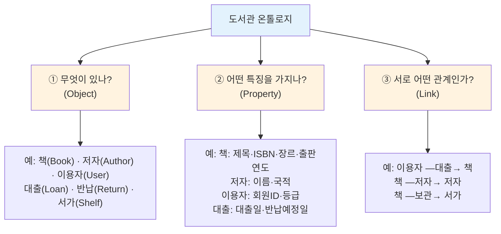
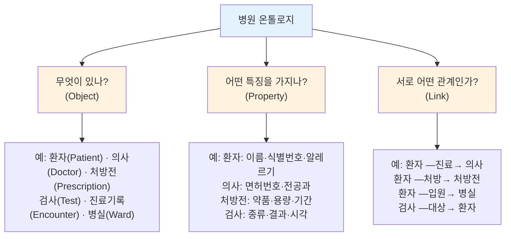

## 2. Palantir Ontology

### 2.1 일반 온톨로지 vs Palantir Ontology

**일반 온톨로지 (데이터 정리)**

- 주로 데이터를 정리하고 분류하는 용도
- 사전적 정의를 컴퓨터로 표현한 것
- 정적인 지식 표현 (변하지 않는 규칙)
- 주로 학술적 연구나 지식 관리에 활용

**Palantir Ontology (운영 플랫폼)**

> **"조직의 디지털 트윈(Digital Twin)"**  
> 실제 업무 워크플로우를 컴퓨터 안에 똑같이 만들어서, 누구나 쉽게 이해하고 사용할 수 있게 만든 디지털 지도

Palantir Ontology는 단순히 데이터를 정리하는 것을 넘어서:

- **실시간으로 작동**하는 시스템입니다 (Live Digital Twin)
- **사용자 행동을 기록**하고 학습합니다 (Decision Capture)
- **AI와 자연스럽게 통합**됩니다 (Operational AI)
- **자동으로 작업을 수행**할 수 있습니다 (Actions & Workflows)

### 2.2 Palantir Ontology의 핵심: 디지털 트윈

Palantir가 말하는 "디지털 트윈"이란?

**실제 세계**와 **디지털 세계**를 **1:1로 연결**하여, 컴퓨터가 실제 비즈니스를 이해하고 실행할 수 있게 만드는 것입니다.

### 2.2 항공 산업 예시

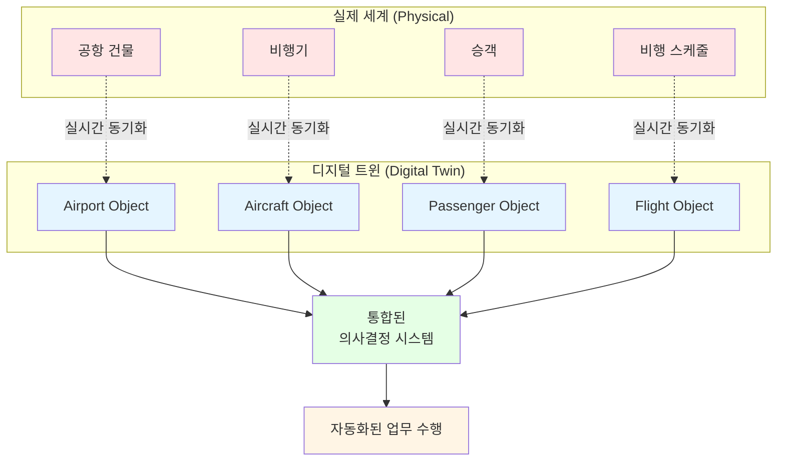

### 2.3 Palantir Ontology의 핵심 구성 요소

Palantir Ontology는 LEGO처럼 여러 블록으로 이루어져 있습니다:

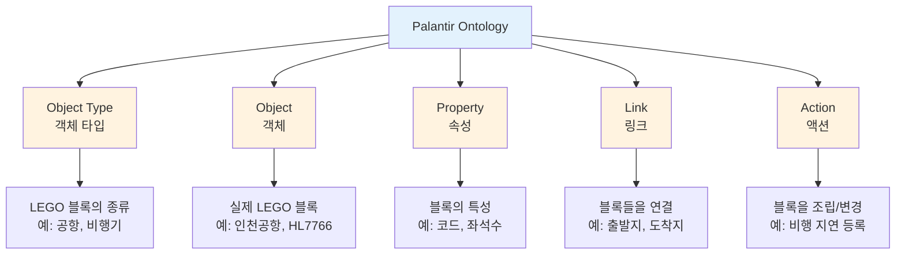

#### 📦 **1) Object Type (객체 타입)** = LEGO 블록의 종류

**정의:** "이런 종류의 것들이 있어요"

|Object Type|예시|
|---|---|
|`공항`(Airport)|인천공항, 김포공항|
|`비행기`(Aircraft)|HL7766, HL8227|
|`비행`(Flight)|KE001편, OZ101편|
|`승객`(Passenger)|홍길동, 김영희|

#### 🔷 **2) Object (객체)** = 실제 LEGO 블록 하나하나

**정의:** 객체 타입의 실제 사례

**예시:**

- 공항 타입의 객체: `인천국제공항`, `김포공항`, `제주공항`
- 비행기 타입의 객체: `HL7766`, `HL8227` (실제 비행기 등록 번호)
- 비행 타입의 객체: `KE001편`, `OZ101편`

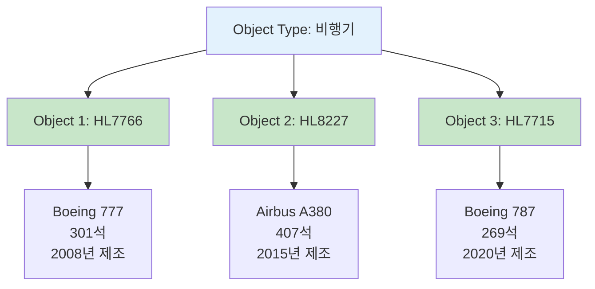

#### 🏷️ **3) Property (속성)** = LEGO 블록의 특성

각 객체가 가진 정보입니다.

**예시: 비행기 객체 `HL7766`**

|속성 이름|값|설명|
|---|---|---|
|`등록번호`|HL7766|고유 식별자|
|`기종`|Boeing 777|제조사와 모델|
|`좌석수`|301석|총 승객 수용 가능 인원|
|`제조년도`|2008년|생산된 연도|
|`상태`|운항중|현재 운영 상태|
|`마지막 정비일`|2024-11-01|최근 정비 날짜|

#### 🔗 **4) Link (링크)** = LEGO 블록들을 연결하는 것

**정의:** 객체들 사이의 관계

**예시:**

- `KE001편` (비행) ← **출발지** → `인천국제공항` (공항)
- `KE001편` (비행) ← **도착지** → `로스앤젤레스공항` (공항)
- `KE001편` (비행) ← **사용 항공기** → `HL7766` (비행기)
- `홍길동` (승객) ← **탑승** → `KE001편` (비행)

mermaid

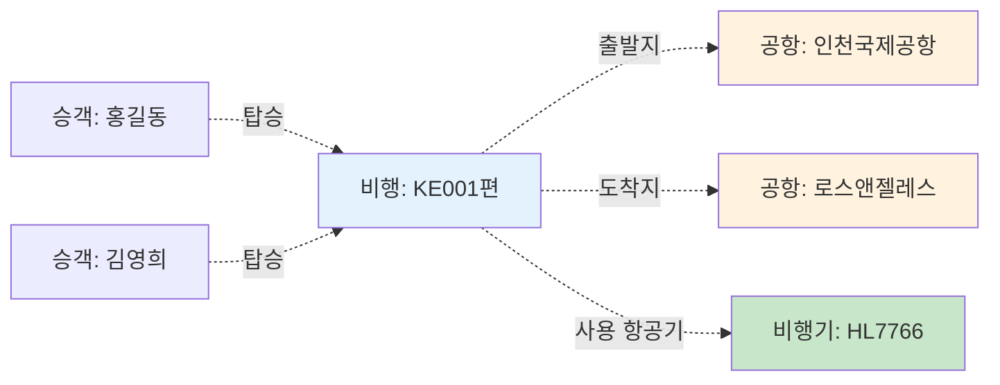

**Link의 종류:**

- **일대일 관계:** 비행 ↔ 사용 항공기
- **일대다 관계:** 공항 ↔ 여러 비행
- **다대다 관계:** 승객 ↔ 여러 비행

#### ⚡ **5) Action (액션)** = LEGO를 조립하고 변경하는 행동

**정의:** 사용자가 할 수 있는 동작들

**예시:**

- `비행 지연 등록`: 비행 객체의 상태를 "정시" → "지연"으로 변경
- `정비 완료 기록`: 비행기 객체의 상태를 "정비중" → "운항가능"으로 변경
- `좌석 배정`: 승객 객체와 좌석 번호를 연결

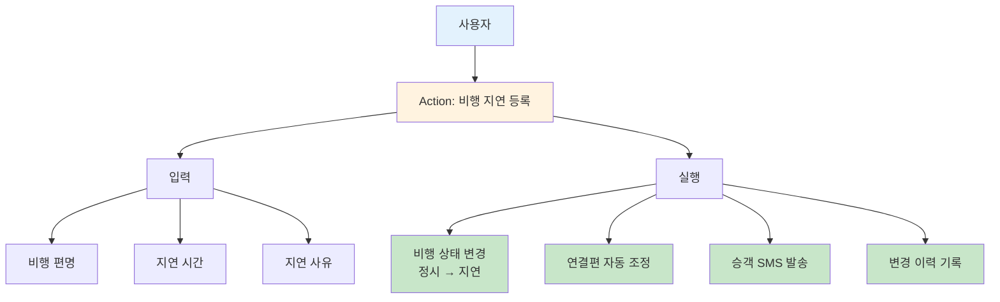

**Action의 특징:**

- ✅ **자동화:** 관련된 모든 작업 자동 실행
- ✅ **추적:** 누가, 언제, 왜 변경했는지 기록
- ✅ **검증:** 잘못된 입력 방지
- ✅ **권한:** 역할에 따라 실행 가능한 Action 제한

### 2.4 항공 산업 실제 예시

Palantir 공식 문서에서 소개하는 항공 산업의 예시입니다:
https://www.palantir.com/docs/kr/foundry/ontology/core-concepts/
![[Pasted image 20251110230601.png]]

**실제 공항에는:**
- 공항 건물이 있고
- 비행기들이 있고
- 승객들이 있고
- 비행 스케줄이 있습니다

**Palantir Ontology로 표현하면:**

**공항 객체 (Airport Object):**

- 속성: 국가, 도시, 위도, 경도, 활주로 개수
- 연결된 것들: 이 공항에 있는 모든 비행기들, 이 공항의 모든 비행 기록들
- 관련 정보: 공항의 코로나 대응 프로토콜, 지연된 비행 분석 리포트

**이렇게 하면:**
- 질문하면 **즉시** 관련 정보를 모두 볼 수 있습니다
- **과거 데이터**를 바탕으로 **미래를 예측**할 수 있습니다
- **관련된 모든 정보**가 자동으로 연결됩니다

### 2.5 Excel과의 비교

| Excel        | Palantir Ontology     |
| ------------ | --------------------- |
| 시트(Sheet)    | 객체 타입 (Object Type)   |
| 행(Row)       | 객체 (Object)           |
| 열(Column)    | 속성 (Property)         |
| 셀(Cell)      | 속성 값 (Property Value) |
| VLOOKUP/JOIN | 링크 (Link)             |

| 항목         | Excel          | Palantir Ontology |
| ---------- | -------------- | ----------------- |
| **데이터 저장** | ✅              | ✅                 |
| **관계 이해**  | ❌ (수동 VLOOKUP) | ✅ (자동 Link)       |
| **의미 파악**  | ❌              | ✅                 |
| **변경 이력**  | ❌              | ✅                 |
| **권한 관리**  | 파일 단위          | 객체/속성 단위          |
| **협업**     | 파일 주고받기        | 실시간 동시 작업         |
| **자동화**    | 매크로 (제한적)      | Action (완전 통합)    |
| **AI 통합**  | 불가능            | 네이티브 지원           |

## 3. 왜 Palantir Ontology가 필요한가?

### 3.1 핵심 키워드 3가지

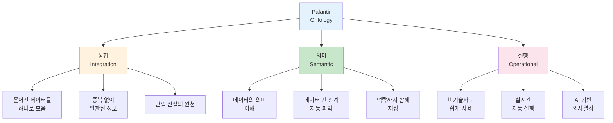

### 3.2 Palantir Ontology 도입으로 얻을 수 있는 5가지 가치

#### 💎 **가치 1: 단일 진실의 원천 (Single Source of Truth)**

**의미:** 모든 팀과 사용자가 동일한 정보를 기반으로 작업합니다

**현재 Signoff 업무 상황:**

프로젝트 매니저가 "HBM4E R30 DSC 현황을 보고해주세요"라고 요청했을 때:

1. 설계팀 Excel 파일 확인 (Block 목록 확인)
2. Signoff 엔지니어 로컬 폴더 확인 (실행 결과 수집)
3. ResultViewer 개별 실행 (Violation 분석)
4. 각 팀의 Waiver 판단 기록 취합
5. 수동으로 리포트 작성 및 정리
6. **결과: 3일 소요** 😰

**온톨로지 기반 Signoff Platform:**

1. Dashboard에서 "HBM4E R30 DSC" 검색
2. 실시간으로 통합된 정보 확인:
    - 전체 Block 목록 및 진행 상태
    - 모든 Violation 현황 (Pass/Waiver/Fixed)
    - 각 엔지니어의 Waiver 판단 근거
    - 과거 Revision과의 비교 분석
3. **결과: 3초 만에 확인** ✨

**핵심 효과:**

- ✅ 모든 사람이 **동일한 데이터**를 봅니다
- ✅ 정보 **불일치로 인한 실수**가 사라집니다
- ✅ 누가 업데이트하든 **전체에 즉시 반영**됩니다

#### 💎 **가치 2: 데이터 표준화 및 일관성**

**의미:** 같은 대상을 어디서든 동일하게 식별하고 참조할 수 있습니다

**현재 Signoff 업무 상황:**

같은 Power 파일을 팀마다 다르게 표기합니다:

- 설계팀: `POWER_CORE_v2.3.pp`
- Signoff 엔지니어 A: `/proj/HBM4E/R30/power/POWER_CORE_v2.3.pp`
- Signoff 엔지니어 B: `~/workspace/power_core_latest.pp`
- 문서 기록: "Core 영역 Power 정의 파일 (11월 5일 버전)"

→ 모두 **같은 파일**인데 이름과 경로가 달라서 **혼란 발생!** 😵

**온톨로지 기반 Signoff Platform:**

하나의 "Power 파일 객체"로 통합 관리:

- **고유 ID:** `PWR_HBM4E_CORE_R30_v2.3`
- **표준 경로:** `/WORKSPACE/HBM4E/R30/POWER/CORE_v2.3.pp`
- **메타데이터:**
    - 생성자: 김설계 (2024-11-05)
    - 포함 Net: VDD, VSS, VDDQ, VSSQ (자동 파싱)
    - 완전성 검증: 98% (2% 누락 경고)
    - 사용 이력: 15개 Job에서 참조 중

**핵심 효과:**

- ✅ **표준화된 참조**로 혼란 제거
- ✅ 파일 버전 관리 **자동화**
- ✅ 누락된 정의 **사전 감지**

#### 💎 **가치 3: 완전한 추적성 (Complete Traceability)**

**의미:** 모든 의사결정과 변경 사항이 기록되어 언제든 추적 가능합니다

**현재 Signoff 업무 상황:**

"왜 이 Violation을 Waiver 처리했지? 누가 승인했지?"

- 개인 메모나 이메일에만 기록되어 **찾을 수 없음** 😓
- Waiver 판단 근거가 **소실**됨
- 신입 엔지니어는 **과거 이력을 모름**

**온톨로지 기반 Signoff Platform:**

모든 Violation의 전체 생명주기가 자동 기록됩니다:

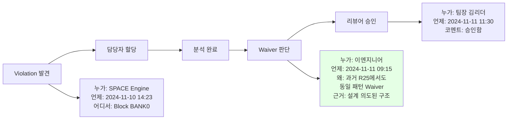

**핵심 효과:**

- ✅ 모든 의사결정 **근거 보존**
- ✅ 책임 소재 **명확화**
- ✅ 유사 케이스 발생 시 **즉시 참조** 가능

#### 💎 **가치 4: 확장 가능성 (Scalability)**

**의미:** 데이터와 사용자가 증가해도 복잡도가 증가하지 않습니다

**현재 Signoff 업무 상황:**

**제품 초기 (R00~R10):**

- Block 20개, Application 3종 → Excel 관리 가능 ✅

**제품 성숙기 (R30~R50):**

- Block 100개, Application 19종 → 파일 수백 개 😰
    - 어떤 파일이 최신인지 파악 불가
    - 각 Revision마다 Setup 재작성
    - 새 Application 추가 시 **전체 재구성** 필요

**온톨로지 기반 Signoff Platform:**

- Block 1,000개가 되어도 **같은 방식**으로 작동
- 새 Application 추가? → Application 객체만 추가
- 새 Revision? → Revision 객체 생성 후 자동 상속
- 기존 분석/리포트가 **자동으로 새 데이터 포함**

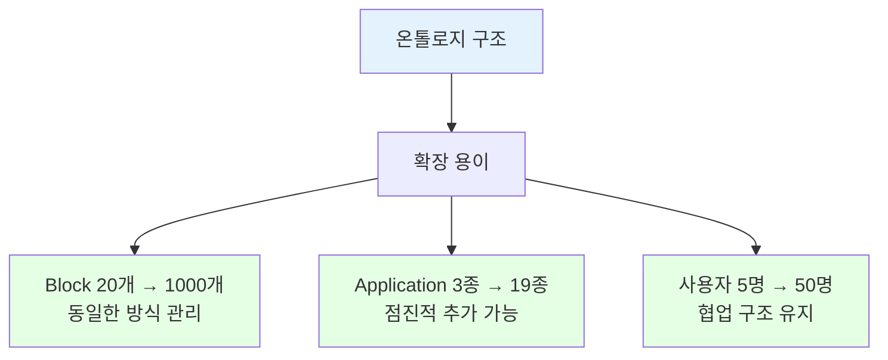

**핵심 효과:**

- ✅ 복잡도 증가 **제어**
- ✅ 새로운 요구사항에 **유연한 대응**
- ✅ 장기적 **유지보수 비용 절감**

#### 💎 **가치 5: AI 기반 지능형 자동화**

**의미:** AI가 과거 패턴을 학습하여 자동으로 의사결정을 지원합니다

**현재 Signoff 업무 상황:**

**Power 정의 누락 문제 (발생률 50%):**

1. Power 파일 작성 (30분)
2. DSC 실행 (1시간)
3. Garbage 결과 확인 (10분)
4. Power Net 누락 발견 😰
5. Power 파일 수정 (20분)
6. DSC 재실행 (1시간)
7. **총 3시간 20분 소요 + 1일 지연**

**온톨로지 + AI 기반 Signoff Platform:**

mermaid

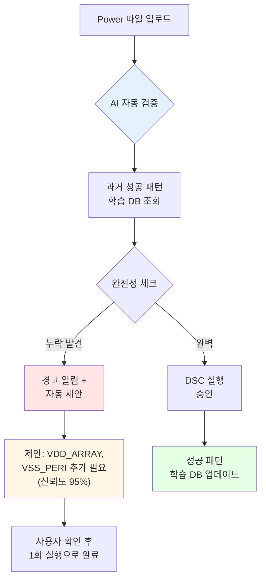

**Waiver 판단 자동화:**

1. 새로운 Violation 발견
2. 온톨로지에서 유사 패턴 검색 (과거 3,000건 분석)
3. AI가 분석:
    - Block 타입 유사도: 92%
    - Violation 패턴 매칭: 88%
    - 과거 Waiver 비율: 95%
4. **AI 추천:** "Waiver 처리 권장 (신뢰도 90%)"
5. 사용자 확인 → 학습 데이터 축적

**핵심 효과:**

- ✅ Power 정의 오류 **50% → 5% 감소**
- ✅ Waiver 판단 시간 **30분 → 3분**
- ✅ 신입 엔지니어도 **전문가 수준 판단** 가능
- ✅ 반복 작업 **완전 자동화**

### 3.3 Signoff Platform 적용 시나리오

위의 5가지 가치를 실제 Signoff 업무에 적용하면 어떤 변화가 일어날까요?

#### 시나리오 1: HBM4E R30 Signoff 진행 과정

**현재 방식 (온톨로지 없이):**

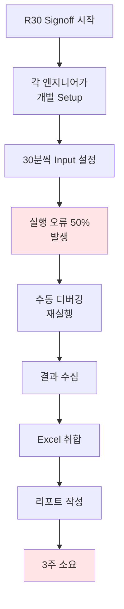

**온톨로지 기반 방식:**

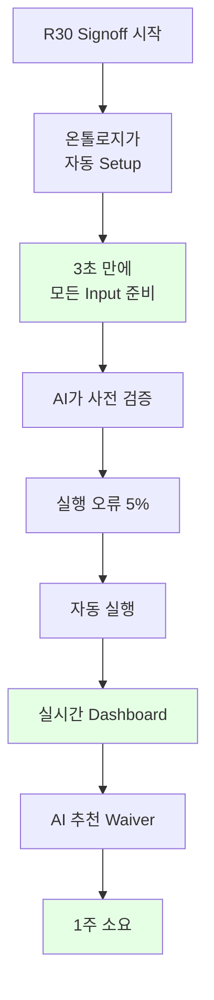

**효과:**

- TAT(Turn Around Time): **3주 → 1주 (67% 단축)**
- 에러율: **50% → 5%**
- 엔지니어 작업 시간: **40시간 → 8시간**

#### 시나리오 2: 새로운 엔지니어 온보딩

**현재 방식:**

1. Signoff 방법론 교육 (2주)
2. 도구 사용법 습득 (1주)
3. Waiver 판단 노하우 학습 (2개월)
4. **총 3개월 소요**

**온톨로지 기반:**

1. Dashboard 사용법 교육 (2일)
2. AI 추천 시스템 활용 (1주)
3. 과거 사례 검색 및 학습 (1주)
4. **총 2주 만에 실무 투입 가능**

---

### 3.4 정량적 효과 예측

Palantir Ontology를 Signoff Platform에 도입하면 다음과 같은 정량적 효과를 기대할 수 있습니다:

|항목|현재 (온톨로지 없이)|온톨로지 도입 후|개선율|
|---|---|---|---|
|**Input Setup 시간**|30분/Job|30초/Job|**98% 감소**|
|**Power 정의 오류**|50%|5%|**90% 감소**|
|**Signoff TAT**|3주/Revision|1주/Revision|**67% 단축**|
|**Waiver 판단 시간**|30분/건|3분/건|**90% 감소**|
|**신규 인력 교육**|3개월|2주|**85% 단축**|
|**재실행률**|40%|8%|**80% 감소**|

**비용 효과:**
- 인력 효율성 향상: **300% 증가**
- HPC 리소스 낭비: **60% 감소**
- 연간 예상 절감 효과: **약 5억원**

## 4. 더 알아보기

이 섹션에서는 Palantir Ontology를 이해하는 데 도움이 되는 추가 자료들을 소개합니다.

![[Pasted image 20251111235325.png]]

* 데이터베이스도 지식그래프화 되어있어야지 LLM이 질문의 난이도가 올라가도 질문에 대답을 잘함.
* LLM이 성능이 좋아지는것도 좋아하지만, LLM이 읽고 이해하는 지식체계도 틀을 갖추는게 중요함.

![[Pasted image 20251112000227.png]]
Ontology의 궁극적인 역할은 그 기업의 진짜 인과관계 지식을 생성하는 도구할수있다. (진짜 인과관계 데이터는 통제하에 테스트를 통해서 새로 생성) = 팔란티어의 온톨로지가 구축돼어야만 그 기업의 진짜 인과관계 지식을 AI가 학습을 할 수 있게 된다.
* 온톨로지는 인과관계를 검증하고 생성할 수 있는 도구
* 온톨로지를 통해 그 기업만의 진짜 인과관계 지식을 찾을 수 있다.
* 인과관계를 많이 찾아낼수록 솔루션이 완벽에 가까워진다.
* 그러나 솔루션의 끝이 어디인지 모르기 때문에 인과관계를 먼저 찾아낸 기업이, 많이 찾아낸 기업이 무조건 앞서 있을 수 밖에 없다.
* 인과관계는 기업마다 다르다.
* 그래서 그 인과관계를 학습한 AI도 각각 달라진다.
* 팔란티어의 고객사는 모두 같은 AI를 사용하고 있지만 결국 모두 다른 답을 제시하는 AI를 갖게 된다. (AI가 커스터마이징 되니까)

![[Pasted image 20251112000553.png]]
팔란티어 온톨로지는 이러한 형태를 토대로 언어인공지능과 소통할수 있는 최고의 도구(언어)이기도 합니다.

* 온톨로지의 목적은 딥러닝과 같다.
![[Pasted image 20251112001839.png]]

![[Pasted image 20251112002125.png]]
* 반복적으로 데이터에 의미를 부여(온톨로지 구축)함으로써 데이터의 본질(완벽에 가까운 온톨로지)에 다가갈 수 있다.

