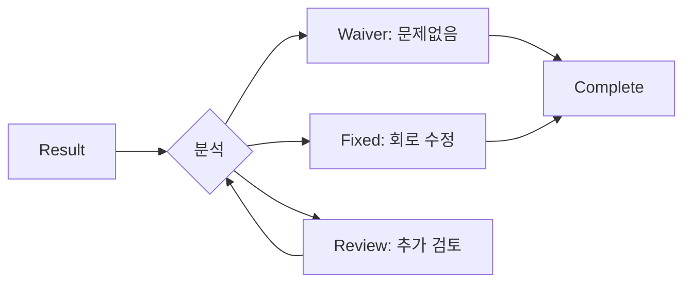

# Signoff 업무 현황 & 방법론 (As‑Is)

## 0) Executive Summary

- **현재 운영 구조**: 각 메모리 제품 설개팀에서 In‑house C++ 엔진(**SPACE/ADV**) 기반의 여러 종류의 Signoff Application들 각각의 제품 계정의 Signoff workspace 표준 경로에서 수행을 **Signoff Launcher**를 통해 시뮬레이션에 필요한 input들을 입력하고 작업 제출 → **HPC(LSF)** 분산 실행 → 각각의 Signoff 수행 결과 result.csv을  **ResultViewer WORKSPACE**에 업로드 → Signoff ResultViewer(사용자별 Dash 인스턴스 Standalone 운용)로 업로드된 결과 parquet데이터를 분석·웨이버 작업 수행.(결과에서 각 line마다 Categorize Part 수행해서 Part Labeling → 각 Part 담당자마다 해당영역 검토/분석 및 Waiver 작업 수행)

(설계팀에서 특정 제품에 대한 Signoff를 수행하게되면 R00 Netlist가 나오고 이에 관련된 데이터들이 1차적으로 나올거야. 그럼 이러한 R00시점에 준비된 데이터를 가지고 수행할수있는 Signoff 들을 수행할테고 그것들은 초기에 합의된 내용들에 대해서 수행될거야. 각 Signoff 설계팀 수행 담당자들이 Signoff들을 수행하고나면 해당 결과 파일이 csv형식으로 생성될거야. 이는 LINUX HPC 시스템상에서 수행되고 각자의 계정 local에서 signoff launcher를 통해서 수행할거야. 각 제품 계정에 /user/{product}/VERIFY/SIGNOFF/{LIBRARY}/{CELL}/{user_id}/{Signoff Application}{tag}/{Signoff Application RUNSCRIPT} 형식으로 해당 프로젝트 제품 경로에서 표준경로에 맞게 로컬에서 Signoff 수행을 할거야. 그리고나서 result.csv와 같은 Signoff 수행 결과 파일이 나오면 이를 Excel과 같은 툴인 ResultViewer의 Cloud인 WORKSPACE라는 공용 공간에 업로드 시킬거야. 해당 결과 row마다 회로 net 혹은 instance에 대한 signoff simulation 결과 값들이 쭉 나올텐데 (대략 100만 rows) 해당 net 혹은 instance마다 담당자가 누구인지 categorize part script를 수행할거야. 각 row 회로마다의 담당자 column인 Part를 생성할거야. 그리고 이를 ResultViewer Worksapce에 공요 공간에 올려졌으니까 각 회라 Part 담당자가 해당 회로를 분석하고 괜찮은지 체크한 후에 Waiver값이 처음에는 다 Result라고 되어있는것을 Waiver로 수정 업데이트, 만약 진짜 문제가 있어서 회로를 수정했다면 Fixed라고 값을 수정 편집할거야. 그러면 해당 result.csv에서 Waiver Column값이 초기에는 Result인데 모두 Fixed 혹은 Waiver값으로 바뀌고나면 해당 Signoff는 끝난거야.)


    
- **데이터 협업**: 중앙 **WORKSPACE** (`/WORKSPACE/{PRODUCT}/{REV}/{BLOCK}/{TOOL}/…`)에 결과/메타/버전을 보관, 팀 단위로 공유·추적.
    
- **방법론 포인트**: CCC 분해·Stage 단위 검증, 리비전 연동 반복 Signoff, R00 스크리닝 → R10+ 정밀화, 웨이버 승계·비교, 최종 수렴(Closure).

(Channel Connected Component(CCC):  TR Level DB 에서 Gate 를 찾기 위한 알고리즘,  Vdd 에서 Gnd 로 연결된 MOS 를 Tracing 하며 Searching.)

- **사용자 관점 산출물**: 각 App 실행 결과 **`result.csv`**가 핵심(웨이버/메타는 ResultViewer 내부에서 관리).
    


* 조직, 배경과 당면 이슈: 메모리( DRAM/FLASH/HBM )의 **Full-custom TR-level 설계** 특성 때문에, 경험 기반 동적 검증 + In-house Signoff가 핵심 흐름입니다. 제품 고사양화로 **Runtime 증가, 진성 오류 검출력 저하(Garbage↑), Coverage 부족, UI/사용성 한계**가 중첩되어 검증 TAT 리스크와 리소스 비용 급증


엔진과 공통 Signoff 기법

- **SPACE(Static)** / **ADV(Dynamic)**: C++ 기반 In-house 엔진. 입력(Netlist/PVT)으로 SPICE를 대량 수행해 각 Application 결과를 산출합니다.
- 공통 파이프라인(현재/개선 대상):  
    ① Tech/Powers/Netlist 로드 → ② **CCC(Channel-Connected Component)** 기반 회로 분해/Stage 추출 → ③ Application별 SPICE 데크 생성·대량 시뮬레이션·취합. (예: **DSC**는 Stage Slew 시뮬레이션으로 드라이버 사이즈 유효성 평가; 500 ps 입력 슬루로 Rise/Fall Slew 측정)


---

## 1) 역할/환경/구성요소

### 1.1 역할

- **설계팀 Signoff Application 수행 담당자**: App 실행/결과 검토/웨이버 처리.
    
- **Signoff 파트**: In‑house Tool/방법론 고도화, 운영/문의 대응, 자동화·무인화 준비. In-house Tool 개발/유지보수와 Signoff 방법론 고도화, 사용자 문의 대응을 맡고 있으며, 병렬 시뮬레이션 및 **AI/ML 기반 Signoff 방법론** 도입이 중장기 과제로 삼고있음.

* Signoff 파트 Signoff Application 개발 담당자: 현재 Signoff 파트는  19종의 Signoff Application을 운영하고 있으며, 각 Application마다 전담 개발자(정/부 1-2명)가 배정되어 있습니다. 이들 Application은 모두 현재 활발하게 사용되고 있으며, 설계 검증 과정에서 핵심적인 역할을 담당하고 있습니다.
 Signoff RUNSCIRPT 표준 구조:
 
```
your-signoff-app/
├── .github/
│   └── workflows/
│       └── auto-deploy.yaml     # Launcher에 자동배포 github action 워크플로우
├── input_config.yaml            # 필수 파일, 이를 기반으로 signoff launcher gui상에서 해당 application 선택 시 필요한 입력을 받을수있는 gui를 만듬.
├── run.sh                       # 필수 파일
└── 기타 Application 파일들...
```

#### 실제 사용 예시 - DSC Application

```yaml
DSC:
  name: "Driver Size Check"
  category: "Static"
  color: "blue"
  description: "Driver size verification for signoff"
  runscript_path: "RUNSCRIPTS/signoff-dsc"
  inputs:
    - name: "netlist_file"
      type: "file_input"
      required: true
      description: "Circuit netlist file for analysis"
      accept: ".sp,.cir,.hsp"
    
    - name: "driver_type"
      type: "select_input"
      required: true
      description: "Select driver type to check"
      options:
        - value: "nmos"
          label: "NMOS Driver"
        - value: "pmos"
          label: "PMOS Driver"
        - value: "cmos"
          label: "CMOS Driver"
      default: "cmos"
    
    - name: "min_width"
      type: "number_input"
      required: true
      default: "0.1"
      description: "Minimum driver width (um)"
      min: 0.01
      max: 100.0
      step: 0.01
    
    - name: "max_width"
      type: "number_input"
      required: true
      default: "10.0"
      description: "Maximum driver width (um)"
      min: 0.1
      max: 1000.0
      step: 0.1
    
    - name: "simulation_corners"
      type: "multiselect_input"
      required: false
      description: "Select simulation corners"
      options:
        - value: "tt_1v_25c"
          label: "TT 1V 25C"
        - value: "ss_0.9v_125c"
          label: "SS 0.9V 125C"
        - value: "ff_1.1v_-40c"
          label: "FF 1.1V -40C"
      default: ["tt_1v_25c"]
    
    - name: "output_format"
      type: "select_input"
      required: false
      description: "Output file format"
      options:
        - value: "csv"
          label: "CSV Format"
        - value: "xlsx"
          label: "Excel Format"
        - value: "json"
          label: "JSON Format"
      default: "csv"
```

### 1.2 실행 환경

- **HPC 스케줄러**: IBM **LSF**. GUI 앱은 전용 래퍼로 제출: `sol_sub`(Launcher), `sorv_sub`(ResultViewer). 사용자별 Dash 서버 1개씩 기동(브라우저 자동 열림).
    
- **Launcher 앱 구성(현행)**: Set(입력 정의) / Run(제출·모니터링) 2페이지 + Workspace 관리(로컬 작업영역).

- 사내 HPC는 **IBM LSF**로 운영되며, GUI 앱은 전용 래퍼로 제출:  
    `sol_sub`(Signoff Launcher), `sorv_sub`(Signoff ResultViewer). 개별 사용자가 LSF로 **자기 전용 Dash 웹서버**를 띄워 Standalone처럼 사용합니다(사용자 1명 : 서버 1개).
- Signoff 실행은 각 Application의 `run.sh`가 **전처리→LSF 제출→후처리**로 이루어져있음, 대표 엔진은 Static 계열 `SPACE`, Dynamic 계열 `ADV`입니다.


### 1.3 핵심 구성요소

- **Signoff Launcher**: 입력·코너·블록 조합 생성 → LSF 제출·상태/로그·중단/재실행·결과열기. LEGO‑flow 일원화, 공통 입력 재사용.
    
- **In‑house 엔진**: Static=**SPACE**, Dynamic=**ADV**. Netlist/PVT 기반 대량 시뮬레이션.
    
- **ResultViewer**: 대용량 CSV/Parquet을 Excel‑like로 분석(Compare/Categorize/Waiver 등), 중앙 WORKSPACE 연계 협업.
    
- **WORKSPACE(중앙)**: 결과/메타/버전/락을 표준 경로에 저장하여 다자 협업 및 이력 일관성 보장.
    

> 📌 _현황 레퍼런스 인용은 본문 하단 각주 참조_

---

## 2) 데이터 & 협업 (WORKSPACE 관점)

- **표준 트리 예시**: `/WORKSPACE/{PRODUCT}/{REV}/{BLOCK}/{TOOL}/` 하위에 `result.csv / result.parquet`, `.meta`, `.version`, `.lock(Partial/Full)` 등.
    
- **노출 원칙**: 실사용자에게 보이는 1차 산출물은 **result.csv**. 웨이버·상태·비교키·소유자 등은 **ResultViewer 내부 메타**로 관리(별도 `waiver.csv`는 없음).
    
- **대시보드**(향후): 메타의 진행률/웨이버 현황/KPI를 활용해 팀 단위 진행 상황 가시화.
    

---

## 3) 표준 Signoff Workflow (Revision 연동)

### A. Initiation (제품 선정 직후)

- **내용**: R00에 필요한 **데이터 준비**(초기 Netlist/PVT/Power 등) 및 **Criteria/코너 합의**.
    
- **산출물**: _현재는 문서화 최소_. 다만 운영상 편의를 위해 **제품 메타 템플릿**(제품 코드, 리비전 정책, 코너 세트, 담당자·블록 매핑, 툴별 입력/분석키 초안)을 권장.
    

### B. R00 사이클 — _Schematic‑only, 제한 정보_

- **입력**: R00 TR‑level Netlist, 초기 MP/Power(미확정 다수).
    
- **수행**: App Owner별로 Launcher에서 코너×블록 조합 실행 → LSF 제출 → **`result.csv`** 산출.
    
- **검토**: ResultViewer 업로드 → 담당 영역 열람/웨이버 처리. R00은 **초기 스크리닝** 성격(치명 결함 중심, 나머지는 웨이버로 우선 정리).
    

### C. R10 / R20 … — _데이터 보강·범위 확대_

- **입력 갱신**: MP/Power 정밀화, 일부 **RC 반영** 시작.
    
- **반복 실행**: 동일 App을 확대 수행(코너·기준 강화).
    
- **웨이버 승계**: R00 웨이버를 **비교(Compare)**로 이월, **달라진 항목만** 재검토/갱신.
    

### D. Convergence & Closure (후기 리비전)

- 테이프아웃과 병행되며, 현실적으로 **마무리 프로세스가 축약**되는 경향. 향후 제도화·자동화를 통해 정착 필요.
    

#### ▶ 워크플로우 다이어그램

```
[Initiation]
  └─ 데이터/코너/Criteria 합의
      └─ WORKSPACE 생성
          └─[R00]
              ├─ Launcher 실행(코너×블록)
              ├─ result.csv 산출 → ResultViewer 업로드
              └─ 웨이버 스크리닝
                  └─[R10/R20…]
                      ├─ 입력·RC 보강
                      ├─ 증분 실행(델타 우선)
                      ├─ Compare로 웨이버 승계
                      └─ 달라진 항목 확인 및 리뷰
                          └─[후기 Rev]

```

---

## 4) Compare & 웨이버 운영 (현행 로직 반영)

### 4.1 Compare Script 개념

- **App별 비교 키**가 다르며, 예를 들어 **DSC**는 `measure_net, driver_net`을 **키**로 하고, `rise_slope, fall_slope`를 **값**으로 비교.
- Compare 결과 라벨: `same / duplicated / not found / diff` (+ **tolerance**를 적용하여 허용 오차 내 차이는 `same` 처리).
- 다중 발생 방지: 대상(df2)에서 키 그룹의 값 일관성 검사 → 불일치 시 `duplicated`.

### 4.2 웨이버

- **비교 키 표준표**를 App별로 고정(예: DSC=measure_net+driver_net, …).
- **Tolerance 테이블화**(App×지표별 허용 오차).
- **웨이버 승계 규칙**: 리비전 간 동일 키에서 `same` 또는 `diff≤tol`이면 **자동 웨이버 유지**, `diff>tol` 또는 `not found/duplicated`는 리뷰 로 승격.
- **로그/추적성**: 웨이버 상태 변경 이력(누가/언제/이유/근거)을 메타에 기록.

- **유효 범위 규칙**: 팀 **공통 규약** 보유 (리비전/코너 범위 등)
- **판단 책임**: 개별 **App Owner** 가 자신의 결과에 대해 최종 판단/등록
- **waiver migration 로직**
    1. 신 리비전 `result.csv` 로드
    2. App-별 **Key 컬럼 집합**으로 이전 리비전 결과/웨이버와 **조인(match)**
    3. **동일 garbage**로 판정 가능한 항목은 **“웨이버”**로 미리 태깅
    4. 담당자가 **확정/수정**(최종 책임은 담당자)


---

## 5) 툴 라인업 × 리비전 × 코너 매트릭스 (현행 표 반영)

> 제품마다 상이할 수 있으나, 제공 표를 바탕으로 대표 케이스를 정리.

| Tool Name           | Condition (예)   | Criteria(예)    | R00 | R10 | R20 | R30 | R40 | R50 | R60 |
| ------------------- | --------------- | -------------- | :-: | :-: | :-: | :-: | :-: | :-: | :-: |
| Voltage Finder      | –               | –              |  ●  |  ●  |  ●  |  ●  |  ●  |  ●  |  ●  |
| Power at Gate       | –               | –              |  ●  |  ●  |  ●  |  ●  |  ●  |  ●  |  ●  |
| PN Ratio            | SSPLVCT         | –              |  ●  |  ●  |  ●  |  ●  |  ●  |  ●  |  ●  |
| FO Check            | SSPLVCT         | –              |  ●  |  ●  |  ●  |  ●  |  ●  |  ●  |  ●  |
| Driver & Keeper     | SFLVCT,FSLVCT   | –              |  ●  |  ●  |  ●  |  ●  |  ●  |  ●  |  ●  |
| DC Path             | TTTVCT(2P)      | –              |  ●  |  ●  |  ●  |  ●  |  ●  |  ●  |  ●  |
| Floating Node       | TTTVCT(2P)      | –              |  ●  |  ●  |  ●  |  ●  |  ●  |  ●  |  ●  |
| PEC                 | Normal          | All Violations |  ●  |  ●  |  ●  |  ●  |  ●  |  ●  |  ●  |
| **DSC**             | SSPLVCT,SSPLVHT | –              |     |     |  ●  |  ●  |  ●  |  ●  |  ●  |
| **LSC**             | SFLVCT,FSLVCT   | Rs/Fs>250ps?   |     |  ●  |  ●  |  ●  |  ●  |  ●  |  ●  |
| **LS**              | SFLVCT,FSLVCT   | –              |     |     |  ●  |  ●  |  ●  |  ●  |  ●  |
| Cana‑TR (Static)    | FFPHVHT         | All Violations |     |     |     |     |  ●  |  ●  |  ●  |
| Cana‑TR (Dynamic)   | FFPHVHT         | All Violations |     |     |     |     |  ●  |  ●  |  ●  |
| CDA / STA           | SSPLVCT         | –              |     |     |     |     |     |  ●  |  ●  |
| Glitch Margin       | FSDB            | –              |     |     |     |     |     |  ●  |  ●  |
| Dynamic DC Path     | TRN/FSDB        | –              |     |     |     |     |     |  ●  |  ●  |
| ADV Margin Analyzer | FSDB            | –              |  ●  |  ●  |  ●  |  ●  |  ●  |  ●  |  ●  |
| ADV Latch S/H       | FSDB            | –              |     |     |     |     |     |  ●  |  ●  |
| **열화 검증 자동화**       | FSDB            | –              |     |     |     |     |     |     |  ●  |


## 4) 표준 Signoff Workflow (설계 리비전 연동)

- **리비전 흐름(R00 → R10 → …)**: 초기 R00은 제한된 정보로 **기초 점검(DC path, Fanout, DSC/LS/LSC 등)**을 수행, 이후 리비전이 진행될수록 RC/모델 정확도 향상에 맞춰 **체크 폭과 커버리지**가 확대됩니다. (R-by-R 반복 Signoff)
    
- **Launcher 측면**
    
    - Set 페이지에서 다수 Application을 **공통 입력 공유**로 생성, Job Queue로 다중 코너/블록 제출. 필요한 입력은 각 `RUNSCRIPTS/*/input_config.yaml`로 정의되어 동적 생성됩니다. 런타임 중 **상태/로그/중지/재실행/결과 열기**(ResultViewer) 액션을 제공.
        
    - Workspace 표준 경로를 강제하고(예: `/user/{PRJ}/VERIFY/SIGNOFF/{LIB}/{CELL}/{USER}`), 거기서 Job별 폴더에 설정·로그·결과를 일원화합니다.
        
- **ResultViewer 측면**
    
    - 결과 CSV/Parquet을 **Excel-like UI**로 대용량 처리(Polars/서버사이드 로딩), Cross-Probing/Compare/Categorize/Waiver 등의 **Signoff 특화 분석**을 제공합니다. 중앙 **WORKSPACE**를 통해 팀 협업/버전 일관성을 유지합니다.

## 7) 데이터·협업 체계

- **WORKSPACE 표준 트리**: `/WORKSPACE/{PRODUCT}/{REV}/{BLOCK}/{TOOL}/…`에 `result.parquet/csv`, `.meta`, `.lock(Partial/Full)`, `.version`, `backup/…`를 저장. Lock에 **필터/선택 컬럼/uniqid 집합** 포함(단일 파일로 관리).
    
- **Waiver/진행 현황**을 메타데이터에 포함하여 대시보드화, 팀 단위 진행률 가시화 → 재작업·책임소재·이슈 추적의 표준화 기반.


## 0) 용어 한 줄 정리

- **Revision(Rxx)**: 설계 진척 단계. R00(초기 Schematic) → R10/R20…(Model/Power/RC 점차 보강).
    
- **Signoff Application**: DSC/LS/LSC/동적 DC Path 등 각 검증 항목(툴/스크립트 단위).
    
- ** Resultviewer WORKSPACE(중앙)**: 제품·리비전·툴별 결과/메타/웨이버를 팀이 공유·관리하는 저장소.


* Signoff Launcher WORKSPACE(분산): 각 제품별 Storage에서 signoff launcher를 수행하기위해 설정하는 경로. (/user/{PRODUCT}/VERIFY/SIGNOFF/{Library}/{CELL}/{USER}/{Applicatoin}_date/) 이유는 계정벼로 큰 Storage 용량제한이 있고, ResultViewer WORKSPACE 처럼 중앙 Storage로도 용량제한이 있음. ResultViewer WORKSPACE는 결과파일만 관리하기에 괜찮음

- **Launcher**: 각 Signoff App을 LSF로 제출/감시하는 실행 포털(사용자별 Dash 인스턴스).
    
- **ResultViewer**: 결과 CSV/Parquet의 대용량 시각화·필터링·웨이버 편집기.
# 📊 Signoff 업무 현황과 방법론 (As-Is)

## 1. Executive Summary

### 1.1 Signoff 개요

- **정의**: 메모리(DRAM/FLASH/HBM) 제품의 Tr-level(트랜지스터 수준) 회로 설계 검증을 위한 통합 프로세스
- **목적**: Full-custom 설계된 메모리 회로의 무결성 확보 및 제품 완성도 향상
- **범위**: Static/Dynamic 검증을 통한 19종 Signoff Application 운영

### 1.2 핵심 도전 과제

- **기술적 한계**: Runtime 증가(복잡도↑), Garbage 증가(진성 오류 검출력↓), Coverage 부족
- **비용 이슈**: 설계 resource cost 급증(~1,200억원@22년, YoY 63%↑)
- **생산성 문제**: 설계 TAT 증가, Pending 증가로 인한 검증 지연
- **협업 복잡성**: 다수 설계팀 간 Signoff 결과 공유 및 Waiver 관리의 어려움

## 2. 조직 구조 및 역할

### 2.1 조직 체계

```
DS (Device Solutions) 부문
└── 메모리 사업부
    └── Design Technology Team
        └── Design Simulation & Signoff Group
            └── Signoff Part (19종 Application 운영)
```

### 2.2 주요 역할 정의

#### Signoff Part (Platform 개발/운영)

- **In-house Tool 개발**: SPACE/ADV 엔진 개발 및 유지보수
- **방법론 고도화**: AI/ML 기반 Signoff 방법론 연구
- **Platform 운영**: Launcher, ResultViewer, WORKSPACE 관리
- **기술 지원**: 설계팀 문의 대응 및 교육

#### 설계팀 (Signoff 수행)

- **Application 실행**: 각 제품별 필요 Signoff 수행
- **결과 분석**: ResultViewer를 통한 결과 검토
- **Waiver 처리**: 담당 회로 영역의 Waiver 판단 및 처리

## 3. Signoff Workflow (설계 리비전 연동)

### 3.1 전체 프로세스 흐름

mermaid

````mermaid
graph TB
    A[Initiation] --> B[R00: Schematic-only]
    B --> C[R10-R20: Model 보강]
    C --> D[R30-R40: RC 반영]
    D --> E[R50-R60: Final]
    
    B --> F[초기 스크리닝]
    C --> G[범위 확대]
    D --> H[정밀 검증]
    E --> I[Closure]
```

### 3.2 리비전별 수행 내용

#### Phase A. Initiation (제품 선정 직후)
- **데이터 준비**: 초기 Netlist, PVT(Process/Voltage/Temperature) 조건
- **Criteria 합의**: 각 Application별 Pass/Fail 기준 설정
- **WORKSPACE 생성**: `/WORKSPACE/{PRODUCT}/` 표준 경로 생성

#### Phase B. R00 (Schematic-only, 제한 정보)
- **입력 데이터**: 
  - TR-level Netlist (Schematic 기반)
  - 초기 MP(Model Parameter)/Power 정보
- **수행 Application**: 기본 Static 검증
  - Voltage Finder, Power at Gate
  - PN Ratio, FO Check
  - Driver & Keeper, DC Path
  - Floating Node, PEC
- **특징**: 초기 스크리닝 목적, 치명적 결함 중심 검토

#### Phase C. R10/R20 (데이터 보강)
- **추가 데이터**: 
  - MP/Power 정밀화
  - 일부 RC(Resistance/Capacitance) 반영 시작
- **추가 Application**: 
  - LSC (Level Shifter Check)
  - DSC, LS 본격 수행 시작
- **웨이버 승계**: R00 웨이버를 Compare 기능으로 이월

#### Phase D. R30/R40 (RC 본격 반영)
- **정밀 데이터**: 
  - Layout 기반 RC extraction
  - 정확한 Timing 정보
- **추가 Application**: 
  - Cana-TR (Static/Dynamic)
  - 초기 Dynamic 검증 시작

#### Phase E. R50/R60 (Final Verification)
- **완성 데이터**: 
  - 최종 Layout 정보
  - FSDB/TRN waveform
- **추가 Application**: 
  - CDA/STA
  - Glitch Margin Analysis
  - Dynamic DC Path
  - ADV Latch Setup-Hold
  - 열화 검증 자동화

### 3.3 데이터 흐름 및 산출물
```
[설계팀 Local] → [HPC 실행] → [결과 생성] → [WORKSPACE 업로드]
    ↓              ↓            ↓              ↓
  입력 준비    LSF Job 제출   result.csv   ResultViewer 분석
```

## 4. Signoff Application 체계

### 4.1 Application 분류

#### Static Signoff (SPACE 엔진)
- **회로 인식 기반**: CCC(Channel Connected Component) 알고리즘
- **주요 Application** (9종):
  1. **DSC** (Driver Size Check): 500ps 입력 슬루로 드라이버 크기 적절성 평가
  2. **LSC** (Latch Strength Check): Latch 회로의 Feed-back Loop 강도 검증
  3. **LS** (Level Shifter): 전압 도메인 간 신호 변환 안전성
  4. **Cana-Tr**: Coupling noise 분석
  5. **CDA**: Coupling Delay 분석
  6. **PEC**: Power Error Check
  7. **PN Ratio**: PMOS/NMOS 비율 검증
  8. **FO Check**: Fan-out 검증
  9. **DC Path**: DC 경로 검증

#### Dynamic Signoff (ADV 엔진)
- **Waveform 기반**: Verilog/CKT + FSDB/TRN 분석
- **주요 Application** (13종):
  - ADV Checker/Compare/Xtracer
  - ADV Latch Setup-Hold
  - ADV Margin Analysis
  - Glitch Margin Analysis
  - Dynamic DC Path
  - Current Analyzer
  - 열화 검증 자동화 등

### 4.2 Application별 수행 매트릭스

| Tool Name | R00 | R10 | R20 | R30 | R40 | R50 | R60 | Condition | Criteria |
|-----------|-----|-----|-----|-----|-----|-----|-----|-----------|----------|
| Voltage Finder | ● | ● | ● | ● | ● | ● | ● | - | - |
| PN Ratio | ● | ● | ● | ● | ● | ● | ● | SSPLVCT | - |
| DSC | - | - | ● | ● | ● | ● | ● | SSPLVCT/HT | Rise/Fall < 2.5x |
| LSC | - | ● | ● | ● | ● | ● | ● | SFLVCT/FSLVCT | Rs/Fs > 250ps |
| Cana-TR | - | - | - | - | ● | ● | ● | FFPHVHT | All Violations |
| Dynamic DC Path | - | - | - | - | - | ● | ● | TRN/FSDB | - |

## 5. Signoff Platform 운영 체계

### 5.1 실행 환경
- **HPC 시스템**: IBM LSF Scheduler 기반
- **실행 명령어**:
  - `sol_sub`: Signoff Launcher 실행
  - `sorv_sub`: ResultViewer 실행
  - `space_sub`/`adv_sub`: 엔진별 작업 제출
- **운영 방식**: 사용자별 독립 Dash 서버 인스턴스

### 5.2 표준 경로 구조

#### Launcher Workspace (분산/Local)
```
/user/{PRODUCT}/VERIFY/SIGNOFF/{LIBRARY}/{CELL}/{USER}/{APPLICATION}_{date}/
├── input_config.yaml    # Application 입력 설정
├── run.sh              # 실행 스크립트
├── env                 # 환경 변수
└── result.csv          # 결과 파일
```

#### ResultViewer WORKSPACE (중앙/공유)
```
/WORKSPACE/{PRODUCT}/{REVISION}/{BLOCK}/{TOOL}/
├── result.parquet      # 변환된 결과 데이터
├── .meta              # 메타데이터 (진행률, 담당자 등)
├── .version           # 버전 정보
├── .lock              # Lock 정보 (Partial/Full)
└── backup/            # 백업 데이터
````

## 6. Compare & Waiver 운영

### 6.1 Compare 로직

- **비교 키**: Application별 상이
    - DSC: `measure_net` + `driver_net`
    - LSC: `latch_name` + `input_pin`
- **비교 결과 라벨**:
    - `same`: 동일
    - `diff`: 차이 (tolerance 고려)
    - `not found`: 미발견
    - `duplicated`: 중복

### 6.2 Waiver 처리 프로세스

mermaid



### 6.3 Waiver Migration

- **자동 승계**: 이전 리비전에서 Waiver된 항목 중 변경없는 항목
- **수동 검토**: Tolerance 초과 또는 새로운 항목
- **이력 관리**: 누가/언제/왜 Waiver 처리했는지 기록

## 7. 현재 시스템의 한계점

### 7.1 기술적 한계

- **엔진 레벨**:
    - C++ 레거시 코드 유지보수 어려움
    - 병렬 처리 한계로 Runtime 증가
    - 최신 회로 패턴 인식 한계
- **Platform 레벨**:
    - 수동적인 Signoff 수행 프로세스
    - 분산된 결과 관리로 인한 비효율
    - 실시간 협업 기능 부족

### 7.2 프로세스 한계

- **Setup 복잡성**: Application별 상이한 입력 요구사항
- **Garbage 관리**: False positive 증가로 분석 시간 증가
- **Coverage 부족**: 모든 설계 케이스 검증 불가

## 8. 개선 방향 (To-Be Vision)

### 8.1 단기 목표 (2025)

- **Platform 통합**: Launcher 3.0 + ResultViewer 3.0 고도화
- **Python Wrapper**: C++ 엔진의 Python API화
- **데이터 표준화**: 통합 DB 구조 및 Input/Output 규약

### 8.2 중장기 목표 (2026-2027)

- **Event-Driven Signoff**: 설계 변경 감지 자동 실행
- **AI/ML Integration**:
    - Garbage Reduction
    - Auto Waiver
    - Pattern Matching
- **24-hour No-Human-In-the-Loop**: 완전 자동화된 Signoff 체계

## 2) 단계별(Revision별) 흐름

### A. Initiation (제품 선정 직후)

- **하는 일**: Signoff 수행에 필요한 **데이터 준비**(초기 Netlist/PVT/Power list 등) 및 **Criteria/코너**에 대한 **합의**
- **특별 산출물**: 없음 (문서화/템플릿이 있다면 참고하되, 현재는 “합의/세팅” 수준)
- 설계팀에서 미팅 후에 정하고 회의록이나 각자의 문서에 관리되던지 할거임.

### B. R00 사이클 (초기 Schematic 위주, 제한 정보)

- **입력**: R00 TR-level Netlist, 초기 Techfile/Power 정보(향후 추가 및 업데이트 가능)
- **수행**: 각 Signoff App 설계팀 수행 담당자 가 담당 Signoff App** 실행 → **`result.csv`** 산출
- **업로드/검토**: `result.csv`를 **ResultViewer WORKSPACE**에 업로드 → 회로별 -> 담당 회로 영역을 열람/검토
- **웨이버 처리**: 가성(garbage)/조건부 허용 항목을 **웨이버 등록** "Waiver", 회로에 문제가 있어 해당 부분 수정하였으면 "Fixed"
- **비고**
    - R00은 **초기 스크리닝** 성격: 치명 결함 위주로 확인, 나머지는 웨이버로 일단 정리
    - 코너는 최소/대표 코너(또는 팀 규약의 앵커 코너) 중심으로 수행

> **산출물(사용자 관점)**: `result.csv` (ResultViewer가 나머지 메타/상태를 내부에서 관리)  
> **없음**: 별도 `waiver.csv` 파일을 사용자에게 노출하지 않음

---

### C. R10 / R20… (데이터 보강·범위 확대, 반복 수렴)

- **입력 갱신**: 리비전 진행에 따라 **MP 업데이트, Power 보강, RC 정보 일부/점진 반영**
- **수행**: 동일 App들을 **지속 수행**(코너/기준 점진 확대, 필요 시 범위 확장)
- **웨이버 이월(핵심)**:
    - **R00에서 웨이버 처리한 garbage**를 **R10 이후에도 비교로 가져와** 동일 성격이면 **자동/반자동 웨이버 후보**로 표기
    - **주의**: 비교는 **`uniqid`(순번)가 아니라 App별 “특수 Net/도메인 키 컬럼”**을 **Key**로 사용  
        (각 App이 합의한 Key 스키마가 필요)
- **검토**: 변한 것만 집중(“달라진 항목만 웨이버/리뷰 갱신”), 진성 FAIL은 설계 수정 요청

> **산출물(사용자 관점)**: 매 리비전 수행의 `result.csv` (ResultViewer로 누적 업로드/비교/이월)

---

### D. (이상적) Convergence & Closure

- **현황**: 테이프아웃 일정/업무 우선순위 때문에 **실제 운영에선 별도 정리 단계까지는 못 가는 경우가 많음**
- **이상적 목표(참고)**: 최종 기준 확정, 잔여 웨이버 최소화/근거 명확화, 리포트 패키징

---

## 3) 웨이버 운영 원칙 (현행)

- **유효 범위 규칙**: 팀 **공통 규약** 보유 (리비전/코너 범위 등)
- **판단 책임**: 개별 **App Owner** 가 자신의 결과에 대해 최종 판단/등록
- **이월 로직(권장 구현 템플릿)**
    1. 신 리비전 `result.csv` 로드
    2. App-별 **Key 컬럼 집합**으로 이전 리비전 결과/웨이버와 **조인(match)**
    3. **동일 garbage**로 판정 가능한 항목은 **“웨이버 후보”**로 미리 태깅
    4. 담당자가 후보를 **확정/수정**(최종 책임은 담당자)

> 예) Key 컬럼 예시(템플릿)  
> • DC Path/Fanout: `(Block, FromNet(or FromCell), ToNet(or ToCell), RuleType)`  
> • Dynamic DC Path: `(StartNet, EndNet, PathClass)`  
> • DSC/LS/LSC: `(DriverNet(or StageID), LoadNet(or SinkID), Pattern/Rule)`  
> → 실제 Key는 **각 App Owner 회의**에서 합의해 ResultViewer/Launcher에 반영

---

## 4) 운영 팁 (현실 반영)

- **야간 배치**: 장시간/대량 잡은 야간에 몰아 실행(낮 시간엔 탐색/단기 잡 우선)
- **자동 웨이버 이월**: R00에서 웨이버 처리된 garbage는 R10+에서 **Key-기반** 자동 후보 처리
- **비교 뷰 주의**: **uniqid 사용 금지**(매 실행마다 순번 랜덤). **App-전용 Key**로 비교

---

## 5) 툴 라인업 × 리비전 × 코너 매트릭스

### 5.1 App × Revision × Corner (한 장 요약)

> ※ 코너 표기는 예시입니다. 실제 코너명/세트는 팀 규약에 맞춰 수정해 사용하세요.

| Signoff App         | R00 (초기)                            | R10 (확대)                                           | R20+ (안정화)         |
| ------------------- | ----------------------------------- | -------------------------------------------------- | ------------------ |
| **DC Path**         | 기본 연결성/고립 경로 스캔 (코너 비의존/논코너)        | 규칙 강화(예: Net class/Domain별)                        | 전 범위 정례 수행         |
| **Fanout**          | 기본 Fanout 컷(대표 조건)                  | 블록/셀 클래스별 임계 강화                                    | 전 범위 정례 수행         |
| **Dynamic DC Path** | **대표 패턴 + 대표 코너(예: TT@Vnom@Troom)** | **앵커 + Worst-case(예: SS@Vmin@Tmin, FF@Vmax@Tmax)** | **공식 코너 풀 커버리지**   |
| **DSC**             | 거친 기준(대표 코너)로 1차 스크리닝               | 기준 정교화 + 코너 확대(앵커+Worst)                           | RC/MP 반영 후 공식 코너 풀 |
| **LS**              | 대표 코너 위주                            | 앵커+Worst                                           | 공식 코너 풀            |
| **LSC**             | 대표 코너 위주                            | 앵커+Worst                                           | 공식 코너 풀            |

> **앵커(Anchor) 코너**: 팀 규약상 항상 포함하는 기준 코너(예: TT@Vnom@Troom).  
> **Worst-case 코너**: FAIL 민감도가 높은 조합(예: SS@Vmin@Tmin, FF@Vmax@Tmax).

---

### 5.2 Revision × Corner 커버리지(템플릿)

> 프로젝트 시작 시 이 표를 복사해 **실제 코너명**으로 채워 쓰면 팀 공통 기준이 명확해집니다.

| Revision | 포함 코너(예시)                                       | 비고             |
| -------- | ----------------------------------------------- | -------------- |
| **R00**  | `TT@Vnom@Troom` _(필수 앵커)_                       | 초기 스크리닝, 빠른 회전 |
| **R10**  | `TT@Vnom@Troom`, `SS@Vmin@Tmin`, `FF@Vmax@Tmax` | 변화 감지/민감도 커버   |
| **R20+** | 팀 **공식 코너 풀** 전량                                | 안정화/최종 검증 폭 확대 |

---

### 5.3 App-별 “비교 Key” 권장 템플릿

> ResultViewer/Launcher 설정 시 App별로 아래 **Key 스키마**를 등록해 두면 리비전 비교/웨이버 이월이 정확해집니다.

| App             | 비교 Key(예시 스키마)                                              | 비고            |
| --------------- | ----------------------------------------------------------- | ------------- |
| DC Path         | `Block, FromNet(or FromCell), ToNet(or ToCell), RuleType`   | 논코너 성격 강함     |
| Fanout          | `Block, Net(or Cell), RuleType, FanoutClass`                |               |
| Dynamic DC Path | `StartNet, EndNet, PathClass`                               | 패턴/경로 클래스 포함  |
| DSC             | `DriverNet(or StageID), LoadNet(or SinkID), Pattern/Rule`   | RC 반영 시 필드 보강 |
| LS              | `DriverNet(or StageID), LoadNet(or SinkID), SlewClass/Rule` |               |
| LSC             | `Net(or NodeID), RuleType, Context`                         | LSC 정의에 맞게 조정 |

> 실제 Key 컬럼은 **각 App 정의서**에 따라 최종 확정. 중요한 것은 **uniqid를 쓰지 않는 것**.

---

## 6) 실제 사용자 데이터 관점

- **사용자가 직접 다루는 파일**: 각 수행 결과의 **`result.csv`**
- **나머지(메타/웨이버/이력/버전 등)**: **ResultViewer 내부 데이터**로 관리됨 (사용자 직접 접근/수정 대상 아님)

---

## 7) 요약(핵심만)

- R00: 빠른 스크리닝 → `result.csv` 업로드 → 웨이버
- R10+: 계속 수행, **이전 웨이버를 Key-기반으로 이월/비교**, 변한 것만 재검토
- uniqid 금지, **App-별 Key** 사용
- 야간 배치로 대량/장기 잡 처리
- 사용자 파일 관점에선 **항상 `result.csv`** 하나가 중심

## 4) Signoff Signoff Workflow (설계 리비전 연동)

- **리비전 흐름(R00 → R10 → …)**: 초기 R00은 제한된 정보로 **기초 점검(DC path, Fanout, DSC/LS/LSC 등)**을 수행, 이후 리비전이 진행될수록 RC/모델 정확도 향상에 맞춰 **체크 폭과 커버리지**가 확대됩니다. (R-by-R 반복 Signoff)
- **Launcher 측면**
    - Set 페이지에서 다수 Application을 **공통 입력 공유**로 생성, Job Queue로 다중 코너/블록 제출. 필요한 입력은 각 `RUNSCRIPTS/*/input_config.yaml`로 정의되어 동적 생성됩니다. 런타임 중 **상태/로그/중지/재실행/결과 열기**(ResultViewer) 액션을 제공.
    - Workspace 표준 경로를 강제하고(예: `/user/{PRJ}/VERIFY/SIGNOFF/{LIB}/{CELL}/{USER}`), 거기서 Job별 폴더에 설정·로그·결과를 일원화합니다.
- **ResultViewer 측면**
    - 결과 CSV/Parquet을 **Excel-like UI**로 대용량 처리(Polars/서버사이드 로딩), Cross-Probing/Compare/Categorize/Waiver 등의 **Signoff 특화 분석**을 제공합니다. 중앙 **WORKSPACE**를 통해 팀 협업/버전 일관성을 유지합니다.

## 5) 현재 Pain Points (기술적)

- 대규모 Full-chip에서 **메모리 소모·세그폴트**, 수십만~백만 건의 SPICE 데크 제출로 **LSF 제출 병목** 발생 → 총 **Runtime↑**. C++ 레거시 유지보수 난이도도 큽니다.
- 사용자 관점에선 **입력 설정 다양성·우발오류**, Tool별 상이한 수행환경, 분석 협업/데이터 관리의 **표준성 부족**이 생산성을 떨어뜨립니다.

## 6) 방법론·운영 고도화(진행/계획)

- **엔진 현대화**: Python wrapper, 모듈화, **Ray** 병렬로 데크 실행을 클러스터 내부에서 관리 → 제출 병목·Fail 회복력 개선, 유지보수성 향상. **Hierarchical Signoff**로 분할·병렬화 전략 확대.
- **Launcher 3.0**: YAML 기반 툴 탑재, 워크스페이스·입력 정규화, **UDV(Portal) 자동 질의**로 DB를 가져와 **원-클릭 재수행**, 가벼운 체크는 **야간 자동 수행** 후 DB 적재까지 지향.
- **ResultViewer WORKSPACE 2.0**: 중앙 저장소에 **Selective Loading + Partial/Full Lock + Merge Update + Version 관리**를 결합해 **동시 편집·충돌 방지·이력 관리**를 실현. (파일 규약: `.meta`, `.lock`, `.version`, `backup/…`)
- **Event-Driven 자동화(24h)**: 설계 변경 감지 시 최적 Signoff 자동 실행·피드백으로 **No-human-in-the-loop**에 근접. (Design Portal 연동)
- **Pre-layout 방법론**: Cg/Cd 보상, Symbol size/Port 예측, Unit/Peri-level 보정, Layout Abstract/PNR 활용으로 **Post-layout 대비 ~95-98% 정합성** 확보 방향. (제품 적용 확대 계획 포함)

## 7) 데이터·협업 체계

- **WORKSPACE 표준 트리**: `/WORKSPACE/{PRODUCT}/{REV}/{BLOCK}/{TOOL}/…`에 `result.parquet/csv`, `.meta`, `.lock(Partial/Full)`, `.version`, `backup/…`를 저장. Lock에 **필터/선택 컬럼/uniqid 집합** 포함(단일 파일로 관리).
- **Waiver/진행 현황**을 메타데이터에 포함하여 대시보드화, 팀 단위 진행률 가시화 → 재작업·책임소재·이슈 추적의 표준화 기반.

## 8) 운영·모니터링

- Launcher **Run/Monitoring**에서 상태/로그/터미널/중지/재실행을 통합 제공하며(Ag-Grid + 액션 버튼), LSF 잡 현황 뷰어와 연계합니다. 업무 흐름 중 **결과 뷰어 바로 열기**(sorv_sub)도 지원합니다.


---

Signoff Signoff Workflow에 대해서 좀 더 상세하게 설명해줘.

제품이 정해지면 (ex: HBM4E) 초기 회로 설계 Netlist가 나올테고 이를 R00 회로도라고해.(개념설개 자료 참고, 특히 Signoff Tool Line-Up & 수행 시점 & Condition 부분.) 이때 수행 가능한 Signoff 를 수행. 각 설계자마다 자기가 담당하고있는 Signoff Application을 수행. Signoff 결과(result.csv)가 나오면 해당 데이터에 대해서 이상이 있는지 없는지를 자기가 담당하고 있는 회로영역을 check하고 waiver처리. 회로 수정할 부분이 있는지를 체크, 이에 따라 다시 수정된 회로, 즉 Revision된 회로 R10이 나올테고 똑같이 Signoff Application수행. 똑같이 결과를 바탕으로 Revision진행. Revision이 진행되면서 Signoff Revision뿐만아니라 회로도 점점 구체적이되고 MP도 업데이트되고 Physical Layout도 어느정도 설계되면서 RC정보도 netlist에 추가되면서 Revision이 계속 진행될때마다 완성도가 높아지고 수행해서 점검해야할 Signoff Tool들도 많아져. 

이러한 내용을 좀더 체계적이고 상세하게 잘 정리해줘. 작업을 하면서 혹시 궁금하거나 추가적인 정보가 필요하다면 충분한 정보와 지식이 있을때까지 먼저 물어보도록해.


---

아래 feedback 사항을 바탕으로 Signoff 수행 방법론 현황 설명 자료를 다시 잘 작성해줘.

* "Initiation (제품 선정 시점)"에 특별한 산출물은 없는 상태야, 내가 설계팀 사람이 아니여서 정확히 어떤 산출물을 가지는지 모르겠어. 그냥 Signoff 수행해야하기 위한 Data 준비 및 Criaterial 합의 정도만 하는거 같아. (`리비전 정책, 코너 정의, 담당자, 진행 규칙, 툴별 입력/코너/분석키).
* "R00 사이클 (Schematic-only, 제한 정보)"의 산출물에서는 Signoff 수행 결과 result.csv야. 해당 결과 파일을 result.csv를 ResultViewer에 업로드. 각 회로의 담당자별로 해당 데이터를 열람해서 웨이버 작업 수행. 
* "R10/R20… 사이클 (데이터 보강·범위 확대)" 진행하면서 계속해서 Signoff 수행, 이전의 결과에서 waiver처리된거 compare통해서 가져옴. 달라진것만 waiver잘업 계속 수행.
* Convergence & Closure (후기 리비전)에 해당하는 내용은 tapeout하기도 바빠서 Signoff 끝내기도 바빠서 진행하지 않는거 같아. 해야하는거지만 못하고 있어.
* "6) 데이터·아티팩트 규약" 에 나온 데이터는 ResultViewer에서 다루는 데이터들에 대한 내용이야. 실제로 사용자는 result.csv만 보이고 나머지는 resultviewer 툴에서 다루는 데이터들이라 사용자들은 특별히 볼일이 없어. 그리고 waiver.csv라는건 없어. 
* 9) 실무 팁(운영상 Best Practice)에 대허서는 야간 배치 말고는 다 틀린거 같아. 델타 우선 재실행, 웨이버 만료 정책 은 무슨말인지 잘 모르겠어. 반복 Fail 자동 태깅은 이런 내용인거 같아. R00에서 일단 먼저 garbage에 대해서 다 waiver 처리했을텐데 R10했을때 이부분을 가져와서 동일한 garbage에 대해서는 자동으로 waiver처리하도록 할수있어.  "리비전 비교 표준 뷰"는 있지도 않고 필요로 하는거긴한데 uniqid로 비교하면 안되. 이유는 tool이 실행할떄마다 result.csv의 순서가 random하게 나오기 때문에 uniqid index가 돌릴떄 마다 달라. application별로 특수 net을 바탕으로 key column로 해서 비교해야되.

지금의 Signoff flow 설명에  툴 라인업 × 리비전 × 코너 매트릭스 자료를 보기좋게 잘 작성해줘.

다음은 질문에 대한 답변이야. 참고하도록해

- 현재 조직에서 **R00/R10… 단계별 필수 App 라인업**(DSC/LS/LSC/동적 DC Path 외)과 **최소 Gate 기준**이 문서로 고정돼 있나요?  : 단계별 필수 App 라인업이 고정되어있어. 최소 Gate는 문슨 뜻인지 질문을 잘 이해하지 못했어. 
- 웨이버 **유효 범위 규칙**(리비전/코너)을 팀 공통 규약으로 이미 운용 중인지, 아니면 Owner 재량인지 알려주면, 대시보드/자동화 규칙에 반영하겠습니다. :팀 공통 규약으로 가지고있어. 웹이버 판단은 각 담당자마다 책임지고 하고있어.


이러한 내용을 좀더 체계적이고 상세하게 잘 정리해줘. 작업을 하면서 혹시 궁금하거나 추가적인 정보가 필요하다면 충분한 정보와 지식이 있을때까지 먼저 물어보도록해.

----


아래는 주신 피드백을 반영해 다시 정리한 **“Signoff 수행 방법론 현황(As-Is)”**입니다. 실제 현업 흐름에 맞춰 간결/정확/재사용 가능한 형태로 구성했고, 마지막에 **툴 라인업 × 리비전 × 코너 매트릭스**를 보기 좋게 넣었습니다.

---

# Signoff 수행 방법론 (As-Is, 정리본)

## 1) 개요

- 대상: 메모리(HBM/DRAM 등) 제품의 TR-level Netlist 기반 In-house Signoff
- 주체: 설계팀의 각 Signoff **Application 수행 담당자** 가 자신이 맡은 **Signoff App**을 수행하고 결과를 회로block단위로 Part categorize column을 만들고 이를 동료 설계팀에 뿌려 각자의 담당 회로 Part(block)를 검토/웨이버 처리
- 결과물: 각 수행에서 생성된 `result.csv`를 **ResultViewer**에 업로드 → 열람/웨이버/비교

## 2) 단계별(Revision별) 흐름

### A. Initiation (제품 선정 직후)

- **하는 일**: Signoff 수행에 필요한 **데이터 준비**(초기 Netlist/PVT/Power list 등) 및 **Criteria/코너**에 대한 **합의** (대략적인 초안, 변경될 수 있음)
- **특별 산출물**: 없음 (문서화/템플릿이 있다면 참고하되, 현재는 “합의/세팅” 수준)
- 설계팀에서 미팅 후에 정하고 회의록이나 각자의 문서에 관리되던지 할거임.

### B. R00 사이클 (초기 Schematic 위주, 제한 정보)

- **입력**: R00 TR-level Netlist, 초기 Techfile/Power 정보(향후 추가 및 업데이트 가능)
- **수행**: 각 Signoff App 설계팀 수행 담당자 가 담당 Signoff App** 실행 → **`result.csv`** 산출
- **업로드/검토**: `result.csv`를 **ResultViewer WORKSPACE**에 업로드 → 회로별 -> 담당 회로 영역을 열람/검토
- **웨이버 처리**: 가성(garbage)/조건부 허용 항목을 **웨이버 등록**
- **비고**
    - R00은 **초기 스크리닝** 성격: 치명 결함 위주로 확인, 나머지는 웨이버로 일단 정리
    - 코너는 최소/대표 코너(또는 팀 규약의 앵커 코너) 중심으로 수행

> **산출물(사용자 관점)**: `result.csv` (ResultViewer가 나머지 메타/상태를 내부에서 관리)  
> **없음**: 별도 `waiver.csv` 파일을 사용자에게 노출하지 않음

---

### C. R10 / R20… (데이터 보강·범위 확대, 반복 수렴)

- **입력 갱신**: 리비전 진행에 따라 **MP 업데이트, Power 보강, RC 정보 일부/점진 반영**
- **수행**: 동일 App들을 **지속 수행**(코너/기준 점진 확대, 필요 시 범위 확장)
- **웨이버 이월(핵심)**:
    - **R00에서 웨이버 처리한 garbage**를 **R10 이후에도 비교로 가져와** 동일 성격이면 **자동/반자동 웨이버 후보**로 표기
    - **주의**: 비교는 **`uniqid`(순번)가 아니라 App별 “특수 Net/도메인 키 컬럼”**을 **Key**로 사용  
        (각 App이 합의한 Key 스키마가 필요)
- **검토**: 변한 것만 집중(“달라진 항목만 웨이버/리뷰 갱신”), 진성 FAIL은 설계 수정 요청

> **산출물(사용자 관점)**: 매 리비전 수행의 `result.csv` (ResultViewer로 누적 업로드/비교/이월)

---

### D. (이상적) Convergence & Closure

- **현황**: 테이프아웃 일정/업무 우선순위 때문에 **실제 운영에선 별도 정리 단계까지는 못 가는 경우가 많음**
- **이상적 목표(참고)**: 최종 기준 확정, 잔여 웨이버 최소화/근거 명확화, 리포트 패키징

---

## 3) 웨이버 운영 원칙 (현행)

- **유효 범위 규칙**: 팀 **공통 규약** 보유 (리비전/코너 범위 등)
- **판단 책임**: 개별 **App Owner** 가 자신의 결과에 대해 최종 판단/등록
- **이월 로직(권장 구현 템플릿)**
    1. 신 리비전 `result.csv` 로드
    2. App-별 **Key 컬럼 집합**으로 이전 리비전 결과/웨이버와 **조인(match)**
    3. **동일 garbage**로 판정 가능한 항목은 **“웨이버 후보”**로 미리 태깅
    4. 담당자가 후보를 **확정/수정**(최종 책임은 담당자)

> 예) Key 컬럼 예시(템플릿)  
> • DC Path/Fanout: `(Block, FromNet(or FromCell), ToNet(or ToCell), RuleType)`  
> • Dynamic DC Path: `(StartNet, EndNet, PathClass)`  
> • DSC/LS/LSC: `(DriverNet(or StageID), LoadNet(or SinkID), Pattern/Rule)`  
> → 실제 Key는 **각 App Owner 회의**에서 합의해 ResultViewer/Launcher에 반영

---

## 4) 운영 팁 (현실 반영)

- **야간 배치**: 장시간/대량 잡은 야간에 몰아 실행(낮 시간엔 탐색/단기 잡 우선)
- **자동 웨이버 이월**: R00에서 웨이버 처리된 garbage는 R10+에서 **Key-기반** 자동 후보 처리
- **비교 뷰 주의**: **uniqid 사용 금지**(매 실행마다 순번 랜덤). **App-전용 Key**로 비교

---

## 5) 툴 라인업 × 리비전 × 코너 매트릭스

### 5.1 App × Revision × Corner (한 장 요약)

> ※ 코너 표기는 예시입니다. 실제 코너명/세트는 팀 규약에 맞춰 수정해 사용하세요.

|Signoff App|R00 (초기)|R10 (확대)|R20+ (안정화)|
|---|---|---|---|
|**DC Path**|기본 연결성/고립 경로 스캔 (코너 비의존/논코너)|규칙 강화(예: Net class/Domain별)|전 범위 정례 수행|
|**Fanout**|기본 Fanout 컷(대표 조건)|블록/셀 클래스별 임계 강화|전 범위 정례 수행|
|**Dynamic DC Path**|**대표 패턴 + 대표 코너(예: TT@Vnom@Troom)**|**앵커 + Worst-case(예: SS@Vmin@Tmin, FF@Vmax@Tmax)**|**공식 코너 풀 커버리지**|
|**DSC**|거친 기준(대표 코너)로 1차 스크리닝|기준 정교화 + 코너 확대(앵커+Worst)|RC/MP 반영 후 공식 코너 풀|
|**LS**|대표 코너 위주|앵커+Worst|공식 코너 풀|
|**LSC**|대표 코너 위주|앵커+Worst|공식 코너 풀|

> **앵커(Anchor) 코너**: 팀 규약상 항상 포함하는 기준 코너(예: TT@Vnom@Troom).  
> **Worst-case 코너**: FAIL 민감도가 높은 조합(예: SS@Vmin@Tmin, FF@Vmax@Tmax).

---

### 5.2 Revision × Corner 커버리지(템플릿)

> 프로젝트 시작 시 이 표를 복사해 **실제 코너명**으로 채워 쓰면 팀 공통 기준이 명확해집니다.

|Revision|포함 코너(예시)|비고|
|---|---|---|
|**R00**|`TT@Vnom@Troom` _(필수 앵커)_|초기 스크리닝, 빠른 회전|
|**R10**|`TT@Vnom@Troom`, `SS@Vmin@Tmin`, `FF@Vmax@Tmax`|변화 감지/민감도 커버|
|**R20+**|팀 **공식 코너 풀** 전량|안정화/최종 검증 폭 확대|

---

### 5.3 App-별 “비교 Key” 권장 템플릿

> ResultViewer/Launcher 설정 시 App별로 아래 **Key 스키마**를 등록해 두면 리비전 비교/웨이버 이월이 정확해집니다.

|App|비교 Key(예시 스키마)|비고|
|---|---|---|
|DC Path|`Block, FromNet(or FromCell), ToNet(or ToCell), RuleType`|논코너 성격 강함|
|Fanout|`Block, Net(or Cell), RuleType, FanoutClass`||
|Dynamic DC Path|`StartNet, EndNet, PathClass`|패턴/경로 클래스 포함|
|DSC|`DriverNet(or StageID), LoadNet(or SinkID), Pattern/Rule`|RC 반영 시 필드 보강|
|LS|`DriverNet(or StageID), LoadNet(or SinkID), SlewClass/Rule`||
|LSC|`Net(or NodeID), RuleType, Context`|LSC 정의에 맞게 조정|

> 실제 Key 컬럼은 **각 App 정의서**에 따라 최종 확정. 중요한 것은 **uniqid를 쓰지 않는 것**.

---

## 6) 실제 사용자 데이터 관점

- **사용자가 직접 다루는 파일**: 각 수행 결과의 **`result.csv`**
- **나머지(메타/웨이버/이력/버전 등)**: **ResultViewer 내부 데이터**로 관리됨 (사용자 직접 접근/수정 대상 아님)

---

## 7) 요약(핵심만)

- R00: 빠른 스크리닝 → `result.csv` 업로드 → 웨이버
- R10+: 계속 수행, **이전 웨이버를 Key-기반으로 이월/비교**, 변한 것만 재검토
- uniqid 금지, **App-별 Key** 사용
- 야간 배치로 대량/장기 잡 처리
- 사용자 파일 관점에선 **항상 `result.csv`** 하나가 중심

---

### 추가로 필요 시 바로 만들어 드릴 수 있는 것

1. **ResultViewer “리비전 비교” 규칙 스펙**(App별 Key/조인 방식/자동 웨이버 후보 로직)
2. **Launcher 실행 세트 템플릿**(리비전·코너·블록 매트릭스 기반 일괄 실행표)
3. **팀 공통 코너 표 표준 템플릿**(앵커/워스트/풀 코너 구분 + 관리 규칙)

원하시면 위 1)~3) 중 필요한 항목부터 바로 작성해드릴게요.