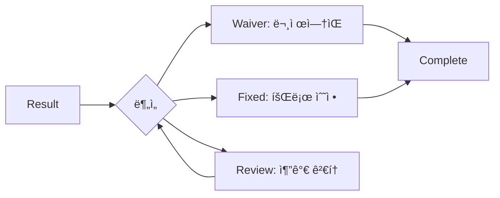

# Signoff 업무 현황 & 방법론 (As‑Is)

## 0) Executive Summary

- **í˜„ì¬ ìš´ì˜ êµ¬ì¡°**: ê° ë©”ëª¨ë¦¬ 제품 설개팀ì—ì„œ In‑house C++ 엔진(**SPACE/ADV**) ê¸°ë°˜ì˜ ì—¬ëŸ¬ ì¢…ë¥˜ì˜ Signoff Application들 ê°ê°ì˜ 제품 ê³„ì •ì˜ Signoff workspace 표준 경로ì—ì„œ ìˆ˜í–‰ì„ **Signoff Launcher**를 통해 시뮬레ì´ì…˜ì— 필요한 inputë“¤ì„ ì…력하고 ì‘ì—… 제출 → **HPC(LSF)** 분산 실행 → ê°ê°ì˜ Signoff 수행 ê²°ê³¼ result.csvì„  **ResultViewer WORKSPACE**ì— ì—…ë¡œë“œ → Signoff ResultViewer(사용ì별 Dash ì¸ìŠ¤í„´ìŠ¤ Standalone ìš´ìš©)ë¡œ ì—…ë¡œë“œëœ ê²°ê³¼ parquetë°ì´í„°ë¥¼ 분ì„·웨ì´ë²„ ì‘ì—… 수행.(ê²°ê³¼ì—ì„œ ê° line마다 Categorize Part 수행해서 Part Labeling → ê° Part 담당ì마다 해당ì˜ì—­ 검토/ë¶„ì„ ë° Waiver ì‘ì—… 수행)

(설계팀ì—ì„œ 특정 ì œí’ˆì— ëŒ€í•œ Signoff를 수행하게ë˜ë©´ R00 Netlistê°€ 나오고 ì´ì— ê´€ë ¨ëœ ë°ì´í„°ë“¤ì´ 1ì°¨ì ìœ¼ë¡œ 나올거야. 그럼 ì´ëŸ¬í•œ R00ì‹œì ì— ì¤€ë¹„ëœ ë°ì´í„°ë¥¼ 가지고 수행할수ìˆëŠ” Signoff ë“¤ì„ ìˆ˜í–‰í• í…Œê³  ê·¸ê²ƒë“¤ì€ ì´ˆê¸°ì— í•©ì˜ëœ ë‚´ìš©ë“¤ì— ëŒ€í•´ì„œ 수행ë ê±°ì•¼. ê° Signoff 설계팀 수행 담당ìë“¤ì´ Signoffë“¤ì„ ìˆ˜í–‰í•˜ê³ ë‚˜ë©´ 해당 ê²°ê³¼ 파ì¼ì´ csv형ì‹ìœ¼ë¡œ ìƒì„±ë ê±°ì•¼. ì´ëŠ” LINUX HPC 시스템ìƒì—ì„œ 수행ë˜ê³  ê°ìì˜ ê³„ì • localì—ì„œ signoff launcher를 통해서 수행할거야. ê° ì œí’ˆ ê³„ì •ì— /user/{product}/VERIFY/SIGNOFF/{LIBRARY}/{CELL}/{user_id}/{Signoff Application}{tag}/{Signoff Application RUNSCRIPT} 형ì‹ìœ¼ë¡œ 해당 프로ì íŠ¸ 제품 경로ì—ì„œ í‘œì¤€ê²½ë¡œì— ë§ê²Œ 로컬ì—ì„œ Signoff ìˆ˜í–‰ì„ í• ê±°ì•¼. 그리고나서 result.csv와 ê°™ì€ Signoff 수행 ê²°ê³¼ 파ì¼ì´ 나오면 ì´ë¥¼ Excelê³¼ ê°™ì€ íˆ´ì¸ ResultViewerì˜ Cloudì¸ WORKSPACEë¼ëŠ” 공용 ê³µê°„ì— ì—…ë¡œë“œ 시킬거야. 해당 ê²°ê³¼ row마다 회로 net í˜¹ì€ instanceì— ëŒ€í•œ signoff simulation ê²°ê³¼ ê°’ë“¤ì´ ì­‰ 나올í…ë° (ëŒ€ëµ 100만 rows) 해당 net í˜¹ì€ instance마다 담당ìê°€ 누구ì¸ì§€ categorize part script를 수행할거야. ê° row íšŒë¡œë§ˆë‹¤ì˜ ë‹´ë‹¹ì columnì¸ Part를 ìƒì„±í• ê±°ì•¼. 그리고 ì´ë¥¼ ResultViewer Worksapceì— ê³µìš” ê³µê°„ì— ì˜¬ë ¤ì¡Œìœ¼ë‹ˆê¹Œ ê° íšŒë¼ Part 담당ìê°€ 해당 회로를 분ì„하고 괜찮ì€ì§€ ì²´í¬í•œ í›„ì— Waiverê°’ì´ ì²˜ìŒì—는 다 Resultë¼ê³  ë˜ì–´ìˆëŠ”ê²ƒì„ Waiverë¡œ 수정 ì—…ë°ì´íŠ¸, 만약 진짜 문제가 ìˆì–´ì„œ 회로를 수정했다면 Fixedë¼ê³  ê°’ì„ ìˆ˜ì • í¸ì§‘할거야. 그러면 해당 result.csvì—ì„œ Waiver Columnê°’ì´ ì´ˆê¸°ì—는 Resultì¸ë° ëª¨ë‘ Fixed í˜¹ì€ Waiver값으로 바뀌고나면 해당 Signoff는 ë난거야.)


    
- **ë°ì´í„° 협업**: 중앙 **WORKSPACE** (`/WORKSPACE/{PRODUCT}/{REV}/{BLOCK}/{TOOL}/…`)ì— ê²°ê³¼/메타/ë²„ì „ì„ ë³´ê´€, 팀 단위로 공유·추ì .
    
- **방법론 í¬ì¸íŠ¸**: CCC 분해·Stage 단위 ê²€ì¦, 리비전 ì—°ë™ ë°˜ë³µ Signoff, R00 스í¬ë¦¬ë‹ → R10+ 정밀화, 웨ì´ë²„ 승계·비êµ, 최종 수렴(Closure).

(Channel Connected Component(CCC):  TR Level DB ì—ì„œ Gate 를 찾기 위한 알고리즘,  Vdd ì—ì„œ Gnd ë¡œ ì—°ê²°ëœ MOS 를 Tracing 하며 Searching.)

- **사용ì ê´€ì  ì‚°ì¶œë¬¼**: ê° App 실행 ê²°ê³¼ **`result.csv`**ê°€ 핵심(웨ì´ë²„/메타는 ResultViewer 내부ì—ì„œ 관리).
    


* ì¡°ì§, 배경과 당면 ì´ìŠˆ: 메모리( DRAM/FLASH/HBM )ì˜ **Full-custom TR-level 설계** 특성 때문ì—, 경험 기반 ë™ì  ê²€ì¦ + In-house Signoffê°€ 핵심 í름ì…니다. 제품 고사양화로 **Runtime ì¦ê°€, 진성 오류 검출력 저하(Garbage↑), Coverage 부족, UI/사용성 한계**ê°€ 중첩ë˜ì–´ ê²€ì¦ TAT 리스í¬ì™€ 리소스 비용 급ì¦


엔진과 공통 Signoff 기법

- **SPACE(Static)** / **ADV(Dynamic)**: C++ 기반 In-house 엔진. ì…ë ¥(Netlist/PVT)으로 SPICE를 대량 수행해 ê° Application 결과를 산출합니다.
- 공통 파ì´í”„ë¼ì¸(현ì¬/개선 대ìƒ):  
    â‘  Tech/Powers/Netlist 로드 → â‘¡ **CCC(Channel-Connected Component)** 기반 회로 분해/Stage 추출 → â‘¢ Application별 SPICE ë°í¬ ìƒì„±Â·ëŒ€ëŸ‰ 시뮬레ì´ì…˜Â·ì·¨í•©. (예: **DSC**는 Stage Slew 시뮬레ì´ì…˜ìœ¼ë¡œ ë“œë¼ì´ë²„ 사ì´ì¦ˆ 유효성 í‰ê°€; 500 ps ì…ë ¥ 슬루로 Rise/Fall Slew 측정)


---

## 1) 역할/환경/구성요소

### 1.1 ì—­í• 

- **설계팀 Signoff Application 수행 담당ì**: App 실행/ê²°ê³¼ 검토/웨ì´ë²„ 처리.
    
- **Signoff 파트**: In‑house Tool/방법론 ê³ ë„í™”, ìš´ì˜/ë¬¸ì˜ ëŒ€ì‘, ìë™í™”·무ì¸í™” 준비. In-house Tool 개발/유지보수와 Signoff 방법론 ê³ ë„í™”, 사용ì ë¬¸ì˜ ëŒ€ì‘ì„ ë§¡ê³  ìˆìœ¼ë©°, 병렬 시뮬레ì´ì…˜ ë° **AI/ML 기반 Signoff 방법론** ë„ì…ì´ ì¤‘ì¥ê¸° 과제로 삼고ìˆìŒ.

* Signoff 파트 Signoff Application 개발 담당ì: í˜„ì¬ Signoff 파트는  19ì¢…ì˜ Signoff Applicationì„ ìš´ì˜í•˜ê³  ìˆìœ¼ë©°, ê° Application마다 ì „ë‹´ 개발ì(ì •/부 1-2명)ê°€ ë°°ì •ë˜ì–´ ìˆìŠµë‹ˆë‹¤. ì´ë“¤ Applicationì€ ëª¨ë‘ í˜„ì¬ í™œë°œí•˜ê²Œ 사용ë˜ê³  ìˆìœ¼ë©°, 설계 ê²€ì¦ ê³¼ì •ì—ì„œ 핵심ì ì¸ ì—­í• ì„ ë‹´ë‹¹í•˜ê³  ìˆìŠµë‹ˆë‹¤.
 Signoff RUNSCIRPT 표준 구조:
 
```
your-signoff-app/
├── .github/
│   └── workflows/
│       └── auto-deploy.yaml     # Launcherì— ìë™ë°°í¬ github action 워í¬í”Œë¡œìš°
├── input_config.yaml            # 필수 파ì¼, ì´ë¥¼ 기반으로 signoff launcher guiìƒì—ì„œ 해당 application ì„ íƒ ì‹œ 필요한 ì…ë ¥ì„ ë°›ì„수ìˆëŠ” gui를 만듬.
├── run.sh                       # 필수 파ì¼
└── 기타 Application 파ì¼ë“¤...
```

#### 실제 사용 예시 - DSC Application

```yaml
DSC:
  name: "Driver Size Check"
  category: "Static"
  color: "blue"
  description: "Driver size verification for signoff"
  runscript_path: "RUNSCRIPTS/signoff-dsc"
  inputs:
    - name: "netlist_file"
      type: "file_input"
      required: true
      description: "Circuit netlist file for analysis"
      accept: ".sp,.cir,.hsp"
    
    - name: "driver_type"
      type: "select_input"
      required: true
      description: "Select driver type to check"
      options:
        - value: "nmos"
          label: "NMOS Driver"
        - value: "pmos"
          label: "PMOS Driver"
        - value: "cmos"
          label: "CMOS Driver"
      default: "cmos"
    
    - name: "min_width"
      type: "number_input"
      required: true
      default: "0.1"
      description: "Minimum driver width (um)"
      min: 0.01
      max: 100.0
      step: 0.01
    
    - name: "max_width"
      type: "number_input"
      required: true
      default: "10.0"
      description: "Maximum driver width (um)"
      min: 0.1
      max: 1000.0
      step: 0.1
    
    - name: "simulation_corners"
      type: "multiselect_input"
      required: false
      description: "Select simulation corners"
      options:
        - value: "tt_1v_25c"
          label: "TT 1V 25C"
        - value: "ss_0.9v_125c"
          label: "SS 0.9V 125C"
        - value: "ff_1.1v_-40c"
          label: "FF 1.1V -40C"
      default: ["tt_1v_25c"]
    
    - name: "output_format"
      type: "select_input"
      required: false
      description: "Output file format"
      options:
        - value: "csv"
          label: "CSV Format"
        - value: "xlsx"
          label: "Excel Format"
        - value: "json"
          label: "JSON Format"
      default: "csv"
```

### 1.2 실행 환경

- **HPC 스케줄러**: IBM **LSF**. GUI ì•±ì€ ì „ìš© ë˜í¼ë¡œ 제출: `sol_sub`(Launcher), `sorv_sub`(ResultViewer). 사용ì별 Dash 서버 1개씩 기ë™(브ë¼ìš°ì € ìë™ ì—´ë¦¼).
    
- **Launcher 앱 구성(현행)**: Set(ì…ë ¥ ì •ì˜) / Run(제출·모니터ë§) 2í˜ì´ì§€ + Workspace 관리(로컬 ì‘ì—…ì˜ì—­).

- 사내 HPC는 **IBM LSF**ë¡œ ìš´ì˜ë˜ë©°, GUI ì•±ì€ ì „ìš© ë˜í¼ë¡œ 제출:  
    `sol_sub`(Signoff Launcher), `sorv_sub`(Signoff ResultViewer). 개별 사용ìê°€ LSFë¡œ **ì기 ì „ìš© Dash 웹서버**를 ë„워 Standalone처럼 사용합니다(사용ì 1명 : 서버 1ê°œ).
- Signoff ì‹¤í–‰ì€ ê° Applicationì˜ `run.sh`ê°€ **전처리→LSF 제출→후처리**ë¡œ ì´ë£¨ì–´ì ¸ìˆìŒ, 대표 ì—”ì§„ì€ Static 계열 `SPACE`, Dynamic 계열 `ADV`ì…니다.


### 1.3 핵심 구성요소

- **Signoff Launcher**: ì…ë ¥Â·ì½”ë„ˆÂ·ë¸”ë¡ ì¡°í•© ìƒì„± → LSF 제출·ìƒíƒœ/로그·중단/ì¬ì‹¤í–‰Â·ê²°ê³¼ì—´ê¸°. LEGO‑flow ì¼ì›í™”, 공통 ì…ë ¥ ì¬ì‚¬ìš©.
    
- **In‑house 엔진**: Static=**SPACE**, Dynamic=**ADV**. Netlist/PVT 기반 대량 시뮬레ì´ì…˜.
    
- **ResultViewer**: 대용량 CSV/Parquetì„ Excel‑likeë¡œ 분ì„(Compare/Categorize/Waiver 등), 중앙 WORKSPACE 연계 협업.
    
- **WORKSPACE(중앙)**: ê²°ê³¼/메타/버전/ë½ì„ 표준 ê²½ë¡œì— ì €ì¥í•˜ì—¬ 다ì 협업 ë° ì´ë ¥ ì¼ê´€ì„± ë³´ì¥.
    

> 📌 _현황 ë ˆí¼ëŸ°ìŠ¤ ì¸ìš©ì€ 본문 하단 ê°ì£¼ 참조_

---

## 2) ë°ì´í„° & 협업 (WORKSPACE ê´€ì )

- **표준 트리 예시**: `/WORKSPACE/{PRODUCT}/{REV}/{BLOCK}/{TOOL}/` í•˜ìœ„ì— `result.csv / result.parquet`, `.meta`, `.version`, `.lock(Partial/Full)` 등.
    
- **노출 ì›ì¹™**: 실사용ìì—게 ë³´ì´ëŠ” 1ì°¨ ì‚°ì¶œë¬¼ì€ **result.csv**. 웨ì´ë²„·ìƒíƒœÂ·ë¹„êµí‚¤Â·ì†Œìœ ì ë“±ì€ **ResultViewer 내부 메타**ë¡œ 관리(ë³„ë„ `waiver.csv`는 ì—†ìŒ).
    
- **대시보드**(향후): ë©”íƒ€ì˜ ì§„í–‰ë¥ /웨ì´ë²„ 현황/KPI를 활용해 팀 단위 진행 ìƒí™© 가시화.
    

---

## 3) 표준 Signoff Workflow (Revision ì—°ë™)

### A. Initiation (제품 ì„ ì • ì§í›„)

- **ë‚´ìš©**: R00ì— í•„ìš”í•œ **ë°ì´í„° 준비**(초기 Netlist/PVT/Power 등) ë° **Criteria/코너 í•©ì˜**.
    
- **산출물**: _현ì¬ëŠ” 문서화 최소_. 다만 ìš´ì˜ìƒ í¸ì˜ë¥¼ 위해 **제품 메타 템플릿**(제품 코드, 리비전 ì •ì±…, 코너 세트, 담당ìÂ·ë¸”ë¡ ë§¤í•‘, 툴별 ì…ë ¥/분ì„키 초안)ì„ ê¶Œì¥.
    

### B. R00 사ì´í´ — _Schematic‑only, 제한 ì •ë³´_

- **ì…ë ¥**: R00 TR‑level Netlist, 초기 MP/Power(미확정 다수).
    
- **수행**: App Owner별로 Launcherì—ì„œ ì½”ë„ˆÃ—ë¸”ë¡ ì¡°í•© 실행 → LSF 제출 → **`result.csv`** 산출.
    
- **검토**: ResultViewer 업로드 → 담당 ì˜ì—­ ì—´ëŒ/웨ì´ë²„ 처리. R00ì€ **초기 스í¬ë¦¬ë‹** 성격(치명 결함 중심, 나머지는 웨ì´ë²„ë¡œ ìš°ì„  정리).
    

### C. R10 / R20 … — _ë°ì´í„° 보강·범위 확대_

- **ì…ë ¥ 갱신**: MP/Power 정밀화, ì¼ë¶€ **RC ë°˜ì˜** ì‹œì‘.
    
- **반복 실행**: ë™ì¼ Appì„ í™•ëŒ€ 수행(코너·기준 ê°•í™”).
    
- **웨ì´ë²„ 승계**: R00 웨ì´ë²„를 **비êµ(Compare)**ë¡œ ì´ì›”, **달ë¼ì§„ 항목만** ì¬ê²€í† /갱신.
    

### D. Convergence & Closure (후기 리비전)

- í…Œì´í”„아웃과 병행ë˜ë©°, 현실ì ìœ¼ë¡œ **마무리 프로세스가 축약**ë˜ëŠ” 경향. 향후 ì œë„화·ìë™í™”를 통해 ì •ì°© í•„ìš”.
    

#### â–¶ 워í¬í”Œë¡œìš° 다ì´ì–´ê·¸ë¨

```
[Initiation]
  └─ ë°ì´í„°/코너/Criteria í•©ì˜
      └─ WORKSPACE ìƒì„±
          └─[R00]
              ├─ Launcher 실행(코너×블ë¡)
              ├─ result.csv 산출 → ResultViewer 업로드
              └─ 웨ì´ë²„ 스í¬ë¦¬ë‹
                  └─[R10/R20…]
                      ├─ ì…력·RC ë³´ê°•
                      ├─ ì¦ë¶„ 실행(ë¸íƒ€ ìš°ì„ )
                      ├─ Compareë¡œ 웨ì´ë²„ 승계
                      └─ 달ë¼ì§„ 항목 í™•ì¸ ë° ë¦¬ë·°
                          └─[후기 Rev]

```

---

## 4) Compare & 웨ì´ë²„ ìš´ì˜ (현행 ë¡œì§ ë°˜ì˜)

### 4.1 Compare Script ê°œë…

- **App별 ë¹„êµ í‚¤**ê°€ 다르며, 예를 들어 **DSC**는 `measure_net, driver_net`ì„ **키**ë¡œ 하고, `rise_slope, fall_slope`를 **ê°’**으로 비êµ.
- Compare ê²°ê³¼ ë¼ë²¨: `same / duplicated / not found / diff` (+ **tolerance**를 ì ìš©í•˜ì—¬ 허용 오차 ë‚´ ì°¨ì´ëŠ” `same` 처리).
- 다중 ë°œìƒ ë°©ì§€: 대ìƒ(df2)ì—ì„œ 키 ê·¸ë£¹ì˜ ê°’ ì¼ê´€ì„± 검사 → 불ì¼ì¹˜ ì‹œ `duplicated`.

### 4.2 웨ì´ë²„

- **ë¹„êµ í‚¤ 표준표**를 App별로 ê³ ì •(예: DSC=measure_net+driver_net, …).
- **Tolerance í…Œì´ë¸”í™”**(App×지표별 허용 오차).
- **웨ì´ë²„ 승계 규칙**: 리비전 ê°„ ë™ì¼ 키ì—ì„œ `same` ë˜ëŠ” `diff≤tol`ì´ë©´ **ìë™ ì›¨ì´ë²„ 유지**, `diff>tol` ë˜ëŠ” `not found/duplicated`는 리뷰 ë¡œ 승격.
- **로그/추ì ì„±**: 웨ì´ë²„ ìƒíƒœ 변경 ì´ë ¥(누가/언제/ì´ìœ /근거)ì„ ë©”íƒ€ì— ê¸°ë¡.

- **유효 범위 규칙**: 팀 **공통 규약** 보유 (리비전/코너 범위 등)
- **íŒë‹¨ ì±…ì„**: 개별 **App Owner** ê°€ ìì‹ ì˜ ê²°ê³¼ì— ëŒ€í•´ 최종 íŒë‹¨/등ë¡
- **waiver migration ë¡œì§**
    1. 신 리비전 `result.csv` 로드
    2. App-별 **Key 컬럼 집합**으로 ì´ì „ 리비전 ê²°ê³¼/웨ì´ë²„와 **ì¡°ì¸(match)**
    3. **ë™ì¼ garbage**ë¡œ íŒì • 가능한 í•­ëª©ì€ **“웨ì´ë²„â€**ë¡œ 미리 태깅
    4. 담당ìê°€ **확정/수정**(최종 ì±…ì„ì€ ë‹´ë‹¹ì)


---

## 5) 툴 ë¼ì¸ì—… × 리비전 × 코너 매트릭스 (현행 í‘œ ë°˜ì˜)

> 제품마다 ìƒì´í•  수 ìˆìœ¼ë‚˜, 제공 표를 바탕으로 대표 ì¼€ì´ìŠ¤ë¥¼ 정리.

| Tool Name           | Condition (예)   | Criteria(예)    | R00 | R10 | R20 | R30 | R40 | R50 | R60 |
| ------------------- | --------------- | -------------- | :-: | :-: | :-: | :-: | :-: | :-: | :-: |
| Voltage Finder      | –               | –              |  ◠ |  ◠ |  ◠ |  ◠ |  ◠ |  ◠ |  ◠ |
| Power at Gate       | –               | –              |  ◠ |  ◠ |  ◠ |  ◠ |  ◠ |  ◠ |  ◠ |
| PN Ratio            | SSPLVCT         | –              |  ◠ |  ◠ |  ◠ |  ◠ |  ◠ |  ◠ |  ◠ |
| FO Check            | SSPLVCT         | –              |  ◠ |  ◠ |  ◠ |  ◠ |  ◠ |  ◠ |  ◠ |
| Driver & Keeper     | SFLVCT,FSLVCT   | –              |  ◠ |  ◠ |  ◠ |  ◠ |  ◠ |  ◠ |  ◠ |
| DC Path             | TTTVCT(2P)      | –              |  ◠ |  ◠ |  ◠ |  ◠ |  ◠ |  ◠ |  ◠ |
| Floating Node       | TTTVCT(2P)      | –              |  ◠ |  ◠ |  ◠ |  ◠ |  ◠ |  ◠ |  ◠ |
| PEC                 | Normal          | All Violations |  â—  |  â—  |  â—  |  â—  |  â—  |  â—  |  â—  |
| **DSC**             | SSPLVCT,SSPLVHT | –              |     |     |  ◠ |  ◠ |  ◠ |  ◠ |  ◠ |
| **LSC**             | SFLVCT,FSLVCT   | Rs/Fs>250ps?   |     |  â—  |  â—  |  â—  |  â—  |  â—  |  â—  |
| **LS**              | SFLVCT,FSLVCT   | –              |     |     |  ◠ |  ◠ |  ◠ |  ◠ |  ◠ |
| Cana‑TR (Static)    | FFPHVHT         | All Violations |     |     |     |     |  ◠ |  ◠ |  ◠ |
| Cana‑TR (Dynamic)   | FFPHVHT         | All Violations |     |     |     |     |  ◠ |  ◠ |  ◠ |
| CDA / STA           | SSPLVCT         | –              |     |     |     |     |     |  ◠ |  ◠ |
| Glitch Margin       | FSDB            | –              |     |     |     |     |     |  ◠ |  ◠ |
| Dynamic DC Path     | TRN/FSDB        | –              |     |     |     |     |     |  ◠ |  ◠ |
| ADV Margin Analyzer | FSDB            | –              |  ◠ |  ◠ |  ◠ |  ◠ |  ◠ |  ◠ |  ◠ |
| ADV Latch S/H       | FSDB            | –              |     |     |     |     |     |  ◠ |  ◠ |
| **ì—´í™” ê²€ì¦ ìë™í™”**       | FSDB            | –              |     |     |     |     |     |     |  â—  |


## 4) 표준 Signoff Workflow (설계 리비전 ì—°ë™)

- **리비전 í름(R00 → R10 → …)**: 초기 R00ì€ ì œí•œëœ ì •ë³´ë¡œ **기초 ì ê²€(DC path, Fanout, DSC/LS/LSC 등)**ì„ ìˆ˜í–‰, ì´í›„ ë¦¬ë¹„ì „ì´ ì§„í–‰ë ìˆ˜ë¡ RC/ëª¨ë¸ ì •í™•ë„ í–¥ìƒì— ë§ì¶° **ì²´í¬ í­ê³¼ 커버리지**ê°€ 확대ë©ë‹ˆë‹¤. (R-by-R 반복 Signoff)
    
- **Launcher 측면**
    
    - Set í˜ì´ì§€ì—ì„œ 다수 Applicationì„ **공통 ì…ë ¥ 공유**ë¡œ ìƒì„±, Job Queueë¡œ 다중 코너/ë¸”ë¡ ì œì¶œ. 필요한 ì…ë ¥ì€ ê° `RUNSCRIPTS/*/input_config.yaml`ë¡œ ì •ì˜ë˜ì–´ ë™ì  ìƒì„±ë©ë‹ˆë‹¤. ëŸ°íƒ€ì„ ì¤‘ **ìƒíƒœ/로그/중지/ì¬ì‹¤í–‰/ê²°ê³¼ 열기**(ResultViewer) ì•¡ì…˜ì„ ì œê³µ.
        
    - Workspace 표준 경로를 강제하고(예: `/user/{PRJ}/VERIFY/SIGNOFF/{LIB}/{CELL}/{USER}`), 거기서 Job별 í´ë”ì— ì„¤ì •Â·ë¡œê·¸Â·ê²°ê³¼ë¥¼ ì¼ì›í™”합니다.
        
- **ResultViewer 측면**
    
    - ê²°ê³¼ CSV/Parquetì„ **Excel-like UI**ë¡œ 대용량 처리(Polars/서버사ì´ë“œ 로딩), Cross-Probing/Compare/Categorize/Waiver ë“±ì˜ **Signoff 특화 분ì„**ì„ ì œê³µí•©ë‹ˆë‹¤. 중앙 **WORKSPACE**를 통해 팀 협업/버전 ì¼ê´€ì„±ì„ 유지합니다.

## 7) ë°ì´í„°Â·í˜‘ì—… 체계

- **WORKSPACE 표준 트리**: `/WORKSPACE/{PRODUCT}/{REV}/{BLOCK}/{TOOL}/…`ì— `result.parquet/csv`, `.meta`, `.lock(Partial/Full)`, `.version`, `backup/…`를 ì €ì¥. Lockì— **í•„í„°/ì„ íƒ ì»¬ëŸ¼/uniqid 집합** í¬í•¨(ë‹¨ì¼ íŒŒì¼ë¡œ 관리).
    
- **Waiver/진행 현황**ì„ ë©”íƒ€ë°ì´í„°ì— í¬í•¨í•˜ì—¬ 대시보드화, 팀 단위 진행률 가시화 → ì¬ì‘업·책ì„소ì¬Â·ì´ìŠˆ 추ì ì˜ 표준화 기반.


## 0) 용어 한 줄 정리

- **Revision(Rxx)**: 설계 진척 단계. R00(초기 Schematic) → R10/R20…(Model/Power/RC ì ì°¨ ë³´ê°•).
    
- **Signoff Application**: DSC/LS/LSC/ë™ì  DC Path 등 ê° ê²€ì¦ í•­ëª©(툴/스í¬ë¦½íŠ¸ 단위).
    
- ** Resultviewer WORKSPACE(중앙)**: 제품·리비전·툴별 ê²°ê³¼/메타/웨ì´ë²„를 íŒ€ì´ ê³µìœ Â·ê´€ë¦¬í•˜ëŠ” ì €ì¥ì†Œ.


* Signoff Launcher WORKSPACE(분산): ê° ì œí’ˆë³„ Storageì—ì„œ signoff launcher를 수행하기위해 설정하는 경로. (/user/{PRODUCT}/VERIFY/SIGNOFF/{Library}/{CELL}/{USER}/{Applicatoin}_date/) ì´ìœ ëŠ” 계정벼로 í° Storage ìš©ëŸ‰ì œí•œì´ ìˆê³ , ResultViewer WORKSPACE 처럼 중앙 Storageë¡œë„ ìš©ëŸ‰ì œí•œì´ ìˆìŒ. ResultViewer WORKSPACE는 결과파ì¼ë§Œ ê´€ë¦¬í•˜ê¸°ì— ê´œì°®ìŒ

- **Launcher**: ê° Signoff Appì„ LSFë¡œ 제출/ê°ì‹œí•˜ëŠ” 실행 í¬í„¸(사용ì별 Dash ì¸ìŠ¤í„´ìŠ¤).
    
- **ResultViewer**: ê²°ê³¼ CSV/Parquetì˜ ëŒ€ìš©ëŸ‰ ì‹œê°í™”·필터ë§Â·ì›¨ì´ë²„ í¸ì§‘기.
# 📊 Signoff 업무 현황과 방법론 (As-Is)

## 1. Executive Summary

### 1.1 Signoff 개요

- **ì •ì˜**: 메모리(DRAM/FLASH/HBM) ì œí’ˆì˜ Tr-level(트ëœì§€ìŠ¤í„° 수준) 회로 설계 ê²€ì¦ì„ 위한 통합 프로세스
- **목ì **: Full-custom ì„¤ê³„ëœ ë©”ëª¨ë¦¬ íšŒë¡œì˜ ë¬´ê²°ì„± 확보 ë° ì œí’ˆ ì™„ì„±ë„ í–¥ìƒ
- **범위**: Static/Dynamic ê²€ì¦ì„ 통한 19종 Signoff Application ìš´ì˜

### 1.2 핵심 ë„ì „ 과제

- **ê¸°ìˆ ì  í•œê³„**: Runtime ì¦ê°€(ë³µì¡ë„↑), Garbage ì¦ê°€(진성 오류 검출력↓), Coverage 부족
- **비용 ì´ìŠˆ**: 설계 resource cost 급ì¦(~1,200ì–µì›@22ë…„, YoY 63%↑)
- **ìƒì‚°ì„± 문제**: 설계 TAT ì¦ê°€, Pending ì¦ê°€ë¡œ ì¸í•œ ê²€ì¦ ì§€ì—°
- **협업 ë³µì¡ì„±**: 다수 설계팀 ê°„ Signoff ê²°ê³¼ 공유 ë° Waiver ê´€ë¦¬ì˜ ì–´ë ¤ì›€

## 2. ì¡°ì§ êµ¬ì¡° ë° ì—­í• 

### 2.1 ì¡°ì§ ì²´ê³„

```
DS (Device Solutions) 부문
└── 메모리 사업부
    └── Design Technology Team
        └── Design Simulation & Signoff Group
            └── Signoff Part (19종 Application ìš´ì˜)
```

### 2.2 주요 ì—­í•  ì •ì˜

#### Signoff Part (Platform 개발/ìš´ì˜)

- **In-house Tool 개발**: SPACE/ADV 엔진 개발 ë° ìœ ì§€ë³´ìˆ˜
- **방법론 ê³ ë„í™”**: AI/ML 기반 Signoff 방법론 연구
- **Platform ìš´ì˜**: Launcher, ResultViewer, WORKSPACE 관리
- **기술 지ì›**: 설계팀 ë¬¸ì˜ ëŒ€ì‘ ë° êµìœ¡

#### 설계팀 (Signoff 수행)

- **Application 실행**: ê° ì œí’ˆë³„ í•„ìš” Signoff 수행
- **ê²°ê³¼ 분ì„**: ResultViewer를 통한 ê²°ê³¼ 검토
- **Waiver 처리**: 담당 회로 ì˜ì—­ì˜ Waiver íŒë‹¨ ë° ì²˜ë¦¬

## 3. Signoff Workflow (설계 리비전 ì—°ë™)

### 3.1 ì „ì²´ 프로세스 í름

mermaid

````mermaid
graph TB
    A[Initiation] --> B[R00: Schematic-only]
    B --> C[R10-R20: Model ë³´ê°•]
    C --> D[R30-R40: RC ë°˜ì˜]
    D --> E[R50-R60: Final]
    
    B --> F[초기 스í¬ë¦¬ë‹]
    C --> G[범위 확대]
    D --> H[ì •ë°€ ê²€ì¦]
    E --> I[Closure]
```

### 3.2 리비전별 수행 내용

#### Phase A. Initiation (제품 ì„ ì • ì§í›„)
- **ë°ì´í„° 준비**: 초기 Netlist, PVT(Process/Voltage/Temperature) ì¡°ê±´
- **Criteria í•©ì˜**: ê° Application별 Pass/Fail 기준 설정
- **WORKSPACE ìƒì„±**: `/WORKSPACE/{PRODUCT}/` 표준 경로 ìƒì„±

#### Phase B. R00 (Schematic-only, 제한 정보)
- **ì…ë ¥ ë°ì´í„°**: 
  - TR-level Netlist (Schematic 기반)
  - 초기 MP(Model Parameter)/Power 정보
- **수행 Application**: 기본 Static ê²€ì¦
  - Voltage Finder, Power at Gate
  - PN Ratio, FO Check
  - Driver & Keeper, DC Path
  - Floating Node, PEC
- **특징**: 초기 스í¬ë¦¬ë‹ 목ì , ì¹˜ëª…ì  ê²°í•¨ 중심 검토

#### Phase C. R10/R20 (ë°ì´í„° ë³´ê°•)
- **추가 ë°ì´í„°**: 
  - MP/Power 정밀화
  - ì¼ë¶€ RC(Resistance/Capacitance) ë°˜ì˜ ì‹œì‘
- **추가 Application**: 
  - LSC (Level Shifter Check)
  - DSC, LS 본격 수행 ì‹œì‘
- **웨ì´ë²„ 승계**: R00 웨ì´ë²„를 Compare 기능으로 ì´ì›”

#### Phase D. R30/R40 (RC 본격 ë°˜ì˜)
- **ì •ë°€ ë°ì´í„°**: 
  - Layout 기반 RC extraction
  - 정확한 Timing 정보
- **추가 Application**: 
  - Cana-TR (Static/Dynamic)
  - 초기 Dynamic ê²€ì¦ ì‹œì‘

#### Phase E. R50/R60 (Final Verification)
- **완성 ë°ì´í„°**: 
  - 최종 Layout 정보
  - FSDB/TRN waveform
- **추가 Application**: 
  - CDA/STA
  - Glitch Margin Analysis
  - Dynamic DC Path
  - ADV Latch Setup-Hold
  - ì—´í™” ê²€ì¦ ìë™í™”

### 3.3 ë°ì´í„° í름 ë° ì‚°ì¶œë¬¼
```
[설계팀 Local] → [HPC 실행] → [ê²°ê³¼ ìƒì„±] → [WORKSPACE 업로드]
    ↓              ↓            ↓              ↓
  ì…ë ¥ 준비    LSF Job 제출   result.csv   ResultViewer 분ì„
```

## 4. Signoff Application 체계

### 4.1 Application 분류

#### Static Signoff (SPACE 엔진)
- **회로 ì¸ì‹ 기반**: CCC(Channel Connected Component) 알고리즘
- **주요 Application** (9종):
  1. **DSC** (Driver Size Check): 500ps ì…ë ¥ 슬루로 ë“œë¼ì´ë²„ í¬ê¸° ì ì ˆì„± í‰ê°€
  2. **LSC** (Latch Strength Check): Latch íšŒë¡œì˜ Feed-back Loop ê°•ë„ ê²€ì¦
  3. **LS** (Level Shifter): ì „ì•• ë„ë©”ì¸ ê°„ 신호 변환 안전성
  4. **Cana-Tr**: Coupling noise 분ì„
  5. **CDA**: Coupling Delay 분ì„
  6. **PEC**: Power Error Check
  7. **PN Ratio**: PMOS/NMOS 비율 ê²€ì¦
  8. **FO Check**: Fan-out ê²€ì¦
  9. **DC Path**: DC 경로 ê²€ì¦

#### Dynamic Signoff (ADV 엔진)
- **Waveform 기반**: Verilog/CKT + FSDB/TRN 분ì„
- **주요 Application** (13종):
  - ADV Checker/Compare/Xtracer
  - ADV Latch Setup-Hold
  - ADV Margin Analysis
  - Glitch Margin Analysis
  - Dynamic DC Path
  - Current Analyzer
  - ì—´í™” ê²€ì¦ ìë™í™” 등

### 4.2 Application별 수행 매트릭스

| Tool Name | R00 | R10 | R20 | R30 | R40 | R50 | R60 | Condition | Criteria |
|-----------|-----|-----|-----|-----|-----|-----|-----|-----------|----------|
| Voltage Finder | â— | â— | â— | â— | â— | â— | â— | - | - |
| PN Ratio | â— | â— | â— | â— | â— | â— | â— | SSPLVCT | - |
| DSC | - | - | â— | â— | â— | â— | â— | SSPLVCT/HT | Rise/Fall < 2.5x |
| LSC | - | â— | â— | â— | â— | â— | â— | SFLVCT/FSLVCT | Rs/Fs > 250ps |
| Cana-TR | - | - | - | - | â— | â— | â— | FFPHVHT | All Violations |
| Dynamic DC Path | - | - | - | - | - | â— | â— | TRN/FSDB | - |

## 5. Signoff Platform ìš´ì˜ ì²´ê³„

### 5.1 실행 환경
- **HPC 시스템**: IBM LSF Scheduler 기반
- **실행 명령어**:
  - `sol_sub`: Signoff Launcher 실행
  - `sorv_sub`: ResultViewer 실행
  - `space_sub`/`adv_sub`: 엔진별 ì‘ì—… 제출
- **ìš´ì˜ ë°©ì‹**: 사용ì별 ë…립 Dash 서버 ì¸ìŠ¤í„´ìŠ¤

### 5.2 표준 경로 구조

#### Launcher Workspace (분산/Local)
```
/user/{PRODUCT}/VERIFY/SIGNOFF/{LIBRARY}/{CELL}/{USER}/{APPLICATION}_{date}/
├── input_config.yaml    # Application ì…ë ¥ 설정
├── run.sh              # 실행 스í¬ë¦½íŠ¸
├── env                 # 환경 변수
└── result.csv          # ê²°ê³¼ 파ì¼
```

#### ResultViewer WORKSPACE (중앙/공유)
```
/WORKSPACE/{PRODUCT}/{REVISION}/{BLOCK}/{TOOL}/
├── result.parquet      # ë³€í™˜ëœ ê²°ê³¼ ë°ì´í„°
├── .meta              # 메타ë°ì´í„° (진행률, 담당ì 등)
├── .version           # 버전 정보
├── .lock              # Lock 정보 (Partial/Full)
└── backup/            # 백업 ë°ì´í„°
````

## 6. Compare & Waiver ìš´ì˜

### 6.1 Compare ë¡œì§

- **ë¹„êµ í‚¤**: Application별 ìƒì´
    - DSC: `measure_net` + `driver_net`
    - LSC: `latch_name` + `input_pin`
- **ë¹„êµ ê²°ê³¼ ë¼ë²¨**:
    - `same`: ë™ì¼
    - `diff`: ì°¨ì´ (tolerance ê³ ë ¤)
    - `not found`: 미발견
    - `duplicated`: 중복

### 6.2 Waiver 처리 프로세스

mermaid



### 6.3 Waiver Migration

- **ìë™ ìŠ¹ê³„**: ì´ì „ 리비전ì—ì„œ Waiverëœ í•­ëª© 중 변경없는 항목
- **ìˆ˜ë™ ê²€í† **: Tolerance 초과 ë˜ëŠ” 새로운 항목
- **ì´ë ¥ 관리**: 누가/언제/왜 Waiver 처리했는지 기ë¡

## 7. í˜„ì¬ ì‹œìŠ¤í…œì˜ í•œê³„ì 

### 7.1 ê¸°ìˆ ì  í•œê³„

- **엔진 레벨**:
    - C++ 레거시 코드 유지보수 어려움
    - 병렬 처리 한계로 Runtime ì¦ê°€
    - 최신 회로 패턴 ì¸ì‹ 한계
- **Platform 레벨**:
    - 수ë™ì ì¸ Signoff 수행 프로세스
    - ë¶„ì‚°ëœ ê²°ê³¼ 관리로 ì¸í•œ 비효율
    - 실시간 협업 기능 부족

### 7.2 프로세스 한계

- **Setup ë³µì¡ì„±**: Application별 ìƒì´í•œ ì…ë ¥ 요구사항
- **Garbage 관리**: False positive ì¦ê°€ë¡œ ë¶„ì„ ì‹œê°„ ì¦ê°€
- **Coverage 부족**: 모든 설계 ì¼€ì´ìŠ¤ ê²€ì¦ ë¶ˆê°€

## 8. 개선 방향 (To-Be Vision)

### 8.1 단기 목표 (2025)

- **Platform 통합**: Launcher 3.0 + ResultViewer 3.0 ê³ ë„í™”
- **Python Wrapper**: C++ ì—”ì§„ì˜ Python APIí™”
- **ë°ì´í„° 표준화**: 통합 DB 구조 ë° Input/Output 규약

### 8.2 중ì¥ê¸° 목표 (2026-2027)

- **Event-Driven Signoff**: 설계 변경 ê°ì§€ ìë™ ì‹¤í–‰
- **AI/ML Integration**:
    - Garbage Reduction
    - Auto Waiver
    - Pattern Matching
- **24-hour No-Human-In-the-Loop**: 완전 ìë™í™”ëœ Signoff 체계

## 2) 단계별(Revision별) í름

### A. Initiation (제품 ì„ ì • ì§í›„)

- **하는 ì¼**: Signoff ìˆ˜í–‰ì— í•„ìš”í•œ **ë°ì´í„° 준비**(초기 Netlist/PVT/Power list 등) ë° **Criteria/코너**ì— ëŒ€í•œ **í•©ì˜**
- **특별 산출물**: ì—†ìŒ (문서화/í…œí”Œë¦¿ì´ ìˆë‹¤ë©´ 참고하ë˜, 현ì¬ëŠ” “합ì˜/세팅†수준)
- 설계팀ì—ì„œ 미팅 í›„ì— ì •í•˜ê³  회ì˜ë¡ì´ë‚˜ ê°ìì˜ ë¬¸ì„œì— ê´€ë¦¬ë˜ë˜ì§€ í• ê±°ì„.

### B. R00 사ì´í´ (초기 Schematic 위주, 제한 ì •ë³´)

- **ì…ë ¥**: R00 TR-level Netlist, 초기 Techfile/Power ì •ë³´(향후 추가 ë° ì—…ë°ì´íŠ¸ 가능)
- **수행**: ê° Signoff App 설계팀 수행 담당ì ê°€ 담당 Signoff App** 실행 → **`result.csv`** 산출
- **업로드/검토**: `result.csv`를 **ResultViewer WORKSPACE**ì— ì—…ë¡œë“œ → 회로별 -> 담당 회로 ì˜ì—­ì„ ì—´ëŒ/검토
- **웨ì´ë²„ 처리**: 가성(garbage)/조건부 허용 í•­ëª©ì„ **웨ì´ë²„ 등ë¡** "Waiver", íšŒë¡œì— ë¬¸ì œê°€ ìˆì–´ 해당 부분 수정하였으면 "Fixed"
- **비고**
    - R00ì€ **초기 스í¬ë¦¬ë‹** 성격: 치명 결함 위주로 확ì¸, 나머지는 웨ì´ë²„ë¡œ ì¼ë‹¨ 정리
    - 코너는 최소/대표 코너(ë˜ëŠ” 팀 ê·œì•½ì˜ ì•µì»¤ 코너) 중심으로 수행

> **산출물(사용ì ê´€ì )**: `result.csv` (ResultViewerê°€ 나머지 메타/ìƒíƒœë¥¼ 내부ì—ì„œ 관리)  
> **ì—†ìŒ**: ë³„ë„ `waiver.csv` 파ì¼ì„ 사용ìì—게 노출하지 ì•ŠìŒ

---

### C. R10 / R20… (ë°ì´í„° 보강·범위 확대, 반복 수렴)

- **ì…ë ¥ 갱신**: 리비전 ì§„í–‰ì— ë”°ë¼ **MP ì—…ë°ì´íŠ¸, Power ë³´ê°•, RC ì •ë³´ ì¼ë¶€/ì ì§„ ë°˜ì˜**
- **수행**: ë™ì¼ Appë“¤ì„ **ì§€ì† ìˆ˜í–‰**(코너/기준 ì ì§„ 확대, í•„ìš” ì‹œ 범위 확ì¥)
- **웨ì´ë²„ ì´ì›”(핵심)**:
    - **R00ì—ì„œ 웨ì´ë²„ 처리한 garbage**를 **R10 ì´í›„ì—ë„ ë¹„êµë¡œ 가져와** ë™ì¼ 성격ì´ë©´ **ìë™/ë°˜ìë™ ì›¨ì´ë²„ 후보**ë¡œ 표기
    - **주ì˜**: 비êµëŠ” **`uniqid`(순번)ê°€ ì•„ë‹ˆë¼ App별 “특수 Net/ë„ë©”ì¸ í‚¤ 컬럼â€**ì„ **Key**ë¡œ 사용  
        (ê° Appì´ í•©ì˜í•œ Key 스키마가 í•„ìš”)
- **검토**: 변한 것만 집중(“달ë¼ì§„ 항목만 웨ì´ë²„/리뷰 갱신â€), 진성 FAILì€ ì„¤ê³„ 수정 요청

> **산출물(사용ì ê´€ì )**: 매 리비전 ìˆ˜í–‰ì˜ `result.csv` (ResultViewerë¡œ ëˆ„ì  ì—…ë¡œë“œ/비êµ/ì´ì›”)

---

### D. (ì´ìƒì ) Convergence & Closure

- **현황**: í…Œì´í”„아웃 ì¼ì •/업무 우선순위 ë•Œë¬¸ì— **실제 ìš´ì˜ì—ì„  ë³„ë„ ì •ë¦¬ 단계까지는 못 가는 경우가 ë§ìŒ**
- **ì´ìƒì  목표(참고)**: 최종 기준 확정, ì”ì—¬ 웨ì´ë²„ 최소화/근거 명확화, 리í¬íŠ¸ 패키징

---

## 3) 웨ì´ë²„ ìš´ì˜ ì›ì¹™ (현행)

- **유효 범위 규칙**: 팀 **공통 규약** 보유 (리비전/코너 범위 등)
- **íŒë‹¨ ì±…ì„**: 개별 **App Owner** ê°€ ìì‹ ì˜ ê²°ê³¼ì— ëŒ€í•´ 최종 íŒë‹¨/등ë¡
- **ì´ì›” ë¡œì§(ê¶Œì¥ êµ¬í˜„ 템플릿)**
    1. 신 리비전 `result.csv` 로드
    2. App-별 **Key 컬럼 집합**으로 ì´ì „ 리비전 ê²°ê³¼/웨ì´ë²„와 **ì¡°ì¸(match)**
    3. **ë™ì¼ garbage**ë¡œ íŒì • 가능한 í•­ëª©ì€ **“웨ì´ë²„ 후보â€**ë¡œ 미리 태깅
    4. 담당ìê°€ 후보를 **확정/수정**(최종 ì±…ì„ì€ ë‹´ë‹¹ì)

> 예) Key 컬럼 예시(템플릿)  
> • DC Path/Fanout: `(Block, FromNet(or FromCell), ToNet(or ToCell), RuleType)`  
> • Dynamic DC Path: `(StartNet, EndNet, PathClass)`  
> • DSC/LS/LSC: `(DriverNet(or StageID), LoadNet(or SinkID), Pattern/Rule)`  
> → 실제 Key는 **ê° App Owner 회ì˜**ì—ì„œ í•©ì˜í•´ ResultViewer/Launcherì— ë°˜ì˜

---

## 4) ìš´ì˜ íŒ (현실 ë°˜ì˜)

- **야간 배치**: ì¥ì‹œê°„/대량 ì¡ì€ ì•¼ê°„ì— ëª°ì•„ 실행(ë‚® 시간엔 íƒìƒ‰/단기 ì¡ ìš°ì„ )
- **ìë™ ì›¨ì´ë²„ ì´ì›”**: R00ì—ì„œ 웨ì´ë²„ ì²˜ë¦¬ëœ garbage는 R10+ì—ì„œ **Key-기반** ìë™ í›„ë³´ 처리
- **ë¹„êµ ë·° 주ì˜**: **uniqid 사용 금지**(매 실행마다 순번 ëœë¤). **App-ì „ìš© Key**ë¡œ 비êµ

---

## 5) 툴 ë¼ì¸ì—… × 리비전 × 코너 매트릭스

### 5.1 App × Revision × Corner (í•œ ì¥ ìš”ì•½)

> ※ 코너 표기는 예시ì…니다. 실제 코너명/세트는 팀 ê·œì•½ì— ë§ì¶° 수정해 사용하세요.

| Signoff App         | R00 (초기)                            | R10 (확대)                                           | R20+ (안정화)         |
| ------------------- | ----------------------------------- | -------------------------------------------------- | ------------------ |
| **DC Path**         | 기본 연결성/고립 경로 스캔 (코너 비ì˜ì¡´/논코너)        | 규칙 ê°•í™”(예: Net class/Domain별)                        | ì „ 범위 ì •ë¡€ 수행         |
| **Fanout**          | 기본 Fanout ì»·(대표 ì¡°ê±´)                  | 블ë¡/ì…€ í´ë˜ìŠ¤ë³„ ì„계 ê°•í™”                                    | ì „ 범위 ì •ë¡€ 수행         |
| **Dynamic DC Path** | **대표 패턴 + 대표 코너(예: TT@Vnom@Troom)** | **앵커 + Worst-case(예: SS@Vmin@Tmin, FF@Vmax@Tmax)** | **ê³µì‹ ì½”ë„ˆ í’€ 커버리지**   |
| **DSC**             | 거친 기준(대표 코너)ë¡œ 1ì°¨ 스í¬ë¦¬ë‹               | 기준 ì •êµí™” + 코너 확대(앵커+Worst)                           | RC/MP ë°˜ì˜ í›„ ê³µì‹ ì½”ë„ˆ í’€ |
| **LS**              | 대표 코너 위주                            | 앵커+Worst                                           | ê³µì‹ ì½”ë„ˆ í’€            |
| **LSC**             | 대표 코너 위주                            | 앵커+Worst                                           | ê³µì‹ ì½”ë„ˆ í’€            |

> **앵커(Anchor) 코너**: 팀 ê·œì•½ìƒ í•­ìƒ í¬í•¨í•˜ëŠ” 기준 코너(예: TT@Vnom@Troom).  
> **Worst-case 코너**: FAIL 민ê°ë„ê°€ ë†’ì€ ì¡°í•©(예: SS@Vmin@Tmin, FF@Vmax@Tmax).

---

### 5.2 Revision × Corner 커버리지(템플릿)

> 프로ì íŠ¸ ì‹œì‘ ì‹œ ì´ í‘œë¥¼ 복사해 **실제 코너명**으로 채워 ì“°ë©´ 팀 공통 ê¸°ì¤€ì´ ëª…í™•í•´ì§‘ë‹ˆë‹¤.

| Revision | í¬í•¨ 코너(예시)                                       | 비고             |
| -------- | ----------------------------------------------- | -------------- |
| **R00**  | `TT@Vnom@Troom` _(필수 앵커)_                       | 초기 스í¬ë¦¬ë‹, 빠른 회전 |
| **R10**  | `TT@Vnom@Troom`, `SS@Vmin@Tmin`, `FF@Vmax@Tmax` | 변화 ê°ì§€/민ê°ë„ 커버   |
| **R20+** | 팀 **ê³µì‹ ì½”ë„ˆ í’€** 전량                                | 안정화/최종 ê²€ì¦ í­ í™•ëŒ€ |

---

### 5.3 App-별 â€œë¹„êµ Keyâ€ ê¶Œì¥ í…œí”Œë¦¿

> ResultViewer/Launcher 설정 ì‹œ App별로 ì•„ë˜ **Key 스키마**를 등ë¡í•´ ë‘ë©´ 리비전 비êµ/웨ì´ë²„ ì´ì›”ì´ ì •í™•í•´ì§‘ë‹ˆë‹¤.

| App             | ë¹„êµ Key(예시 스키마)                                              | 비고            |
| --------------- | ----------------------------------------------------------- | ------------- |
| DC Path         | `Block, FromNet(or FromCell), ToNet(or ToCell), RuleType`   | 논코너 성격 강함     |
| Fanout          | `Block, Net(or Cell), RuleType, FanoutClass`                |               |
| Dynamic DC Path | `StartNet, EndNet, PathClass`                               | 패턴/경로 í´ë˜ìŠ¤ í¬í•¨  |
| DSC             | `DriverNet(or StageID), LoadNet(or SinkID), Pattern/Rule`   | RC ë°˜ì˜ ì‹œ í•„ë“œ ë³´ê°• |
| LS              | `DriverNet(or StageID), LoadNet(or SinkID), SlewClass/Rule` |               |
| LSC             | `Net(or NodeID), RuleType, Context`                         | LSC ì •ì˜ì— ë§ê²Œ ì¡°ì • |

> 실제 Key ì»¬ëŸ¼ì€ **ê° App ì •ì˜ì„œ**ì— ë”°ë¼ ìµœì¢… 확정. 중요한 ê²ƒì€ **uniqid를 쓰지 않는 것**.

---

## 6) 실제 사용ì ë°ì´í„° ê´€ì 

- **사용ìê°€ ì§ì ‘ 다루는 파ì¼**: ê° ìˆ˜í–‰ ê²°ê³¼ì˜ **`result.csv`**
- **나머지(메타/웨ì´ë²„/ì´ë ¥/버전 등)**: **ResultViewer 내부 ë°ì´í„°**ë¡œ ê´€ë¦¬ë¨ (사용ì ì§ì ‘ ì ‘ê·¼/수정 ëŒ€ìƒ ì•„ë‹˜)

---

## 7) 요약(핵심만)

- R00: 빠른 스í¬ë¦¬ë‹ → `result.csv` 업로드 → 웨ì´ë²„
- R10+: ê³„ì† ìˆ˜í–‰, **ì´ì „ 웨ì´ë²„를 Key-기반으로 ì´ì›”/비êµ**, 변한 것만 ì¬ê²€í† 
- uniqid 금지, **App-별 Key** 사용
- 야간 배치로 대량/ì¥ê¸° ì¡ ì²˜ë¦¬
- 사용ì íŒŒì¼ ê´€ì ì—ì„  **í•­ìƒ `result.csv`** 하나가 중심

## 4) Signoff Signoff Workflow (설계 리비전 ì—°ë™)

- **리비전 í름(R00 → R10 → …)**: 초기 R00ì€ ì œí•œëœ ì •ë³´ë¡œ **기초 ì ê²€(DC path, Fanout, DSC/LS/LSC 등)**ì„ ìˆ˜í–‰, ì´í›„ ë¦¬ë¹„ì „ì´ ì§„í–‰ë ìˆ˜ë¡ RC/ëª¨ë¸ ì •í™•ë„ í–¥ìƒì— ë§ì¶° **ì²´í¬ í­ê³¼ 커버리지**ê°€ 확대ë©ë‹ˆë‹¤. (R-by-R 반복 Signoff)
- **Launcher 측면**
    - Set í˜ì´ì§€ì—ì„œ 다수 Applicationì„ **공통 ì…ë ¥ 공유**ë¡œ ìƒì„±, Job Queueë¡œ 다중 코너/ë¸”ë¡ ì œì¶œ. 필요한 ì…ë ¥ì€ ê° `RUNSCRIPTS/*/input_config.yaml`ë¡œ ì •ì˜ë˜ì–´ ë™ì  ìƒì„±ë©ë‹ˆë‹¤. ëŸ°íƒ€ì„ ì¤‘ **ìƒíƒœ/로그/중지/ì¬ì‹¤í–‰/ê²°ê³¼ 열기**(ResultViewer) ì•¡ì…˜ì„ ì œê³µ.
    - Workspace 표준 경로를 강제하고(예: `/user/{PRJ}/VERIFY/SIGNOFF/{LIB}/{CELL}/{USER}`), 거기서 Job별 í´ë”ì— ì„¤ì •Â·ë¡œê·¸Â·ê²°ê³¼ë¥¼ ì¼ì›í™”합니다.
- **ResultViewer 측면**
    - ê²°ê³¼ CSV/Parquetì„ **Excel-like UI**ë¡œ 대용량 처리(Polars/서버사ì´ë“œ 로딩), Cross-Probing/Compare/Categorize/Waiver ë“±ì˜ **Signoff 특화 분ì„**ì„ ì œê³µí•©ë‹ˆë‹¤. 중앙 **WORKSPACE**를 통해 팀 협업/버전 ì¼ê´€ì„±ì„ 유지합니다.

## 5) í˜„ì¬ Pain Points (기술ì )

- 대규모 Full-chipì—ì„œ **메모리 소모·세그í´íŠ¸**, 수십만~백만 ê±´ì˜ SPICE ë°í¬ 제출로 **LSF 제출 병목** ë°œìƒ â†’ ì´ **Runtime↑**. C++ 레거시 유지보수 ë‚œì´ë„ë„ í½ë‹ˆë‹¤.
- 사용ì ê´€ì ì—ì„  **ì…ë ¥ 설정 다양성·우발오류**, Tool별 ìƒì´í•œ 수행환경, ë¶„ì„ í˜‘ì—…/ë°ì´í„° ê´€ë¦¬ì˜ **표준성 부족**ì´ ìƒì‚°ì„±ì„ 떨어뜨립니다.

## 6) ë°©ë²•ë¡ Â·ìš´ì˜ ê³ ë„í™”(진행/계íš)

- **엔진 현대화**: Python wrapper, 모듈화, **Ray** 병렬로 ë°í¬ ì‹¤í–‰ì„ í´ëŸ¬ìŠ¤í„° 내부ì—ì„œ 관리 → 제출 병목·Fail 회복력 개선, 유지보수성 í–¥ìƒ. **Hierarchical Signoff**ë¡œ 분할·병렬화 ì „ëµ í™•ëŒ€.
- **Launcher 3.0**: YAML 기반 툴 탑ì¬, 워í¬ìŠ¤í˜ì´ìŠ¤Â·ì…ë ¥ 정규화, **UDV(Portal) ìë™ ì§ˆì˜**ë¡œ DB를 가져와 **ì›-í´ë¦­ ì¬ìˆ˜í–‰**, 가벼운 ì²´í¬ëŠ” **야간 ìë™ ìˆ˜í–‰** 후 DB ì ì¬ê¹Œì§€ 지향.
- **ResultViewer WORKSPACE 2.0**: 중앙 ì €ì¥ì†Œì— **Selective Loading + Partial/Full Lock + Merge Update + Version 관리**를 ê²°í•©í•´ **ë™ì‹œ í¸ì§‘Â·ì¶©ëŒ ë°©ì§€Â·ì´ë ¥ 관리**를 실현. (íŒŒì¼ ê·œì•½: `.meta`, `.lock`, `.version`, `backup/…`)
- **Event-Driven ìë™í™”(24h)**: 설계 변경 ê°ì§€ ì‹œ ìµœì  Signoff ìë™ ì‹¤í–‰Â·í”¼ë“œë°±ìœ¼ë¡œ **No-human-in-the-loop**ì— ê·¼ì ‘. (Design Portal ì—°ë™)
- **Pre-layout 방법론**: Cg/Cd ë³´ìƒ, Symbol size/Port 예측, Unit/Peri-level ë³´ì •, Layout Abstract/PNR 활용으로 **Post-layout 대비 ~95-98% 정합성** 확보 ë°©í–¥. (제품 ì ìš© 확대 ê³„íš í¬í•¨)

## 7) ë°ì´í„°Â·í˜‘ì—… 체계

- **WORKSPACE 표준 트리**: `/WORKSPACE/{PRODUCT}/{REV}/{BLOCK}/{TOOL}/…`ì— `result.parquet/csv`, `.meta`, `.lock(Partial/Full)`, `.version`, `backup/…`를 ì €ì¥. Lockì— **í•„í„°/ì„ íƒ ì»¬ëŸ¼/uniqid 집합** í¬í•¨(ë‹¨ì¼ íŒŒì¼ë¡œ 관리).
- **Waiver/진행 현황**ì„ ë©”íƒ€ë°ì´í„°ì— í¬í•¨í•˜ì—¬ 대시보드화, 팀 단위 진행률 가시화 → ì¬ì‘업·책ì„소ì¬Â·ì´ìŠˆ 추ì ì˜ 표준화 기반.

## 8) ìš´ì˜Â·ëª¨ë‹ˆí„°ë§

- Launcher **Run/Monitoring**ì—ì„œ ìƒíƒœ/로그/터미ë„/중지/ì¬ì‹¤í–‰ì„ 통합 제공하며(Ag-Grid + ì•¡ì…˜ 버튼), LSF ì¡ í˜„í™© 뷰어와 연계합니다. 업무 í름 중 **ê²°ê³¼ ë·°ì–´ 바로 열기**(sorv_sub)ë„ ì§€ì›í•©ë‹ˆë‹¤.


---

Signoff Signoff Workflowì— ëŒ€í•´ì„œ 좀 ë” ìƒì„¸í•˜ê²Œ 설명해줘.

ì œí’ˆì´ ì •í•´ì§€ë©´ (ex: HBM4E) 초기 회로 설계 Netlistê°€ 나올테고 ì´ë¥¼ R00 회로ë„ë¼ê³ í•´.(ê°œë…설개 ì료 참고, íŠ¹íˆ Signoff Tool Line-Up & 수행 ì‹œì  & Condition 부분.) ì´ë•Œ 수행 가능한 Signoff 를 수행. ê° ì„¤ê³„ì마다 ì기가 담당하고ìˆëŠ” Signoff Applicationì„ ìˆ˜í–‰. Signoff ê²°ê³¼(result.csv)ê°€ 나오면 해당 ë°ì´í„°ì— 대해서 ì´ìƒì´ ìˆëŠ”지 없는지를 ì기가 담당하고 ìˆëŠ” 회로ì˜ì—­ì„ check하고 waiver처리. 회로 수정할 ë¶€ë¶„ì´ ìˆëŠ”지를 ì²´í¬, ì´ì— ë”°ë¼ ë‹¤ì‹œ ìˆ˜ì •ëœ íšŒë¡œ, 즉 Revisionëœ íšŒë¡œ R10ì´ ë‚˜ì˜¬í…Œê³  ë˜‘ê°™ì´ Signoff Application수행. ë˜‘ê°™ì´ ê²°ê³¼ë¥¼ 바탕으로 Revision진행. Revisionì´ ì§„í–‰ë˜ë©´ì„œ Signoff Revisionë¿ë§Œì•„ë‹ˆë¼ íšŒë¡œë„ ì ì  구체ì ì´ë˜ê³  MPë„ ì—…ë°ì´íŠ¸ë˜ê³  Physical Layoutë„ ì–´ëŠì •ë„ 설계ë˜ë©´ì„œ RCì •ë³´ë„ netlistì— ì¶”ê°€ë˜ë©´ì„œ Revisionì´ ê³„ì† ì§„í–‰ë ë•Œë§ˆë‹¤ 완성ë„ê°€ 높아지고 수행해서 ì ê²€í•´ì•¼í•  Signoff Toolë“¤ë„ ë§ì•„ì ¸. 

ì´ëŸ¬í•œ ë‚´ìš©ì„ ì¢€ë” ì²´ê³„ì ì´ê³  ìƒì„¸í•˜ê²Œ ì˜ ì •ë¦¬í•´ì¤˜. ì‘ì—…ì„ í•˜ë©´ì„œ 혹시 ê¶ê¸ˆí•˜ê±°ë‚˜ 추가ì ì¸ ì •ë³´ê°€ 필요하다면 충분한 정보와 지ì‹ì´ ìˆì„때까지 먼저 물어보ë„ë¡í•´.


---

ì•„ë˜ feedback ì‚¬í•­ì„ ë°”íƒ•ìœ¼ë¡œ Signoff 수행 방법론 현황 설명 ì료를 다시 ì˜ ì‘성해줘.

* "Initiation (제품 ì„ ì • ì‹œì )"ì— íŠ¹ë³„í•œ ì‚°ì¶œë¬¼ì€ ì—†ëŠ” ìƒíƒœì•¼, ë‚´ê°€ 설계팀 사ëŒì´ 아니여서 ì •í™•íˆ ì–´ë–¤ ì‚°ì¶œë¬¼ì„ ê°€ì§€ëŠ”ì§€ 모르겠어. 그냥 Signoff 수행해야하기 위한 Data 준비 ë° Criaterial í•©ì˜ ì •ë„만 하는거 같아. (`리비전 ì •ì±…, 코너 ì •ì˜, 담당ì, 진행 규칙, 툴별 ì…ë ¥/코너/분ì„키).
* "R00 사ì´í´ (Schematic-only, 제한 ì •ë³´)"ì˜ ì‚°ì¶œë¬¼ì—서는 Signoff 수행 ê²°ê³¼ result.csv야. 해당 ê²°ê³¼ 파ì¼ì„ result.csv를 ResultViewerì— ì—…ë¡œë“œ. ê° íšŒë¡œì˜ ë‹´ë‹¹ì별로 해당 ë°ì´í„°ë¥¼ ì—´ëŒí•´ì„œ 웨ì´ë²„ ì‘ì—… 수행. 
* "R10/R20… 사ì´í´ (ë°ì´í„° 보강·범위 확대)" 진행하면서 계ì†í•´ì„œ Signoff 수행, ì´ì „ì˜ ê²°ê³¼ì—ì„œ waiver처리ëœê±° compare통해서 가져옴. 달ë¼ì§„것만 waiverì˜ì—… ê³„ì† ìˆ˜í–‰.
* Convergence & Closure (후기 리비전)ì— í•´ë‹¹í•˜ëŠ” ë‚´ìš©ì€ tapeoutí•˜ê¸°ë„ ë°”ë¹ ì„œ Signoff ëë‚´ê¸°ë„ ë°”ë¹ ì„œ 진행하지 않는거 같아. 해야하는거지만 못하고 ìˆì–´.
* "6) ë°ì´í„°Â·ì•„티팩트 규약" ì— ë‚˜ì˜¨ ë°ì´í„°ëŠ” ResultViewerì—ì„œ 다루는 ë°ì´í„°ë“¤ì— 대한 ë‚´ìš©ì´ì•¼. 실제로 사용ì는 result.csv만 ë³´ì´ê³  나머지는 resultviewer 툴ì—ì„œ 다루는 ë°ì´í„°ë“¤ì´ë¼ 사용ìë“¤ì€ íŠ¹ë³„íˆ ë³¼ì¼ì´ 없어. 그리고 waiver.csvë¼ëŠ”ê±´ 없어. 
* 9) 실무 íŒ(ìš´ì˜ìƒ Best Practice)ì— ëŒ€í—ˆì„œëŠ” 야간 배치 ë§ê³ ëŠ” 다 틀린거 같아. ë¸íƒ€ ìš°ì„  ì¬ì‹¤í–‰, 웨ì´ë²„ 만료 ì •ì±… ì€ ë¬´ìŠ¨ë§ì¸ì§€ ì˜ ëª¨ë¥´ê² ì–´. 반복 Fail ìë™ íƒœê¹…ì€ ì´ëŸ° ë‚´ìš©ì¸ê±° 같아. R00ì—ì„œ ì¼ë‹¨ 먼저 garbageì— ëŒ€í•´ì„œ 다 waiver 처리했ì„í…ë° R10í–ˆì„ë•Œ ì´ë¶€ë¶„ì„ ê°€ì ¸ì™€ì„œ ë™ì¼í•œ garbageì— ëŒ€í•´ì„œëŠ” ìë™ìœ¼ë¡œ waiver처리하ë„ë¡ í• ìˆ˜ìˆì–´.  "리비전 ë¹„êµ í‘œì¤€ ë·°"는 ìˆì§€ë„ ì•Šê³  필요로 í•˜ëŠ”ê±°ê¸´í•œë° uniqidë¡œ 비êµí•˜ë©´ 안ë˜. ì´ìœ ëŠ” toolì´ ì‹¤í–‰í• ë–„ë§ˆë‹¤ result.csvì˜ ìˆœì„œê°€ random하게 나오기 ë•Œë¬¸ì— uniqid indexê°€ ëŒë¦´ë–„ 마다 달ë¼. application별로 특수 netì„ ë°”íƒ•ìœ¼ë¡œ key columnë¡œ í•´ì„œ 비êµí•´ì•¼ë˜.

ì§€ê¸ˆì˜ Signoff flow ì„¤ëª…ì—  툴 ë¼ì¸ì—… × 리비전 × 코너 매트릭스 ì료를 보기좋게 ì˜ ì‘성해줘.

다ìŒì€ ì§ˆë¬¸ì— ëŒ€í•œ 답변ì´ì•¼. 참고하ë„ë¡í•´

- í˜„ì¬ ì¡°ì§ì—ì„œ **R00/R10… 단계별 필수 App ë¼ì¸ì—…**(DSC/LS/LSC/ë™ì  DC Path 외)ê³¼ **최소 Gate 기준**ì´ ë¬¸ì„œë¡œ ê³ ì •ë¼ ìˆë‚˜ìš”?  : 단계별 필수 App ë¼ì¸ì—…ì´ ê³ ì •ë˜ì–´ìˆì–´. 최소 Gate는 문슨 뜻ì¸ì§€ ì§ˆë¬¸ì„ ì˜ ì´í•´í•˜ì§€ 못했어. 
- 웨ì´ë²„ **유효 범위 규칙**(리비전/코너)ì„ íŒ€ 공통 규약으로 ì´ë¯¸ ìš´ìš© 중ì¸ì§€, 아니면 Owner ì¬ëŸ‰ì¸ì§€ 알려주면, 대시보드/ìë™í™” ê·œì¹™ì— ë°˜ì˜í•˜ê² ìŠµë‹ˆë‹¤. :팀 공통 규약으로 가지고ìˆì–´. 웹ì´ë²„ íŒë‹¨ì€ ê° ë‹´ë‹¹ì마다 ì±…ì„지고 하고ìˆì–´.


ì´ëŸ¬í•œ ë‚´ìš©ì„ ì¢€ë” ì²´ê³„ì ì´ê³  ìƒì„¸í•˜ê²Œ ì˜ ì •ë¦¬í•´ì¤˜. ì‘ì—…ì„ í•˜ë©´ì„œ 혹시 ê¶ê¸ˆí•˜ê±°ë‚˜ 추가ì ì¸ ì •ë³´ê°€ 필요하다면 충분한 정보와 지ì‹ì´ ìˆì„때까지 먼저 물어보ë„ë¡í•´.

----


ì•„ë˜ëŠ” 주신 í”¼ë“œë°±ì„ ë°˜ì˜í•´ 다시 정리한 **“Signoff 수행 방법론 현황(As-Is)â€**ì…니다. 실제 현업 íë¦„ì— ë§ì¶° ê°„ê²°/정확/ì¬ì‚¬ìš© 가능한 형태로 구성했고, ë§ˆì§€ë§‰ì— **툴 ë¼ì¸ì—… × 리비전 × 코너 매트릭스**를 보기 좋게 넣었습니다.

---

# Signoff 수행 방법론 (As-Is, 정리본)

## 1) 개요

- 대ìƒ: 메모리(HBM/DRAM 등) ì œí’ˆì˜ TR-level Netlist 기반 In-house Signoff
- 주체: ì„¤ê³„íŒ€ì˜ ê° Signoff **Application 수행 담당ì** ê°€ ìì‹ ì´ ë§¡ì€ **Signoff App**ì„ ìˆ˜í–‰í•˜ê³  결과를 회로block단위로 Part categorize columnì„ ë§Œë“¤ê³  ì´ë¥¼ ë™ë£Œ ì„¤ê³„íŒ€ì— ë¿Œë ¤ ê°ìì˜ ë‹´ë‹¹ 회로 Part(block)를 검토/웨ì´ë²„ 처리
- 결과물: ê° ìˆ˜í–‰ì—ì„œ ìƒì„±ëœ `result.csv`를 **ResultViewer**ì— ì—…ë¡œë“œ → ì—´ëŒ/웨ì´ë²„/비êµ

## 2) 단계별(Revision별) í름

### A. Initiation (제품 ì„ ì • ì§í›„)

- **하는 ì¼**: Signoff ìˆ˜í–‰ì— í•„ìš”í•œ **ë°ì´í„° 준비**(초기 Netlist/PVT/Power list 등) ë° **Criteria/코너**ì— ëŒ€í•œ **í•©ì˜** (대ëµì ì¸ 초안, ë³€ê²½ë  ìˆ˜ ìˆìŒ)
- **특별 산출물**: ì—†ìŒ (문서화/í…œí”Œë¦¿ì´ ìˆë‹¤ë©´ 참고하ë˜, 현ì¬ëŠ” “합ì˜/세팅†수준)
- 설계팀ì—ì„œ 미팅 í›„ì— ì •í•˜ê³  회ì˜ë¡ì´ë‚˜ ê°ìì˜ ë¬¸ì„œì— ê´€ë¦¬ë˜ë˜ì§€ í• ê±°ì„.

### B. R00 사ì´í´ (초기 Schematic 위주, 제한 ì •ë³´)

- **ì…ë ¥**: R00 TR-level Netlist, 초기 Techfile/Power ì •ë³´(향후 추가 ë° ì—…ë°ì´íŠ¸ 가능)
- **수행**: ê° Signoff App 설계팀 수행 담당ì ê°€ 담당 Signoff App** 실행 → **`result.csv`** 산출
- **업로드/검토**: `result.csv`를 **ResultViewer WORKSPACE**ì— ì—…ë¡œë“œ → 회로별 -> 담당 회로 ì˜ì—­ì„ ì—´ëŒ/검토
- **웨ì´ë²„ 처리**: 가성(garbage)/조건부 허용 í•­ëª©ì„ **웨ì´ë²„ 등ë¡**
- **비고**
    - R00ì€ **초기 스í¬ë¦¬ë‹** 성격: 치명 결함 위주로 확ì¸, 나머지는 웨ì´ë²„ë¡œ ì¼ë‹¨ 정리
    - 코너는 최소/대표 코너(ë˜ëŠ” 팀 ê·œì•½ì˜ ì•µì»¤ 코너) 중심으로 수행

> **산출물(사용ì ê´€ì )**: `result.csv` (ResultViewerê°€ 나머지 메타/ìƒíƒœë¥¼ 내부ì—ì„œ 관리)  
> **ì—†ìŒ**: ë³„ë„ `waiver.csv` 파ì¼ì„ 사용ìì—게 노출하지 ì•ŠìŒ

---

### C. R10 / R20… (ë°ì´í„° 보강·범위 확대, 반복 수렴)

- **ì…ë ¥ 갱신**: 리비전 ì§„í–‰ì— ë”°ë¼ **MP ì—…ë°ì´íŠ¸, Power ë³´ê°•, RC ì •ë³´ ì¼ë¶€/ì ì§„ ë°˜ì˜**
- **수행**: ë™ì¼ Appë“¤ì„ **ì§€ì† ìˆ˜í–‰**(코너/기준 ì ì§„ 확대, í•„ìš” ì‹œ 범위 확ì¥)
- **웨ì´ë²„ ì´ì›”(핵심)**:
    - **R00ì—ì„œ 웨ì´ë²„ 처리한 garbage**를 **R10 ì´í›„ì—ë„ ë¹„êµë¡œ 가져와** ë™ì¼ 성격ì´ë©´ **ìë™/ë°˜ìë™ ì›¨ì´ë²„ 후보**ë¡œ 표기
    - **주ì˜**: 비êµëŠ” **`uniqid`(순번)ê°€ ì•„ë‹ˆë¼ App별 “특수 Net/ë„ë©”ì¸ í‚¤ 컬럼â€**ì„ **Key**ë¡œ 사용  
        (ê° Appì´ í•©ì˜í•œ Key 스키마가 í•„ìš”)
- **검토**: 변한 것만 집중(“달ë¼ì§„ 항목만 웨ì´ë²„/리뷰 갱신â€), 진성 FAILì€ ì„¤ê³„ 수정 요청

> **산출물(사용ì ê´€ì )**: 매 리비전 ìˆ˜í–‰ì˜ `result.csv` (ResultViewerë¡œ ëˆ„ì  ì—…ë¡œë“œ/비êµ/ì´ì›”)

---

### D. (ì´ìƒì ) Convergence & Closure

- **현황**: í…Œì´í”„아웃 ì¼ì •/업무 우선순위 ë•Œë¬¸ì— **실제 ìš´ì˜ì—ì„  ë³„ë„ ì •ë¦¬ 단계까지는 못 가는 경우가 ë§ìŒ**
- **ì´ìƒì  목표(참고)**: 최종 기준 확정, ì”ì—¬ 웨ì´ë²„ 최소화/근거 명확화, 리í¬íŠ¸ 패키징

---

## 3) 웨ì´ë²„ ìš´ì˜ ì›ì¹™ (현행)

- **유효 범위 규칙**: 팀 **공통 규약** 보유 (리비전/코너 범위 등)
- **íŒë‹¨ ì±…ì„**: 개별 **App Owner** ê°€ ìì‹ ì˜ ê²°ê³¼ì— ëŒ€í•´ 최종 íŒë‹¨/등ë¡
- **ì´ì›” ë¡œì§(ê¶Œì¥ êµ¬í˜„ 템플릿)**
    1. 신 리비전 `result.csv` 로드
    2. App-별 **Key 컬럼 집합**으로 ì´ì „ 리비전 ê²°ê³¼/웨ì´ë²„와 **ì¡°ì¸(match)**
    3. **ë™ì¼ garbage**ë¡œ íŒì • 가능한 í•­ëª©ì€ **“웨ì´ë²„ 후보â€**ë¡œ 미리 태깅
    4. 담당ìê°€ 후보를 **확정/수정**(최종 ì±…ì„ì€ ë‹´ë‹¹ì)

> 예) Key 컬럼 예시(템플릿)  
> • DC Path/Fanout: `(Block, FromNet(or FromCell), ToNet(or ToCell), RuleType)`  
> • Dynamic DC Path: `(StartNet, EndNet, PathClass)`  
> • DSC/LS/LSC: `(DriverNet(or StageID), LoadNet(or SinkID), Pattern/Rule)`  
> → 실제 Key는 **ê° App Owner 회ì˜**ì—ì„œ í•©ì˜í•´ ResultViewer/Launcherì— ë°˜ì˜

---

## 4) ìš´ì˜ íŒ (현실 ë°˜ì˜)

- **야간 배치**: ì¥ì‹œê°„/대량 ì¡ì€ ì•¼ê°„ì— ëª°ì•„ 실행(ë‚® 시간엔 íƒìƒ‰/단기 ì¡ ìš°ì„ )
- **ìë™ ì›¨ì´ë²„ ì´ì›”**: R00ì—ì„œ 웨ì´ë²„ ì²˜ë¦¬ëœ garbage는 R10+ì—ì„œ **Key-기반** ìë™ í›„ë³´ 처리
- **ë¹„êµ ë·° 주ì˜**: **uniqid 사용 금지**(매 실행마다 순번 ëœë¤). **App-ì „ìš© Key**ë¡œ 비êµ

---

## 5) 툴 ë¼ì¸ì—… × 리비전 × 코너 매트릭스

### 5.1 App × Revision × Corner (í•œ ì¥ ìš”ì•½)

> ※ 코너 표기는 예시ì…니다. 실제 코너명/세트는 팀 ê·œì•½ì— ë§ì¶° 수정해 사용하세요.

|Signoff App|R00 (초기)|R10 (확대)|R20+ (안정화)|
|---|---|---|---|
|**DC Path**|기본 연결성/고립 경로 스캔 (코너 비ì˜ì¡´/논코너)|규칙 ê°•í™”(예: Net class/Domain별)|ì „ 범위 ì •ë¡€ 수행|
|**Fanout**|기본 Fanout ì»·(대표 ì¡°ê±´)|블ë¡/ì…€ í´ë˜ìŠ¤ë³„ ì„계 ê°•í™”|ì „ 범위 ì •ë¡€ 수행|
|**Dynamic DC Path**|**대표 패턴 + 대표 코너(예: TT@Vnom@Troom)**|**앵커 + Worst-case(예: SS@Vmin@Tmin, FF@Vmax@Tmax)**|**ê³µì‹ ì½”ë„ˆ í’€ 커버리지**|
|**DSC**|거친 기준(대표 코너)ë¡œ 1ì°¨ 스í¬ë¦¬ë‹|기준 ì •êµí™” + 코너 확대(앵커+Worst)|RC/MP ë°˜ì˜ í›„ ê³µì‹ ì½”ë„ˆ í’€|
|**LS**|대표 코너 위주|앵커+Worst|ê³µì‹ ì½”ë„ˆ í’€|
|**LSC**|대표 코너 위주|앵커+Worst|ê³µì‹ ì½”ë„ˆ í’€|

> **앵커(Anchor) 코너**: 팀 ê·œì•½ìƒ í•­ìƒ í¬í•¨í•˜ëŠ” 기준 코너(예: TT@Vnom@Troom).  
> **Worst-case 코너**: FAIL 민ê°ë„ê°€ ë†’ì€ ì¡°í•©(예: SS@Vmin@Tmin, FF@Vmax@Tmax).

---

### 5.2 Revision × Corner 커버리지(템플릿)

> 프로ì íŠ¸ ì‹œì‘ ì‹œ ì´ í‘œë¥¼ 복사해 **실제 코너명**으로 채워 ì“°ë©´ 팀 공통 ê¸°ì¤€ì´ ëª…í™•í•´ì§‘ë‹ˆë‹¤.

|Revision|í¬í•¨ 코너(예시)|비고|
|---|---|---|
|**R00**|`TT@Vnom@Troom` _(필수 앵커)_|초기 스í¬ë¦¬ë‹, 빠른 회전|
|**R10**|`TT@Vnom@Troom`, `SS@Vmin@Tmin`, `FF@Vmax@Tmax`|변화 ê°ì§€/민ê°ë„ 커버|
|**R20+**|팀 **ê³µì‹ ì½”ë„ˆ í’€** 전량|안정화/최종 ê²€ì¦ í­ í™•ëŒ€|

---

### 5.3 App-별 â€œë¹„êµ Keyâ€ ê¶Œì¥ í…œí”Œë¦¿

> ResultViewer/Launcher 설정 ì‹œ App별로 ì•„ë˜ **Key 스키마**를 등ë¡í•´ ë‘ë©´ 리비전 비êµ/웨ì´ë²„ ì´ì›”ì´ ì •í™•í•´ì§‘ë‹ˆë‹¤.

|App|ë¹„êµ Key(예시 스키마)|비고|
|---|---|---|
|DC Path|`Block, FromNet(or FromCell), ToNet(or ToCell), RuleType`|논코너 성격 강함|
|Fanout|`Block, Net(or Cell), RuleType, FanoutClass`||
|Dynamic DC Path|`StartNet, EndNet, PathClass`|패턴/경로 í´ë˜ìŠ¤ í¬í•¨|
|DSC|`DriverNet(or StageID), LoadNet(or SinkID), Pattern/Rule`|RC ë°˜ì˜ ì‹œ í•„ë“œ ë³´ê°•|
|LS|`DriverNet(or StageID), LoadNet(or SinkID), SlewClass/Rule`||
|LSC|`Net(or NodeID), RuleType, Context`|LSC ì •ì˜ì— ë§ê²Œ ì¡°ì •|

> 실제 Key ì»¬ëŸ¼ì€ **ê° App ì •ì˜ì„œ**ì— ë”°ë¼ ìµœì¢… 확정. 중요한 ê²ƒì€ **uniqid를 쓰지 않는 것**.

---

## 6) 실제 사용ì ë°ì´í„° ê´€ì 

- **사용ìê°€ ì§ì ‘ 다루는 파ì¼**: ê° ìˆ˜í–‰ ê²°ê³¼ì˜ **`result.csv`**
- **나머지(메타/웨ì´ë²„/ì´ë ¥/버전 등)**: **ResultViewer 내부 ë°ì´í„°**ë¡œ ê´€ë¦¬ë¨ (사용ì ì§ì ‘ ì ‘ê·¼/수정 ëŒ€ìƒ ì•„ë‹˜)

---

## 7) 요약(핵심만)

- R00: 빠른 스í¬ë¦¬ë‹ → `result.csv` 업로드 → 웨ì´ë²„
- R10+: ê³„ì† ìˆ˜í–‰, **ì´ì „ 웨ì´ë²„를 Key-기반으로 ì´ì›”/비êµ**, 변한 것만 ì¬ê²€í† 
- uniqid 금지, **App-별 Key** 사용
- 야간 배치로 대량/ì¥ê¸° ì¡ ì²˜ë¦¬
- 사용ì íŒŒì¼ ê´€ì ì—ì„  **í•­ìƒ `result.csv`** 하나가 중심

---

### 추가로 í•„ìš” ì‹œ 바로 만들어 드릴 수 ìˆëŠ” 것

1. **ResultViewer “리비전 비êµâ€ 규칙 스í™**(App별 Key/ì¡°ì¸ ë°©ì‹/ìë™ ì›¨ì´ë²„ 후보 ë¡œì§)
2. **Launcher 실행 세트 템플릿**(ë¦¬ë¹„ì „Â·ì½”ë„ˆÂ·ë¸”ë¡ ë§¤íŠ¸ë¦­ìŠ¤ 기반 ì¼ê´„ 실행표)
3. **팀 공통 코너 표 표준 템플릿**(앵커/워스트/풀 코너 구분 + 관리 규칙)

ì›í•˜ì‹œë©´ 위 1)~3) 중 필요한 항목부터 바로 ì‘성해드릴게요.