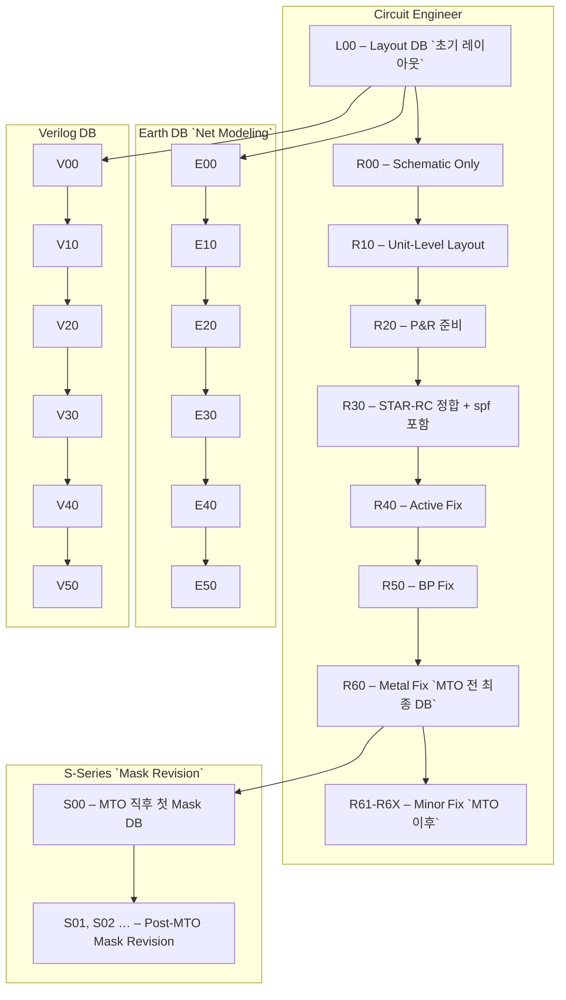

2. R‑Series (Layout Revision DB)
리비전	발행 시점·조건	주요 내용·추가 / 변경	비고
R00	회로 스키매틱이 완성된 직후	Schematic Only – Layout 전 단계	설계 시작점
R10	Unit‑Level 레이아웃 초안(셀·블록 배치) 완료	기본 Placement 확보, 간단한 DRC 통과	설계·레이아웃 병행 시작
R20	P&R 전 사전 검증 완료	Placement & Routing 규칙 정의, Power‑Net 초기 설계	P&R 진행 전 체크리스트 통과
R30	STAR‑RC DB와 정합 확보, spf(Standard Parasitic Format) 포함	레이아웃이 대략 완성, RC 추출(SPF) 가능	이후 Fix 단계로 이동
R40	Active Fix 적용, DRC/IR‑Drop 등 오류 수정	배선·패턴 세부 수정, 신호 무결성 보강	품질 향상 단계
R50	BP‑Fix(Back‑Power?) 적용	전원·배터리 네트워크 최적화, 전압‑전류 분배 검증	전력 설계와 연계
R60	Metal‑Fix 완료 + MTO 전 최종 검증	MTO 전 최종 Metal Layout, 모든 DRC/LVS/DFM 통과	양산 전 마지막 리비전
R61‑R6X	MTO 이후 소규모 수정(버그, 마스크 리워크)	기존 R60 DB 를 베이스로 하는 마이너 리비전	번호가 순차적으로 증가
R31‑R3x (Minor)	주요 리비전 사이에 발생하는 작은 변경	실수·버그 수정용 임시 DB	공식 리비전(R40, R50…) 과 구분

핵심 포인트

R30부터 spf(Standard Parasitic Format)와 STAR‑RC가 포함돼 레이아웃 완성도가 크게 올라갑니다.
R40 ~ R60은 Fix 단계(Active, BP, Metal)이며, 각각 배선·전원·Metal에 대한 세부 교정 작업을 의미합니다.
R60은 MTO 전 최종 DB이며, 양산 마스크 제작 직전까지 검증을 마칩니다.

3. E‑Series (Earth Parasitic DB)
DB	발행 시점	목적	주요 포맷·툴
E00	L00(Layout DB) 혹은 R00 이후, Layout이 없을 때	Pin‑to‑Pin RC 모델을 제공해 회로 엔지니어가 전력·타이밍 분석을 수행할 수 있게 함	Earth Tool → SPF(Standard Parasitic Format)
E10, E20, E30 …	레이아웃이 R20‑R40 수준에 도달할 때마다	RC delay·전력 시뮬레이션 업데이트(전력‑노이즈·IR‑Drop 등)	SPF → SPEF(ASCII) → GPD(Binary)
E40, E50	R50‑R60 단계( BP Fix / Metal Fix ) 반영 후	전력‑노이즈·IR‑Drop 분석, Noise‑Sim Deck 생성	SPF → RSPF(Reduced SPF)

특징

Earth DB는 Layout이 존재하지 않을 때 회로 엔지니어가 사용할 Net‑Modeling DB입니다.
일반 스키매틱에서는 Net → Pin 으로 바로 연결되지만, Earth DB에서는 Pin → RC Model → Pin 흐름을 거쳐야 하므로, RC 정보가 직접 포함됩니다.
R‑Series는 Layout Engineer가 참고하는 Reference DB이며, Earth DB는 Circuit Engineer 전용으로 구

4. V‑Series (Verilog Verification DB)
DB	발행 시점	목적	주요 툴·포맷
V00	R00 혹은 R10 단계 (스키매틱 뒤)	기본 Verilog Netlist 구축, 초기 기능 검증	Verilog Netlist
V10, V20, V30 …	레이아웃·Fix 단계가 진행될 때마다	타이밍·전력 업데이트, Gate‑level 시뮬레이션	VG(Verilog‑Gate)
V40, V50	R40‑R60 단계에서 Active Fix / BP Fix 반영 후	정밀 타이밍·노이즈 검증, DFM 검증 포함	Verilog‑Back‑Annotation (RSPF)
V‑DB는 R/E DB 를 기반으로 Back‑annotation된 파라시틱 정보를 이용해 STA 및 Signal‑Integrity 분석을 수행합니다.

5. S‑Series (Mask‑Revision DB)
리비전	발행 시점·조건	내용·특징
S00	MTO(양산 마스크) 완료 직후(양산 전)	최초 양산용 Mask DB. 설계자는 SMAIN(현재 최신 DB)으로 작업합니다.
S01, S02, …	MTO 이후 마스크 수정(결함 보정, 레이어 추가 등) 필요 시	번호가 순차적으로 증가하며, 각 버전은 별도 DB 로 관리됩니다.
SMAIN	언제나 가장 최신 S‑DB 를 의미	개발 브랜치와 동일하게 생각하면 되며, 새로운 수정이 완료되면 새로운 Sxx 를 발행합니다.

예시 흐름

MTO → S00 발행 (양산 마스크 최초)
마스크 결함 발견 → S01 발행 (첫 번째 마스크 수정) → SMAIN 업데이트
추가 변경 → S02, S03 … 순차 발행

📌 요약 체크리스트 (리비전 발행 전)
단계	확인 항목
R00	스키매틱 완전성, 전압·전류 스펙 정의
R10	Unit‑level 배치, 기본 DRC 통과
R20	P&R 규칙 정의, Power‑Net 초기 설계
R30	STAR‑RC 정합, SPF 추출 완료
R40	Active Fix 적용, DRC/IR‑Drop 재검증
R50	BP Fix 적용, 전력‑노이즈 시뮬레이션
R60	Metal Fix 완료, 모든 DRC/LVS/DFM 통과 (MTO 전 최종)
E‑Series	RC 망 (SPF) 추출, Back‑annotation용 파일 생성
V‑Series	Verilog Netlist 업데이트, STA Back‑annotation 적용
S‑Series	Mask Defect 수정 > 신규 Sxx 발행, SMAIN 업데이트