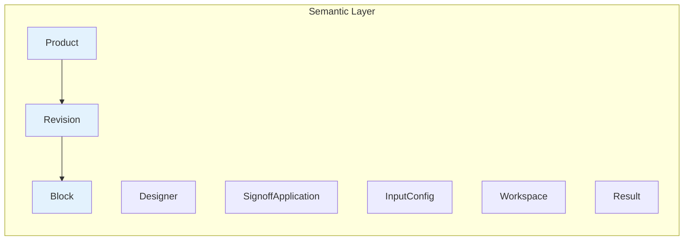
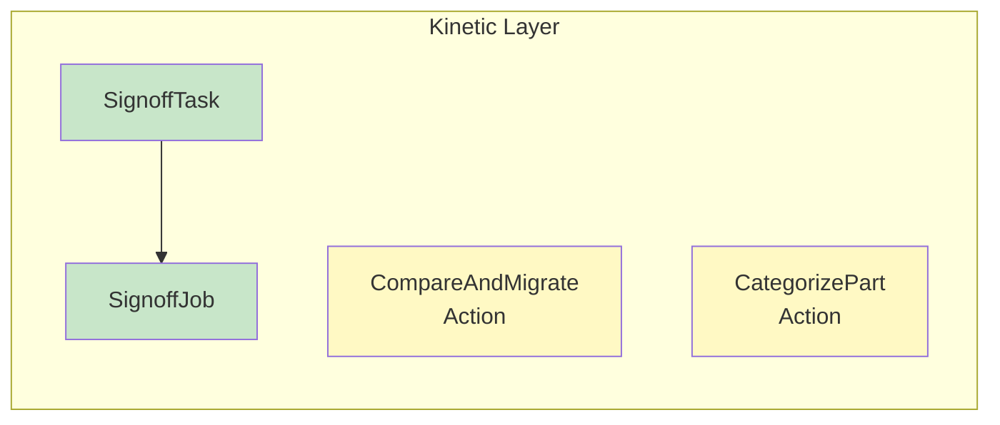
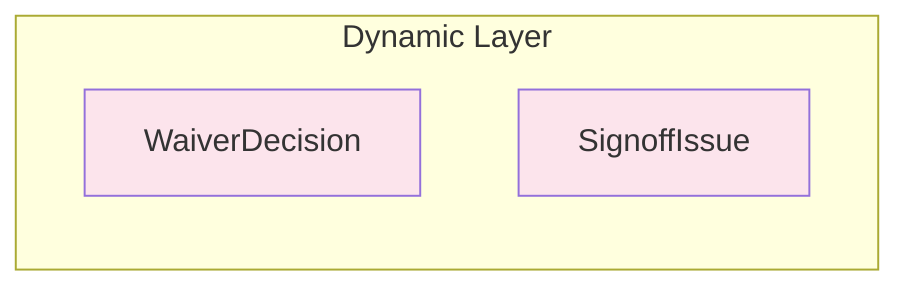
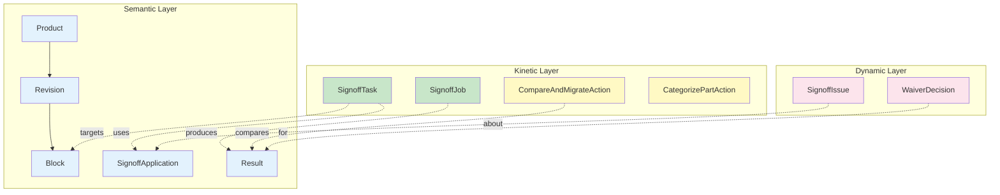
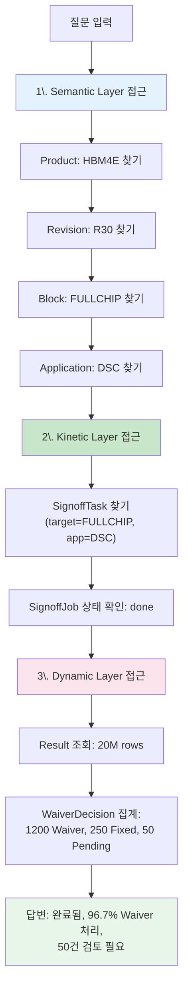
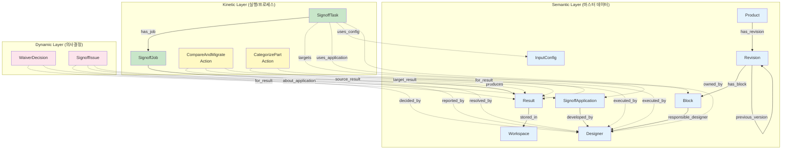
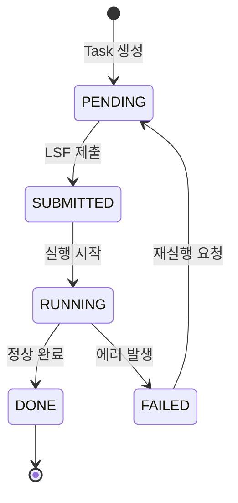
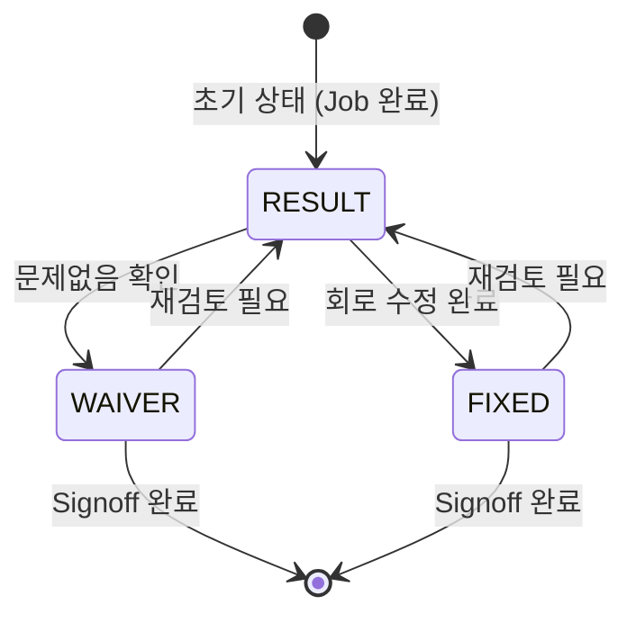
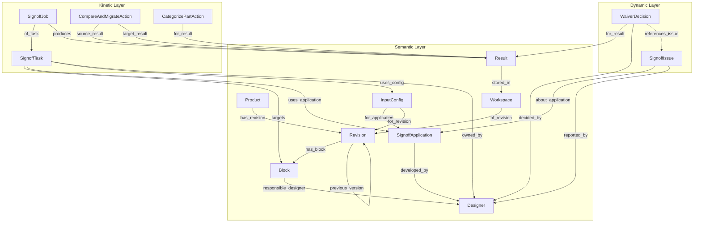

## 1. Executive Summary

### 1.1 프로젝트 비전

**"Human-Out-Of-The-Loop Signoff"** 실현을 위한 Ontology 기반 차세대 Signoff Platform 구축

### 1.2 현재 시스템의 근본적 한계

현재 Signoff Flow는 각각의 모듈들이 독립적으로 운영되며 파편화된 **파일 기반 데이터**들로 동작하고 있습니다. 실행 스크립트와 결과 파일 등 **데이터**는 남지만, 그 데이터의 **맥락과 의미**(어떤 설계 버전의 어떤 블록에 대한 어떤 검증인지, 왜 그런 결과가 나왔는지 등)는 시스템에 녹아들지 못합니다. 예를 들어 결과 CSV 파일 경로(`/user/프로젝트/R30/DSC/result.csv`)만으로는 **무슨 내용의 결과인지, 어떤 관계의 데이터인지** 파악하는데 한계가 있습니다. 이로 인해 다음과 같은 문제가 발생합니다:

- **Context 손실:** 설계 변경 이력, 입력 조건, Waiver 판단 근거 등 **문맥 정보가 파일 밖에 존재**하여 공유되지 않습니다. 중앙 Workspace와 로컬 작업 폴더로 **작업공간이 이원화**되어, 어떤 설정과 환경에서 실행됐는지 추적하기 어렵습니다. 그 결과 결과 해석이나 문제 원인 파악에 일일이 담당자의 기억과 메모에 의존하게 됩니다.
- **재현 및 추적 불가:** 현재 어떤 설정으로 검증이 수행되었는지 시스템이 모르기 때문에, 동일 조건으로 다시 실행하거나 결과를 **재현**하기 어렵습니다. 과거 특정 이력 추적 "왜 Error가 생기지?" "누가 Waiver했지?", "어떤 입력으로 수행했지?"와 같은 질문에 답하려 해도, **기록이 남지 않아 추적하기 어려운** 상황입니다. 이는 검증 결과의 **재현성과 신뢰성**을 저해합니다.
- **자동화의 어려움:** **Signoff Agent**를 지향하지만, 의미 정보 부재로 인해 자동화가 구조적으로 불가능합니다. 데이터 간 **관계가 정의되지 않아** 입력 파일들을 자동으로 세팅할 수 없고, **이벤트 트리거**를 인식하지 못해 설계 변경 시 자동 실행이 안 되며, 과거 오류 패턴을 학습시키지 못해 **AI 활용**도 제한됩니다. 결국 사람의 수작업과 판단 없이는 프로세스 진행이 막히는 것입니다.

이러한 _"데이터는 있으나 의미는 없는"_ 갭을 해결하기 위해 **온톨로지(Ontology)** 개념을 도입합니다.


### 1.2 온톨로지 도입 목표

**온톨로지(Ontology)**는 Signoff 업무의 **핵심 개체(Object)와 그들 간의 관계(Relationship)**를 명시적으로 정의하여, 시스템이 데이터의 **의미와 맥락**을 이해할 수 있게 합니다.

| 구분          | 현재 (파일 기반)   | 온톨로지 도입 후      |
| ----------- | ------------ | -------------- |
| **데이터 저장**  | 파일 경로, 실행 결과 | 객체 + 속성 + 관계   |
| **의미 이해**   | ❌ 불가능        | ✅ (AI) 시스템이 이해 |
| **자동화 가능성** | 수동 설정 필수     | 규칙 기반 자동 실행    |
| **지식 축적**   | 개인 경험에 의존    | 조직 지식으로 체계화    |


### 1.3 핵심 전략: Palantir 3-Layer Ontology

```
┌─────────────────────────────────────────────────────────────┐
│  🎯 Dynamic Layer (의사결정 계층)                            │
│  WaiverDecision, SignoffIssue                               │
│  → "어떤 판단이 내려졌는가?" - AI 학습 대상                    │
├─────────────────────────────────────────────────────────────┤
│  ⚡ Kinetic Layer (실행 계층)                                │
│  SignoffTask, SignoffJob, CompareAndMigrateAction,          │
│  CategorizePartAction                                       │
│  → "어떻게 실행되는가?" - 프로세스 추적                        │
├─────────────────────────────────────────────────────────────┤
│  📚 Semantic Layer (의미 계층)                               │
│  Product, Revision, Block, Designer, SignoffApplication,    │
│  InputConfig, Workspace, Result                             │
│  → "무엇이 있는가?" - 마스터 데이터                           │
└─────────────────────────────────────────────────────────────┘
```

---

## 2. Ontology 도입 배경 및 필요성

### 2.1 현재 시스템의 근본적 한계

#### 2.1.1 파일 기반 아키텍처의 문제

#### 2.1.2 구체적 Pain Point

**Pain Point 1: Power 정의 오류 (재실행율 ~50%)**

```
시나리오: DSC 실행

1. 설계자가 입력(Netlist, Power) 파일 경로 입력
2. 시스템: 파일 존재 여부만 확인 ✓
3. 실행 시작... (10시간 소요: Power 의심 net들에 대한 Power정의 누락 Warning, Power 정의가 재대로 안되어있어서 CCC 알고리즘 수행시간이 오래 걸리고 가성 결과도 많이 생기게됨.)
4. 결과: 1000개 Violation (대부분 Power 누락으로 인한 가성)
5. Power 파일 수정 후 재실행... (또 5시간)

→ 총 10시간 + 분석 시간 낭비
```

**Pain Point 2: Waiver 일관성 부족**

```
동일한 Violation에 대해:

설계자 A (R30, 신입): 
  → Waiver 처리, 근거 미기록

설계자 B (R40, 경력자): 
  → Fixed 처리, "기준 미달"

문제:
- 왜 판단이 다른가? → 알 수 없음
- 어느 쪽이 맞는가? → 확인 불가
- 표준 기준은? → 문서화 안 됨
```

**Pain Point 3: 협업 정보의 시스템 외부화**

```
Signoff 협업 현황:

1. Categorize Part 후 담당자 할당
   → 메신저로 통보 (시스템 외부)
   
2. Waiver 판단 협의
   → 회의/메신저 (기록 안 됨)

결과: 
- 실제 분석 & 커뮤니케이션 오버헤드

```

### 2.2 왜 Ontology인가?

#### 2.2.1 Ontology의 본질

> **Ontology = 데이터 + 의미 + 관계의 통합**

```
파일 기반:
┌──────────────────┐
│ result.csv       │
│ ─────────────    │
│ net,driver,value │
│ CLK,NMOS,2.0um   │  ← 숫자만 있음, 의미 없음
└──────────────────┘

Ontology 기반:
┌──────────────────────────────────────────────────────┐
│ Result Object                                        │
│ ─────────────────────────────────────────────────    │
│ • 소속: HBM4E → R30 → FULLCHIP → DSC                 │
│ • 담당자: 김설계                                      │
│ • 이전 Revision: R29에서 동일 케이스 Waiver 처리됨     │
│ • Power 검증: VDD_PERI 누락 경고                      │
│ • AI 추천: 92% 확률로 Waiver 가능                     │
└──────────────────────────────────────────────────────┘
```

#### 2.2.2 스크립트 자동화 vs Ontology

**"스크립트로 자동화하면 되지 않나요?"**

| 관점          | 스크립트 자동화               | Ontology + AI Agent   |
| ----------- | ---------------------- | --------------------- |
| **새 제품 추가** | 스크립트 복사/수정 필요          | 데이터만 추가하면 끝           |
| **에러 대응**   | case문 추가 (정확히 매칭되어야 함) | 맥락 기반 유사 사례 검색        |
| **현황 파악**   | 개별 스크립트 실행 후 수동 취합     | 통합 쿼리 한 번으로 완료        |
| **지식 축적**   | 담당자 머릿속에만 존재           | 시스템에 구조화되어 저장         |
| **확장성**     | 선형 증가 (기능당 스크립트 추가)    | 로그 증가 (Object 추가로 해결) |

**구체적 비교: 에러 대응**

```bash
# 스크립트 방식
case $ERROR_CODE in
  "PWR001") echo "Power 파일 확인하세요" ;;
  "MEM001") echo "Block 분할하세요" ;;
  *) echo "알 수 없는 에러" ;;  # 새 에러는 대응 불가
esac
```

```
# Ontology + AI Agent 방식
사용자: "Segfault 에러가 떴어요"

AI Agent:
1. SignoffIssue에서 유사 에러 검색
2. 현재 Job 정보 조회 → Block="FULLCHIP", instance=10M
3. 과거 해결 사례 분석 → 5건 중 4건이 Block 분할로 해결

응답:
"FULLCHIP의 트랜지스터 수가 약 1,000만 개로 매우 큽니다.
과거 HBM4E에서 동일 문제가 5건 발생했고, 
4건은 Block 분할(Core/NoCore/PAD)로 해결되었습니다.
분할 방법을 안내해 드릴까요?"
```

### 2.3 Ontology vs 기존 데이터 관리 도구

#### 2.3.1 ICM (IC Manage: Design Data Management)과의 차이

| 구분        | ICM                        | Signoff Ontology            |
| --------- | -------------------------- | --------------------------- |
| **목적**    | 설계 파일 버전 관리                | Signoff 프로세스 전체 관리          |
| **대상**    | Netlist, Schematic 등 설계 파일 | Task, Result, Waiver, Issue |
| **관계 표현** | 파일 간 의존성                   | 의미적 관계 (누가, 언제, 왜)          |
| **쿼리**    | 파일 경로 기반                   | 의미 기반 ("R30 DSC 진행률은?")     |
| **AI 연동** | 불가능                        | 자연스러운 통합                    |

#### 2.3.2 일반 Database와의 차이

| 구분       | 관계형 DB              | Signoff Ontology |
| -------- | ------------------- | ---------------- |
| **스키마**  | 정적, 변경 어려움          | 동적, 확장 용이        |
| **관계**   | Foreign Key (단순 참조) | Link (의미적 관계)    |
| **쿼리**   | SQL (기술자만 가능)       | 자연어 + AI Agent   |
| **컨텍스트** | 없음                  | 비즈니스 맥락 내장       |

#### 2.3.3 RAG (Retrieval-Augmented Generation)와의 차이

| 구분           | RAG            | Ontology + AI Agent   |
| ------------ | -------------- | --------------------- |
| **데이터 형태**   | 비정형 텍스트 (문서)   | 구조화된 Object + 관계      |
| **질의 방식**    | 유사 문서 검색       | 관계 탐색 + 정확한 쿼리        |
| **실시간 데이터**  | ❌ (문서 업데이트 필요) | ✅ (DB에서 직접 조회)        |
| **관계 기반 분석** | ❌              | ✅ ("이전 Revision과 비교") |
| **적합한 용도**   | 매뉴얼 검색, FAQ    | 현황 조회, 비교 분석, 가이드     |

> **결론:** RAG는 문서 검색에 유용하지만, Signoff 업무의 **실시간 현황 파악, 관계 기반 분석, 구조화된 쿼리**에는 Ontology가 필수입니다.

---

## 3. Palantir 3-Layer Architecture 개요

### 3.1 왜 3개 층으로 나누는가?

Palantir의 Ontology는 단순히 데이터를 정리하는 것을 넘어, **현실 세계를 디지털로 완벽하게 표현**합니다.

```
현실 세계의 3가지 측면:

1. 존재 (Being)     → Semantic Layer
   "무엇이 있는가?"
   
2. 행동 (Doing)     → Kinetic Layer  
   "어떻게 실행되는가?"
   
3. 변화 (Becoming)  → Dynamic Layer
   "어떤 판단이 내려지는가?"
```

### 3.2 각 Layer의 역할

#### 3.2.1 Semantic Layer (의미 계층)

**"무엇이 있는가?" - 정적 마스터 데이터**



**특징:**

- 거의 변하지 않는 **마스터 데이터**
- 조직의 **디지털 트윈** 역할
- 모든 다른 Layer의 **기반**

**Signoff 예시:**

- Product: "HBM4E32GWG" (제품명)
- Revision: "R30" (설계 버전)
- Block: "FULLCHIP", "CORE", "PAD" (회로 영역)
- Result: Signoff 수행 결과 (100만+ rows)

#### 3.2.2 Kinetic Layer (실행 계층)

**"어떻게 실행되는가?" - 프로세스 및 액션**



**특징:**

- **상태 변화** 추적 (pending → running → done)
- **실행 이력** 기록 (누가, 언제, 무엇을)
- Launcher의 **모든 액션**이 자동 기록됨

**Signoff 예시:**

- SignoffTask: "HBM4E R30 FULLCHIP에 DSC 수행"
- SignoffJob: 실제 LSF Job 실행 인스턴스
- CompareAndMigrateAction: 이전 Revision과 비교 + Waiver 이관
- CategorizePartAction: Part 담당자 할당

#### 3.2.3 Dynamic Layer (의사결정 계층)

**"어떤 판단이 내려졌는가?" - 의사결정 및 변화 이력**



**특징:**

- **의사결정 기록** (Waiver 판단 근거)
- **문제 해결 이력** (Issue → Resolution)
- **AI 학습 대상** (패턴 인식, 추천)

**Signoff 예시:**

- WaiverDecision: "이 Violation을 Waiver 처리, 근거: CLK Buffer design intent"
- SignoffIssue: "Segfault 에러 → Block 분할로 해결"

### 3.3 3-Layer의 상호작용



### 3.4 실제 질문 처리 예시

**질문: "HBM4E R30 FULLCHIP DSC 현황이 어떻게 되나요?"**



---

## 4. Signoff Ontology 전체 구조

### 4.1 Object Type 전체 목록

| Layer        | Object Type             | 역할                       | 변경 빈도   |
| ------------ | ----------------------- | ------------------------ | ------- |
| **Semantic** | Product                 | 메모리 제품 (HBM4E, DDR5 등)   | 거의 없음   |
|              | Revision                | 설계 버전 (R00~R60)          | 낮음      |
|              | Block                   | 회로 영역 (FULLCHIP, CORE 등) | 낮음      |
|              | Designer                | 설계자/담당자                  | 낮음      |
|              | SignoffApplication      | 검증 도구 (DSC, LSC 등 19종)   | 거의 없음   |
|              | InputConfig             | 입력 설정 (Power, Netlist 등) | 중간      |
|              | Workspace               | 작업 공간 (Local/Central)    | 낮음      |
|              | Result                  | Signoff 결과 데이터           | 높음 (내용) |
| **Kinetic**  | SignoffTask             | 작업 계획 단위                 | 중간      |
|              | SignoffJob              | LSF 실행 인스턴스              | 높음      |
|              | CompareAndMigrateAction | 비교 + Waiver 이관 액션        | 중간      |
|              | CategorizePartAction    | Part 담당자 할당 액션           | 중간      |
| **Dynamic**  | WaiverDecision          | Waiver 의사결정 이력           | 높음      |
|              | SignoffIssue            | 문의/해결 이력                 | 중간      |

### 4.2 전체 관계도



---

## 5. Semantic Layer 상세 설계

> **Semantic Layer**: "무엇이 있는가?" - 거의 변하지 않는 마스터 데이터

### 5.1 Product (제품)

**역할:** 메모리 제품의 최상위 개체. HBM4E, DDR5, LPDDR5 등의 제품을 표현.

**Layer:** Semantic

#### Properties

|속성명|타입|필수|기본값|설명|예시|
|---|---|---|---|---|---|
|`product_id`|VARCHAR(50)|✅|-|제품 고유 식별자|"HBM4E32GWG"|
|`product_name`|VARCHAR(200)|✅|-|제품 전체 이름|"HBM4E 32GB Wide I/O"|
|`product_type`|ENUM|✅|-|제품 종류|DRAM / HBM / FLASH|
|`development_status`|ENUM|❌|"Development"|개발 상태|Planning / Development / Production|
|`tapeout_date`|DATE|❌|NULL|Tape-out 예정/완료일|"2025-12-01"|
|`description`|TEXT|❌|NULL|제품 설명|-|
|`created_at`|TIMESTAMP|✅|CURRENT_TIMESTAMP|생성 시각|-|
|`updated_at`|TIMESTAMP|✅|CURRENT_TIMESTAMP|수정 시각|-|

#### Links

|관계명|방향|대상|카디널리티|설명|
|---|---|---|---|---|
|`has_revision`|→|Revision|1:N|이 제품의 설계 버전들|
|`managed_by`|→|Designer|N:M|제품 담당 관리자들|

#### 예시 데이터

```json
{
  "product_id": "HBM4E32GWG",
  "product_name": "HBM4E 32GB Wide I/O DRAM",
  "product_type": "HBM",
  "development_status": "Development",
  "tapeout_date": "2025-12-01",
  "description": "차세대 고대역폭 메모리"
}
```

---

### 5.2 Revision (설계 버전)

**역할:** 제품의 설계 버전. R00~R60까지 진행되며, 각 Revision은 이전 버전을 기반으로 개선됨.

**Layer:** Semantic

#### Properties

| 속성명                     | 타입          | 필수  | 기본값               | 설명                        | 예시                                    |
| ----------------------- | ----------- | --- | ----------------- | ------------------------- | ------------------------------------- |
| `revision_id`           | VARCHAR(50) | ✅   | -                 | Revision 고유 ID            | "HBM4E32GWG_R30"                      |
| `product_id`            | VARCHAR(50) | ✅   | -                 | 소속 제품 ID (FK)             | "HBM4E32GWG"                          |
| `revision_name`         | VARCHAR(10) | ✅   | -                 | 버전 번호                     | "R30"                                 |
| `revision_status`       | ENUM        | ✅   | "Active"          | 상태                        | Planning / Active / Frozen / Archived |
| `start_date`            | DATE        | ❌   | NULL              | Revision 시작일              | "2025-01-15"                          |
| `target_date`           | DATE        | ❌   | NULL              | 목표 완료일                    | "2025-03-30"                          |
| `required_applications` | JSON        | ❌   | NULL              | 필수 Signoff Application 목록 | ["DSC", "LSC", "LS"]                  |
| `created_at`            | TIMESTAMP   | ✅   | CURRENT_TIMESTAMP | 생성 시각                     | -                                     |
| `updated_at`            | TIMESTAMP   | ✅   | CURRENT_TIMESTAMP | 수정 시각                     | -                                     |

#### Links

|관계명|방향|대상|카디널리티|설명|
|---|---|---|---|---|
|`of_product`|→|Product|N:1|소속 제품|
|`has_block`|→|Block|1:N|이 Revision의 Block들|
|`previous_version`|→|Revision|N:1|이전 Revision|
|`has_task`|→|SignoffTask|1:N|생성된 Signoff 작업들|

#### 예시 데이터

```json
{
  "revision_id": "HBM4E32GWG_R30",
  "product_id": "HBM4E32GWG",
  "revision_number": "R30",
  "revision_status": "Active",
  "start_date": "2025-01-15",
  "target_date": "2025-03-30",
  "required_applications": ["DSC", "LSC", "LS", "Cana-TR", "CDA"]
}
```

---

### 5.3 Block (회로 영역)

**역할:** 회로를 논리적으로 분할한 영역. FULLCHIP, CORE, PAD 등으로 나뉘며, 계층 구조를 가짐.

**Layer:** Semantic

#### Properties

| 속성명              | 타입           | 필수  | 기본값               | 설명                  | 예시                            |
| ---------------- | ------------ | --- | ----------------- | ------------------- | ----------------------------- |
| `block_id`       | VARCHAR(100) | ✅   | -                 | Block 고유 ID         | "HBM4E_R30_FULLCHIP"          |
| `revision_id`    | VARCHAR(50)  | ✅   | -                 | 소속 Revision ID (FK) | "HBM4E32GWG_R30"              |
| `block_name`     | VARCHAR(100) | ✅   | -                 | Block 이름            | "FULLCHIP"                    |
| `hierarchy_path` | VARCHAR(500) | ❌   | NULL              | 계층 경로               | "/FULLCHIP/CORE/CPU"          |
| `instance_count` | INTEGER      | ❌   | NULL              | 트랜지스터/인스턴스 수        | 10000000                      |
| `netlist_path`   | VARCHAR(500) | ❌   | NULL              | Netlist 파일 경로       | "/proj/HBM4E/R30/netlist/..." |
| `created_at`     | TIMESTAMP    | ✅   | CURRENT_TIMESTAMP | 생성 시각               | -                             |
| `updated_at`     | TIMESTAMP    | ✅   | CURRENT_TIMESTAMP | 수정 시각               | -                             |

#### Links

| 관계명                    | 방향  | 대상       | 카디널리티 | 설명          |
| ---------------------- | --- | -------- | ----- | ----------- |
| `of_revision`          | →   | Revision | N:1   | 소속 Revision |
| `parent_block`         | →   | Block    | N:1   | 상위 Block    |
| `child_blocks`         | →   | Block    | 1:N   | 하위 Block들   |
| `responsible_designer` | →   | Designer | N:1   | 담당 설계자      |

#### 예시 데이터

```json
{
  "block_id": "HBM4E_R30_FULLCHIP",
  "revision_id": "HBM4E32GWG_R30",
  "block_name": "FULLCHIP",
  "block_type": "TOP",
  "hierarchy_path": "/FULLCHIP",
  "instance_count": 10000000
}
```

---

### 5.4 Designer (설계자/담당자)

**역할:** 설계자, 검증 담당자, Tool 개발자 등 사람의 정보. 책임 추적과 협업에 활용.

**Layer:** Semantic

#### Properties

| 속성명               | 타입           | 필수  | 기본값               | 설명               | 예시                                    |
| ----------------- | ------------ | --- | ----------------- | ---------------- | ------------------------------------- |
| `designer_id`     | VARCHAR(50)  | ✅   | -                 | 설계자 고유 ID (사번 등) | "EMP_12345"                           |
| `name`            | VARCHAR(100) | ✅   | -                 | 이름               | "김설계"                                 |
| `email`           | VARCHAR(200) | ✅   | -                 | 이메일              | "kim@samsung.com"                     |
| `team`            | VARCHAR(100) | ✅   | -                 | 소속 팀             | "Memory Design Team A"                |
| `role`            | ENUM         | ❌   | "Engineer"        | 역할               | Engineer / Lead / Manager / Developer |
| `expertise_areas` | JSON         | ❌   | NULL              | 전문 분야            | ["DSC", "LSC", "Power Analysis"]      |
| `is_active`       | BOOLEAN      | ✅   | TRUE              | 활성 상태            | TRUE                                  |
| `created_at`      | TIMESTAMP    | ✅   | CURRENT_TIMESTAMP | 생성 시각            | -                                     |
| `updated_at`      | TIMESTAMP    | ✅   | CURRENT_TIMESTAMP | 수정 시각            | -                                     |

#### Links

|관계명|방향|대상|카디널리티|설명|
|---|---|---|---|---|
|`responsible_for`|→|Block|N:M|담당 Block들|
|`manages`|→|Product|N:M|관리하는 제품들|
|`develops`|→|SignoffApplication|1:N|개발 담당 Application|

---

### 5.5 SignoffApplication (검증 도구)

**역할:** 19개 Signoff Application(DSC, LSC, LS 등)의 정의 및 메타 정보.

**Layer:** Semantic

#### Properties

| 속성명                 | 타입           | 필수  | 기본값               | 설명                  | 예시                                |
| ------------------- | ------------ | --- | ----------------- | ------------------- | --------------------------------- |
| `app_id`            | VARCHAR(20)  | ✅   | -                 | Application 고유 ID   | "DSC"                             |
| `app_name`          | VARCHAR(100) | ✅   | -                 | 전체 이름               | "Driver Size Checker"             |
| `app_category`      | ENUM         | ✅   | -                 | 분류                  | Static / Dynamic / Timing / Power |
| `engine_type`       | ENUM         | ✅   | -                 | 엔진 종류               | SPACE / ADV / External            |
| `description`       | TEXT         | ❌   | NULL              | 설명                  | "Driver 크기 검증"                    |
| `version`           | VARCHAR(20)  | ❌   | NULL              | 현재 버전               | "3.2.1"                           |
| `execution_phase`   | JSON         | ❌   | NULL              | 수행 시점 (Revision 범위) | ["R20", "R60"]                    |
| `required_inputs`   | JSON         | ❌   | NULL              | 필수 입력               | ["netlist", "power_definition"]   |
| `comparison_key`    | STRING       | ✅   | -                 | 비교/Migration 기준 키   | `"measure_net + driver_net"`      |
| `developer`         | STRING       | ✅   | -                 | 담당 개발자 ID           | `"deepwonwoo"`                    |
| `manual_url`        | STRING       | ❌   | -                 | 매뉴얼 URL             |                                   |
| `avg_runtime_hours` | FLOAT        | ❌   | NULL              | 평균 실행 시간            | 2.5                               |
| `created_at`        | TIMESTAMP    | ✅   | CURRENT_TIMESTAMP | 생성 시각               | -                                 |
| `updated_at`        | TIMESTAMP    | ✅   | CURRENT_TIMESTAMP | 수정 시각               | -                                 |

#### Links

|관계명|방향|대상|카디널리티|설명|
|---|---|---|---|---|
|`developed_by`|→|Designer|N:1|담당 개발자|
|`used_by_task`|→|SignoffTask|1:N|사용하는 Task들|

#### 16종 Application 목록

| ID              | 이름                           | 엔진        | 카테고리          |
| --------------- | ---------------------------- | --------- | ------------- |
| DSC             | Driver Size Check            | SPACE     | Static        |
| LSC             | Latch Setup Check            | SPACE     | Static        |
| LS              | Level Shifter                | SPACE     | Static        |
| Cana-TR         | Coupling Analysis TR         | SPACE     | Static        |
| CDA             | Coupling Delay Analysis      | SPACE     | Timing        |
| PEC             | Power/ESD Checker            | SPACE     | Power         |
| PN_Ratio        | PN Ratio Checker             | PERC      | Static        |
| FO_Check        | Fan-Out Checker              | PERC      | Static        |
| DC_Path         | DC Path Checker              | PRIMESIM  | Static        |
| Float_Node      | Floating Node Checker        | SPACE     | Static        |
| ADV_Margin      | ADV Margin Analyzer          | ADV       | Dynamic       |
| DriverKeeper    | Driver Keeper                | ADV       | Dynamic       |
| Glitch          | Glitch Margin                | ADV       | Dynamic       |
| Dynamic_DC_PATH | Dynamic DC Path              | SPACE     | Dynamic       |
| CurrentAnalyzer | Current Analyzer             | ADV       | Dynamic       |
| PT_SINGOFF      | Gate-level STA               | PRIMETIME | Timing        |
| BA_DUMP_NETLIST | Back Annotation DUMP NETLIST | PRIMESIM  | Preprocessing |
| VOLTAGE_FINDER  | Voltage power finder         | PRIMESIM  | Preprocessing |
|                 |                              |           |               |


---

### 5.6 InputConfig (입력 설정)

**역할:** Signoff 실행에 필요한 입력 파일 및 설정 정보. Power 정의, Netlist 경로, MP 파일 등을 관리.

**Layer:** Semantic

#### Properties

| 속성명                  | 타입           | 필수  | 기본값               | 설명                  | 예시                                                |
| -------------------- | ------------ | --- | ----------------- | ------------------- | ------------------------------------------------- |
| `config_id`          | VARCHAR(100) | ✅   | -                 | Config 고유 ID        | "CFG_DSC_HBM4E_R30_001"                           |
| `edr_file`           | STRING       | ✅   | -                 | EDR 파일 경로           | `"/path/fullchip_EDR"`                            |
| `app_id`             | VARCHAR(20)  | ✅   | -                 | 대상 Application (FK) | "DSC"                                             |
| `revision_id`        | VARCHAR(50)  | ❌   | NULL              | 대상 Revision (FK)    | "HBM4E32GWG_R30"                                  |
| `netlist_path`       | VARCHAR(500) | ❌   | NULL              | Netlist 파일 경로       | "/proj/.../netlist.sp"                            |
| `power_definition`   | JSON         | ❌   | NULL              | Power 정의            | `{"VDD": ["VDD_CORE", "VDD_IO"], "GND": ["VSS"]}` |
| `mp_file_path`       | VARCHAR(500) | ❌   | NULL              | MP 파일 경로            | "/proj/.../mp.tech"                               |
| `corner_settings`    | JSON         | ❌   | NULL              | Corner 설정           | {"temp": "125C", "voltage": "0.9V"}               |
| `additional_options` | JSON         | ❌   | NULL              | 추가 옵션               | {"EDR": true, "parallel": 4}                      |
| `is_validated`       | BOOLEAN      | ✅   | FALSE             | 검증 완료 여부            | TRUE                                              |
| `validation_result`  | JSON         | ❌   | NULL              | 검증 결과               | {"power_completeness": 98}                        |
| `created_by`         | VARCHAR(50)  | ✅   | -                 | 생성자 ID (FK)         | "EMP_12345"                                       |
| `created_at`         | TIMESTAMP    | ✅   | CURRENT_TIMESTAMP | 생성 시각               | -                                                 |
| `updated_at`         | TIMESTAMP    | ✅   | CURRENT_TIMESTAMP | 수정 시각               | -                                                 |

#### Links

|관계명|방향|대상|카디널리티|설명|
|---|---|---|---|---|
|`for_application`|→|SignoffApplication|N:1|대상 Application|
|`for_revision`|→|Revision|N:1|대상 Revision|
|`created_by`|→|Designer|N:1|생성자|
|`used_by_task`|→|SignoffTask|1:N|사용하는 Task들|

---

### 5.7 Workspace (작업 공간)

**역할:** Signoff 실행 및 결과 저장 공간. Local(개인)과 Central(공유) 두 유형 존재.

**Layer:** Semantic

#### Properties

| 속성명               | 타입           | 필수  | 기본값               | 설명                 | 예시                                                  |
| ----------------- | ------------ | --- | ----------------- | ------------------ | --------------------------------------------------- |
| `workspace_id`    | VARCHAR(100) | ✅   | -                 | Workspace 고유 ID    | "WS_DSC_HBM4E_R30_FULLCHIP"                         |
| `local_path`      | STRING       | ✅   |                   | Local 작업 경로        | `"/user/HBM4E/VERIFY/SIGNOFF/.../DSC_20250318/"`    |
| `central_path`    | STRING       | ✅   |                   | Central 공유 경로      | `"/WORKSPACE/HBM4E/R30/FULLCHIP/DSC/"`              |
| `job_id`          | STRING       | ✅   |                   | 소속 Job ID (FK)     | `"JOB_DSC_FULLCHIP_R30_001"`                        |
| `uploaded`        | ENUM         | ✅   |                   | 업로드 상태             | `"NOT_UPLOADED"`, `"UPLOADED"`, `"UPLOADED_FAILED"` |
| `owner_id`        | VARCHAR(50)  | ❌   | NULL              | 소유자 ID (LOCAL인 경우) | "EMP_12345"                                         |
| `storage_size_gb` | FLOAT        | ❌   | NULL              | 사용 용량 (GB)         | 15.5                                                |
| `created_at`      | TIMESTAMP    | ✅   | CURRENT_TIMESTAMP | 생성 시각              | -                                                   |
| `updated_at`      | TIMESTAMP    | ✅   | CURRENT_TIMESTAMP | 수정 시각              | -                                                   |

#### Links

|관계명|방향|대상|카디널리티|설명|
|---|---|---|---|---|
|`of_product`|→|Product|N:1|소속 제품|
|`of_revision`|→|Revision|N:1|소속 Revision|
|`of_block`|→|Block|N:1|소속 Block|
|`for_application`|→|SignoffApplication|N:1|대상 Application|
|`owned_by`|→|Designer|N:1|소유자 (LOCAL)|
|`stores_result`|→|Result|1:N|저장된 Result들|

---

### 5.8 Result (Signoff 결과)

**역할:** Signoff 수행 후 생성된 결과 데이터. 수백만 row의 Violation 정보를 포함하며, Waiver 작업의 대상.

**Layer:** Semantic

> **Note:** Result의 **데이터 자체**는 Semantic Layer (존재하는 것)이고, **Waiver 상태 변경 이력**은 Dynamic Layer의 WaiverDecision으로 관리.

#### Properties

|속성명|타입|필수|기본값|설명|예시|
|---|---|---|---|---|---|
|`result_id`|VARCHAR(100)|✅|-|Result 고유 ID|"RST_DSC_HBM4E_R30_FULLCHIP_001"|
|`job_id`|VARCHAR(100)|✅|-|생성 Job ID (FK)|"JOB_DSC_001"|
|`workspace_id`|VARCHAR(100)|✅|-|저장 Workspace ID (FK)|"WS_DSC_HBM4E_R30_FULLCHIP"|
|`app_id`|VARCHAR(20)|✅|-|Application ID (FK)|"DSC"|
|`result_file_path`|VARCHAR(500)|✅|-|결과 파일 경로|"/WORKSPACE/.../result.parquet"|
|`row_count`|INTEGER|✅|-|전체 Row 수 (=Violation 수)|1500000|
|`result_status`|INTEGER|✅|0|RESULT 상태 Row 수 (미처리)|50|
|`waiver_count`|INTEGER|✅|0|WAIVER 처리된 Row 수|1200000|
|`fixed_count`|INTEGER|✅|0|FIXED 처리된 Row 수|299950|
|`waiver_progress_pct`|FLOAT|✅|0.0|Waiver 진행률 (%)|99.99|
|`has_part_column`|BOOLEAN|✅|FALSE|Part 컬럼 존재 여부|TRUE|
|`has_fullmaster_column`|BOOLEAN|✅|FALSE|FullMaster 컬럼 존재 여부|TRUE|
|`schema_info`|JSON|❌|NULL|컬럼 스키마 정보|{"columns": ["net", "driver", ...]}|
|`created_at`|TIMESTAMP|✅|CURRENT_TIMESTAMP|생성 시각|-|
|`updated_at`|TIMESTAMP|✅|CURRENT_TIMESTAMP|수정 시각|-|

#### Links

|관계명|방향|대상|카디널리티|설명|
|---|---|---|---|---|
|`produced_by`|→|SignoffJob|1:1|생성 Job|
|`stored_in`|→|Workspace|N:1|저장 Workspace|
|`for_application`|→|SignoffApplication|N:1|해당 Application|
|`has_waiver_decisions`|→|WaiverDecision|1:N|Waiver 의사결정들|
|`compared_as_source`|→|CompareAndMigrateAction|1:N|비교 Source로 사용됨|
|`compared_as_target`|→|CompareAndMigrateAction|1:N|비교 Target으로 사용됨|

---

## 6. Kinetic Layer 상세 설계

> **Kinetic Layer**: "어떻게 실행되는가?" - 프로세스, 액션, 상태 변화 추적

### 6.1 SignoffTask (작업 계획)

**역할:** Signoff 작업의 계획 단위. "어떤 Block에 어떤 Application을 수행할 것인가"를 정의.

**Layer:** Kinetic

#### Properties

|속성명|타입|필수|기본값|설명|예시|
|---|---|---|---|---|---|
|`task_id`|VARCHAR(100)|✅|-|Task 고유 ID|"TASK_DSC_HBM4E_R30_FULLCHIP"|
|`revision_id`|VARCHAR(50)|✅|-|대상 Revision ID (FK)|"HBM4E32GWG_R30"|
|`block_id`|VARCHAR(100)|✅|-|대상 Block ID (FK)|"HBM4E_R30_FULLCHIP"|
|`app_id`|VARCHAR(20)|✅|-|사용 Application ID (FK)|"DSC"|
|`config_id`|VARCHAR(100)|❌|NULL|사용 Config ID (FK)|"CFG_DSC_HBM4E_R30_001"|
|`owner_id`|VARCHAR(50)|✅|-|담당자 ID (FK)|"EMP_12345"|
|`task_status`|ENUM|✅|"PENDING"|작업 상태|PENDING / IN_PROGRESS / COMPLETED / FAILED|
|`priority`|ENUM|❌|"MEDIUM"|우선순위|LOW / MEDIUM / HIGH / CRITICAL|
|`scheduled_date`|DATE|❌|NULL|예정일|"2025-03-20"|
|`due_date`|DATE|❌|NULL|마감일|"2025-03-25"|
|`description`|TEXT|❌|NULL|작업 설명|-|
|`created_at`|TIMESTAMP|✅|CURRENT_TIMESTAMP|생성 시각|-|
|`updated_at`|TIMESTAMP|✅|CURRENT_TIMESTAMP|수정 시각|-|

#### Links

|관계명|방향|대상|카디널리티|설명|
|---|---|---|---|---|
|`belongs_to_revision`|→|Revision|N:1|소속 Revision|
|`targets`|→|Block|N:1|대상 Block|
|`uses_application`|→|SignoffApplication|N:1|사용 Application|
|`uses_config`|→|InputConfig|N:1|사용 설정|
|`owned_by`|→|Designer|N:1|담당자|
|`has_jobs`|→|SignoffJob|1:N|실행된 Job들|

---

### 6.2 SignoffJob (실행 인스턴스)

**역할:** SignoffTask의 실제 LSF 실행 인스턴스. 재실행 시마다 새로운 Job 생성.

**Layer:** Kinetic

#### Properties

|속성명|타입|필수|기본값|설명|예시|
|---|---|---|---|---|---|
|`job_id`|VARCHAR(100)|✅|-|Job 고유 ID|"JOB_DSC_HBM4E_R30_001"|
|`task_id`|VARCHAR(100)|✅|-|소속 Task ID (FK)|"TASK_DSC_HBM4E_R30_FULLCHIP"|
|`owner_id`|VARCHAR(50)|✅|-|실행자 ID (FK)|"EMP_12345"|
|`lsf_job_id`|VARCHAR(50)|❌|NULL|LSF Job ID|"12345678"|
|`job_status`|ENUM|✅|"PENDING"|상태|PENDING / SUBMITTED / RUNNING / DONE / FAILED|
|`job_dir`|VARCHAR(500)|✅|-|작업 디렉토리 경로|"/user/kim/HBM4E/VERIFY/..."|
|`submission_time`|TIMESTAMP|❌|NULL|LSF 제출 시각|-|
|`start_time`|TIMESTAMP|❌|NULL|실행 시작 시각|-|
|`completion_time`|TIMESTAMP|❌|NULL|완료 시각|-|
|`runtime_seconds`|INTEGER|❌|NULL|실행 시간 (초)|7200|
|`cpu_cores`|INTEGER|❌|NULL|사용 CPU 코어 수|8|
|`memory_gb`|FLOAT|❌|NULL|사용 메모리 (GB)|32.5|
|`queue_name`|VARCHAR(50)|❌|NULL|LSF Queue 이름|"normal"|
|`log_path`|VARCHAR(500)|❌|NULL|로그 파일 경로|"/user/.../pipeline.log"|
|`error_message`|TEXT|❌|NULL|에러 메시지 (실패 시)|"Segmentation fault"|
|`attempt_number`|INTEGER|✅|1|시도 번호|1|
|`created_at`|TIMESTAMP|✅|CURRENT_TIMESTAMP|생성 시각|-|
|`updated_at`|TIMESTAMP|✅|CURRENT_TIMESTAMP|수정 시각|-|

#### Links

|관계명|방향|대상|카디널리티|설명|
|---|---|---|---|---|
|`of_task`|→|SignoffTask|N:1|소속 Task|
|`executed_by`|→|Designer|N:1|실행자|
|`produces`|→|Result|1:1|생성된 Result|

#### 상태 전이도



---

### 6.3 CompareAndMigrateAction (비교 + Waiver 이관)

**역할:** 이전 Revision의 Result와 현재 Result를 비교하고, 동일 항목의 Waiver를 자동 이관하는 액션.

**Layer:** Kinetic

#### Properties

|속성명|타입|필수|기본값|설명|예시|
|---|---|---|---|---|---|
|`action_id`|VARCHAR(100)|✅|-|Action 고유 ID|"CMA_DSC_R29_R30_001"|
|`source_result_id`|VARCHAR(100)|✅|-|Source Result ID (이전 Rev)|"RST_DSC_HBM4E_R29_001"|
|`target_result_id`|VARCHAR(100)|✅|-|Target Result ID (현재 Rev)|"RST_DSC_HBM4E_R30_001"|
|`executed_by`|VARCHAR(50)|✅|-|실행자 ID (FK)|"EMP_12345"|
|`action_status`|ENUM|✅|"PENDING"|상태|PENDING / RUNNING / COMPLETED / FAILED|
|`comparison_key`|VARCHAR(200)|✅|-|비교 기준 컬럼|"measure_net + driver_net"|
|`tolerance_settings`|JSON|❌|NULL|Tolerance 설정|{"rise": 0.05, "fall": 0.05}|
|`same_count`|INTEGER|❌|0|동일 항목 수|1000|
|`diff_count`|INTEGER|❌|0|변경 항목 수|200|
|`new_count`|INTEGER|❌|0|신규 항목 수|250|
|`removed_count`|INTEGER|❌|0|삭제 항목 수|50|
|`migrated_waiver_count`|INTEGER|❌|0|이관된 Waiver 수|800|
|`migration_rule`|JSON|❌|NULL|이관 규칙|{"same": "auto", "diff": "manual"}|
|`execution_time`|TIMESTAMP|❌|NULL|실행 시각|-|
|`completion_time`|TIMESTAMP|❌|NULL|완료 시각|-|
|`created_at`|TIMESTAMP|✅|CURRENT_TIMESTAMP|생성 시각|-|
|`updated_at`|TIMESTAMP|✅|CURRENT_TIMESTAMP|수정 시각|-|

#### Links

|관계명|방향|대상|카디널리티|설명|
|---|---|---|---|---|
|`source_result`|→|Result|N:1|비교 Source (이전)|
|`target_result`|→|Result|N:1|비교 Target (현재)|
|`executed_by`|→|Designer|N:1|실행자|

#### 비교 결과 라벨 정의

|라벨|의미|Waiver 이관|
|---|---|---|
|`same`|동일 (Tolerance 범위 내)|✅ 자동 이관|
|`diff`|값이 변경됨|❌ 수동 검토|
|`new`|현재 Revision에서 신규 발생|❌ 수동 검토|
|`removed`|이전에만 존재 (해결됨)|- (무시)|

---

### 6.4 CategorizePartAction (Part 담당자 할당)

**역할:** Result의 각 row에 대해 FullMasterName을 생성하고, Pattern Matching으로 Part(담당자)를 할당하는 액션.

**Layer:** Kinetic

#### Properties

|속성명|타입|필수|기본값|설명|예시|
|---|---|---|---|---|---|
|`action_id`|VARCHAR(100)|✅|-|Action 고유 ID|"CPA_DSC_R30_001"|
|`result_id`|VARCHAR(100)|✅|-|대상 Result ID (FK)|"RST_DSC_HBM4E_R30_001"|
|`executed_by`|VARCHAR(50)|✅|-|실행자 ID (FK)|"EMP_12345"|
|`action_status`|ENUM|✅|"PENDING"|상태|PENDING / RUNNING / COMPLETED / FAILED|
|`source_column`|VARCHAR(100)|✅|-|FullMaster 생성 기준 컬럼|"instance_name"|
|`separator`|VARCHAR(10)|✅|"/"|계층 구분자|"/"|
|`rule_table_path`|VARCHAR(500)|❌|NULL|규칙 테이블 경로|"/rules/categorize_hbm4e.yaml"|
|`rule_table_content`|JSON|❌|NULL|규칙 테이블 내용|아래 참조|
|`total_rows`|INTEGER|❌|0|전체 Row 수|1500000|
|`categorized_rows`|INTEGER|❌|0|분류된 Row 수|1480000|
|`uncategorized_rows`|INTEGER|❌|0|미분류 Row 수|20000|
|`part_distribution`|JSON|❌|NULL|Part별 분포|{"CPU": 30, "MEM": 40, "IO": 30}|
|`execution_time`|TIMESTAMP|❌|NULL|실행 시각|-|
|`completion_time`|TIMESTAMP|❌|NULL|완료 시각|-|
|`created_at`|TIMESTAMP|✅|CURRENT_TIMESTAMP|생성 시각|-|
|`updated_at`|TIMESTAMP|✅|CURRENT_TIMESTAMP|수정 시각|-|

#### Links

|관계명|방향|대상|카디널리티|설명|
|---|---|---|---|---|
|`for_result`|→|Result|N:1|대상 Result|
|`executed_by`|→|Designer|N:1|실행자|

#### rule_table_content 예시

```json
{
  "rules": [
    {"pattern": "/FULLCHIP/CORE/CPU/*", "part": "CPU_Part", "owner": "EMP_11111"},
    {"pattern": "/FULLCHIP/CORE/MEM/*", "part": "MEM_Part", "owner": "EMP_22222"},
    {"pattern": "/FULLCHIP/PAD/*", "part": "IO_Part", "owner": "EMP_33333"}
  ],
  "default_part": "UNASSIGNED"
}
```

#### 프로세스 흐름


---

## 7. Dynamic Layer 상세 설계

> **Dynamic Layer**: "어떤 판단이 내려졌는가?" - 의사결정 및 변화 이력, AI 학습 대상

### 7.1 WaiverDecision (Waiver 의사결정)

**역할:** Result의 개별 row에 대한 Waiver 상태 변경 이력. 판단 근거와 함께 기록되어 추적성 및 AI 학습에 활용.

**Layer:** Dynamic

#### Properties

|속성명|타입|필수|기본값|설명|예시|
|---|---|---|---|---|---|
|`decision_id`|VARCHAR(100)|✅|-|Decision 고유 ID|"WD_DSC_R30_001_ROW_12345"|
|`result_id`|VARCHAR(100)|✅|-|대상 Result ID (FK)|"RST_DSC_HBM4E_R30_001"|
|`row_identifier`|VARCHAR(200)|✅|-|Result 내 Row 식별자|"net_CLK_OUT_driver_NMOS_001"|
|`previous_status`|ENUM|✅|-|이전 상태|RESULT / WAIVER / FIXED|
|`new_status`|ENUM|✅|-|새 상태|RESULT / WAIVER / FIXED|
|`decided_by`|VARCHAR(50)|✅|-|판단자 ID (FK)|"EMP_12345"|
|`decision_reason`|TEXT|❌|NULL|판단 근거|"CLK Buffer design intent"|
|`decision_category`|ENUM|❌|NULL|근거 분류|DESIGN_INTENT / FALSE_POSITIVE / KNOWN_ISSUE / CIRCUIT_FIX|
|`reference_issue_id`|VARCHAR(100)|❌|NULL|참조 Issue ID (FK)|"SI_DSC_001"|
|`reference_revision`|VARCHAR(50)|❌|NULL|참조 Revision|"R29"|
|`is_auto_migrated`|BOOLEAN|✅|FALSE|자동 이관 여부|TRUE|
|`migration_source_id`|VARCHAR(100)|❌|NULL|이관 Source Decision ID|"WD_DSC_R29_001_ROW_12345"|
|`decided_at`|TIMESTAMP|✅|CURRENT_TIMESTAMP|판단 시각|-|
|`created_at`|TIMESTAMP|✅|CURRENT_TIMESTAMP|생성 시각|-|

#### Links

|관계명|방향|대상|카디널리티|설명|
|---|---|---|---|---|
|`for_result`|→|Result|N:1|대상 Result|
|`decided_by`|→|Designer|N:1|판단자|
|`references_issue`|→|SignoffIssue|N:1|참조 Issue|
|`migrated_from`|→|WaiverDecision|N:1|이관 Source|

#### decision_category 정의

|카테고리|설명|예시|
|---|---|---|
|`DESIGN_INTENT`|설계 의도에 의한 Waiver|"CLK Buffer는 속도 위해 작은 Driver 사용"|
|`FALSE_POSITIVE`|Tool의 가성 검출|"실제로는 문제없음, Tool 한계"|
|`KNOWN_ISSUE`|알려진 이슈로 Waiver|"알려진 버그, 다음 버전에서 수정 예정"|
|`CIRCUIT_FIX`|회로 수정 완료|"Driver 크기 2.0um → 2.5um 변경"|

#### Waiver 상태 전이도



---

### 7.2 SignoffIssue (문의/해결 이력)

**역할:** Confluence/Jira를 통한 문의 및 해결 이력을 구조화하여 저장. AI 학습 및 자동 가이드에 활용.

**Layer:** Dynamic

#### Properties

| 속성명                   | 타입           | 필수  | 기본값               | 설명                      | 예시                                                   |
| --------------------- | ------------ | --- | ----------------- | ----------------------- | ---------------------------------------------------- |
| `issue_id`            | VARCHAR(100) | ✅   | -                 | Issue 고유 ID             | "SI_DSC_001"                                         |
| `app_id`              | VARCHAR(20)  | ✅   | -                 | 관련 Application ID (FK)  | "DSC"                                                |
| `issue_type`          | ENUM         | ✅   | -                 | 문의 유형                   | ERROR / USAGE / ANALYSIS / FEATURE_REQUEST           |
| `title`               | VARCHAR(300) | ✅   | -                 | 제목                      | "Segfault 에러 발생"                                     |
| `description`         | TEXT         | ✅   | -                 | 문의 내용                   | "FULLCHIP DSC 수행 중 Segfault..."                      |
| `reported_by`         | VARCHAR(50)  | ✅   | -                 | 문의자 ID (FK)             | "EMP_12345"                                          |
| `resolved_by`         | VARCHAR(50)  | ❌   | NULL              | 답변자 ID (FK)             | "EMP_99999"                                          |
| `resolution`          | TEXT         | ❌   | NULL              | 해결 방법                   | "Block을 Core/NoCore/PAD로 분할하여 해결"                    |
| `resolution_category` | ENUM         | ❌   | NULL              | 해결 분류                   | INPUT_ERROR / TOOL_BUG / RESOURCE_ISSUE / USER_GUIDE |
| `issue_status`        | ENUM         | ✅   | "OPEN"            | 상태                      | OPEN / IN_PROGRESS / RESOLVED / CLOSED               |
| `priority`            | ENUM         | ❌   | "MEDIUM"          | 우선순위                    | LOW / MEDIUM / HIGH / CRITICAL                       |
| `related_job_id`      | VARCHAR(100) | ❌   | NULL              | 관련 Job ID (FK, 선택적)     | "JOB_DSC_HBM4E_R30_001"                              |
| `related_result_id`   | VARCHAR(100) | ❌   | NULL              | 관련 Result ID (FK, 선택적)  | "RST_DSC_HBM4E_R30_001"                              |
| `external_link`       | VARCHAR(500) | ❌   | NULL              | 외부 링크 (Confluence/Jira) | "https://confluence.../SI_DSC_001"                   |
| `tags`                | JSON         | ❌   | NULL              | 태그                      | ["memory_overflow", "fullchip", "block_split"]       |
| `reported_at`         | TIMESTAMP    | ✅   | CURRENT_TIMESTAMP | 문의 시각                   | -                                                    |
| `resolved_at`         | TIMESTAMP    | ❌   | NULL              | 해결 시각                   | -                                                    |
| `created_at`          | TIMESTAMP    | ✅   | CURRENT_TIMESTAMP | 생성 시각                   | -                                                    |
| `updated_at`          | TIMESTAMP    | ✅   | CURRENT_TIMESTAMP | 수정 시각                   | -                                                    |

#### Links

|관계명|방향|대상|카디널리티|설명|
|---|---|---|---|---|
|`about_application`|→|SignoffApplication|N:1|관련 Application|
|`reported_by`|→|Designer|N:1|문의자|
|`resolved_by`|→|Designer|N:1|답변자|
|`related_job`|→|SignoffJob|N:1|관련 Job (선택적)|
|`related_result`|→|Result|N:1|관련 Result (선택적)|

#### issue_type 정의

|유형|설명|예시|
|---|---|---|
|`ERROR`|실행 에러|Segfault, Out of Memory|
|`USAGE`|사용법 문의|"옵션 X는 어떻게 설정하나요?"|
|`ANALYSIS`|결과 분석 문의|"이 Violation이 왜 발생했나요?"|
|`FEATURE_REQUEST`|기능 요청|"자동 비교 기능이 있으면 좋겠습니다"|

#### resolution_category 정의

|카테고리|설명|예시|
|---|---|---|
|`INPUT_ERROR`|입력 오류|Power 정의 누락, 경로 오류|
|`TOOL_BUG`|Tool 버그|알려진 버그, 우회 방법 안내|
|`RESOURCE_ISSUE`|자원 문제|메모리 부족, Block 분할 필요|
|`USER_GUIDE`|사용법 안내|옵션 설명, Best Practice|

---

## 8. 관계(Links) 전체 정의

### 8.1 Layer별 관계 요약

|관계명|출발|도착|카디널리티|Layer|설명|
|---|---|---|---|---|---|
|`has_revision`|Product|Revision|1:N|Semantic|제품의 설계 버전들|
|`managed_by`|Product|Designer|N:M|Semantic|제품 관리자들|
|`of_product`|Revision|Product|N:1|Semantic|소속 제품|
|`has_block`|Revision|Block|1:N|Semantic|Revision의 Block들|
|`previous_version`|Revision|Revision|N:1|Semantic|이전 Revision|
|`has_task`|Revision|SignoffTask|1:N|Kinetic|생성된 Task들|
|`of_revision`|Block|Revision|N:1|Semantic|소속 Revision|
|`parent_block`|Block|Block|N:1|Semantic|상위 Block|
|`child_blocks`|Block|Block|1:N|Semantic|하위 Block들|
|`responsible_designer`|Block|Designer|N:1|Semantic|담당 설계자|
|`responsible_for`|Designer|Block|N:M|Semantic|담당 Block들|
|`manages`|Designer|Product|N:M|Semantic|관리 제품들|
|`develops`|Designer|SignoffApplication|1:N|Semantic|개발 담당 App|
|`developed_by`|SignoffApplication|Designer|N:1|Semantic|개발자|
|`used_by_task`|SignoffApplication|SignoffTask|1:N|Kinetic|사용하는 Task들|
|`for_application`|InputConfig|SignoffApplication|N:1|Semantic|대상 Application|
|`for_revision`|InputConfig|Revision|N:1|Semantic|대상 Revision|
|`created_by`|InputConfig|Designer|N:1|Semantic|생성자|
|`of_product`|Workspace|Product|N:1|Semantic|소속 제품|
|`of_revision`|Workspace|Revision|N:1|Semantic|소속 Revision|
|`stores_result`|Workspace|Result|1:N|Semantic|저장된 Result들|
|`produced_by`|Result|SignoffJob|1:1|Kinetic→Semantic|생성 Job|
|`stored_in`|Result|Workspace|N:1|Semantic|저장 Workspace|
|`belongs_to_revision`|SignoffTask|Revision|N:1|Kinetic|소속 Revision|
|`targets`|SignoffTask|Block|N:1|Kinetic|대상 Block|
|`uses_application`|SignoffTask|SignoffApplication|N:1|Kinetic|사용 Application|
|`uses_config`|SignoffTask|InputConfig|N:1|Kinetic|사용 설정|
|`owned_by`|SignoffTask|Designer|N:1|Kinetic|담당자|
|`has_jobs`|SignoffTask|SignoffJob|1:N|Kinetic|실행된 Job들|
|`of_task`|SignoffJob|SignoffTask|N:1|Kinetic|소속 Task|
|`executed_by`|SignoffJob|Designer|N:1|Kinetic|실행자|
|`produces`|SignoffJob|Result|1:1|Kinetic|생성된 Result|
|`source_result`|CompareAndMigrateAction|Result|N:1|Kinetic|비교 Source|
|`target_result`|CompareAndMigrateAction|Result|N:1|Kinetic|비교 Target|
|`for_result`|CategorizePartAction|Result|N:1|Kinetic|대상 Result|
|`for_result`|WaiverDecision|Result|N:1|Dynamic|대상 Result|
|`decided_by`|WaiverDecision|Designer|N:1|Dynamic|판단자|
|`references_issue`|WaiverDecision|SignoffIssue|N:1|Dynamic|참조 Issue|
|`migrated_from`|WaiverDecision|WaiverDecision|N:1|Dynamic|이관 Source|
|`about_application`|SignoffIssue|SignoffApplication|N:1|Dynamic|관련 Application|
|`reported_by`|SignoffIssue|Designer|N:1|Dynamic|문의자|
|`resolved_by`|SignoffIssue|Designer|N:1|Dynamic|답변자|
|`related_job`|SignoffIssue|SignoffJob|N:1|Dynamic|관련 Job (선택적)|
|`related_result`|SignoffIssue|Result|N:1|Dynamic|관련 Result (선택적)|

### 8.2 관계도 시각화



---

## 9. 기존 방식과의 차별성

### 9.1 청중별 가치 제안

#### 9.1.1 임원 관점: 비용 절감 및 TAT 단축

|지표|현재|목표|연간 효과|
|---|---|---|---|
|**Signoff TAT**|~3주|~1주|**66% 단축**|
|**Power 정의 오류 재실행**|~50%|~5%|**약 200-250 작업일 절감**|
|**Part Leader 취합 시간**|주 10-15시간|실시간|**약 500-1000시간/년 절감**|
|**연간 비용 절감**|-|-|**5~18억원**|

```
ROI 계산:
- 재실행 절감: 200일 × 8시간 × 시급 = 약 3.2억원
- 모니터링 자동화: 1000시간 × 시급 = 약 0.4억원
- Waiver 효율화: 300시간 × 시급 = 약 0.12억원
- 지식 손실 방지: 신규 인력 적응 3개월 단축 = 약 1억원+
```

#### 9.1.2 설계팀 PL 관점: 실시간 가시성

**현재:**

```
PM: "HBM4E R30 Signoff 전체 진행률?"

Part Leader:
1. 각 설계자에게 개별 문의 (반나절)
2. 응답 취합
3. Excel 정리
4. "약 70% 정도..." (부정확)
```

**Ontology 기반:**

```
PM: "HBM4E R30 Signoff 전체 진행률?"

AI Agent (3초 내):
"HBM4E R30 Signoff 현황입니다.

📊 전체 진행률: 72.5%
| Application | 완료 | 진행중 | 대기 |
|-------------|------|--------|------|
| DSC         | 8/10 | 1/10   | 1/10 |
| LSC         | 7/10 | 2/10   | 1/10 |
| LS          | 6/10 | 3/10   | 1/10 |

⚠️ Bottleneck: FULLCHIP LSC (설계자 A 담당)
📅 예상 완료: 3일 후"
```

#### 9.1.3 설계자 관점: Waiver 작업 효율화

**현재:**

```
설계자: "이 Violation Waiver 해도 될까?"

1. 이전 Revision 결과 찾기 (30분)
2. 동일 케이스 있는지 확인 (30분)
3. 동료에게 문의 (1시간 대기)
4. Waiver 판단 (10분)

총 소요: 2시간+
```

**Ontology 기반:**

```
설계자: "이 Violation Waiver 해도 될까?"

AI Agent (10초 내):
"이 Violation 분석 결과입니다.

📋 Violation 정보:
- Net: CLK_BUF_OUT
- Driver: NMOS W=2um (기준: 2.5um)

🔍 이전 Revision 분석:
- R29: 동일 케이스 Waiver 처리됨
- 판단자: 김설계
- 근거: 'CLK Buffer design intent - 속도 우선'

📊 유사 케이스 통계:
- 전체 50건 중 45건(90%) Waiver 처리

💡 추천: Waiver (신뢰도: 92%)
동일 근거로 Waiver 처리하시겠습니까?"

총 소요: 1분
```

#### 9.1.4 Signoff 개발자 관점: 유지보수 및 확장성

**현재 (스크립트 기반):**

```bash
# 새 제품 HBM5 추가 시
cp power_validation_hbm4.sh power_validation_hbm5.sh
cp categorize_part_hbm4.sh categorize_part_hbm5.sh
cp waiver_migration_hbm4.sh waiver_migration_hbm5.sh
# 각 스크립트 내부 수정 (경로, 규칙 등)
# → 중복 코드, 유지보수 복잡
```

**Ontology 기반:**

```python
# 새 제품 HBM5 추가 시
Product.create(
    product_id="HBM5",
    product_type="HBM",
    required_applications=["DSC", "LSC", "LS", "Cana-TR"]
)
# 끝! 기존 로직 그대로 동작
```

### 9.2 ICM/Database/Script와의 상세 비교

|관점|ICM|관계형 DB|Script|Signoff Ontology|
|---|---|---|---|---|
|**목적**|파일 버전 관리|데이터 저장|자동화|프로세스 전체 관리|
|**데이터 형태**|파일|테이블|변수|Object + 관계|
|**의미 표현**|❌|❌|❌|✅|
|**관계 표현**|파일 의존성|FK (단순 참조)|하드코딩|Link (의미적 관계)|
|**쿼리 방식**|경로 기반|SQL|grep/awk|자연어 + 관계 탐색|
|**변경 이력**|파일 버전만|트리거 필요|❌|✅ 자동|
|**AI 연동**|❌|어려움|❌|✅ 자연스러움|
|**확장성**|파일 추가|스키마 변경|스크립트 추가|Object 추가|
|**유지보수**|낮음|중간|높음 (스파게티)|낮음|

### 9.3 핵심 차별점: "맥락(Context)"의 유무

```
파일 기반 시스템:
┌──────────────────┐
│ result.csv       │
│                  │
│ net,driver,value │
│ CLK,NMOS,2.0um   │  ← 숫자만 있음
│                  │
│ 이게 문제인가?    │  ← 알 수 없음
│ 누가 담당?        │  ← 알 수 없음
│ 이전엔 어땠나?    │  ← 알 수 없음
└──────────────────┘

Ontology 기반 시스템:
┌──────────────────────────────────────────────────────────────┐
│ Result Object: RST_DSC_HBM4E_R30_FULLCHIP_001                │
│                                                              │
│ 📍 맥락 (Context):                                           │
│   • 소속: HBM4E → R30 → FULLCHIP → DSC                       │
│   • 담당자: 김설계 (Block 담당)                               │
│   • 생성: 2025-03-20 14:30 (SignoffJob #1234)                │
│                                                              │
│ 🔗 관계 (Links):                                             │
│   • 이전 Revision: R29에서 동일 케이스 90% Waiver            │
│   • 유사 Block: CORE에서 80% 동일 패턴                        │
│   • 관련 Issue: SI_DSC_005 (Block 분할 가이드)               │
│                                                              │
│ 💡 AI 추천:                                                  │
│   • Waiver 확률: 92%                                         │
│   • 권장 근거: "CLK Buffer design intent"                    │
│                                                              │
│ 📊 현황:                                                     │
│   • 전체: 1,500건                                            │
│   • Waiver: 1,200건 (80%)                                    │
│   • Fixed: 250건 (16.7%)                                     │
│   • Pending: 50건 (3.3%)                                     │
└──────────────────────────────────────────────────────────────┘
```

**핵심:** Ontology는 **데이터와 함께 맥락을 저장**하여, AI가 **이해하고 추론**할 수 있게 합니다.

---
